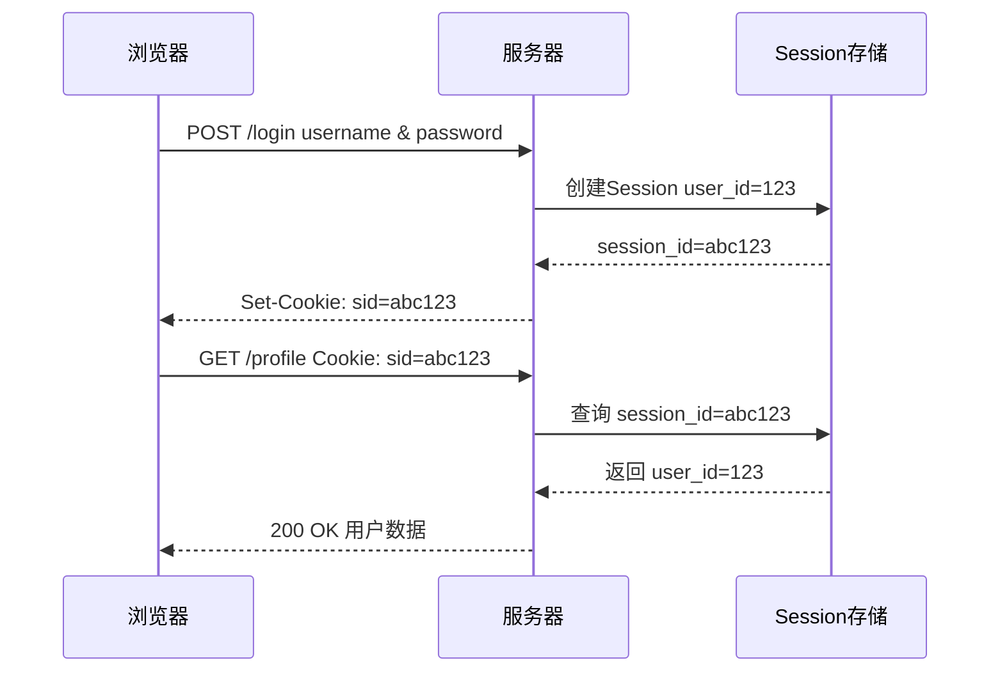
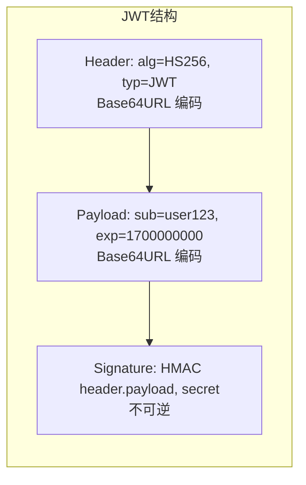
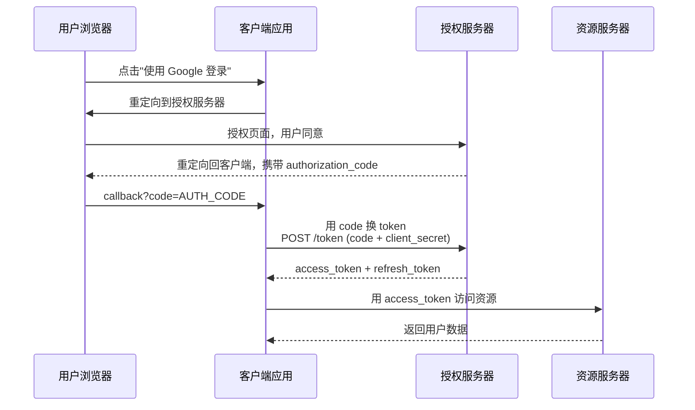
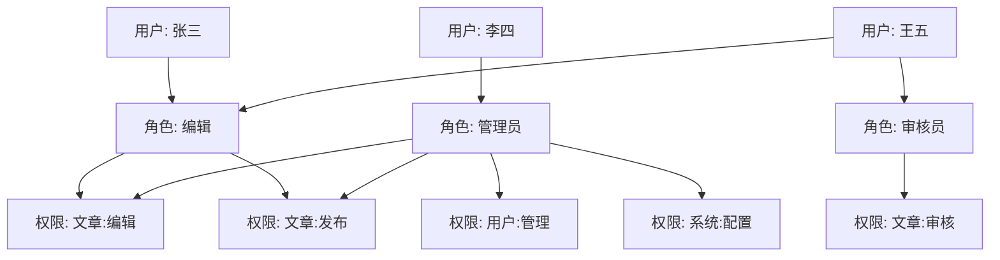
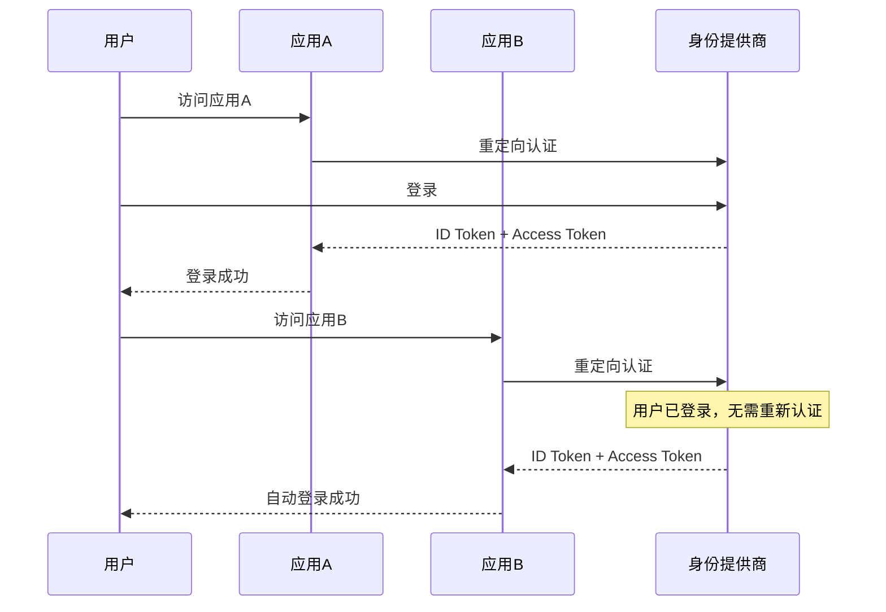

## 认证方案对比

认证（Authentication）回答"你是谁"，授权（Authorization）回答"你能做什么"。三种主流认证方案各有适用场景：

| 方案 | 有状态 | 扩展性 | 适用场景 |
|------|--------|--------|----------|
| Session/Cookie | 是（服务端存储） | 差 | 传统 Web 应用 |
| JWT | 否（令牌自包含） | 好 | 前后端分离、微服务 |
| OAuth 2.0 | 视实现而定 | 好 | 第三方登录、开放平台 |

## Session/Cookie 机制



Session 机制的核心问题：

- **扩展性**：多服务器时需要 Session 粘滞（Sticky Session）或集中存储（Redis）
- **CSRF 风险**：Cookie 自动携带，容易被跨站攻击
- **跨域限制**：Cookie 有同源策略限制

## JWT 机制

JWT（JSON Web Token）由三部分组成，用 `.` 分隔：



```javascript
// JWT 实际示例
// Header
{ "alg": "HS256", "typ": "JWT" }

// Payload（Claims）
{
  "sub": "user_123",        // Subject - 用户标识
  "name": "张三",
  "role": "admin",
  "iat": 1700000000,        // Issued At - 签发时间
  "exp": 1700003600         // Expiration - 过期时间（1小时后）
}

// Signature
HMACSHA256(base64(header) + "." + base64(payload), secret_key)
```

### JWT 的关键问题

**1. 无法主动失效**

JWT 一旦签发，在过期前无法撤销。解决方案：

```python
# 方案1: 短期 JWT + 长期 Refresh Token
# Access Token: 15 分钟
# Refresh Token: 7 天，存储在 Redis 中，可主动删除

@app.route("/login", methods=["POST"])
def login():
    # 验证用户名密码...
    access_token = create_access_token(user_id, expires_delta=timedelta(minutes=15))
    refresh_token = create_refresh_token(user_id, expires_delta=timedelta(days=7))
    redis.setex(f"refresh:{user_id}", 7*24*3600, refresh_token)
    return {"access_token": access_token, "refresh_token": refresh_token}

@app.route("/refresh", methods=["POST"])
def refresh():
    refresh_token = request.json["refresh_token"]
    payload = verify_token(refresh_token)
    if not redis.exists(f"refresh:{payload['sub']}"):
        raise Unauthorized("Token revoked")
    new_access = create_access_token(payload["sub"], timedelta(minutes=15))
    return {"access_token": new_access}

# 方案2: Token 黑名单（牺牲无状态性）
# 将需撤销的 Token 的 jti 存入 Redis，过期时间 = Token 剩余有效期
@app.route("/logout", methods=["POST"])
def logout():
    token = get_token_from_request()
    payload = decode_token(token)
    ttl = payload["exp"] - int(time.time())
    if ttl > 0:
        redis.setex(f"blacklist:{payload['jti']}", ttl, "1")
```

**2. Payload 可被解码**

JWT 的 Header 和 Payload 只是 Base64 编码，不是加密。任何人都能解码查看内容，因此**不要在 JWT 中存储敏感信息**。

## OAuth 2.0 授权码流程

OAuth 2.0 用于授权第三方应用访问用户资源，最安全的是**授权码模式（Authorization Code）**：



### PKCE 增强

纯前端应用（SPA）无法安全保存 `client_secret`，PKCE（Proof Key for Code Exchange）解决了这个问题：

```javascript
// 1. 客户端生成 code_verifier 和 code_challenge
const codeVerifier = generateRandomString(128);
const codeChallenge = base64URL(sha256(codeVerifier));

// 2. 授权请求携带 code_challenge
const authUrl = `https://auth.example.com/authorize?` +
    `client_id=spa_app&` +
    `redirect_uri=https://app.example.com/callback&` +
    `code_challenge=${codeChallenge}&` +
    `code_challenge_method=S256`;

// 3. Token 请求携带 code_verifier
const tokenResponse = await fetch('https://auth.example.com/token', {
    method: 'POST',
    body: new URLSearchParams({
        grant_type: 'authorization_code',
        code: authCode,
        code_verifier: codeVerifier,  // 授权服务器验证 sha256(verifier) == challenge
    })
});
```

## RBAC 与 ABAC 权限模型

### RBAC（基于角色的访问控制）



```sql
-- RBAC 数据模型
CREATE TABLE users (id INT PRIMARY KEY, name VARCHAR(50));
CREATE TABLE roles (id INT PRIMARY KEY, name VARCHAR(50));
CREATE TABLE permissions (id INT PRIMARY KEY, resource VARCHAR(50), action VARCHAR(20));
CREATE TABLE user_roles (user_id INT, role_id INT);
CREATE TABLE role_permissions (role_id INT, permission_id INT);

-- 查询用户权限
SELECT p.resource, p.action
FROM users u
JOIN user_roles ur ON u.id = ur.user_id
JOIN role_permissions rp ON ur.role_id = rp.role_id
JOIN permissions p ON rp.permission_id = p.id
WHERE u.id = ?;
```

### ABAC（基于属性的访问控制）

ABAC 基于主体、资源、环境等多维属性做决策，更灵活但更复杂：

```python
# ABAC 策略示例
policies = [
    {
        "effect": "allow",
        "action": "document:edit",
        "conditions": {
            "subject.department": "eq:resource.department",  # 同部门
            "subject.level": "gte:3",                        # 级别 >= 3
            "environment.time": "between:09:00-18:00"        # 工作时间
        }
    }
]

def check_access(subject, resource, action, environment):
    for policy in policies:
        if policy["action"] != action:
            continue
        if evaluate_conditions(policy["conditions"], subject, resource, environment):
            return policy["effect"] == "allow"
    return False
```

## SSO 与 OIDC

单点登录（SSO）让用户一次登录即可访问多个系统。OpenID Connect（OIDC）是建立在 OAuth 2.0 之上的身份层：



OIDC 在 OAuth 2.0 基础上增加了 `id_token`（JWT 格式），包含用户身份信息：

```json
{
  "iss": "https://auth.example.com",
  "sub": "user_123",
  "aud": "app_client_id",
  "exp": 1700003600,
  "iat": 1700000000,
  "name": "张三",
  "email": "zhang@example.com",
  "email_verified": true
}
```

认证与授权是系统安全的基石——选择合适的认证方案，设计清晰的权限模型，是保护系统安全的第一步。
