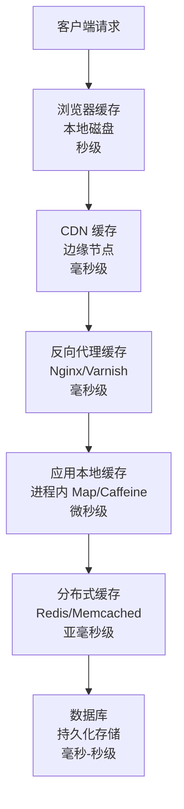
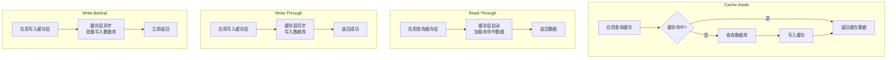
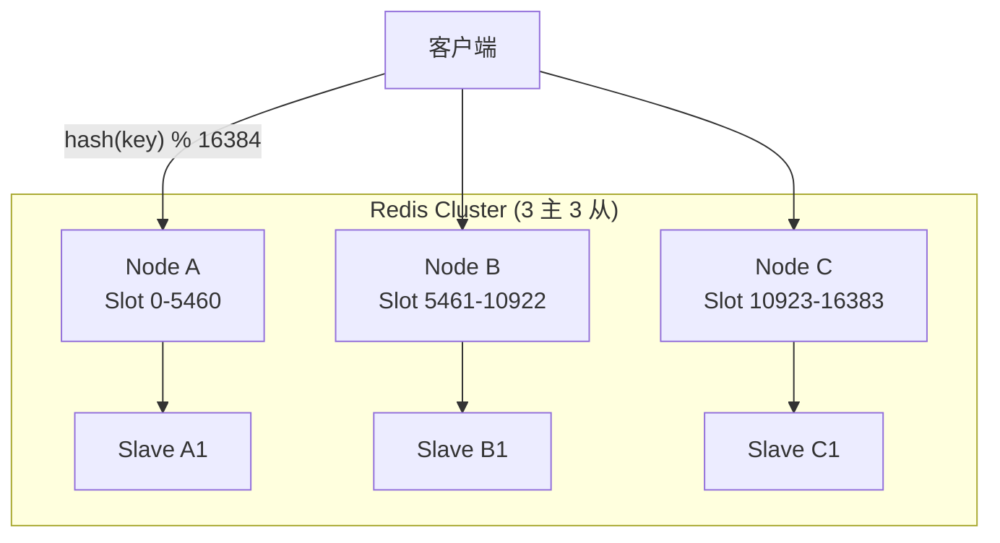
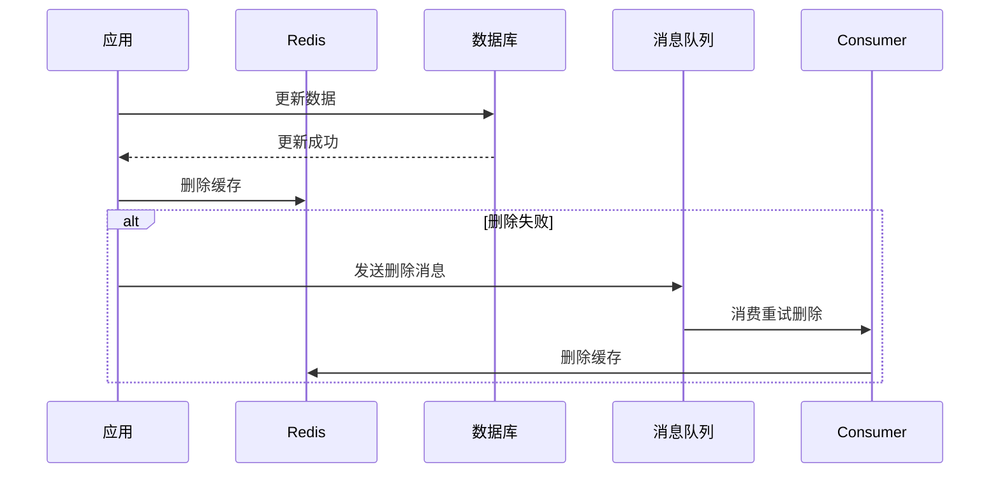

## 缓存层次

现代系统的缓存通常构成一个多层次的体系，数据从慢到快、从大到小逐级缓存：



| 缓存层 | 延迟 | 容量 | 一致性 | 适用场景 |
|--------|------|------|--------|----------|
| 浏览器 | ~0ms | 数百 MB | 最弱 | 静态资源 |
| CDN | ~10ms | TB 级 | 弱 | 静态资源、公共数据 |
| 反向代理 | ~1ms | GB 级 | 弱 | 热点页面、API 响应 |
| 本地缓存 | ~0.01ms | MB 级 | 中 | 配置、元数据 |
| 分布式缓存 | ~0.5ms | GB-TB 级 | 强 | 业务数据 |

## Redis 数据结构与适用场景

Redis 提供 5 种基础数据结构和 3 种扩展结构，每种都有其最佳使用场景：

### 基础数据结构

| 结构 | 特点 | 典型场景 | 时间复杂度 |
|------|------|----------|-----------|
| String | 简单 KV，最大 512MB | 缓存、计数器、分布式锁 | O(1) |
| Hash | 字段-值映射 | 对象存储（用户信息、商品详情） | O(1) |
| List | 有序列表，双向链表 | 消息队列、最新列表 | 头尾 O(1) |
| Set | 无序去重集合 | 标签、共同好友、抽奖 | O(1) |
| Sorted Set | 有序去重集合+分数 | 排行榜、延迟队列 | O(log N) |

### 实战用例

```bash
# 计数器（String + INCR）
SET article:1001:views 0
INCR article:1001:views          # 原子自增

# 对象存储（Hash）
HMSET user:1001 name "张三" email "zhang@example.com" age 28
HGET user:1001 name               # → "张三"

# 排行榜（Sorted Set）
ZADD leaderboard 1500 "player1"
ZADD leaderboard 2000 "player2"
ZREVRANGE leaderboard 0 9 WITHSCORES  # Top 10

# 分布式锁（String + Lua）
SET lock:order:1001 "uuid-xxx" NX PX 30000  # 30秒过期
# 释放锁（Lua 保证原子性）
EVAL "if redis.call('get',KEYS[1]) == ARGV[1] then return redis.call('del',KEYS[1]) else return 0 end" 1 lock:order:1001 "uuid-xxx"

# 延迟队列（Sorted Set）
ZADD delay_queue <timestamp+delay> <task_id>
# 定时轮询
ZRANGEBYSCORE delay_queue 0 <current_timestamp> LIMIT 0 100
```

## 缓存策略

### 四种经典策略



| 策略 | 读路径 | 写路径 | 一致性 | 复杂度 |
|------|--------|--------|--------|--------|
| Cache-Aside | 应用先查缓存，miss 时查 DB 并回填 | 应用先更新 DB，再删缓存 | 最终一致 | 低 |
| Read-Through | 应用只查缓存层，miss 由缓存层加载 | 同 Cache-Aside | 最终一致 | 中 |
| Write-Through | 同 Read-Through | 缓存层同步写 DB | 强一致 | 中 |
| Write-Behind | 同 Read-Through | 缓存层异步批量写 DB | 弱一致 | 高 |

**Cache-Aside 是最常用的策略**，因为实现简单且适用范围广。关键问题是：更新时应该更新缓存还是删除缓存？

推荐**删除缓存**而非更新缓存：
- 避免并发写导致缓存与 DB 不一致
- 缓存可能是复杂计算的结果，更新成本可能高于删除后重建
- 删除是幂等操作，重试安全

## 缓存问题与防御

### 1. 缓存穿透

**现象**：大量请求查询不存在的数据，缓存无法命中，请求直达数据库。

**防御方案**：

```python
# 方案1: 缓存空值
def get_user(user_id):
    data = cache.get(f"user:{user_id}")
    if data is not None:
        if data == "NULL":
            return None           # 命中空值标记
        return data

    data = db.query("SELECT * FROM users WHERE id = %s", user_id)
    if data is None:
        cache.set(f"user:{user_id}", "NULL", ttl=300)  # 缓存空值，5分钟
    else:
        cache.set(f"user:{user_id}", data, ttl=3600)
    return data

# 方案2: 布隆过滤器（前置拦截）
# 将所有合法 ID 放入布隆过滤器，请求先过布隆过滤器
bloom = BloomFilter(capacity=10_000_000, error_rate=0.001)
for user_id in db.get_all_ids():
    bloom.add(user_id)

def get_user(user_id):
    if not bloom.check(user_id):
        return None  # 一定不存在
    # 查缓存、查数据库...
```

### 2. 缓存击穿

**现象**：某个热点 key 过期瞬间，大量并发请求同时查数据库。

**防御方案**：

```python
# 方案1: 互斥锁
def get_user(user_id):
    data = cache.get(f"user:{user_id}")
    if data is not None:
        return data

    lock_key = f"lock:user:{user_id}"
    if cache.set(lock_key, "1", nx=True, ex=5):  # 获取锁
        try:
            data = db.query(...)
            cache.set(f"user:{user_id}", data, ttl=3600)
            return data
        finally:
            cache.delete(lock_key)
    else:
        time.sleep(0.1)     # 等待后重试
        return get_user(user_id)

# 方案2: 逻辑过期（不设置 TTL，数据中嵌入过期时间）
def get_user(user_id):
    data = cache.get(f"user:{user_id}")
    if data and data["expire_at"] > time.time():
        return data["value"]

    # 异步刷新
    async_refresh(user_id)
    return data["value"] if data else db.query(...)
```

### 3. 缓存雪崩

**现象**：大量 key 同时过期，或缓存服务宕机，请求全部压到数据库。

**防御方案**：

```bash
# 方案1: 过期时间加随机偏移
base_ttl = 3600
random_ttl = base_ttl + random.randint(0, 600)  # 3600~4200 秒

# 方案2: 缓存高可用
# Redis Sentinel / Redis Cluster 避免单点故障

# 方案3: 多级缓存
# 本地缓存(Caffeine) + 分布式缓存(Redis)
# 本地缓存设置更短的 TTL，作为兜底

# 方案4: 限流降级
# 当数据库负载过高时，直接返回降级数据
```

## 分布式缓存

### Redis Cluster

Redis Cluster 通过哈希槽（Hash Slot）实现数据分片，共 16384 个槽：



关键设计：
- **哈希标签**：`{user}:profile` 和 `{user}:orders` 会被分配到同一个槽，支持多键操作
- **故障转移**：主节点故障时，从节点自动升级
- **客户端路由**：客户端缓存槽位映射，MOVED 重定向更新

### 缓存一致性保障



最佳实践：先更新数据库，再删除缓存。如果删除缓存失败，通过消息队列可靠重试。极端场景下（读线程在写线程提交前读取并回填旧值）仍可能出现短暂不一致，可通过延迟双删解决。

缓存是用空间换时间的经典手段——合理使用可以让系统性能提升数倍，但必须针对穿透、击穿、雪崩三大问题做好防御。
