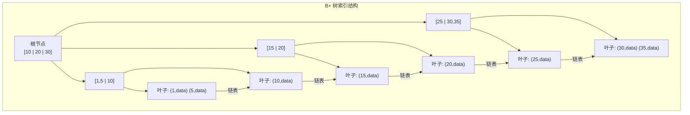
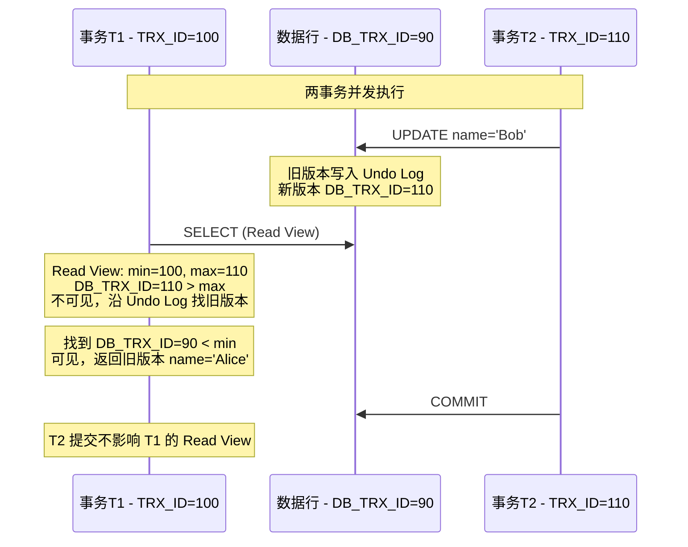
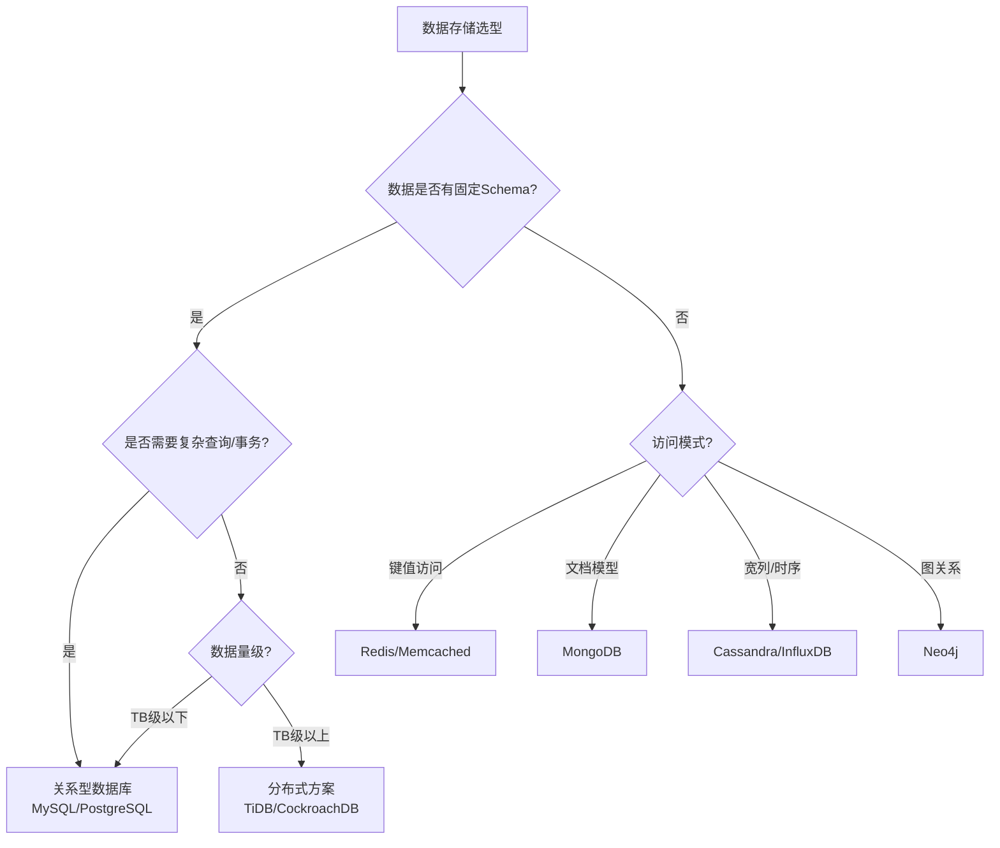

## 关系型数据库存储引擎

数据库存储引擎负责数据在磁盘上的组织方式和内存中的缓存策略。以 InnoDB 为例，核心设计围绕**减少磁盘 I/O**展开。

### B+ 树索引结构

InnoDB 使用 B+ 树作为索引结构，所有数据存储在叶子节点，非叶子节点仅存储键值和子节点指针：



B+ 树的关键设计：

- **阶数大、高度低**：InnoDB 页大小 16KB，一个三层的 B+ 树可存储约 2000 万行数据（假设键+指针约 12 字节），三次磁盘 I/O 即可定位
- **叶子节点链表**：范围查询时顺着链表顺序扫描，无需回溯上层节点
- **页结构**：每个节点是一个页（Page），是 InnoDB 最小的 I/O 单位

### 聚簇索引与二级索引

InnoDB 的**聚簇索引**（主键索引）的叶子节点存储完整的行数据，而**二级索引**的叶子节点存储主键值：

```sql
-- 查询走二级索引时需要"回表"
SELECT * FROM users WHERE email = 'alice@example.com';
-- 1. 在 email 二级索引找到主键 id=5
-- 2. 在聚簇索引通过 id=5 找到完整行数据

-- 覆盖索引避免回表
SELECT id, email FROM users WHERE email = 'alice@example.com';
-- 二级索引已包含 id 和 email，无需回表
```

## 事务 ACID 与隔离级别

### ACID 特性

| 特性 | 含义 | 实现机制 |
|------|------|----------|
| 原子性（Atomicity） | 事务不可分割，要么全做要么全不做 | Undo Log |
| 一致性（Consistency） | 事务前后数据库状态合法 | 约束 + 应用层 |
| 隔离性（Isolation） | 并发事务互不干扰 | 锁 + MVCC |
| 持久性（Durability） | 提交后数据永久保存 | Redo Log |

### MVCC 实现原理

多版本并发控制（MVCC）是 InnoDB 实现高并发读写的核心机制，让读操作不加锁：



MVCC 的核心组件：

1. **隐藏列**：每行有 `DB_TRX_ID`（最后修改的事务 ID）、`DB_ROLL_PTR`（指向 Undo Log 的回滚指针）
2. **Undo Log 版本链**：每次修改将旧版本写入 Undo Log，通过 `DB_ROLL_PTR` 串成链表
3. **Read View**：事务开始时创建的快照，记录当前活跃事务列表，用于判断哪个版本可见

可见性判断规则：
- 版本的 `DB_TRX_ID` < Read View 的 `min_trx_id` → 可见（事务已提交）
- 版本的 `DB_TRX_ID` 在活跃列表中 → 不可见（事务未提交）
- 版本的 `DB_TRX_ID` > Read View 的 `max_trx_id` → 不可见（事务在 Read View 之后开始）
- 否则沿 Undo Log 链找更早版本

### 四种隔离级别

| 隔离级别 | 脏读 | 不可重复读 | 幻读 | 实现方式 |
|----------|------|-----------|------|----------|
| READ UNCOMMITTED | 可能 | 可能 | 可能 | 无隔离 |
| READ COMMITTED | 不会 | 可能 | 可能 | 每次 SELECT 创建 Read View |
| REPEATABLE READ | 不会 | 不会 | 可能* | 事务开始时创建 Read View |
| SERIALIZABLE | 不会 | 不会 | 不会 | 所有读加共享锁 |

*InnoDB 的 REPEATABLE READ 通过 Next-Key Lock（行锁+间隙锁）在一定程度防止幻读。

## SQL 调优实战

### EXPLAIN 分析

```sql
EXPLAIN SELECT u.name, o.total
FROM users u
JOIN orders o ON u.id = o.user_id
WHERE u.status = 'active' AND o.created_at > '2024-01-01';
```

关键指标：
- **type**：`const` > `eq_ref` > `ref` > `range` > `index` > `ALL`（全表扫描）
- **key**：实际使用的索引
- **rows**：预估扫描行数
- **Extra**：`Using index`（覆盖索引）是好的，`Using filesort` / `Using temporary` 需优化

### 常见优化模式

```sql
-- ❌ 索引失效：函数操作
SELECT * FROM users WHERE YEAR(created_at) = 2024;
-- ✅ 改写为范围查询
SELECT * FROM users WHERE created_at >= '2024-01-01' AND created_at < '2025-01-01';

-- ❌ 索引失效：隐式类型转换
SELECT * FROM users WHERE phone = 13800138000;  -- phone 是 VARCHAR
-- ✅ 使用字符串
SELECT * FROM users WHERE phone = '13800138000';

-- ❌ 索引失效：左侧模糊
SELECT * FROM users WHERE name LIKE '%张';
-- ✅ 如需全文搜索，使用全文索引或 Elasticsearch
```

## NoSQL 选型



选型原则：**用最简单的方案解决问题**。80% 的场景关系型数据库足够，NoSQL 引入的运维复杂度往往被低估。

## 数据库连接池

应用与数据库之间的连接创建成本高（TCP 三次握手 + TLS + 认证），连接池通过复用连接解决此问题：

关键参数：
- **最大连接数**：取决于数据库的 `max_connections` 和应用实例数，公式：`池大小 = (核心数 * 2) + 有效磁盘数`
- **最小空闲连接**：保持一定数量的热连接，避免冷启动
- **连接超时**：获取连接的最大等待时间，防止请求堆积
- **最大存活时间**：定期更换连接，避免长时间持有导致的内存泄漏

```java
// HikariCP 配置示例
HikariConfig config = new HikariConfig();
config.setJdbcUrl("jdbc:mysql://localhost:3306/mydb");
config.setMaximumPoolSize(20);
config.setMinimumIdle(5);
config.setConnectionTimeout(3000);     // 3秒获取不到连接则报错
config.setMaxLifetime(1800000);        // 30分钟更换连接
```
