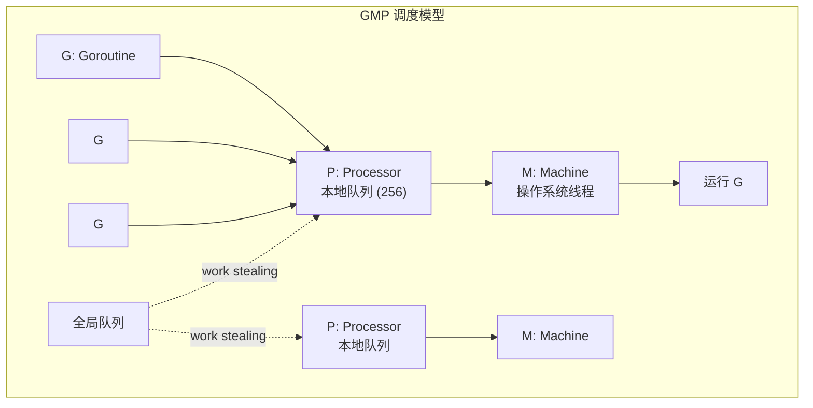
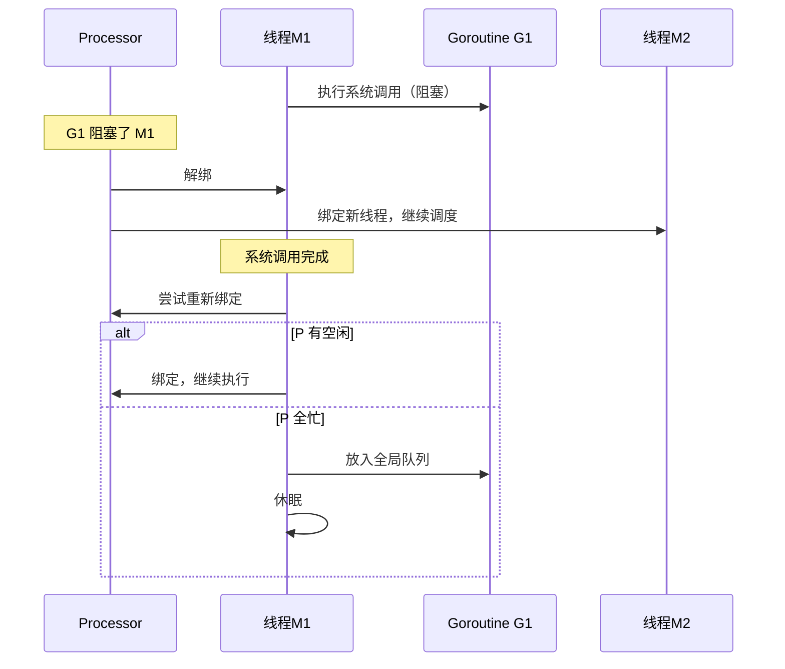

## Goroutine 调度器：GMP 模型

Go 的并发建立在 **Goroutine** 之上——一种用户态轻量级线程，初始栈仅 2KB（可动态增长至 1GB）。调度器采用 GMP 模型管理 Goroutine 的调度：



### 三个核心组件

| 组件 | 职责 | 数量 |
|------|------|------|
| **G（Goroutine）** | 用户代码的执行体，包含栈、指令指针等 | 按需创建 |
| **M（Machine）** | 操作系统线程，真正执行代码 | 按需创建，默认上限 10000 |
| **P（Processor）** | 调度上下文，持有本地运行队列 | GOMAXPROCS（默认=CPU 核心数） |

### 调度策略

**1. Work Stealing（工作窃取）**

当一个 P 的本地队列为空时，它会从其他 P 的本地队列窃取一半的 G：

```go
// P1 本地队列空了
// → 尝试从全局队列取
// → 尝试从其他 P 窃取
// → 都没有则 M 与 P 解绑，M 休眠
```

**2. Hand Off（交接）**

当正在运行的 G 进行系统调用阻塞 M 时，P 会与 M 解绑，寻找或创建新的 M 继续运行本地队列中的其他 G：



**3. 抢占式调度**

Go 1.14 引入基于信号的异步抢占，解决了早期版本中 Goroutine 长时间占用线程不释放的问题（如死循环）。

## Channel 通信

Go 的并发哲学：**不要通过共享内存来通信，而要通过通信来共享内存**。Channel 是这一哲学的核心实现。

### Channel 基础

```go
// 无缓冲 channel：同步通信
ch := make(chan int)       // 发送和接收必须同时就绪

// 有缓冲 channel：异步通信
ch := make(chan int, 100)  // 缓冲区满时发送阻塞，缓冲区空时接收阻塞

// 发送与接收
ch <- 42         // 发送
value := <-ch    // 接收

// 关闭 channel
close(ch)        // 关闭后不能再发送，但可以继续接收直到缓冲区为空
```

### Channel 方向

```go
func producer(out chan<- int) {   // 只写 channel
    for i := 0; i < 10; i++ {
        out <- i
    }
    close(out)
}

func consumer(in <-chan int) {    // 只读 channel
    for v := range in {           // range 自动在 channel 关闭时退出
        fmt.Println(v)
    }
}
```

### select 多路复用

```go
select {
case msg := <-ch1:
    fmt.Println("received from ch1:", msg)
case msg := <-ch2:
    fmt.Println("received from ch2:", msg)
case ch3 <- 42:
    fmt.Println("sent to ch3")
case <-time.After(5 * time.Second):
    fmt.Println("timeout")
default:
    fmt.Println("no channel ready")  // 非阻塞模式
}
```

## sync 包

### Mutex 与 RWMutex

```go
var (
    mu    sync.RWMutex
    cache map[string]string
)

func Read(key string) string {
    mu.RLock()         // 读锁，多个读可并行
    defer mu.RUnlock()
    return cache[key]
}

func Write(key, value string) {
    mu.Lock()          // 写锁，独占
    defer mu.Unlock()
    cache[key] = value
}
```

### WaitGroup

```go
var wg sync.WaitGroup

for i := 0; i < 5; i++ {
    wg.Add(1)
    go func(id int) {
        defer wg.Done()
        doWork(id)
    }(i)
}
wg.Wait()  // 等待所有 goroutine 完成
```

### sync.Once

```go
var once sync.Once
var instance *Database

func GetDB() *Database {
    once.Do(func() {
        instance = &Database{}
        instance.Connect()
    })
    return instance
}
```

### sync.Pool

```go
var bufPool = sync.Pool{
    New: func() interface{} {
        return new(bytes.Buffer)
    },
}

func handler(w http.ResponseWriter, r *http.Request) {
    buf := bufPool.Get().(*bytes.Buffer)
    defer func() {
        buf.Reset()
        bufPool.Put(buf)   // 用完归还
    }()
    // 使用 buf...
}
```

## Context 取消传播

Context 是 Go 中控制 Goroutine 生命周期的标准机制，实现取消传播和超时控制：

```mermaid
flowchart TD
    A[context.Background] --> B[WithCancel]
    A --> C[WithTimeout 5s]
    B --> D[WithCancel<br/>子任务1]
    B --> E[子任务2]
    C --> F[WithDeadline<br/>子任务3]

    B -->|cancel()| G[通知 D, E 取消]
    C -->|超时| H[通知 F 取消]
```

```go
func fetchData(ctx context.Context, url string) ([]byte, error) {
    req, err := http.NewRequestWithContext(ctx, "GET", url, nil)
    if err != nil {
        return nil, err
    }
    resp, err := http.DefaultClient.Do(req)
    if err != nil {
        return nil, err  // ctx 取消时，Do 返回 context.Canceled
    }
    defer resp.Body.Close()
    return io.ReadAll(resp.Body)
}

func main() {
    // 5 秒超时
    ctx, cancel := context.WithTimeout(context.Background(), 5*time.Second)
    defer cancel()

    data, err := fetchData(ctx, "https://api.example.com/data")
    if err != nil {
        if errors.Is(err, context.DeadlineExceeded) {
            log.Println("请求超时")
        }
        return
    }
    fmt.Println(data)
}
```

## 并发模式实战

### Fan-out / Fan-in

```go
func fanOutFanIn(ctx context.Context, input <-chan int, workerCount int) <-chan int {
    // Fan-out: 启动多个 worker
    workers := make([]<-chan int, workerCount)
    for i := 0; i < workerCount; i++ {
        workers[i] = worker(ctx, input)
    }

    // Fan-in: 合并所有 worker 的输出
    return merge(ctx, workers...)
}

func worker(ctx context.Context, input <-chan int) <-chan int {
    out := make(chan int)
    go func() {
        defer close(out)
        for v := range input {
            select {
            case out <- process(v):
            case <-ctx.Done():
                return
            }
        }
    }()
    return out
}
```

### Pipeline 模式

```go
// 生成 → 过滤 → 聚合
func generate(nums ...int) <-chan int {
    out := make(chan int)
    go func() {
        for _, n := range nums {
            out <- n
        }
        close(out)
    }()
    return out
}

func filter(ctx context.Context, in <-chan int, predicate func(int) bool) <-chan int {
    out := make(chan int)
    go func() {
        defer close(out)
        for n := range in {
            if predicate(n) {
                select {
                case out <- n:
                case <-ctx.Done():
                    return
                }
            }
        }
    }()
    return out
}
```

### 限流器

```go
// 基于令牌桶的限流
func rateLimiter(ctx context.Context, requests <-chan Request, rate time.Duration) <-chan Response {
    limiter := time.NewTicker(rate)
    defer limiter.Stop()

    out := make(chan Response)
    go func() {
        defer close(out)
        for req := range requests {
            select {
            case <-limiter.C:       // 令牌
                out <- handle(req)
            case <-ctx.Done():
                return
            }
        }
    }()
    return out
}
```

Go 并发的精髓在于：用 Channel 连接 Goroutine，用 Context 控制生命周期，用 select 处理多路事件。掌握这三个原语，就能构建出各种并发模式。
