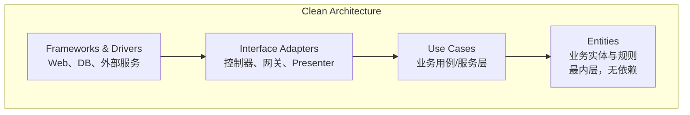
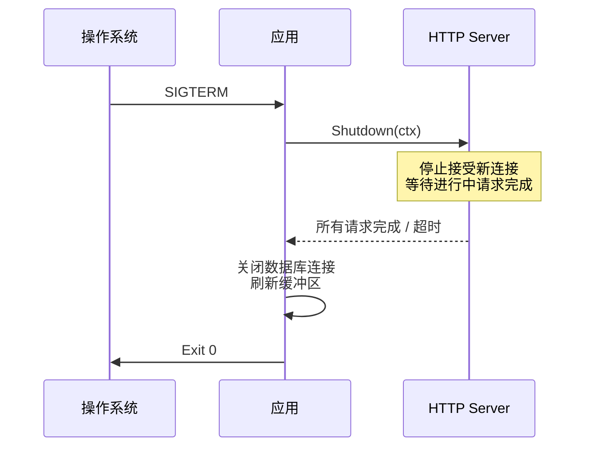

## net/http 标准库

Go 的 `net/http` 标准库已经足够构建生产级 Web 服务，无需框架也能工作：

```go
func main() {
    mux := http.NewServeMux()

    // Go 1.22 增强路由：支持方法匹配和路径参数
    mux.HandleFunc("GET /users/{id}", getUser)
    mux.HandleFunc("POST /users", createUser)
    mux.HandleFunc("DELETE /users/{id}", deleteUser)

    server := &http.Server{
        Addr:         ":8080",
        Handler:      mux,
        ReadTimeout:  5 * time.Second,
        WriteTimeout: 10 * time.Second,
        IdleTimeout:  120 * time.Second,
    }
    log.Fatal(server.ListenAndServe())
}

func getUser(w http.ResponseWriter, r *http.Request) {
    id := r.PathValue("id")  // Go 1.22+
    json.NewEncoder(w).Encode(map[string]string{"id": id})
}
```

### 中间件模式

```go
// 中间链式调用
func Chain(h http.Handler, middleware ...func(http.Handler) http.Handler) http.Handler {
    for i := len(middleware) - 1; i >= 0; i-- {
        h = middleware[i](h)
    }
    return h
}

// 日志中间件
func Logging(next http.Handler) http.Handler {
    return http.HandlerFunc(func(w http.ResponseWriter, r *http.Request) {
        start := time.Now()
        next.ServeHTTP(w, r)
        log.Printf("%s %s %v", r.Method, r.URL.Path, time.Since(start))
    })
}

// 认证中间件
func Auth(next http.Handler) http.Handler {
    return http.HandlerFunc(func(w http.ResponseWriter, r *http.Request) {
        token := r.Header.Get("Authorization")
        if token == "" {
            http.Error(w, "Unauthorized", http.StatusUnauthorized)
            return
        }
        ctx := context.WithValue(r.Context(), "userID", parseToken(token))
        next.ServeHTTP(w, r.WithContext(ctx))
    })
}
```

## Gin/Echo 框架

标准库适合简单服务，框架提供路由分组、参数绑定、验证等便捷功能。

### Gin 示例

```go
func main() {
    r := gin.Default()  // Logger + Recovery 中间件

    // 路由分组
    api := r.Group("/api/v1")
    {
        users := api.Group("/users")
        {
            users.GET("", listUsers)
            users.GET("/:id", getUser)
            users.POST("", createUser)
            users.PUT("/:id", updateUser)
            users.DELETE("/:id", deleteUser)
        }
    }

    r.Run(":8080")
}

type CreateUserReq struct {
    Name  string `json:"name" binding:"required,min=2,max=50"`
    Email string `json:"email" binding:"required,email"`
    Age   int    `json:"age" binding:"omitempty,gte=0,lte=150"`
}

func createUser(c *gin.Context) {
    var req CreateUserReq
    if err := c.ShouldBindJSON(&req); err != nil {
        c.JSON(http.StatusBadRequest, gin.H{"error": err.Error()})
        return
    }
    // 处理业务...
    c.JSON(http.StatusCreated, gin.H{"id": "usr_123", "name": req.Name})
}
```

## 数据库交互

### GORM

GORM 是 Go 生态最流行的 ORM，提供模型定义、关联、迁移等功能：

```go
type User struct {
    ID        uint           `gorm:"primaryKey" json:"id"`
    Name      string         `gorm:"size:100;not null" json:"name"`
    Email     string         `gorm:"uniqueIndex;size:255" json:"email"`
    Orders    []Order        `gorm:"foreignKey:UserID" json:"orders,omitempty"`
    CreatedAt time.Time      `json:"created_at"`
    UpdatedAt time.Time      `json:"updated_at"`
    DeletedAt gorm.DeletedAt `gorm:"index" json:"-"`  // 软删除
}

func setupDB() *gorm.DB {
    dsn := "user:pass@tcp(localhost:3306)/mydb?charset=utf8mb4&parseTime=True"
    db, err := gorm.Open(mysql.Open(dsn), &gorm.Config{})
    if err != nil {
        log.Fatal(err)
    }
    db.AutoMigrate(&User{}, &Order{})
    return db
}

// 查询示例
func getUserWithOrders(db *gorm.DB, id uint) (*User, error) {
    var user User
    err := db.Preload("Orders", "status = ?", "active").
        First(&user, id).Error
    return &user, err
}
```

### sqlx

当需要更精细的 SQL 控制时，sqlx 是更好的选择：

```go
type User struct {
    ID    int    `db:"id"`
    Name  string `db:"name"`
    Email string `db:"email"`
}

func getUsers(db *sqlx.DB) ([]User, error) {
    users := []User{}
    err := db.Select(&users, "SELECT id, name, email FROM users WHERE status = ?", "active")
    return users, err
}

func getUserByID(db *sqlx.DB, id int) (*User, error) {
    var user User
    err := db.Get(&user, "SELECT id, name, email FROM users WHERE id = ?", id)
    return &user, err
}

// 命名参数
func createUser(db *sqlx.DB, user *User) error {
    _, err := db.NamedExec(
        "INSERT INTO users (name, email) VALUES (:name, :email)",
        user,
    )
    return err
}
```

## Clean Architecture 实践

Clean Architecture 将应用分为多个同心层，依赖关系只能从外向内：



### Go 项目结构

```
project/
├── cmd/
│   └── server/
│       └── main.go          # 入口
├── internal/
│   ├── domain/              # 实体层：业务模型
│   │   ├── user.go
│   │   └── order.go
│   ├── usecase/             # 用例层：业务逻辑
│   │   ├── user_service.go
│   │   └── order_service.go
│   ├── repository/          # 接口适配层：仓储接口
│   │   └── user_repository.go
│   ├── handler/             # 接口适配层：HTTP 处理器
│   │   └── user_handler.go
│   └── infrastructure/      # 框架层：具体实现
│       ├── mysql/
│       │   └── user_repo_impl.go
│       └── redis/
│           └── cache.go
├── pkg/                     # 可复用的公共包
└── go.mod
```

### 依赖倒置实现

```go
// domain/user.go — 实体层，无外部依赖
type User struct {
    ID    string
    Name  string
    Email string
}

// repository/user_repository.go — 定义接口（用例层需要）
type UserRepository interface {
    FindByID(ctx context.Context, id string) (*User, error)
    Save(ctx context.Context, user *User) error
}

// usecase/user_service.go — 用例层，依赖接口
type UserService struct {
    repo repository.UserRepository
}

func NewUserService(repo repository.UserRepository) *UserService {
    return &UserService{repo: repo}
}

func (s *UserService) GetUser(ctx context.Context, id string) (*User, error) {
    return s.repo.FindByID(ctx, id)
}

// infrastructure/mysql/user_repo_impl.go — 框架层，实现接口
type mysqlUserRepo struct {
    db *sqlx.DB
}

func NewMysqlUserRepo(db *sqlx.DB) repository.UserRepository {
    return &mysqlUserRepo{db: db}
}
```

## 优雅关停

生产环境必须实现优雅关停——停止接收新请求，等待进行中的请求完成后再退出：

```go
func main() {
    server := &http.Server{Addr: ":8080", Handler: setupRouter()}

    // 启动服务
    go func() {
        if err := server.ListenAndServe(); err != http.ErrServerClosed {
            log.Fatalf("Server error: %v", err)
        }
    }()

    // 等待中断信号
    quit := make(chan os.Signal, 1)
    signal.Notify(quit, syscall.SIGINT, syscall.SIGTERM)
    <-quit
    log.Println("Shutting down server...")

    // 给进行中的请求 15 秒完成时间
    ctx, cancel := context.WithTimeout(context.Background(), 15*time.Second)
    defer cancel()

    if err := server.Shutdown(ctx); err != nil {
        log.Printf("Server forced to shutdown: %v", err)
    }
    log.Println("Server exited gracefully")
}
```

优雅关停流程：



Go Web 开发的核心思路：标准库优先，按需引入框架；依赖倒置保证可测试性；优雅关停保证生产稳定。
