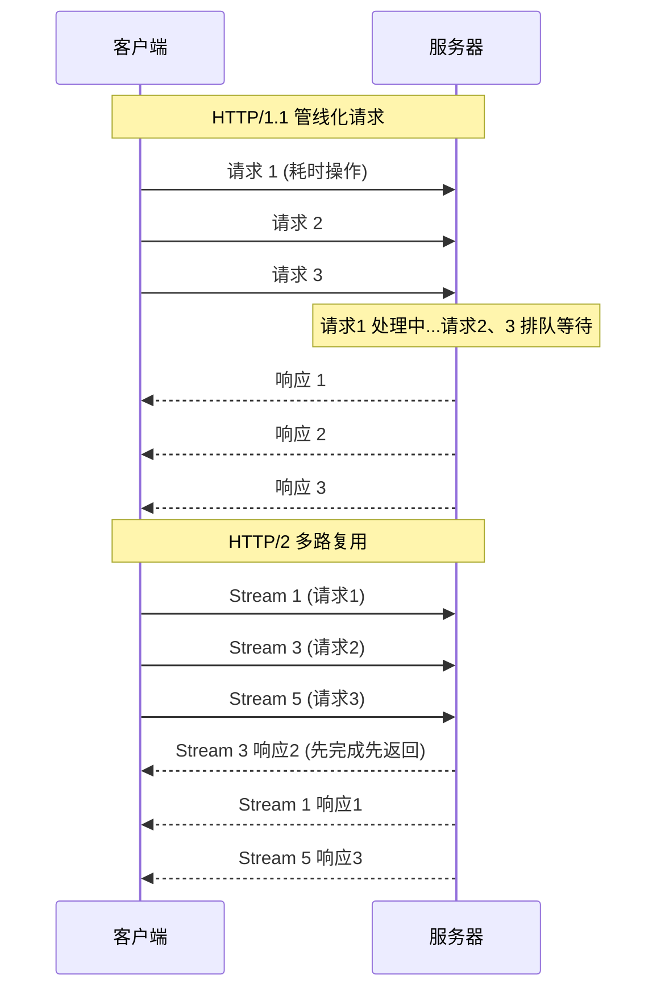
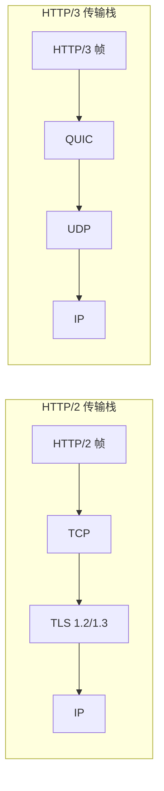
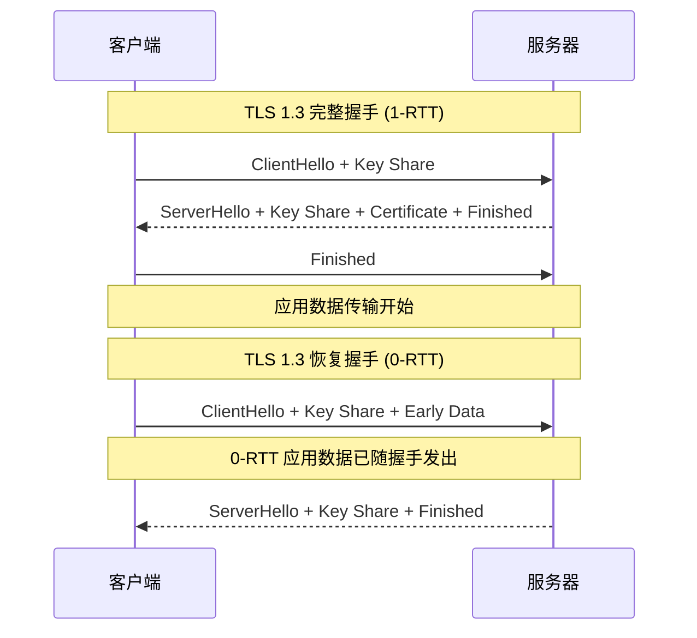
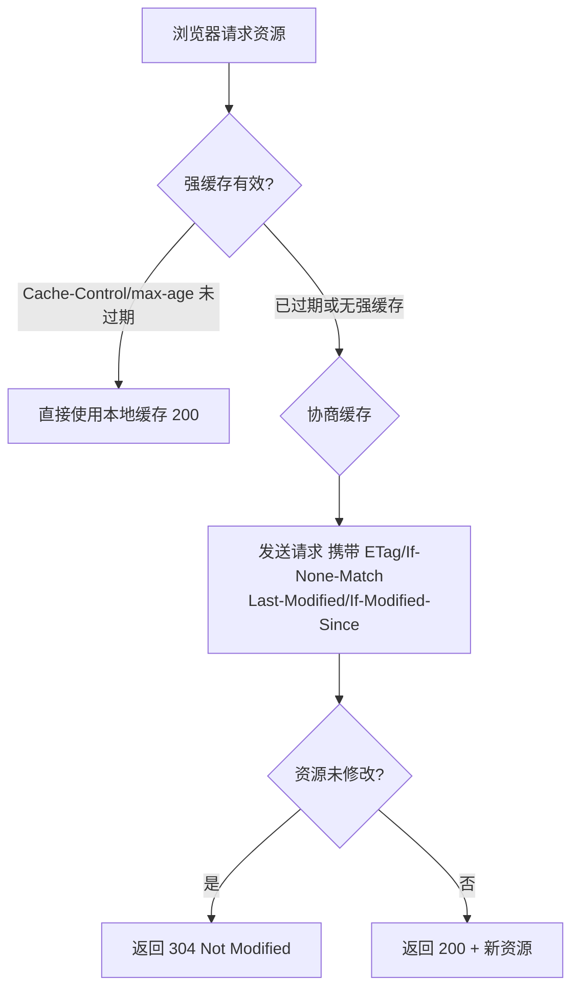

## HTTP 协议演进

HTTP（HyperText Transfer Protocol）是 Web 通信的基石。从 HTTP/1.0 到 HTTP/3，协议经历了三次重大升级，每次都在解决前一代的核心痛点：

| 版本 | 核心改进 | 解决的问题 |
|------|----------|-----------|
| HTTP/1.0 | 短连接 | 基础通信 |
| HTTP/1.1 | 持久连接 | 连接复用 |
| HTTP/2 | 多路复用 | 队头阻塞 |
| HTTP/3 | QUIC 传输 | 传输层阻塞 |

## HTTP/1.1：持久连接与队头阻塞

HTTP/1.1 引入了持久连接（Persistent Connection），默认 `Connection: keep-alive`，允许在同一个 TCP 连接上发送多个请求。同时支持管线化（Pipelining），即无需等待响应即可发送下一个请求。

但管线化存在严重的**队头阻塞（Head-of-Line Blocking）**问题：即使多个请求同时发出，服务器仍需按顺序响应。如果第一个请求处理缓慢，后续请求必须排队等待。



浏览器通常采用**多连接并发**策略（Chrome 最多 6 个 TCP 连接/域名）来绕过队头阻塞，但这又带来了连接开销和资源浪费。

## HTTP/2：多路复用与头部压缩

HTTP/2 在应用层引入了三个核心机制：

### 1. 二进制分帧与多路复用

HTTP/2 将请求和响应分割为更小的**帧（Frame）**，并在一个 TCP 连接上通过**流（Stream）**交错传输：

- **帧（Frame）**：最小通信单位，包含帧头（类型、长度、流标识符）和帧体
- **消息（Message）**：一个完整的请求或响应，由多个帧组成
- **流（Stream）**：双向字节流，每个流有唯一 ID，不同流的帧可以交错传输

这种设计彻底解决了应用层的队头阻塞——不同流的帧可以交错发送，慢请求不会阻塞快请求。

### 2. HPACK 头部压缩

HTTP/1.1 的请求头是纯文本，大量重复（如 Cookie、User-Agent），浪费带宽。HPACK 通过两种机制压缩头部：

- **静态表**：预定义 61 个常见头部字段（如 `:method: GET` 编号为 2）
- **动态表**：连接级别共享，缓存之前出现过的头部键值对
- **哈夫曼编码**：对字符串值进行压缩

实际场景中，HPACK 可减少 80%+ 的头部开销。

### 3. 服务器推送

服务器可以主动向客户端推送资源，无需等待客户端请求。典型场景：客户端请求 `index.html`，服务器同时推送 `style.css` 和 `app.js`。

```http
PUSH_PROMISE :stream_id 2 :path /style.css
HEADERS :stream_id 2 :status 200
DATA :stream_id 2 <css content>
```

## HTTP/3：QUIC 协议

HTTP/2 虽然解决了应用层队头阻塞，但 TCP 层仍存在该问题——一个 TCP 包丢失会导致整个连接阻塞。HTTP/3 基于 **QUIC（Quick UDP Internet Connections）** 协议，彻底摆脱了 TCP 的限制：



QUIC 的核心优势：

- **传输层多路复用**：每个流独立交付，一个流丢包不影响其他流
- **0-RTT 连接建立**：首次连接 1-RTT，后续连接可 0-RTT 恢复
- **连接迁移**：基于 Connection ID 而非四元组识别连接，WiFi 切 4G 无需重建连接
- **内置加密**：QUIC 强制 TLS 1.3，协议握手与加密握手合并

## HTTPS 与 TLS 握手

HTTPS = HTTP + TLS，在传输层对数据进行加密。TLS 1.3 握手流程已大幅简化：



TLS 1.3 相比 1.2 的改进：
- 握手从 2-RTT 缩短为 1-RTT
- 移除了不安全的密码套件（如 RSA 密钥交换、CBC 模式）
- 支持 0-RTT 恢复，适合延迟敏感场景

## 常见状态码语义

| 状态码 | 含义 | 典型场景 |
|--------|------|----------|
| 200 | OK | 请求成功 |
| 201 | Created | 资源创建成功 |
| 204 | No Content | 成功但无返回体（DELETE） |
| 301 | Moved Permanently | 永久重定向，SEO 权重转移 |
| 302 | Found | 临时重定向 |
| 304 | Not Modified | 缓存命中，无需传输 |
| 400 | Bad Request | 请求格式错误 |
| 401 | Unauthorized | 未认证 |
| 403 | Forbidden | 已认证但无权限 |
| 404 | Not Found | 资源不存在 |
| 409 | Conflict | 资源冲突 |
| 429 | Too Many Requests | 限流 |
| 500 | Internal Server Error | 服务器内部错误 |
| 502 | Bad Gateway | 网关上游错误 |
| 503 | Service Unavailable | 服务过载/维护 |

## 缓存头详解

HTTP 缓存通过请求/响应头控制，分为强缓存和协商缓存：



**强缓存头**：
- `Cache-Control: max-age=3600` — 资源在 3600 秒内有效
- `Cache-Control: no-cache` — 跳过强缓存，走协商缓存
- `Cache-Control: no-store` — 完全不缓存

**协商缓存头**：
- `ETag` / `If-None-Match` — 基于内容哈希，精确但耗 CPU
- `Last-Modified` / `If-Modified-Since` — 基于修改时间，精度秒级

实战建议：静态资源（JS/CSS/图片）使用内容哈希文件名 + 长期强缓存；HTML 使用 `no-cache` 走协商缓存；API 响应根据业务语义设置缓存策略。
