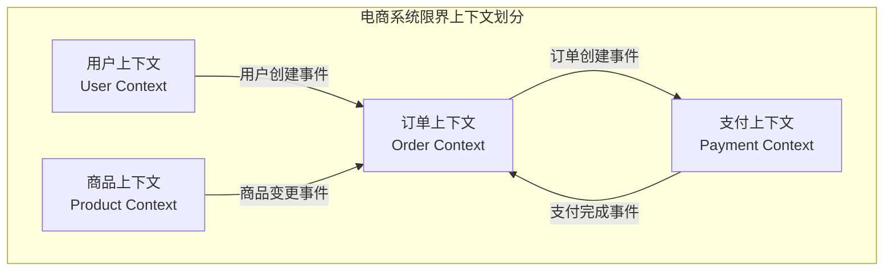
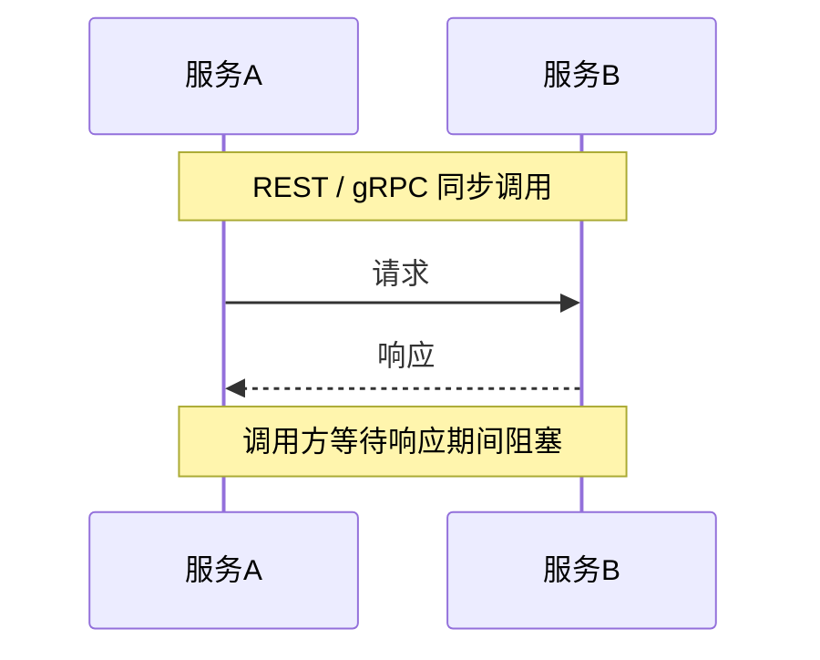
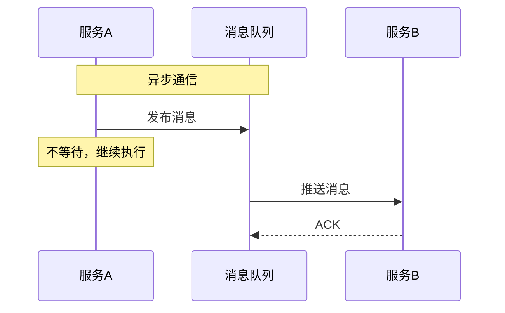
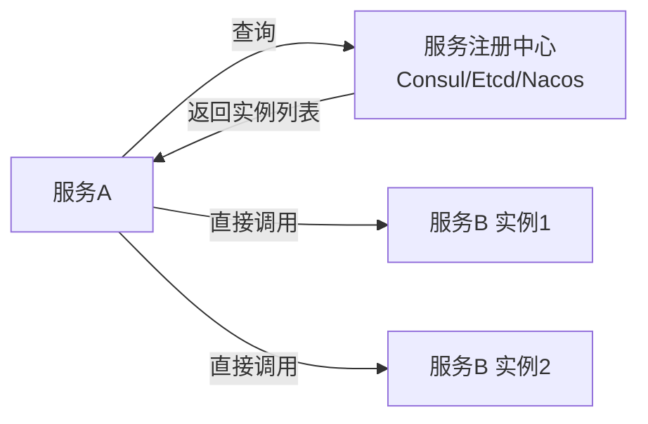
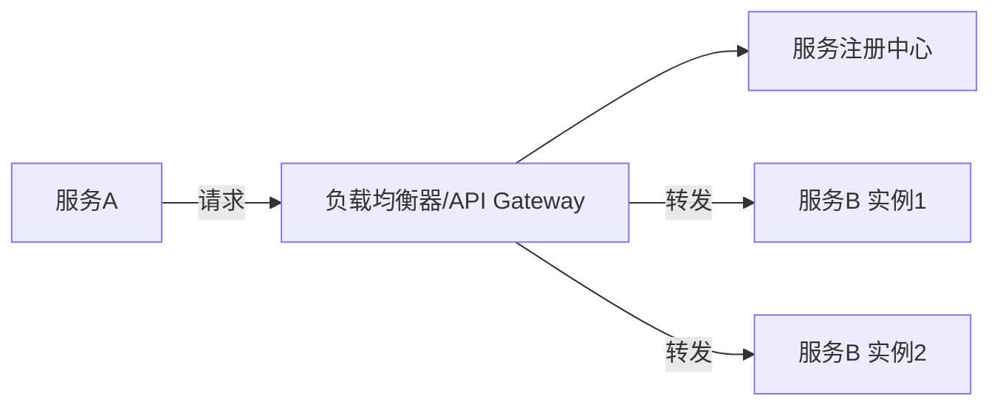
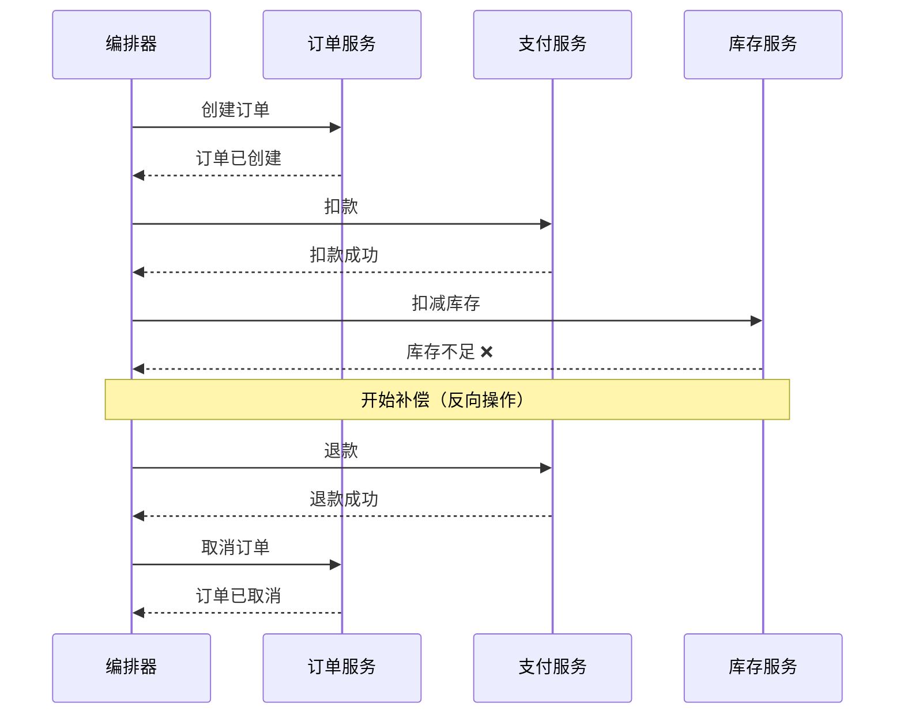
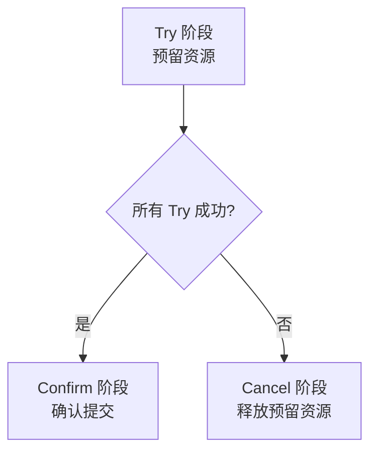
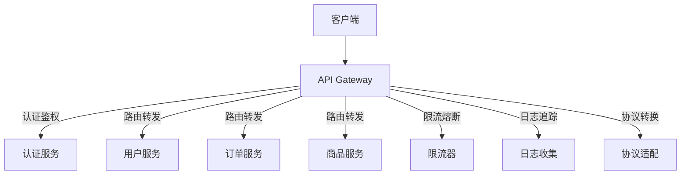

## 从单体到微服务

### 何时拆分

微服务不是银弹，拆分时机取决于业务和团队的实际痛点：

| 信号 | 单体瓶颈 | 微服务优势 |
|------|----------|-----------|
| 团队规模 | 10+ 人改同一代码库，合并冲突频繁 | 独立仓库，团队自治 |
| 部署频率 | 改一行代码要部署整个系统 | 独立部署，不影响其他服务 |
| 故障隔离 | 一个模块 OOM 整体宕机 | 故障隔离在单个服务内 |
| 技术选型 | 统一技术栈，无法按场景优化 | 每个服务可选最合适的技术 |
| 扩展需求 | 整体扩展，浪费资源 | 按需独立扩展 |

**过早微服务化是灾难**：增加运维复杂度、网络延迟、数据一致性挑战。建议：单体优先，随业务增长渐进拆分。

### 领域驱动设计（DDD）

DDD 提供了微服务拆分的方法论，核心概念：

- **限界上下文（Bounded Context）**：一个业务领域的边界，边界内的模型含义统一。一个微服务通常对应一个限界上下文
- **聚合（Aggregate）**：一组必须保持一致性的对象，通过聚合根（Aggregate Root）统一操作
- **领域事件（Domain Event）**：跨限界上下文的通信载体



## 服务通信

### 同步通信



| 协议 | 优势 | 劣势 | 适用场景 |
|------|------|------|----------|
| REST/HTTP | 简单通用、生态丰富 | 文本协议开销大 | 外部 API、简单内部调用 |
| gRPC | 二进制高效、强类型、流式 | 调试困难、浏览器不原生支持 | 内部高频调用、流式场景 |
| GraphQL | 客户端按需查询 | 实现复杂、N+1 问题 | 聚合多服务数据的 BFF 层 |

### 异步通信



- **解耦**：发送方不需要知道接收方的存在
- **削峰**：消息队列缓冲流量洪峰
- **最终一致性**：通过事件驱动保证数据最终一致

## 服务发现与负载均衡

### 服务发现模式

**客户端发现**：客户端查询服务注册中心，自行选择实例：



**服务端发现**：客户端请求负载均衡器/网关，由其转发：



### 负载均衡策略

| 策略 | 特点 | 适用场景 |
|------|------|----------|
| 轮询（Round Robin） | 依次分配 | 实例性能相近 |
| 加权轮询 | 按权重分配 | 实例性能不同 |
| 最少连接 | 分配给当前连接数最少的实例 | 长连接、请求耗时不均 |
| 一致性哈希 | 相同 key 路由到同一实例 | 有状态服务、缓存 |
| 随机 | 随机分配 | 简单场景 |

## 分布式事务

微服务下每个服务有自己的数据库，跨服务事务无法使用本地事务保证。

### Saga 模式

Saga 将长事务拆分为多个本地事务，每个本地事务有对应的补偿操作：



两种编排方式：
- **编舞（Choreography）**：服务通过事件自行协调，无中心节点。简单但难以追踪
- **编排（Orchestration）**：中心编排器控制流程。清晰但引入单点

### TCC（Try-Confirm-Cancel）



```go
// TCC 示例
func Transfer(ctx context.Context, from, to string, amount int) error {
    // Try: 冻结转出金额
    if err := account.TryFreeze(ctx, from, amount); err != nil {
        return err
    }
    // Try: 预增加转入金额
    if err := account.TryAdd(ctx, to, amount); err != nil {
        account.CancelFreeze(ctx, from, amount)  // 补偿
        return err
    }
    // Confirm: 确认双方操作
    account.ConfirmFreeze(ctx, from, amount)
    account.ConfirmAdd(ctx, to, amount)
    return nil
}
```

### 最终一致性

大多数场景下，最终一致性比强一致性更实际：

1. 服务 A 完成本地事务，写入事件表
2. 定时任务读取事件表，发布到消息队列
3. 服务 B 消费事件，执行本地事务
4. 失败时重试，直到成功或人工介入

## API Gateway

API Gateway 是微服务对外的统一入口：



网关核心职责：

- **路由**：将外部请求路由到对应服务
- **认证**：统一认证鉴权，后端服务无需重复实现
- **限流**：保护后端服务不被流量打垮
- **熔断**：下游服务故障时快速失败
- **协议转换**：外部 REST 转内部 gRPC
- **监控**：统一请求日志和链路追踪

常见网关方案：Kong（基于 Nginx）、Envoy（云原生）、APISIX（Apache 基金会）、自研（基于 Go）。

微服务架构的挑战不在于"拆"，而在于拆后的治理——服务发现、通信、事务、监控都需要系统性设计。
