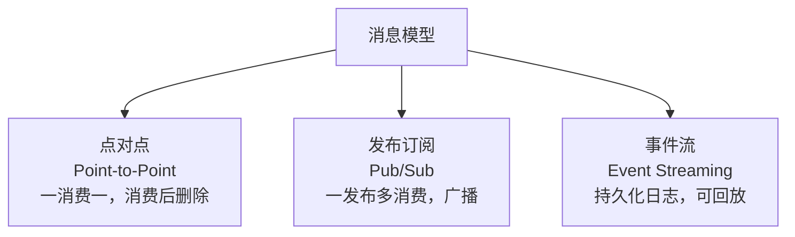
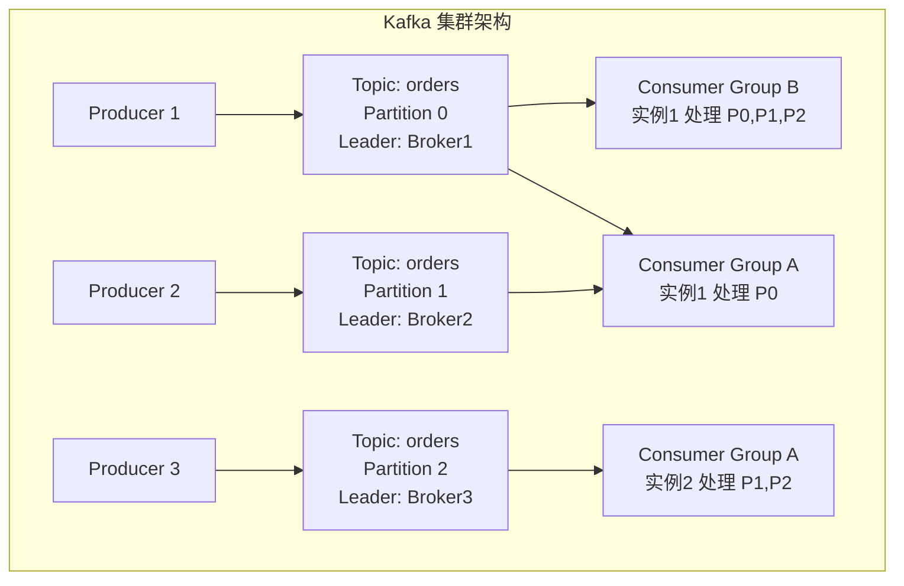
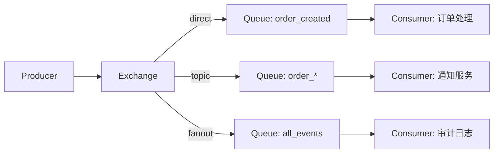
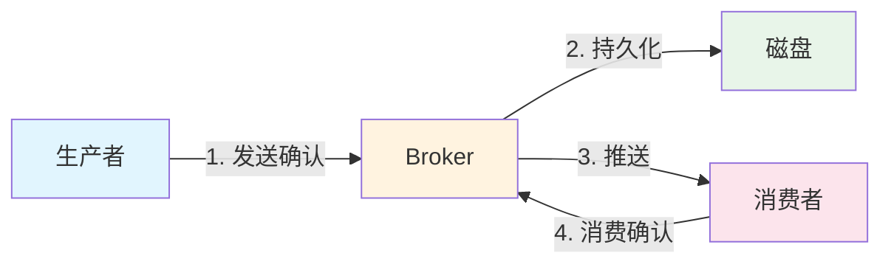
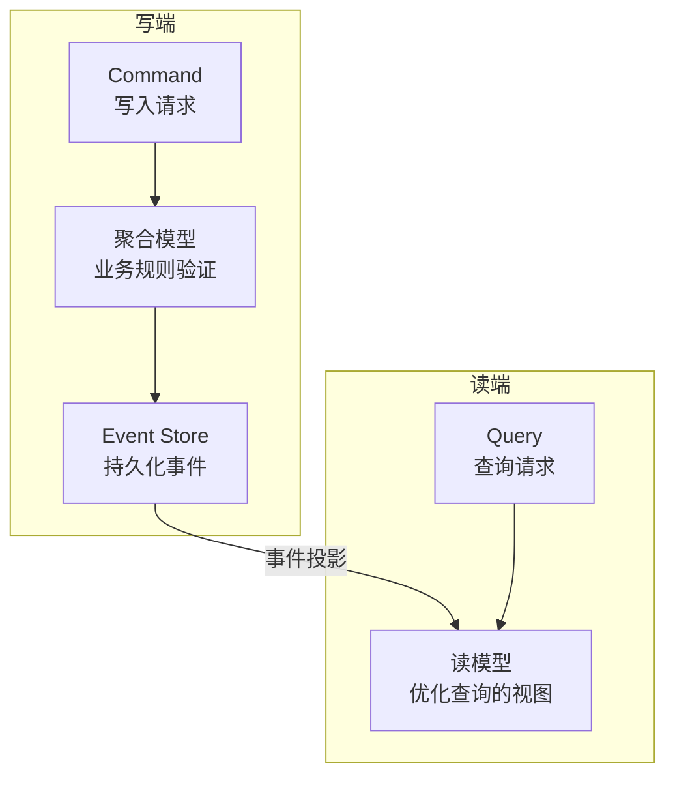

## 消息模型

消息队列有三种核心模型，适用于不同的业务场景：



| 模型 | 代表 | 消费语义 | 顺序保证 | 持久化 |
|------|------|----------|---------|--------|
| 点对点 | RabbitMQ | 一条消息只被一个消费者处理 | 队列级有序 | 消费确认后可删除 |
| 发布订阅 | RabbitMQ Exchange | 所有订阅者都收到 | 每个队列有序 | 按配置 |
| 事件流 | Kafka | 消费者组内竞争，组间广播 | 分区内严格有序 | 基于保留策略 |

## Kafka 架构

Kafka 是分布式事件流平台，以**追加写日志**为核心设计：



### 核心概念

- **Topic**：逻辑分类，类似数据库表
- **Partition**：Topic 的物理分片，每个 Partition 是一个有序的追加日志。分区数决定了最大并行度
- **Consumer Group**：同一组内的消费者分摊 Partition，组间独立消费
- **Offset**：消息在 Partition 中的位置，消费者通过 Offset 控制消费进度

### 分区策略

```java
// 指定分区
producer.send(new ProducerRecord<>("orders", 0, key, value));

// 按 key 哈希分区（相同 key 进同一分区，保证局部有序）
producer.send(new ProducerRecord<>("orders", orderId, orderData));

// 无 key 时轮询分区（负载均衡，无顺序保证）
producer.send(new ProducerRecord<>("orders", orderData));

// 自定义分区器
public class RegionPartitioner implements Partitioner {
    public int partition(String topic, Object key, byte[] keyBytes,
                         Object value, byte[] valueBytes, Cluster cluster) {
        String region = ((Order) value).getRegion();
        return regionToPartition.get(region);
    }
}
```

### 消费者 Rebalance

当消费者加入或离开组时，Kafka 触发 Rebalance 重新分配 Partition。这是 Kafka 的一大痛点——Rebalance 期间消费者无法消费：

```
消费者组 A (3 实例, 6 分区):
实例1: [P0, P1]    →  实例1: [P0, P1]     (实例2 下线)
实例2: [P2, P3]    →  实例3: [P2, P3, P4]  (接管实例2的分区)
实例3: [P4, P5]    →  (新)实例4: [P5]       (新实例加入)
```

**避免频繁 Rebalance**：
- `session.timeout.ms`（默认 10s）和 `heartbeat.interval.ms`（默认 3s）要合理配置
- `max.poll.interval.ms`（默认 5 分钟）要大于最长处理时间
- 使用 **CooperativeStickyAssignor** 避免"Stop-The-World"式 Rebalance

## RabbitMQ 工作模式

RabbitMQ 基于 AMQP 协议，通过 Exchange 和 Queue 的灵活组合支持多种工作模式：



| Exchange 类型 | 路由规则 | 示例 |
|--------------|----------|------|
| direct | 精确匹配 routing key | `order.created` → 订单处理队列 |
| topic | 模式匹配（`*` 一个词，`#` 零或多词） | `order.*` → 匹配 order.created, order.cancelled |
| fanout | 广播到所有绑定队列 | 所有消费者都收到 |
| headers | 基于消息头匹配 | 较少使用 |

### 死信队列

消息被拒绝、过期或队列满时进入死信队列，用于异常处理和重试：

```python
# 声明死信交换
channel.exchange_declare('dlx.exchange', exchange_type='direct')
channel.queue_declare('dlq.orders')

# 主队列绑定死信
channel.queue_declare(
    'orders',
    arguments={
        'x-dead-letter-exchange': 'dlx.exchange',
        'x-dead-letter-routing-key': 'dlq.orders',
        'x-message-ttl': 3600000,  # 1小时过期
    }
)
```

## 可靠性保障

消息从生产到消费，每个环节都可能丢失：



### 生产者确认

```java
// Kafka: acks 确认级别
props.put("acks", "all");  // 等待所有 ISR 副本确认，最安全但最慢
props.put("acks", "1");    // 只等 Leader 确认（默认）
props.put("acks", "0");    // 不等待，最快但可能丢消息

// RabbitMQ: Publisher Confirms
channel.confirmSelect();  // 开启确认模式
channel.basicPublish(...);
channel.waitForConfirms(5000);  // 等待 Broker 确认
```

### 消费者幂等

网络抖动可能导致消息重复投递，消费者必须保证幂等：

```go
func processOrder(msg OrderMessage) error {
    // 方案1: 唯一约束（数据库去重）
    _, err := db.Exec(
        "INSERT INTO processed_messages (id) VALUES (?) ON CONFLICT DO NOTHING",
        msg.MessageID,
    )
    if err != nil {
        return err
    }

    // 方案2: Redis 去重
    ok, _ := redis.SetNX(ctx, "msg:"+msg.MessageID, "1", 24*time.Hour).Result()
    if !ok {
        return nil  // 已处理过，跳过
    }

    // 执行业务逻辑
    return orderService.Process(msg)
}
```

## 事件驱动架构

### CQRS（命令查询职责分离）

CQRS 将读写操作分离，写操作走命令模型，读操作走查询模型：



### Event Sourcing（事件溯源）

传统方式只存储当前状态，Event Sourcing 存储所有状态变更事件：

```go
// 传统：只存当前状态
// UPDATE accounts SET balance = 80 WHERE id = 'acc_1';

// Event Sourcing：存储事件序列
// INSERT INTO events (aggregate_id, type, data) VALUES
//   ('acc_1', 'AccountCreated', '{"initial": 100}'),
//   ('acc_1', 'MoneyWithdrawn', '{"amount": 20}');

// 重建当前状态：回放所有事件
func (a *Account) Apply(events []Event) {
    for _, e := range events {
        switch e.Type {
        case "AccountCreated":
            a.Balance = e.Data["initial"].(int)
        case "MoneyWithdrawn":
            a.Balance -= e.Data["amount"].(int)
        }
    }
}
```

Event Sourcing 的优势：完整审计追踪、时间旅行调试、天然支持事件驱动。劣势：事件存储膨胀、查询复杂、最终一致性。

消息队列和事件驱动架构是微服务通信的基石——选择合适的消息模型和可靠性保障策略，是构建健壮分布式系统的关键。
