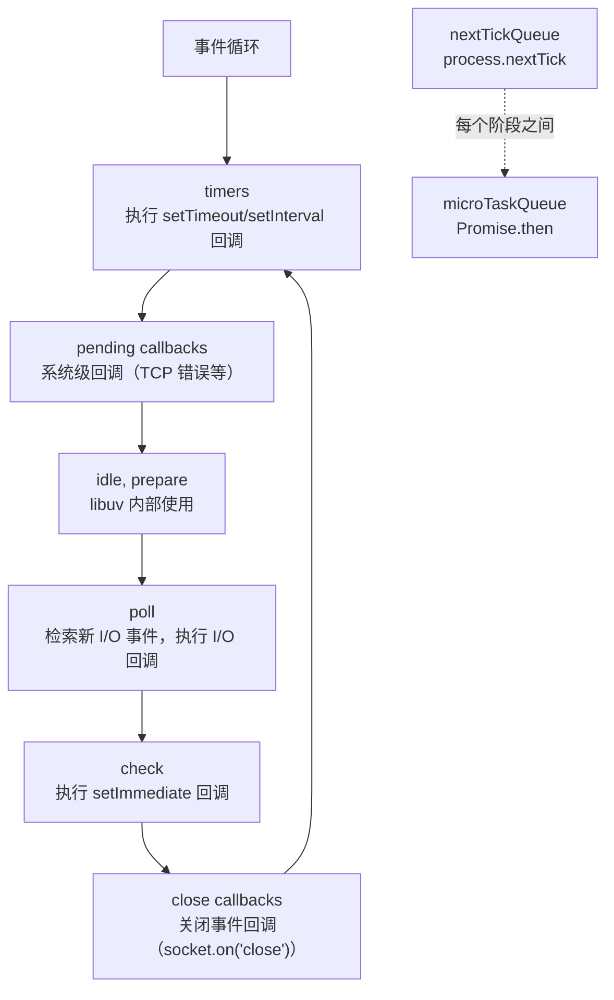
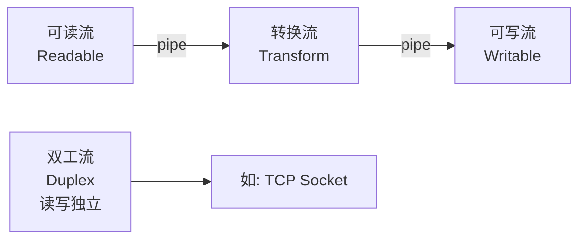

## V8 引擎与 libuv 事件循环

Node.js 由两大核心构成：**V8 引擎**负责 JavaScript 代码的编译执行，**libuv** 库负责跨平台的异步 I/O。两者通过 Node.js 的 C++ 绑定层连接。

事件循环是 Node.js 的心脏，它将操作分为 6 个阶段，每个阶段维护一个回调队列：



### 六个阶段详解

| 阶段 | 执行内容 | 典型 API |
|------|----------|----------|
| timers | 到期的定时器回调 | `setTimeout`, `setInterval` |
| pending callbacks | 系统操作的回调 | TCP 连接错误回调 |
| idle, prepare | libuv 内部 | — |
| poll | I/O 事件和回调 | 文件读取、网络请求完成回调 |
| check | 立即执行的回调 | `setImmediate` |
| close callbacks | 关闭事件 | `socket.destroy()` 的回调 |

**关键细节**：

- `process.nextTick` 不在事件循环的任何阶段，而是在每个阶段之间执行，且优先于微任务队列
- `setImmediate` 在 poll 阶段之后执行，`setTimeout(0)` 在 timers 阶段执行，但在非 I/O 上下文中顺序不确定
- poll 阶段如果队列为空：有 `setImmediate` 则进入 check 阶段；有定时器则等待到时间后进入 timers 阶段；否则阻塞等待 I/O

## 模块系统

### CommonJS 加载机制

```javascript
// 导出
module.exports = { add, subtract };
// 或
exports.add = function(a, b) { return a + b; };

// 导入
const math = require('./math');
```

CommonJS 的加载是**同步**的，`require()` 执行时会：

1. 解析模块路径为绝对路径
2. 检查缓存（`require.cache`），已加载则直接返回 `module.exports`
3. 未缓存则创建 `module` 对象，执行模块代码
4. 缓存并返回 `module.exports`

这意味着 CommonJS 模块可以**条件加载**和**动态加载**：

```javascript
if (process.env.NODE_ENV === 'production') {
  const monitoring = require('./monitoring');  // 条件加载
}
```

### ESM（ECMAScript Modules）

```javascript
// 导出
export function add(a, b) { return a + b; }
export default class Calculator {}

// 导入
import Calculator, { add } from './math.js';
```

ESM 与 CommonJS 的关键差异：

| 特性 | CommonJS | ESM |
|------|----------|-----|
| 加载方式 | 运行时同步加载 | 编译时静态分析 |
| 导出值 | 值的拷贝 | 值的引用（绑定） |
| this 顶层 | `module.exports` | `undefined` |
| 循环依赖 | 得到已执行部分的快照 | 得到引用，可能未初始化 |
| Tree-shaking | 不支持 | 支持 |

```javascript
// CJS: 值的拷贝
// counter.js
let count = 0;
module.exports = { count, increment: () => ++count };

// main.js
const { count, increment } = require('./counter');
console.log(count);      // 0
increment();
console.log(count);      // 0 — count 是拷贝，不会更新

// ESM: 值的引用
// counter.mjs
export let count = 0;
export function increment() { ++count; }

// main.mjs
import { count, increment } from './counter.mjs';
console.log(count);      // 0
increment();
console.log(count);      // 1 — count 是引用，实时更新
```

## 流（Stream）处理

流是 Node.js 处理大数据的核心抽象，数据分块传输而非一次性加载到内存：



四种流类型：
- **Readable**：可读流（`fs.createReadStream`、HTTP 请求体）
- **Writable**：可写流（`fs.createWriteStream`、HTTP 响应体）
- **Duplex**：双工流，读写独立（TCP Socket）
- **Transform**：转换流，读入数据经变换后输出（`zlib.createGzip`）

### 背压机制

当生产者速度 > 消费者速度时，数据会堆积在内存中。背压（Backpressure）机制通过反馈信号让生产者暂停：

```javascript
const fs = require('fs');
const zlib = require('zlib');

// ❌ 不处理背压
readable.on('data', (chunk) => {
  writable.write(chunk);  // 内部缓冲区可能溢出
});

// ✅ pipe 自动处理背压
fs.createReadStream('bigfile.txt')
  .pipe(zlib.createGzip())
  .pipe(fs.createWriteStream('bigfile.txt.gz'));

// ✅ 手动处理背压
const source = fs.createReadStream('bigfile.txt');
const dest = fs.createWriteStream('copy.txt');

source.on('data', (chunk) => {
  const canContinue = dest.write(chunk);
  if (!canContinue) {
    source.pause();  // 写入缓冲区满，暂停读取
  }
});

dest.on('drain', () => {
  source.resume();   // 缓冲区排空，恢复读取
});
```

## Cluster 与 Worker Threads

### Cluster：多进程

Cluster 利用多核 CPU，主进程（Master）监听端口，通过 IPC 将连接分发给工作进程（Worker）：

```javascript
const cluster = require('cluster');
const http = require('http');
const numCPUs = require('os').cpus().length;

if (cluster.isPrimary) {
  for (let i = 0; i < numCPUs; i++) {
    cluster.fork();
  }
  cluster.on('exit', (worker) => {
    console.log(`Worker ${worker.process.pid} died`);
    cluster.fork();  // 自动重启
  });
} else {
  http.createServer((req, res) => {
    res.writeHead(200);
    res.end('Hello from worker ' + process.pid);
  }).listen(3000);
}
```

### Worker Threads：多线程

Worker Threads 共享进程内存，适合 CPU 密集型任务：

```javascript
const { Worker, isMainThread, parentPort, SharedArrayBuffer } = require('worker_threads');

if (isMainThread) {
  const worker = new Worker(__filename);
  worker.on('message', (result) => console.log('Result:', result));
  worker.postMessage({ data: 'compute this' });
} else {
  parentPort.on('message', (msg) => {
    const result = heavyComputation(msg.data);
    parentPort.postMessage(result);
  });
}
```

| 特性 | Cluster | Worker Threads |
|------|---------|---------------|
| 隔离性 | 进程级隔离 | 线程级，共享内存 |
| 通信方式 | IPC（序列化） | MessagePort / SharedArrayBuffer |
| 适用场景 | HTTP 服务多核扩展 | CPU 密集型计算 |
| 内存开销 | 每个进程独立 V8 实例 | 共享主进程 V8 |

## 内存管理

V8 的垃圾回收基于分代回收：

- **新生代（Young Generation）**：存放短生命周期对象，使用 Scavenge（半空间复制）算法，GC 频繁但速度快
- **老生代（Old Generation）**：存放长期存活对象，使用 Mark-Sweep / Mark-Compact，GC 较少但暂停时间长

常见内存泄漏场景：

```javascript
// 1. 闭包引用
function createLeak() {
  const bigData = new Array(1000000);
  return function() {
    return bigData.length;  // bigData 无法被回收
  };
}

// 2. 全局变量
function handler(req, res) {
  leakedData = req.body;  // 忘记 var/let/const
}

// 3. 事件监听器未移除
emitter.on('event', callback);
// 忘记 emitter.removeListener('event', callback);

// 4. 缓存无限增长
const cache = new Map();
app.get('/data/:id', (req, res) => {
  if (!cache.has(req.params.id)) {
    cache.set(req.params.id, fetchData(req.params.id));  // 只增不减
  }
  res.json(cache.get(req.params.id));
});
```

排查工具：`process.memoryUsage()` 查看堆内存使用，`--inspect` 配合 Chrome DevTools 做堆快照对比，`node --max-old-space-size=4096` 调整老生代上限。
