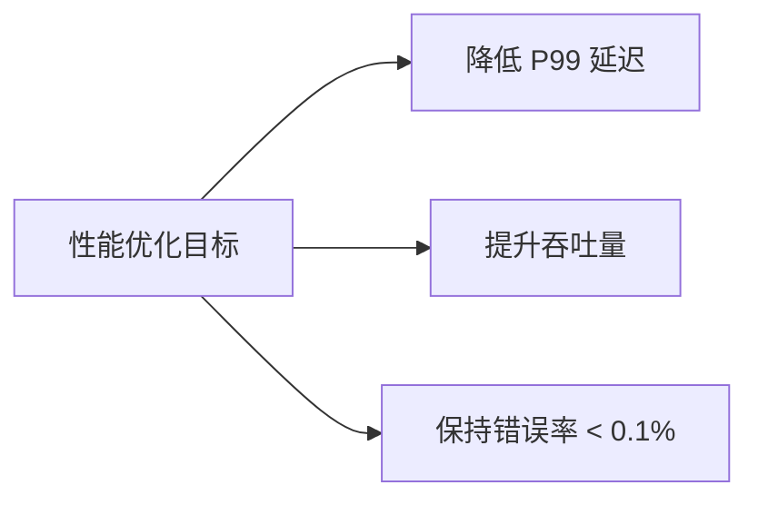
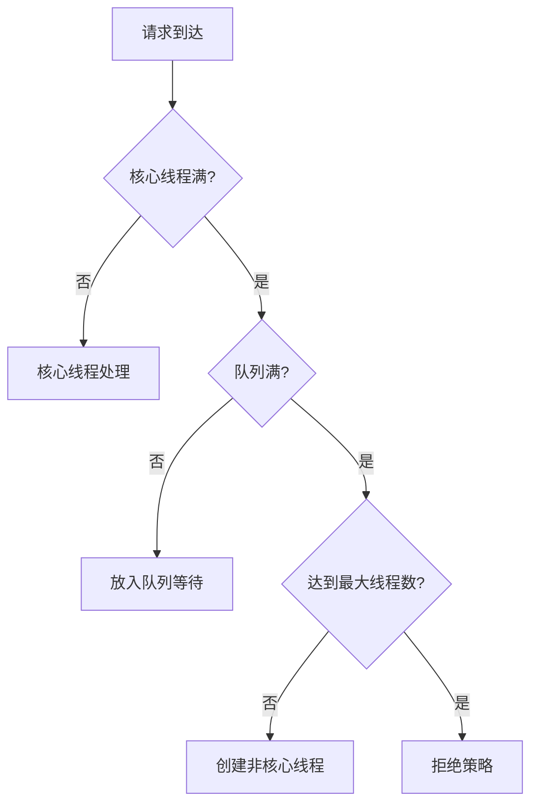
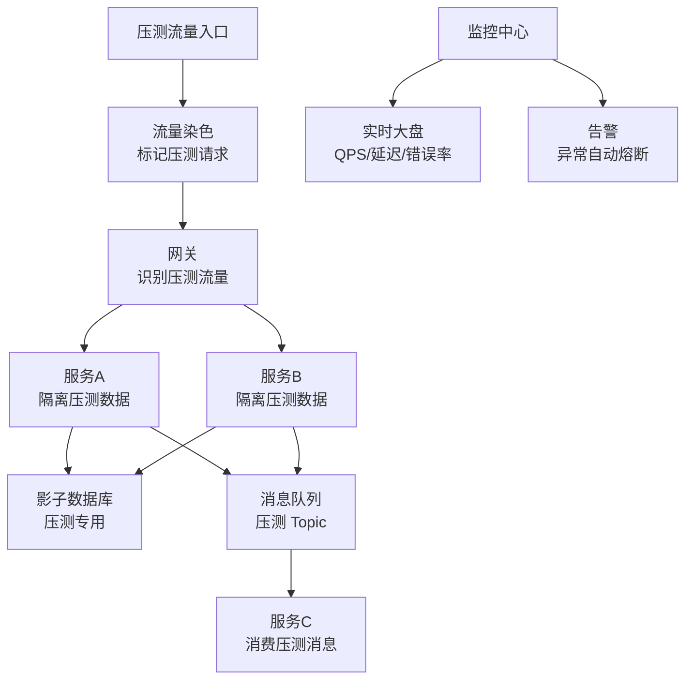
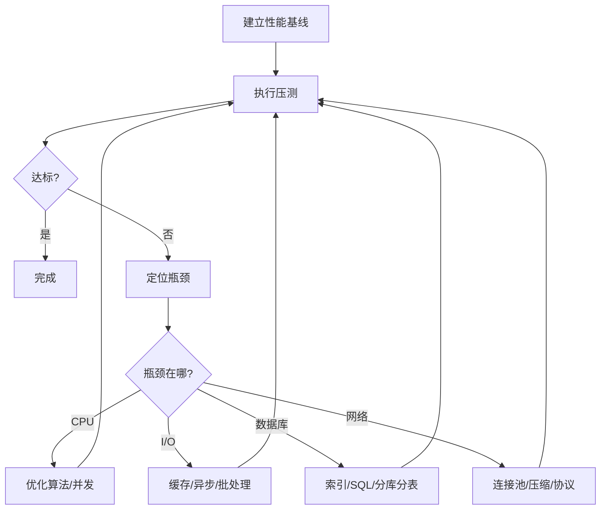

## 性能指标

后端性能调优首先要明确衡量标准：

| 指标 | 含义 | 关注点 |
|------|------|--------|
| 吞吐量（QPS/TPS） | 每秒处理请求数/事务数 | 系统容量上限 |
| 响应延迟（Latency） | 请求从发出到收到响应的时间 | 用户体验 |
| P50/P90/P99 | 第 50/90/99 百分位延迟 | 长尾延迟 |
| 并发数 | 同时处理的请求数 | 资源利用率 |
| 错误率 | 失败请求占比 | 系统稳定性 |

**为什么要看 P99 而不是平均值？** 假设 100 个请求中 99 个 10ms，1 个 10s。平均值 109ms 看起来尚可，但 P99 是 10s——这意味着 1% 的用户体验极差。平均值掩盖了长尾问题。



## 压测工具

### wrk

```bash
# 基础压测：12 线程，400 连接，持续 30 秒
wrk -t12 -c400 -d30s http://localhost:8080/api/users

# 带延迟分布
wrk -t12 -c400 -d30s --latency http://localhost:8080/api/users

# 输出示例
#   Latency   P50=3.21ms  P90=5.43ms  P99=12.87ms
#   Requests/sec: 124532.11
#   Transfer/sec: 45.67MB
```

### wrk2（恒定吞吐量压测）

```bash
# 恒定 1000 QPS，观察延迟随负载变化
wrk2 -t4 -c100 -d30s -R1000 http://localhost:8080/api/users
```

### k6

```javascript
// k6 脚本：渐进式负载
import http from 'k6/http';
import { check } from 'k6';

export const options = {
  stages: [
    { duration: '2m', target: 100 },   // 2分钟爬升到 100 VU
    { duration: '5m', target: 100 },   // 稳定 5 分钟
    { duration: '2m', target: 500 },   // 爬升到 500 VU
    { duration: '5m', target: 500 },   // 稳定 5 分钟
    { duration: '2m', target: 0 },     // 降压
  ],
  thresholds: {
    http_req_duration: ['p(99)<500'],   // P99 < 500ms
    http_req_failed: ['rate<0.01'],     // 错误率 < 1%
  },
};

export default function () {
  const res = http.get('http://localhost:8080/api/users');
  check(res, { 'status is 200': (r) => r.status === 200 });
}
```

## 数据库优化

### 慢查询治理

```sql
-- MySQL 开启慢查询日志
SET GLOBAL slow_query_log = ON;
SET GLOBAL long_query_time = 0.1;  -- 超过 100ms 记录
SET GLOBAL log_queries_not_using_indexes = ON;

-- 分析慢查询
EXPLAIN ANALYZE SELECT u.name, COUNT(o.id)
FROM users u
JOIN orders o ON u.id = o.user_id
WHERE u.created_at > '2024-01-01'
GROUP BY u.name;
```

常见优化路径：

| 问题 | 优化方案 | 预期效果 |
|------|----------|----------|
| 全表扫描 | 添加合适索引 | 查询行数减少 99%+ |
| 回表过多 | 覆盖索引 | 避免 50%+ 的随机 I/O |
| 临时表排序 | 优化 ORDER BY 索引 | 消除 filesort |
| 大量 JOIN | 反范式化/冗余字段 | 减少 JOIN 层数 |
| 深分页 | 游标分页 | 避免扫描前 N 行 |

```sql
-- ❌ OFFSET 深分页（扫描 100010 行，丢弃前 100000 行）
SELECT * FROM orders ORDER BY id LIMIT 10 OFFSET 100000;

-- ✅ 游标分页（只扫描 10 行）
SELECT * FROM orders WHERE id > 100000 ORDER BY id LIMIT 10;
```

### 连接池调优

```yaml
# HikariCP 推荐配置
maximumPoolSize: 20          # 公式: (核心数 * 2) + 有效磁盘数
minimumIdle: 5               # 最小空闲连接
connectionTimeout: 3000      # 获取连接超时 3s
idleTimeout: 600000          # 空闲连接最大存活 10 分钟
maxLifetime: 1800000         # 连接最大存活 30 分钟
leakDetectionThreshold: 60000  # 连接泄漏检测 60s
```

## 连接与线程池调优

### 线程池配置



```java
// 线程池配置（以 I/O 密集型为例）
ThreadPoolExecutor executor = new ThreadPoolExecutor(
    16,                              // 核心线程数
    64,                              // 最大线程数
    60, TimeUnit.SECONDS,            // 非核心线程空闲存活时间
    new LinkedBlockingQueue<>(1000), // 任务队列
    new ThreadPoolExecutor.CallerRunsPolicy()  // 队列满时调用者线程执行
);

// CPU 密集型：核心线程数 ≈ CPU 核心数 + 1
// I/O 密集型：核心线程数 ≈ CPU 核心数 * (1 + 等待时间/计算时间)
```

### 拒绝策略选择

| 策略 | 行为 | 适用场景 |
|------|------|----------|
| AbortPolicy | 抛异常 | 默认，需要感知过载 |
| CallerRunsPolicy | 调用者线程执行 | 降速但不丢弃 |
| DiscardOldestPolicy | 丢弃最老任务 | 允许丢任务 |
| DiscardPolicy | 静默丢弃 | 允许丢任务 |

### HTTP 连接池

```go
// Go HTTP 客户端调优
transport := &http.Transport{
    MaxIdleConns:        100,              // 全局最大空闲连接
    MaxIdleConnsPerHost: 20,               // 每个 Host 最大空闲连接
    MaxConnsPerHost:     50,               // 每个 Host 最大连接数
    IdleConnTimeout:     90 * time.Second, // 空闲连接超时
    DialContext: (&net.Dialer{
        Timeout:   5 * time.Second,        // 连接超时
        KeepAlive: 30 * time.Second,       // TCP keepalive
    }).DialContext,
    TLSHandshakeTimeout:   5 * time.Second,
    ResponseHeaderTimeout: 10 * time.Second,
}
client := &http.Client{Transport: transport, Timeout: 30 * time.Second}
```

## 全链路压测与容量规划

### 全链路压测架构



### 容量规划四步法

**1. 确定目标**

```
业务目标: 大促期间峰值 10000 QPS，P99 < 500ms，错误率 < 0.1%
```

**2. 基准测试**

```
单机基准: 单实例 2000 QPS，P99 = 200ms
```

**3. 计算容量**

```
所需实例数 = 目标 QPS / 单机 QPS × 安全系数
           = 10000 / 2000 × 1.5
           = 8 实例
```

**4. 验证与调优**

```
阶梯压测:
  4 实例 → 4000 QPS → P99 = 350ms ✅
  6 实例 → 6000 QPS → P99 = 420ms ✅
  8 实例 → 8000 QPS → P99 = 480ms ⚠️  接近目标
  10 实例 → 10000 QPS → P99 = 460ms ✅ 达标

瓶颈定位: 数据库连接池排队 → 增加连接数 → 8 实例即可达标
```

### 性能调优流程



### 常见调优手段优先级

| 优先级 | 手段 | 效果 | 成本 |
|--------|------|------|------|
| 1 | 加缓存 | 10-100x | 低 |
| 2 | 优化索引/SQL | 5-50x | 低 |
| 3 | 异步化 | 2-10x | 中 |
| 4 | 批处理 | 3-10x | 中 |
| 5 | 连接池调优 | 2-5x | 低 |
| 6 | 算法优化 | 视情况 | 高 |
| 7 | 水平扩展 | 线性 | 高（成本） |

性能调优的核心原则：**先度量，再优化**。用数据说话，不要凭直觉优化。每次只改一个变量，确认效果后再进行下一步。
