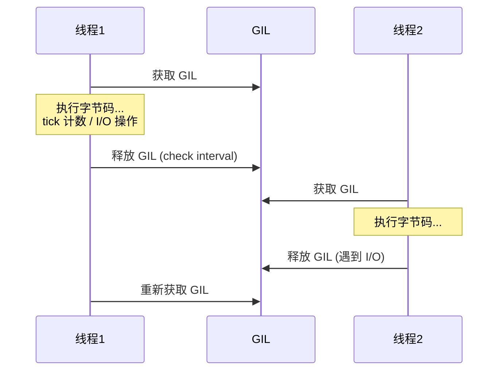
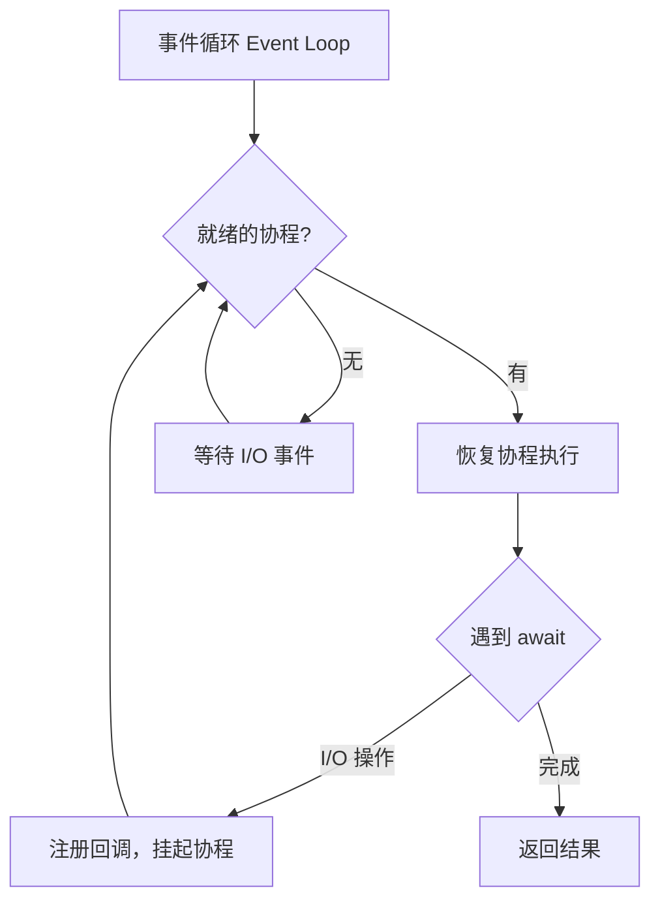

## CPython 解释器

CPython 是 Python 的参考实现，代码执行流程为：源代码 → 字节码 → 虚拟机执行。

### 字节码编译与执行

```python
import dis

def add(a, b):
    return a + b

dis.dis(add)
# 输出：
#  2           0 LOAD_FAST                0 (a)
#              2 LOAD_FAST                1 (b)
#              4 BINARY_ADD
#              6 RETURN_VALUE
```

CPython 的执行循环核心是 **eval_frame** 函数，它逐条取出字节码指令并执行。每个指令对应一个 C 函数的实现（如 `BINARY_ADD` 调用 `PyNumber_Add`）。

**性能关键点**：Python 的动态类型意味着每次操作都需要运行时类型检查和分发。`a + b` 在 C 层需要：检查 `a` 的类型 → 查找 `__add__` → 调用 → 检查结果 → 返回。这就是 Python 比 C 慢 50-100 倍的根本原因。

## GIL 机制

全局解释器锁（GIL）是 CPython 最具争议的设计。它确保同一时刻只有一个线程执行 Python 字节码：



### GIL 的存在原因

CPython 的内存管理（引用计数）不是线程安全的。如果没有 GIL，两个线程同时修改同一对象的引用计数会导致内存泄漏或提前释放。GIL 是最简单的解决方案——用一把锁保护所有对象。

### GIL 对多线程的影响

```python
import threading
import time

# CPU 密集型：多线程无法并行
def cpu_bound():
    total = 0
    for i in range(50_000_000):
        total += i

start = time.time()
t1 = threading.Thread(target=cpu_bound)
t2 = threading.Thread(target=cpu_bound)
t1.start(); t2.start()
t1.join(); t2.join()
print(f"多线程: {time.time() - start:.2f}s")  # 可能比单线程更慢

# I/O 密集型：多线程有效
def io_bound():
    import urllib.request
    urllib.request.urlopen("https://httpbin.org/delay/1").read()
```

### 绕过 GIL 的方案

| 方案 | 适用场景 | 示例 |
|------|----------|------|
| 多进程 | CPU 密集型 | `multiprocessing.Pool` |
| C 扩展释放 GIL | 计算密集库 | NumPy、Pandas |
| `asyncio` | I/O 密集型 | 异步 HTTP/数据库 |
| 子进程调用 | 集成外部程序 | `subprocess.run()` |

```python
from multiprocessing import Pool

def cpu_bound(n):
    return sum(i * i for i in range(n))

if __name__ == '__main__':
    with Pool(4) as p:
        results = p.map(cpu_bound, [50_000_000] * 4)  # 真正并行
```

## 异步 IO：asyncio

asyncio 是 Python 的异步 I/O 框架，基于**协程**和**事件循环**实现单线程并发：



### 协程调度

```python
import asyncio

async def fetch_data(url, delay):
    print(f"开始请求 {url}")
    await asyncio.sleep(delay)  # 模拟 I/O，控制权交还事件循环
    print(f"完成请求 {url}")
    return f"data from {url}"

async def main():
    # 并发执行三个请求，总耗时 ≈ max(1, 2, 3) = 3s
    results = await asyncio.gather(
        fetch_data("api-1", 1),
        fetch_data("api-2", 2),
        fetch_data("api-3", 3),
    )
    print(results)

asyncio.run(main())
```

### 异步上下文管理器与迭代器

```python
# 异步上下文管理器（数据库连接池）
class AsyncPool:
    async def __aenter__(self):
        self.conn = await create_connection()
        return self.conn

    async def __aexit__(self, *exc):
        await self.conn.close()

async def query():
    async with AsyncPool() as conn:
        result = await conn.execute("SELECT * FROM users")
        async for row in result:  # 异步迭代
            print(row)
```

### asyncio 与多线程/多进程结合

```python
# 在异步代码中调用阻塞 I/O
async def main():
    loop = asyncio.get_event_loop()

    # 将阻塞函数放到线程池
    result = await loop.run_in_executor(None, blocking_db_query, "SELECT 1")

    # 使用进程池处理 CPU 密集型
    from concurrent.futures import ProcessPoolExecutor
    with ProcessPoolExecutor() as pool:
        result = await loop.run_in_executor(pool, cpu_heavy_task, data)
```

## 类型系统

Python 3.5+ 引入了类型注解（Type Hints），配合 mypy 做静态类型检查：

```python
from typing import Optional, Union, Literal, TypedDict, Protocol

# 基础类型
def greet(name: str, times: int = 1) -> str:
    return (f"Hello, {name}! ") * times

# 可选与联合类型
def find_user(user_id: int) -> Optional[dict]:
    ...  # 返回 dict 或 None

# Literal 类型
def set_mode(mode: Literal["debug", "production"]) -> None:
    ...

# TypedDict
class UserInfo(TypedDict):
    name: str
    age: int
    email: Optional[str]

# Protocol（结构化子类型）
class Closeable(Protocol):
    def close(self) -> None: ...

def cleanup(resource: Closeable) -> None:
    resource.close()  # 任何有 close() 方法的对象都可以
```

## FastAPI 框架

FastAPI 是 Python 生态中最受关注的后端框架，基于 Starlette（ASGI）和 Pydantic（数据验证）：

```python
from fastapi import FastAPI, HTTPException, Depends
from pydantic import BaseModel, Field
from typing import Optional

app = FastAPI(title="用户服务 API")

class UserCreate(BaseModel):
    name: str = Field(..., min_length=2, max_length=50)
    email: str = Field(..., pattern=r"^[\w.-]+@[\w.-]+\.\w+$")
    age: Optional[int] = Field(None, ge=0, le=150)

class UserResponse(BaseModel):
    id: int
    name: str
    email: str

@app.post("/users", response_model=UserResponse, status_code=201)
async def create_user(user: UserCreate):
    # Pydantic 自动验证请求体，失败返回 422 + 详细错误
    db_user = await db.create(user.dict())
    return db_user

@app.get("/users/{user_id}", response_model=UserResponse)
async def get_user(user_id: int):
    user = await db.get(user_id)
    if not user:
        raise HTTPException(status_code=404, detail="User not found")
    return user
```

FastAPI 的核心优势：

- **自动 OpenAPI 文档**：类型注解自动生成 Swagger UI / ReDoc
- **请求验证**：Pydantic 基于类型自动验证，错误信息精确到字段
- **异步原生**：`async def` 自动使用异步路径，`def` 自动放入线程池
- **依赖注入**：`Depends()` 实现优雅的认证、数据库会话等共享逻辑

```python
# 依赖注入示例
async def get_current_user(token: str = Depends(oauth2_scheme)):
    user = await decode_token(token)
    if not user:
        raise HTTPException(401)
    return user

@app.get("/me")
async def read_me(user: User = Depends(get_current_user)):
    return user
```
