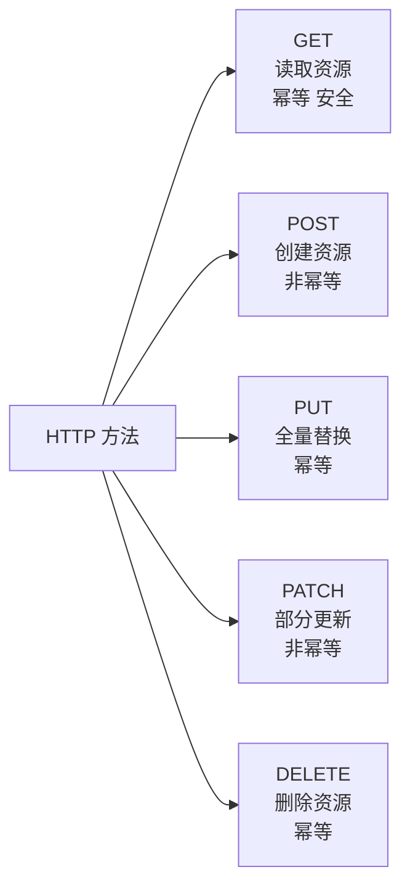
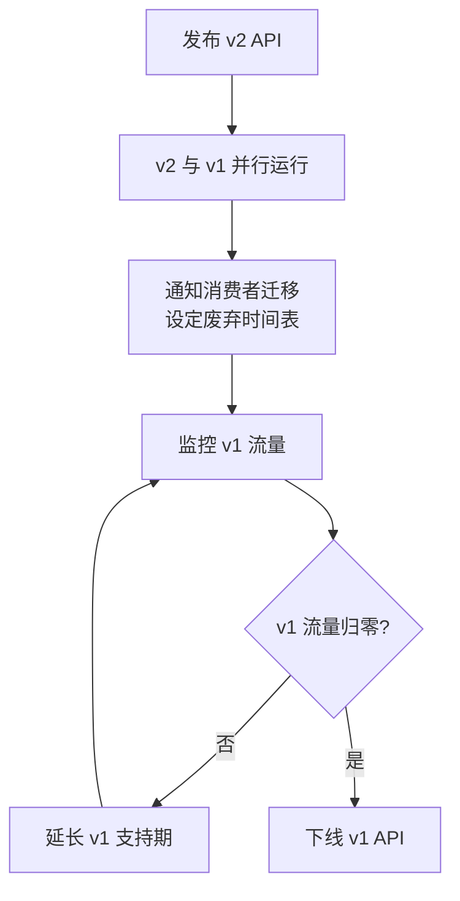
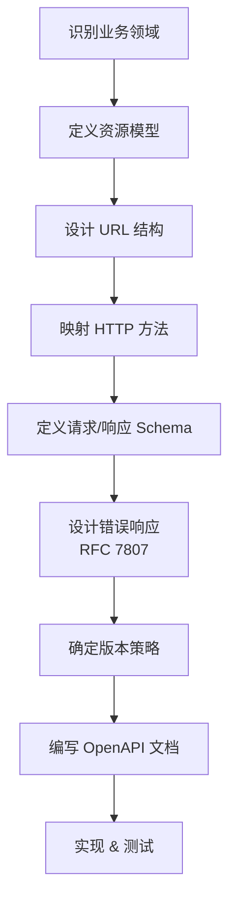

## REST 架构约束

REST（Representational State Transfer）是 Roy Fielding 在 2000 年提出的架构风格，它定义了六个核心约束：

1. **客户端-服务器（Client-Server）**：关注点分离，客户端负责用户交互，服务器负责数据存储
2. **无状态（Stateless）**：每次请求必须包含所有必要信息，服务器不保存客户端状态
3. **可缓存（Cacheable）**：响应必须明确标识是否可缓存
4. **统一接口（Uniform Interface）**：核心约束，包括资源标识、通过表述操作资源、自描述消息、超媒体驱动
5. **分层系统（Layered System）**：客户端不需要知道是否直连服务器
6. **按需代码（Code on Demand）**：可选约束，服务器可以返回可执行代码

其中**统一接口**是 REST 区别于其他架构风格的关键。很多所谓的"RESTful API"实际上只是 HTTP API，因为它们没有满足超媒体驱动（HATEOAS）的要求。

## URL 设计规范

### 资源命名

URL 标识资源，而非操作。核心原则：

```
✅ 好的设计                    ❌ 差的设计
GET  /users                   GET  /getUsers
GET  /users/123               GET  /getUserById?id=123
POST /users                   POST /createUser
PUT  /users/123               PUT  /updateUser?id=123
DELETE /users/123             DELETE /deleteUser?id=123
```

规范要点：

- **使用名词复数**：`/users` 而非 `/user`
- **嵌套资源表达关系**：`/users/123/orders` 表示用户 123 的订单
- **嵌套层级不超过 2 层**：超过时改用查询参数 `/orders?user_id=123`
- **使用小写字母和连字符**：`/user-profiles` 而非 `/userProfiles`
- **避免动词**：动作由 HTTP 方法表达

### 查询参数

```
# 筛选
GET /orders?status=active&region=cn

# 分页
GET /orders?page=2&page_size=20

# 排序
GET /orders?sort=-created_at,+amount   # - 降序, + 升序

# 字段选择（减少带宽）
GET /users/123?fields=name,email

# 搜索
GET /products?q=keyword
```

## HTTP 方法语义



| 方法 | 幂等 | 安全 | 语义 | 典型响应 |
|------|------|------|------|----------|
| GET | 是 | 是 | 获取资源 | 200 + 资源 |
| POST | 否 | 否 | 创建资源 | 201 + Location |
| PUT | 是 | 否 | 全量替换 | 200 或 204 |
| PATCH | 否 | 否 | 部分更新 | 200 或 204 |
| DELETE | 是 | 否 | 删除资源 | 204 |

**幂等性**：同一请求执行一次和多次效果相同。PUT 是幂等的因为全量替换，PATCH 非幂等因为增量更新可能叠加。

**实际案例**：

```http
# 创建订单 - POST
POST /orders
Content-Type: application/json

{
  "items": [{"product_id": "p1", "quantity": 2}],
  "shipping_address": "..."
}

# 响应
HTTP/1.1 201 Created
Location: /orders/ord_abc123

{
  "id": "ord_abc123",
  "status": "pending",
  "created_at": "2024-01-15T10:30:00Z"
}
```

## 错误处理：RFC 7807 Problem Details

不要自定义错误格式。RFC 7807 定义了标准化的错误响应格式：

```json
HTTP/1.1 422 Unprocessable Entity
Content-Type: application/problem+json

{
  "type": "https://example.com/problems/insufficient-stock",
  "title": "Insufficient Stock",
  "status": 422,
  "detail": "Product 'p1' only has 1 unit available, but 2 were requested",
  "instance": "/orders/ord_abc123",
  "available_stock": 1
}
```

核心字段：

- `type`（必需）：错误类型的 URI 引用，人类可读的文档链接
- `title`（必需）：简短的人类可读标题
- `status`（必需）：HTTP 状态码
- `detail`：具体错误详情
- `instance`：出现问题的具体资源

扩展字段可以添加业务相关的错误信息（如上例的 `available_stock`）。

## API 版本管理策略

### URL 路径版本（推荐）

```
/api/v1/users
/api/v2/users
```

优点：简单直观，易于理解。缺点：URL 变化。

### 请求头版本

```
GET /users
Accept: application/vnd.myapi.v2+json
```

优点：URL 保持不变。缺点：不够直观，调试困难。

### 版本迁移实战



版本管理建议：

- **Breaking Change 才升级大版本**：新增字段、新增端点不算
- **保持至少 2 个版本并行**：给消费者足够迁移时间
- **废弃预警**：响应头 `Sunset: Sat, 1 Jan 2025 00:00:00 GMT` + `Link: <v2-docs>; rel="successor-version"`
- **变更日志**：维护 CHANGES.md 记录每个版本的变更

## RESTful API 设计流程



完整设计案例——电商订单 API：

```
资源关系：
/users → /users/{id} → /users/{id}/orders
/orders → /orders/{id} → /orders/{id}/items
/products → /products/{id}

端点设计：
GET    /users/{id}/orders          # 用户的订单列表
POST   /orders                     # 创建订单
GET    /orders/{id}                # 订单详情
PATCH  /orders/{id}/status         # 更新订单状态
DELETE /orders/{id}                # 取消订单
GET    /products?category=electronics  # 商品搜索
```

RESTful 设计不是教条，而是指导原则。在实际项目中，需要根据团队规模、客户端需求、性能要求做合理取舍。关键是保持一致性——团队内采用统一的规范，比追求"完美 REST"更重要。
