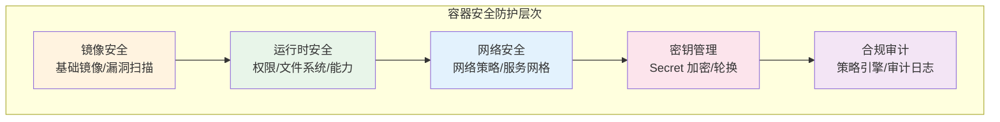
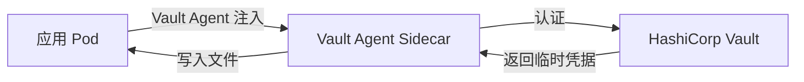

## 容器安全全景

容器安全不是单一技术，而是贯穿镜像构建、运行时、网络、密钥和合规审计的全链路实践。任何环节的疏忽都可能成为攻击入口。



## 镜像安全

### 基础镜像选择

基础镜像是容器安全的根基，选择不当会引入大量已知漏洞：

| 基础镜像 | 大小 | 漏洞面 | 适用场景 |
|---------|------|--------|---------|
| ubuntu:22.04 | ~77MB | 较大 | 需要完整工具链 |
| debian:bookworm-slim | ~74MB | 中等 | 平衡功能与安全 |
| alpine:3.19 | ~7MB | 极小 | 精简运行环境 |
| distroless | ~2MB | 最小 | 仅包含应用运行时 |
| scratch | 0MB | 无 | 静态编译语言（Go/Rust） |

```dockerfile
# 使用 distroless 作为最终运行镜像
FROM golang:1.22 AS builder
WORKDIR /app
COPY . .
RUN CGO_ENABLED=0 go build -o server .

FROM gcr.io/distroless/static-debian12:nonroot
COPY --from=builder /app/server /
USER nonroot:nonroot
ENTRYPOINT ["/server"]
```

### 漏洞扫描

在 CI 流水线中集成镜像扫描，阻止漏洞镜像进入生产环境：

```bash
# 使用 Trivy 扫描镜像
trivy image --severity HIGH,CRITICAL my-app:latest

# CI 中使用，发现高危漏洞则失败
trivy image --exit-code 1 --severity HIGH,CRITICAL my-app:latest

# 扫描并生成报告
trivy image --format json --output report.json my-app:latest
```

推荐的扫描工具：
- **Trivy**：开源、速度快、支持多种目标
- **Grype**：Anchore 出品，与 Syft 配合使用
- **Snyk Container**：商业方案，漏洞数据库更新及时

### 镜像签名与验证

使用 Cosign 对镜像签名，确保部署的镜像未被篡改：

```bash
# 签名镜像
cosign sign --key cosign.key my-registry.com/app:v1.0.0

# 验证签名
cosign verify --key cosign.pub my-registry.com/app:v1.0.0
```

## 运行时安全

### 非 Root 运行

默认情况下容器以 root 运行，这是最大的安全风险之一：

```dockerfile
# Dockerfile 中指定非 root 用户
RUN addgroup -S appgroup && adduser -S appuser -G appgroup
USER appuser

# 或在运行时指定
# docker run --user 1000:1000 my-app
```

```yaml
# K8s Pod 安全上下文
securityContext:
  runAsNonRoot: true
  runAsUser: 1000
  runAsGroup: 1000
  fsGroup: 1000
```

### 只读文件系统

防止运行时被写入恶意文件：

```yaml
# K8s 中设置只读根文件系统
securityContext:
  readOnlyRootFileSystem: true

# 需要写入的目录通过 emptyDir 挂载
volumes:
  - name: tmp
    emptyDir: {}
volumeMounts:
  - name: tmp
    mountPath: /tmp
```

### 能力裁剪（Capabilities）

Linux Capabilities 将 root 权限拆分为细粒度能力，容器只需最小权限集：

```yaml
# K8s 中裁剪能力
securityContext:
  capabilities:
    drop:
      - ALL          # 丢弃所有能力
    add:
      - NET_BIND_SERVICE  # 仅添加绑定特权端口的能力
```

常见能力说明：
- `NET_BIND_SERVICE`：绑定 1024 以下端口
- `SYS_PTRACE`：调试进程（慎用，可被用于进程注入）
- `CHOWN`：修改文件所有者
- `SETUID/SETGID`：切换用户/组身份

### Seccomp 配置

Seccomp 限制容器可使用的系统调用：

```json
{
  "defaultAction": "SCMP_ACT_ERRNO",
  "architectures": ["SCMP_ARCH_X86_64"],
  "syscalls": [
    {"names": ["read", "write", "open", "close", "mmap"], "action": "SCMP_ACT_ALLOW"}
  ]
}
```

## 密钥管理

### 常见反模式

```yaml
# ❌ 错误：密钥写在镜像里
ENV DATABASE_PASSWORD=supersecret

# ❌ 错误：密钥写在 Compose 环境变量中（明文存储）
environment:
  - DB_PASSWORD=supersecret

# ✅ 正确：使用 Docker Secrets 或 K8s Secrets
```

### K8s Secret 安全增强

```yaml
# 使用加密的 Secret
apiVersion: v1
kind: Secret
metadata:
  name: db-credentials
type: Opaque
data:
  username: YWRtaW4=        # base64 编码
  password: c3VwZXJzZWNyZXQ=
```

安全增强措施：

1. **启用 etcd 加密**：配置 K8s API Server 对 Secret 数据加密存储
2. **使用外部密钥管理**：集成 Vault/AWS Secrets Manager
3. **RBAC 限制访问**：最小权限原则，仅授权必要的服务账号读取 Secret
4. **定期轮换**：自动化的密钥轮换机制



## 网络安全

### 网络隔离

```yaml
# K8s Network Policy — 仅允许特定流量
apiVersion: networking.k8s.io/v1
kind: NetworkPolicy
metadata:
  name: api-policy
  namespace: production
spec:
  podSelector:
    matchLabels:
      app: api
  policyTypes:
    - Ingress
    - Egress
  ingress:
    - from:
        - podSelector:
            matchLabels:
              app: web
      ports:
        - port: 8080
  egress:
    - to:
        - podSelector:
            matchLabels:
              app: db
      ports:
        - port: 5432
    - to: []  # 允许 DNS 解析
      ports:
        - port: 53
          protocol: UDP
```

### Pod 安全标准

K8s 1.25+ 使用 Pod Security Standards 替代 PodSecurityPolicy：

| 级别 | 说明 | 典型场景 |
|------|------|---------|
| Privileged | 不限制 | 系统组件、CI 运行器 |
| Baseline | 禁止已知提权手段 | 一般工作负载 |
| Restricted | 严格限制，最小权限 | 安全敏感应用 |

```yaml
# 命名空间级别强制执行
apiVersion: v1
kind: Namespace
metadata:
  name: production
  labels:
    pod-security.kubernetes.io/enforce: restricted
    pod-security.kubernetes.io/audit: restricted
    pod-security.kubernetes.io/warn: restricted
```

## 合规审计

### 策略引擎

使用策略引擎在部署前拦截不安全配置：

```yaml
# OPA/Gatekeeper 策略示例：禁止特权容器
apiVersion: templates.gatekeeper.sh/v1
kind: ConstraintTemplate
metadata:
  name: denyprivileged
spec:
  crd:
    spec:
      names:
        kind: DenyPrivileged
  targets:
    - target: admission.k8s.gatekeeper.sh
      rego: |
        violation[{"msg": msg}] {
          container := input.review.object.spec.containers[_]
          container.securityContext.privileged
          msg := sprintf("Privileged container is forbidden: %v", [container.name])
        }
```

### 审计日志

K8s 审计日志记录所有 API 请求，是安全溯源的基础：

```yaml
# 审计策略配置
apiVersion: audit.k8s.io/v1
kind: Policy
rules:
  - level: RequestResponse
    resources:
      - group: ""
        resources: ["secrets"]
  - level: Metadata
    resources:
      - group: ""
        resources: ["pods", "services"]
```

### 安全扫描工具链

| 工具 | 用途 | 阶段 |
|------|------|------|
| Trivy | 镜像漏洞扫描 | CI 构建 |
| Cosign | 镜像签名验证 | CD 部署 |
| Falco | 运行时异常检测 | 运行时 |
| OPA/Gatekeeper | 策略执行 | 部署前 |
| kube-bench | CIS 基准检查 | 集群评估 |

容器安全是一个持续的过程，需要在每个环节建立防护机制。从镜像安全到运行时保护，从网络隔离到合规审计，层层设防才能构建真正安全的容器化环境。
