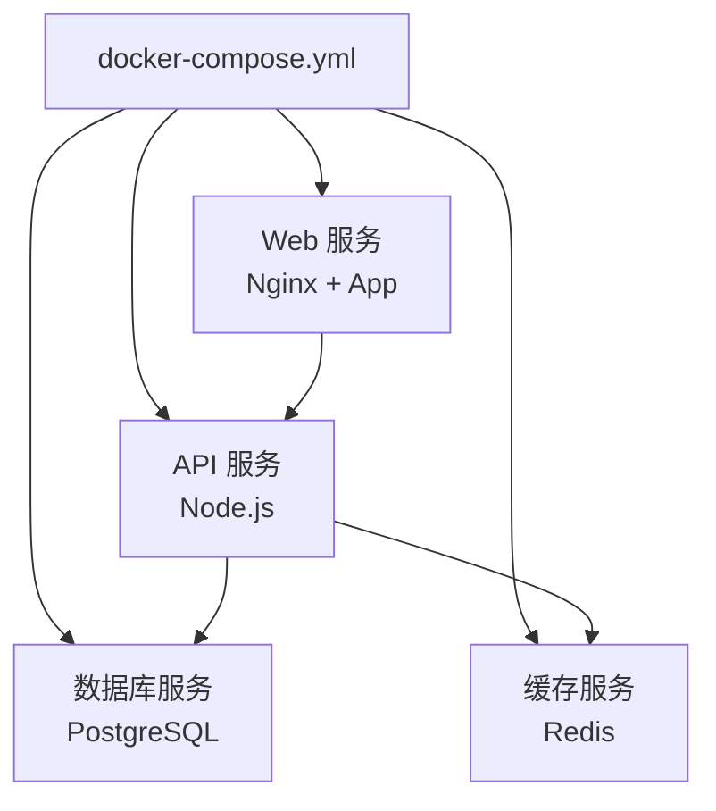
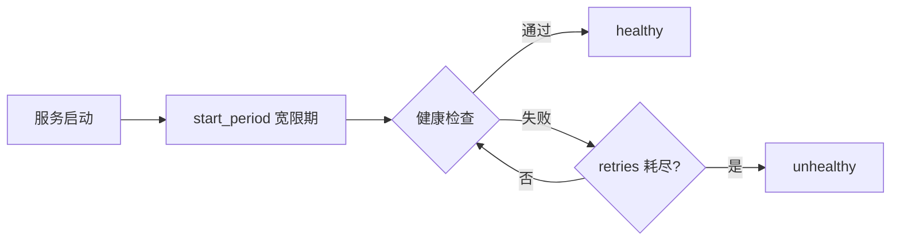
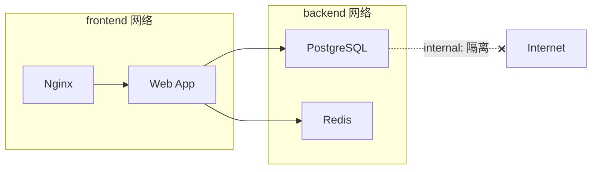

## Docker Compose 概述

Docker Compose 是定义和运行多容器应用的工具。通过一个 YAML 文件声明应用所需的所有服务，一条命令即可创建并启动全部容器。它将"手动逐个启动容器"的繁琐过程，简化为声明式的自动化编排。



## Compose 文件结构与版本演进

### 版本差异

| 版本 | 说明 | 推荐度 |
|------|------|--------|
| v1 | 早期格式，无 version 字段 | 已弃用 |
| v2 | 支持 depends_on 条件 | 不推荐 |
| v2.x | 支持 healthcheck、deploy | 可用 |
| v3 | 支持 deploy 配置，为 Swarm 设计 | 广泛使用 |

> **注意**：从 Docker Compose V2 开始，`version` 字段已不再必需，Compose 会自动推断格式。

### 完整文件示例

```yaml
# docker-compose.yml
services:
  web:
    build:
      context: .
      dockerfile: Dockerfile
      args:
        NODE_ENV: production
    ports:
      - "3000:3000"
    environment:
      - DATABASE_URL=postgresql://app:secret@db:5432/appdb
      - REDIS_URL=redis://cache:6379
    depends_on:
      db:
        condition: service_healthy
      cache:
        condition: service_started
    healthcheck:
      test: ["CMD", "curl", "-f", "http://localhost:3000/health"]
      interval: 30s
      timeout: 10s
      retries: 3
      start_period: 40s
    restart: unless-stopped
    deploy:
      resources:
        limits:
          cpus: "1.0"
          memory: 512M

  db:
    image: postgres:16-alpine
    environment:
      POSTGRES_DB: appdb
      POSTGRES_USER: app
      POSTGRES_PASSWORD: secret
    volumes:
      - db-data:/var/lib/postgresql/data
    healthcheck:
      test: ["CMD-SHELL", "pg_isready -U app -d appdb"]
      interval: 10s
      timeout: 5s
      retries: 5

  cache:
    image: redis:7-alpine
    command: redis-server --appendonly yes
    volumes:
      - cache-data:/data

volumes:
  db-data:
  cache-data:
```

## 服务依赖与健康检查

### 依赖管理

`depends_on` 控制服务启动顺序，但不保证服务"就绪"：

```yaml
services:
  app:
    depends_on:
      db:
        condition: service_healthy  # 等待 db 健康检查通过
      redis:
        condition: service_started  # 只等 redis 启动
```

### 健康检查配置

健康检查让 Compose 了解服务是否真正可用，而非仅仅进程存活：

```yaml
healthcheck:
  test: ["CMD", "curl", "-f", "http://localhost:8080/health"]
  interval: 30s    # 检查间隔
  timeout: 10s     # 超时时间
  retries: 3       # 连续失败次数才判定为 unhealthy
  start_period: 40s # 启动宽限期，期间失败不计入 retries
```



## 网络配置与服务发现

### 默认网络行为

Compose 自动为项目创建一个桥接网络，服务之间可通过服务名互相访问：

```yaml
services:
  web:
    # 可通过 db:5432 访问数据库
    environment:
      - DB_HOST=db
  db:
    # 自动注册为 "db" 主机名
```

### 自定义网络

```yaml
services:
  web:
    networks:
      - frontend
      - backend

  db:
    networks:
      - backend

  nginx:
    networks:
      - frontend

networks:
  frontend:
    driver: bridge
  backend:
    driver: bridge
    internal: true  # 隔离外网访问
```



### 服务发现机制

在 Compose 网络中，Docker 内置 DNS 服务自动将服务名解析为容器 IP：

- 同一网络内，`db` 直接解析为数据库容器的内网 IP
- 多实例时（`deploy.replicas: 3`），DNS 轮询实现基本负载均衡
- 自定义别名：`networks` 下配置 `aliases` 可为服务添加额外 DNS 名称

## 开发环境编排

Compose 是搭建开发环境的利器，可以一键启动完整的本地技术栈：

```yaml
# docker-compose.dev.yml
services:
  app:
    build:
      context: .
      target: development  # 多阶段构建中的开发阶段
    volumes:
      - .:/app              # 源码实时同步
      - /app/node_modules   # 防止覆盖容器内的 node_modules
    environment:
      - NODE_ENV=development
      - CHOKIDAR_USEPOLLING=true  # 文件监听兼容
    ports:
      - "3000:3000"
      - "9229:9229"   # Node.js 调试端口
    command: npm run dev

  db:
    image: postgres:16-alpine
    environment:
      POSTGRES_DB: appdb
      POSTGRES_USER: app
      POSTGRES_PASSWORD: dev
    ports:
      - "5432:5432"   # 暴露端口便于本地工具连接
    volumes:
      - db-data:/var/lib/postgresql/data

  adminer:
    image: adminer
    ports:
      - "8080:8080"   # 数据库管理界面

volumes:
  db-data:
```

```bash
# 使用开发配置启动
docker compose -f docker-compose.yml -f docker-compose.dev.yml up

# 仅启动依赖服务（数据库等），本地运行应用代码
docker compose up db cache
```

## 从 Compose 到 Kubernetes 的迁移策略

当应用规模增长到需要 K8s 管理时，可以遵循以下迁移路径：

### 1. 梳理 Compose 配置

将 Compose 中的每个服务映射为 K8s 的 Deployment + Service：

| Compose 概念 | K8s 对应 |
|-------------|---------|
| service | Deployment + Service |
| volumes | PersistentVolumeClaim |
| environment | ConfigMap / Secret |
| depends_on | initContainer / readinessProbe |
| healthcheck | livenessProbe / readinessProbe |
| ports | Service port + targetPort |
| restart policy | restartPolicy |

### 2. 使用工具辅助转换

```bash
# 使用 kompose 转换
kompose convert -f docker-compose.yml

# 生成 K8s 清单文件
# deployment-web.yaml, service-web.yaml 等
```

### 3. 渐进式迁移


- **阶段一**：无状态服务先迁移（Web/API），数据库保留在 Compose 或使用托管服务
- **阶段二**：引入 ConfigMap 和 Secret 替换环境变量
- **阶段三**：使用 Helm Chart 管理部署配置
- **阶段四**：有状态服务迁移至 StatefulSet 或云托管服务

### 迁移注意事项

- Compose 的 `depends_on` 不等于 K8s 的启动顺序保证，需用 `initContainers` 或 readiness gates 实现
- K8s 没有 Compose 的 `volumes` 简化语法，需手动创建 PVC
- 环境变量应迁移至 ConfigMap（非敏感）和 Secret（敏感），而非硬编码在 Deployment 中
- 健康检查需适配 K8s 的 probe 语义：liveness（是否需要重启）和 readiness（是否可以接收流量）

Docker Compose 是容器编排的起点，它简单易用，适合本地开发和中小规模部署。理解其核心机制和与 K8s 的映射关系，能让你在应用规模演进时平滑过渡。
