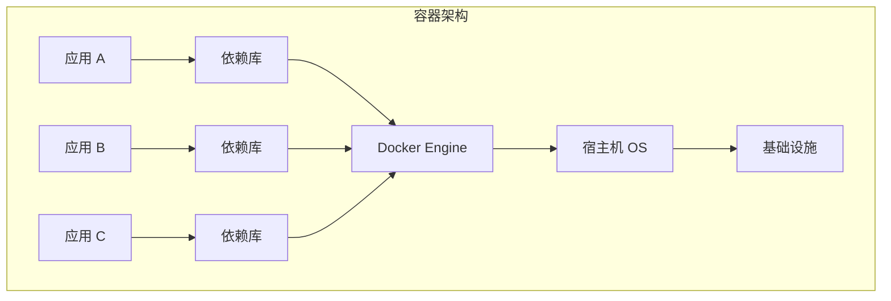
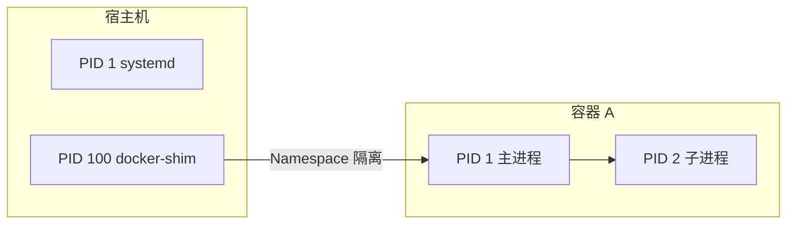
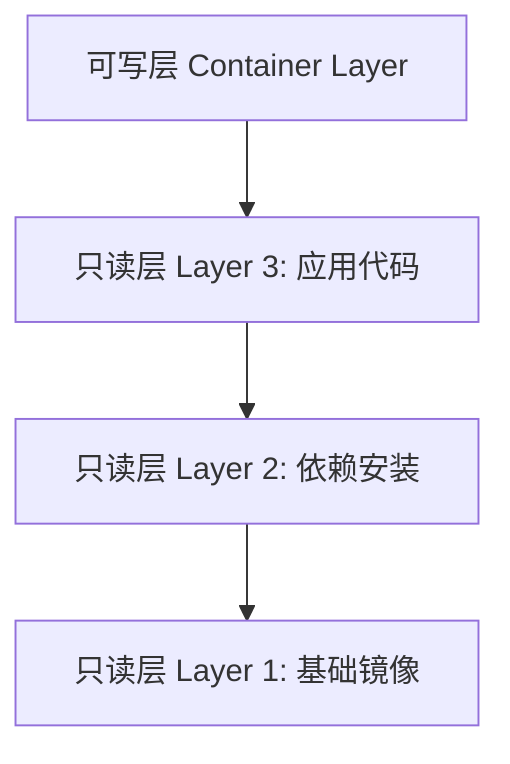
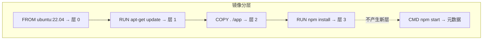
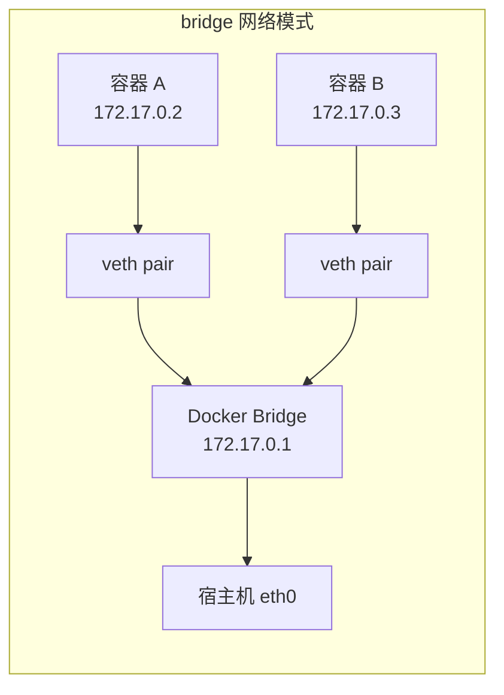
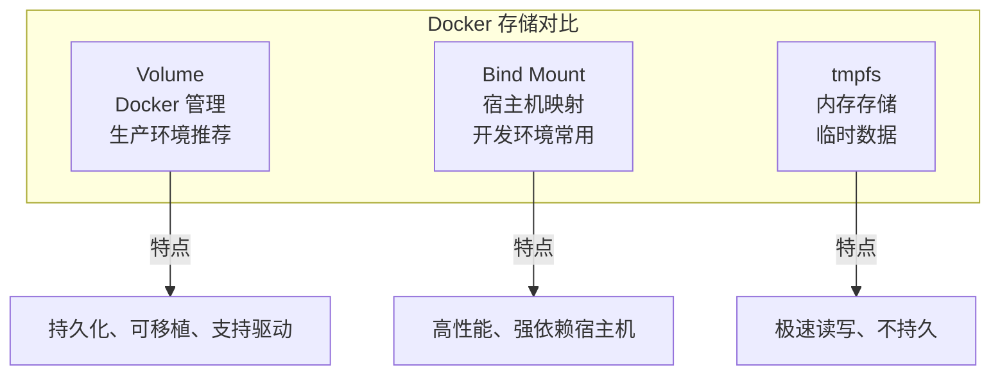

## 容器技术概述

Docker 是目前最流行的容器化平台，它通过操作系统级虚拟化技术，将应用及其依赖打包到一个可移植的容器中运行。与虚拟机不同，容器共享宿主机内核，无需启动完整的 Guest OS，因此启动速度更快、资源开销更低。



### 容器 vs 虚拟机

| 特性 | 容器 | 虚拟机 |
|------|------|--------|
| 启动时间 | 秒级 | 分钟级 |
| 资源占用 | MB 级 | GB 级 |
| 性能 | 接近原生 | 有虚拟化开销 |
| 隔离性 | 进程级 | 完整 OS 级 |
| 镜像大小 | 通常几十 MB | 通常几 GB |

## 三大核心技术

Docker 容器的隔离与资源限制依赖于 Linux 内核的三项关键技术：

### Namespaces — 资源隔离

Namespace 为容器提供独立的系统视图，让进程以为自己是系统中的唯一租户：

- **PID Namespace**：进程 ID 隔离，容器内 PID 1 对应宿主机不同进程
- **NET Namespace**：网络栈隔离，每个容器有独立的 IP、端口、路由表
- **MNT Namespace**：文件系统挂载点隔离
- **UTS Namespace**：主机名隔离
- **IPC Namespace**：进程间通信隔离
- **USER Namespace**：用户和用户组映射



### Cgroups — 资源限制

Cgroups（Control Groups）限制和监控容器对系统资源的使用：


```bash
# 查看容器的 CPU 和内存限制
docker inspect --format '{{.HostConfig.CpuShares}}' my-container
docker inspect --format '{{.HostConfig.Memory}}' my-container

# 直接查看 cgroup 配置
cat /sys/fs/cgroup/memory/docker/<container-id>/memory.limit_in_bytes
```


核心子系统包括：CPU（cpu/cpuacct）、内存（memory）、块设备 I/O（blkio）、网络（net_cls/net_prio）、设备访问（devices）、 freezer（冻结/恢复进程）。

### UnionFS — 镜像分层

联合文件系统是 Docker 镜像分层存储的基础。它将多个只读层叠加为一个统一的文件系统视图，上层覆盖下层的同名文件：



Docker 默认使用 OverlayFS（overlay2 存储驱动），性能优异且支持页级缓存共享。

## 镜像构建最佳实践

### Dockerfile 编写规范

```dockerfile
# 多阶段构建示例：Go 应用
# ---- 构建阶段 ----
FROM golang:1.22-alpine AS builder

WORKDIR /app

# 先复制依赖文件，利用缓存加速构建
COPY go.mod go.sum ./
RUN go mod download

# 再复制源码
COPY . .

# 静态编译
RUN CGO_ENABLED=0 GOOS=linux go build -ldflags="-s -w" -o /app/server .

# ---- 运行阶段 ----
FROM alpine:3.19

# 安装运行时必要证书
RUN apk --no-cache add ca-certificates tzdata

# 创建非 root 用户
RUN addgroup -S appgroup && adduser -S appuser -G appgroup

WORKDIR /app
COPY --from=builder /app/server .
USER appuser

EXPOSE 8080
ENTRYPOINT ["./server"]
```

### 多阶段构建的优势

多阶段构建是 Docker 镜像优化的核心手段：

1. **大幅减小镜像体积**：最终镜像只包含运行时所需文件，不含编译器和中间产物
2. **安全性提升**：减少攻击面，不含构建工具和调试符号
3. **构建缓存优化**：依赖文件单独一层，代码变更不会导致依赖重新下载

### 构建缓存优化原则

- 变化频率低的指令放前面（如安装系统包、下载依赖）
- 变化频率高的指令放后面（如复制源码）
- 使用 `.dockerignore` 排除不需要的文件

```text
# .dockerignore
.git
node_modules
*.md
.env
```

## 镜像分层机制详解

Docker 镜像由一系列只读层组成，每条 Dockerfile 指令生成一个新层：



**关键细节**：

- `RUN`、`COPY`、`ADD` 会产生新层
- `ENTRYPOINT`、`CMD`、`ENV`、`EXPOSE` 只修改元数据，不产生新层
- 删除文件不会减小镜像大小，因为上层删除只是标记删除，下层数据仍存在
- 合并 `RUN` 指令可减少层数：`RUN apt-get update && apt-get install -y pkg && rm -rf /var/lib/apt/lists/*`

## 网络模式

Docker 提供多种网络模式满足不同场景：

| 网络模式 | 说明 | 典型场景 |
|---------|------|---------|
| bridge | 默认模式，容器通过虚拟网桥通信 | 单机多容器通信 |
| host | 共享宿主机网络栈，无网络隔离 | 高性能网络应用 |
| none | 无网络配置 | 离线计算任务 |
| overlay | 跨主机容器通信 | Docker Swarm 集群 |
| macvlan | 容器拥有独立 MAC 地址 | 需要直接接入物理网络 |



## 存储管理

Docker 提供三种数据持久化方式：

### Volume — 推荐方式

```bash
# 创建命名卷
docker volume create app-data

# 挂载卷到容器
docker run -d -v app-data:/var/lib/data my-app

# 查看卷详情
docker volume inspect app-data
```

Volume 由 Docker 管理，存储在 `/var/lib/docker/volumes/` 下，生命周期独立于容器，支持卷驱动扩展（如 NFS、云存储）。

### Bind Mount — 绑定挂载

```bash
# 将宿主机目录挂载到容器
docker run -d -v /host/path:/container/path my-app

# 只读挂载
docker run -d -v /host/path:/container/path:ro my-app
```

Bind Mount 直接映射宿主机目录，适合开发环境实时同步代码，但不便于跨环境迁移。

### tmpfs — 内存存储

```bash
# 临时文件存储在内存中
docker run -d --tmpfs /tmp:rw,noexec,nosuid my-app
```

tmpfs 数据仅存在于内存中，容器停止即丢失，适合存储临时文件和敏感信息。



## 实战案例：Web 应用容器化

以一个 Node.js + Redis 的 Web 应用为例：

```dockerfile
# Dockerfile
FROM node:20-alpine AS production

WORKDIR /app
COPY package*.json ./
RUN npm ci --only=production
COPY . .

USER node
EXPOSE 3000
HEALTHCHECK --interval=30s --timeout=3s \
  CMD wget --no-verbose --tries=1 --spider http://localhost:3000/health || exit 1

CMD ["node", "server.js"]
```

```bash
# 构建并运行
docker build -t my-webapp:1.0 .
docker run -d --name webapp -p 3000:3000 my-webapp:1.0
```

通过理解 Docker 的核心技术原理和最佳实践，你可以构建更轻量、更安全、更高效的容器化应用，为后续的容器编排和云原生部署打下坚实基础。
