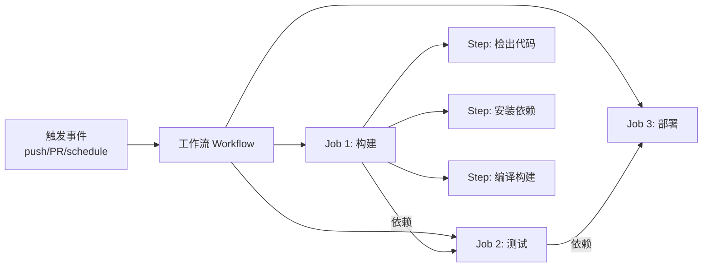
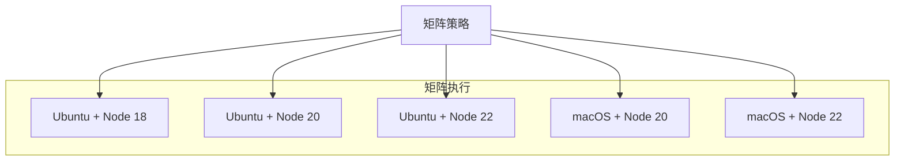
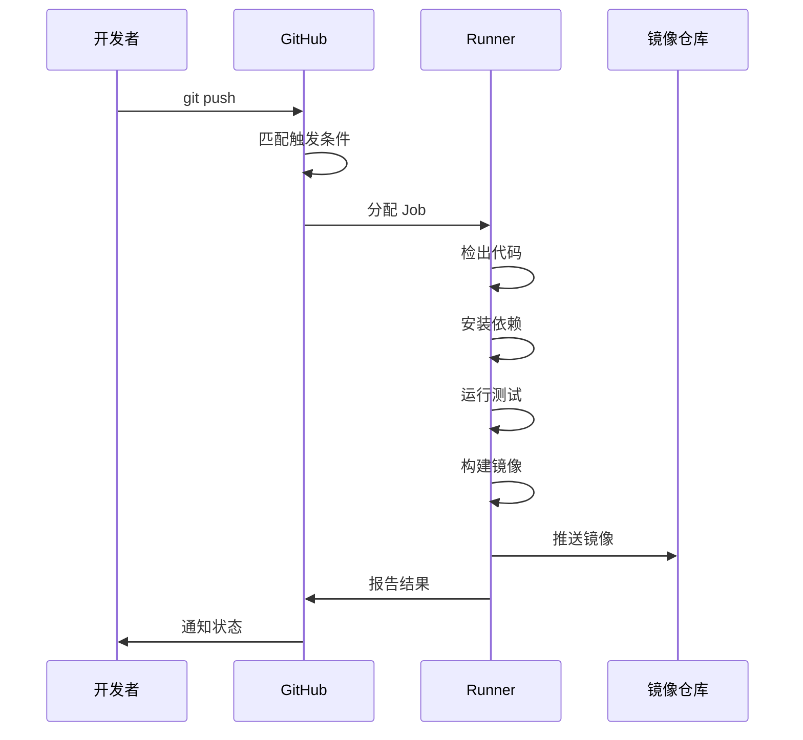

## GitHub Actions 概述

GitHub Actions 是 GitHub 内置的 CI/CD 平台，通过 YAML 文件定义工作流，在代码推送、PR 创建等事件触发时自动执行构建、测试和部署。它与 GitHub 仓库深度集成，无需额外配置即可使用。



## 工作流语法

### 基本结构


```yaml
# .github/workflows/ci.yml
name: CI Pipeline

on:
  push:
    branches: [main]
  pull_request:
    branches: [main]

# 并发控制：同一 PR 只保留最新运行
concurrency:
  group: ci-${{ github.ref }}
  cancel-in-progress: true

permissions:
  contents: read
  pull-requests: write

env:
  REGISTRY: ghcr.io
  IMAGE_NAME: ${{ github.repository }}

jobs:
  build:
    runs-on: ubuntu-latest
    outputs:
      version: ${{ steps.version.outputs.value }}

    steps:
      - name: 检出代码
        uses: actions/checkout@v4
        with:
          fetch-depth: 0  # 完整历史，用于版本号生成

      - name: 设置 Node.js
        uses: actions/setup-node@v4
        with:
          node-version: 20
          cache: npm

      - name: 安装依赖
        run: npm ci

      - name: 代码检查
        run: npm run lint

      - name: 单元测试
        run: npm test

      - name: 构建应用
        run: npm run build

      - name: 生成版本号
        id: version
        run: echo "value=v$(date +%Y%m%d)-$(git rev-parse --short HEAD)" >> $GITHUB_OUTPUT

  test-e2e:
    needs: build
    runs-on: ubuntu-latest
    steps:
      - uses: actions/checkout@v4
      - uses: actions/setup-node@v4
        with:
          node-version: 20
          cache: npm
      - run: npm ci
      - run: npx playwright install --with-deps
      - run: npx playwright test
      - name: 上传测试报告
        if: always()
        uses: actions/upload-artifact@v4
        with:
          name: playwright-report
          path: playwright-report/

  deploy:
    needs: [build, test-e2e]
    if: github.ref == 'refs/heads/main'
    runs-on: ubuntu-latest
    environment: production
    steps:
      - uses: actions/checkout@v4
      - name: 部署到生产
        run: echo "Deploying ${{ needs.build.outputs.version }}"
```


### 触发条件

```yaml
on:
  push:
    branches: [main]
    tags: ['v*']           # 标签触发
    paths:                 # 路径过滤
      - 'src/**'
      - 'package.json'
  pull_request:
    types: [opened, synchronize]
  schedule:
    - cron: '0 2 * * *'   # 每天凌晨 2 点
  workflow_dispatch:       # 手动触发
    inputs:
      environment:
        description: '部署环境'
        required: true
        default: 'staging'
```

## 常用 Action

### 官方推荐 Actions

| Action | 用途 |
|--------|------|
| `actions/checkout@v4` | 检出仓库代码 |
| `actions/setup-node@v4` | 安装 Node.js |
| `actions/setup-python@v5` | 安装 Python |
| `actions/setup-go@v5` | 安装 Go |
| `actions/cache@v4` | 缓存依赖 |
| `actions/upload-artifact@v4` | 上传构建产物 |
| `actions/download-artifact@v4` | 下载构建产物 |

### 缓存策略


```yaml
- name: 缓存依赖
  uses: actions/cache@v4
  with:
    path: |
      ~/.npm
      node_modules
    key: npm-${{ runner.os }}-${{ hashFiles('package-lock.json') }}
    restore-keys: |
      npm-${{ runner.os }}-
```


## 环境与密钥

### 密钥管理


```yaml
# 在仓库 Settings > Secrets 中配置
steps:
  - name: 登录容器镜像仓库
    uses: docker/login-action@v3
    with:
      registry: ghcr.io
      username: ${{ github.actor }}
      password: ${{ secrets.GITHUB_TOKEN }}  # 自动提供的 token

  - name: 使用自定义密钥
    env:
      DATABASE_URL: ${{ secrets.DATABASE_URL }}
      API_KEY: ${{ secrets.API_KEY }}
    run: npm run migrate
```


### 环境保护规则

```yaml
deploy:
  runs-on: ubuntu-latest
  environment:
    name: production
    url: https://app.example.com
  # 需要在仓库 Settings > Environments 中配置审批人
```

## 容器化构建与推送

### 构建并推送 Docker 镜像


```yaml
docker-build:
  runs-on: ubuntu-latest
  permissions:
    contents: read
    packages: write
  steps:
    - uses: actions/checkout@v4

    - name: 登录 GHCR
      uses: docker/login-action@v3
      with:
        registry: ghcr.io
        username: ${{ github.actor }}
        password: ${{ secrets.GITHUB_TOKEN }}

    - name: 设置 Docker Buildx
      uses: docker/setup-buildx-action@v3

    - name: 提取元数据
      id: meta
      uses: docker/metadata-action@v5
      with:
        images: ghcr.io/${{ github.repository }}
        tags: |
          type=ref,event=branch
          type=semver,pattern={{version}}
          type=sha,prefix=

    - name: 构建并推送
      uses: docker/build-push-action@v5
      with:
        context: .
        push: true
        tags: ${{ steps.meta.outputs.tags }}
        labels: ${{ steps.meta.outputs.labels }}
        cache-from: type=gha
        cache-to: type=gha,mode=max
```


## 高级模式

### 复用工作流

将通用流程抽取为可复用的工作流：


```yaml
# .github/workflows/reusable-deploy.yml
name: Reusable Deploy

on:
  workflow_call:
    inputs:
      environment:
        required: true
        type: string
      image-tag:
        required: true
        type: string
    secrets:
      deploy-key:
        required: true

jobs:
  deploy:
    runs-on: ubuntu-latest
    environment: ${{ inputs.environment }}
    steps:
      - name: 部署
        run: |
          echo "Deploying ${{ inputs.image-tag }} to ${{ inputs.environment }}"
          # 实际部署逻辑
```



```yaml
# 调用复用工作流
jobs:
  deploy-staging:
    uses: ./.github/workflows/reusable-deploy.yml
    with:
      environment: staging
      image-tag: ${{ needs.build.outputs.version }}
    secrets:
      deploy-key: ${{ secrets.STAGING_DEPLOY_KEY }}
```


### 矩阵策略

并行测试多个版本组合：


```yaml
test:
  runs-on: ${{ matrix.os }}
  strategy:
    fail-fast: false  # 一个组合失败不取消其他
    matrix:
      os: [ubuntu-latest, macos-latest]
      node-version: [18, 20, 22]
      exclude:
        - os: macos-latest
          node-version: 18  # 排除特定组合

  steps:
    - uses: actions/checkout@v4
    - uses: actions/setup-node@v4
      with:
        node-version: ${{ matrix.node-version }}
    - run: npm ci
    - run: npm test
```




### 工作流执行流程



GitHub Actions 将 CI/CD 直接嵌入开发工作流，从代码推送到生产部署，实现全自动化的软件交付。掌握工作流语法、缓存策略和高级模式，能显著提升构建效率和部署可靠性。
