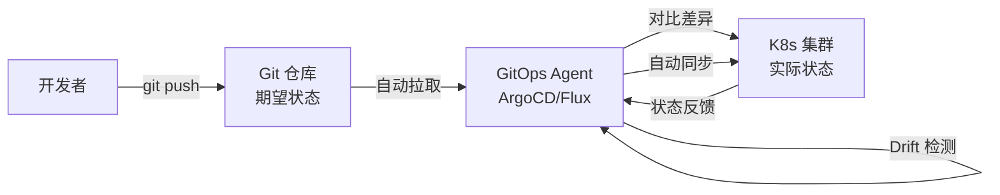
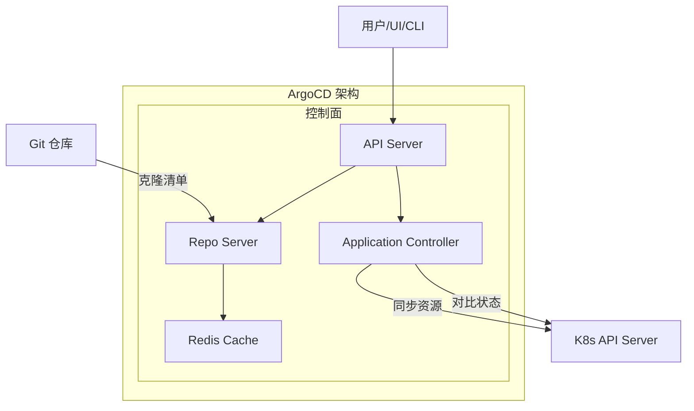
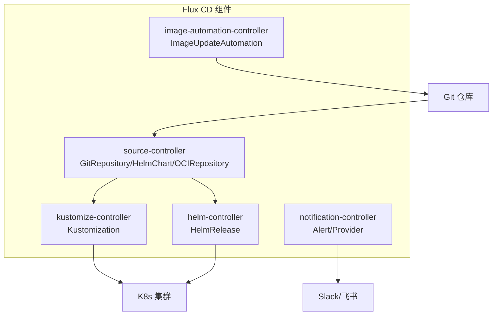
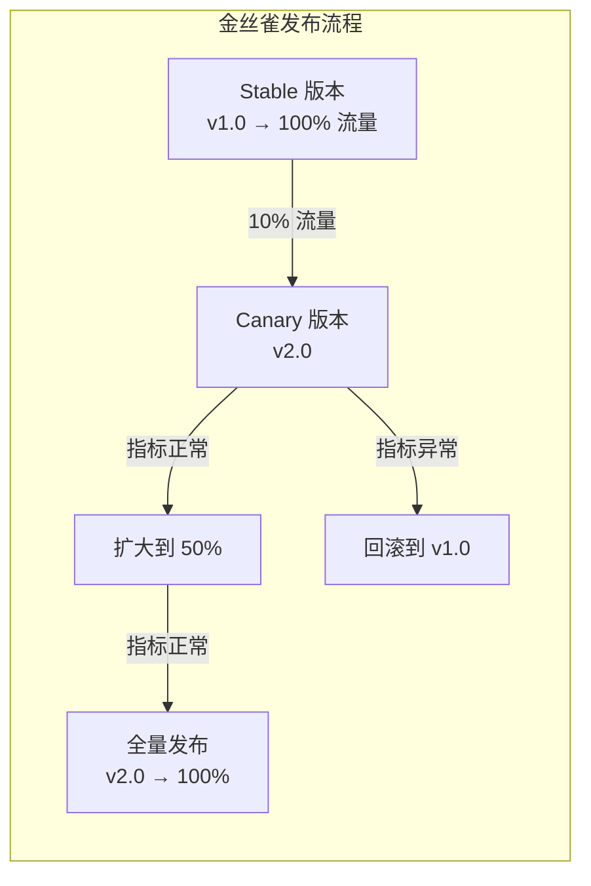
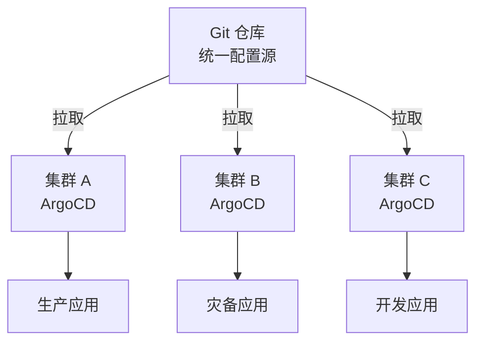

## GitOps 核心理念

GitOps 是一种以 Git 为单一事实来源（Single Source of Truth）的持续交付方法论。它将基础设施和应用配置全部存储在 Git 仓库中，通过 Git 的提交、评审和回滚机制来管理部署，实现声明式、版本化和可审计的运维。

### 核心原则

1. **声明式**：整个系统的期望状态用声明式描述，而非命令式脚本
2. **版本化且不可变**：期望状态存储在 Git 中，具备完整历史和回滚能力
3. **自动拉取**：软件代理自动从 Git 拉取并应用期望状态
4. **持续协调**：软件代理持续对比实际状态与期望状态，发现偏差自动修正



### GitOps vs 传统 CI/CD

| 维度 | 传统 CI/CD | GitOps |
|------|-----------|--------|
| 部署方式 | Push：CI 直接推送 | Pull：集群主动拉取 |
| 配置存储 | CI 平台变量 | Git 仓库 |
| 审计追踪 | CI 日志 | Git 提交历史 |
| 回滚方式 | 重新运行流水线 | `git revert` |
| 访问权限 | CI 需要 K8s 凭证 | 集群内 Agent 自动认证 |
| 多集群 | 每个集群独立配置 | 统一 Git 仓库管理 |

## ArgoCD 架构

ArgoCD 是 K8s 原生的 GitOps 持续交付工具，以 Controller 形式运行在集群内：



### 核心概念

- **Application**：ArgoCD 的核心资源，定义 Git 中的清单与 K8s 中目标的映射
- **Project**：Application 的逻辑分组，限制部署范围和权限
- **Sync Policy**：同步策略，手动或自动同步

### Application 配置示例

```yaml
apiVersion: argoproj.io/v1alpha1
kind: Application
metadata:
  name: web-app
  namespace: argocd
spec:
  project: default
  source:
    repoURL: https://github.com/org/k8s-manifests.git
    targetRevision: main
    path: overlays/production
    # 支持 Kustomize
    kustomize:
      namePrefix: prod-
    # 或 Helm
    # helm:
    #   valueFiles:
    #     - values-prod.yaml
  destination:
    server: https://kubernetes.default.svc
    namespace: production
  syncPolicy:
    automated:
      prune: true       # 自动删除 Git 中不存在的资源
      selfHeal: true    # 自动修复手动修改造成的漂移
    syncOptions:
      - CreateNamespace=true
      - PrunePropagationPolicy=foreground
    retry:
      limit: 5
      backoff:
        duration: 5s
        factor: 2
        maxDuration: 3m
```

### 多环境管理

```text
k8s-manifests/
├── base/                    # 基础配置
│   ├── deployment.yaml
│   ├── service.yaml
│   └── kustomization.yaml
└── overlays/
    ├── development/         # 开发环境覆盖
    │   ├── kustomization.yaml
    │   └── patch-replicas.yaml
    ├── staging/             # 预发环境覆盖
    │   ├── kustomization.yaml
    │   └── patch-resources.yaml
    └── production/          # 生产环境覆盖
        ├── kustomization.yaml
        └── patch-resources.yaml
```

## Flux CD 工作流

Flux CD 是 CNCF 毕业项目，以轻量化和模块化著称：



### Flux 基本配置

```yaml
# GitRepository — 声明 Git 来源
apiVersion: source.toolkit.fluxcd.io/v1
kind: GitRepository
metadata:
  name: web-app
  namespace: flux-system
spec:
  interval: 1m
  url: https://github.com/org/k8s-manifests.git
  ref:
    branch: main
  secretRef:
    name: git-credentials

---
# Kustomization — 声明同步目标
apiVersion: kustomize.toolkit.fluxcd.io/v1
kind: Kustomization
metadata:
  name: web-app-production
  namespace: flux-system
spec:
  interval: 5m
  sourceRef:
    kind: GitRepository
    name: web-app
  path: ./overlays/production
  prune: true
  healthChecks:
    - apiVersion: apps/v1
      kind: Deployment
      name: web-app
      namespace: production
```

### ArgoCD vs Flux CD

| 特性 | ArgoCD | Flux CD |
|------|--------|---------|
| UI | 功能丰富的 Web UI | 简约 UI（可选） |
| 配置方式 | Application CRD | 一组专用 CRD |
| 多集群 | 原生支持 | 通过集群连接 |
| 通知 | 内置 | notification-controller |
| 社区 | 活跃，企业用户多 | CNCF 毕业，持续增长 |
| 学习曲线 | 中等 | 较低 |

## 渐进式交付：金丝雀发布

金丝雀发布将新版本逐步暴露给部分流量，验证无异常后再全量发布：



### Argo Rollouts 配置

```yaml
apiVersion: argoproj.io/v1alpha1
kind: Rollout
metadata:
  name: web-app
spec:
  replicas: 10
  strategy:
    canary:
      steps:
        - setWeight: 10          # 10% 流量到金丝雀
        - pause: {duration: 5m}  # 等待 5 分钟观察
        - setWeight: 30
        - pause: {duration: 5m}
        - setWeight: 50
        - pause: {duration: 10m}
        - setWeight: 80
        - pause: {duration: 5m}
      canaryService: web-app-canary
      stableService: web-app-stable
      analysis:
        templates:
          - templateName: success-rate
```

### AnalysisTemplate — 自动化验证

```yaml
apiVersion: argoproj.io/v1alpha1
kind: AnalysisTemplate
metadata:
  name: success-rate
spec:
  metrics:
    - name: success-rate
      provider:
        prometheus:
          address: http://prometheus.monitoring:9090
          query: |
            sum(rate(http_requests_total{job="web-app",status!~"5.."}[1m]))
            /
            sum(rate(http_requests_total{job="web-app"}[1m]))
      successCondition: result[0] >= 0.99
      failureLimit: 3
      interval: 60s
```

## 多集群管理

GitOps 天然适合多集群管理——每个集群运行自己的 Agent，从同一 Git 仓库拉取各自的配置：



### 多集群 ArgoCD 配置

```yaml
# 在管理集群上注册目标集群
apiVersion: v1
kind: Secret
metadata:
  name: cluster-production
  namespace: argocd
  labels:
    argocd.argoproj.io/secret-type: cluster
type: Opaque
stringData:
  name: production
  server: https://production-api.example.com
  config: |
    {
      "bearerAuth": {
        "token": "${PRODUCTION_CLUSTER_TOKEN}"
      }
    }
```

GitOps 将运维工作转变为代码评审流程——通过 PR 修改配置，合并后自动部署。这种模式不仅提高了部署的安全性和可追溯性，也让基础设施管理具备了与软件开发相同的最佳实践。
