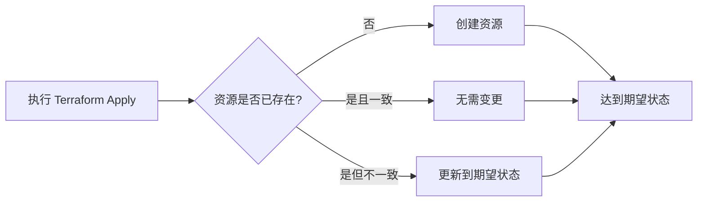
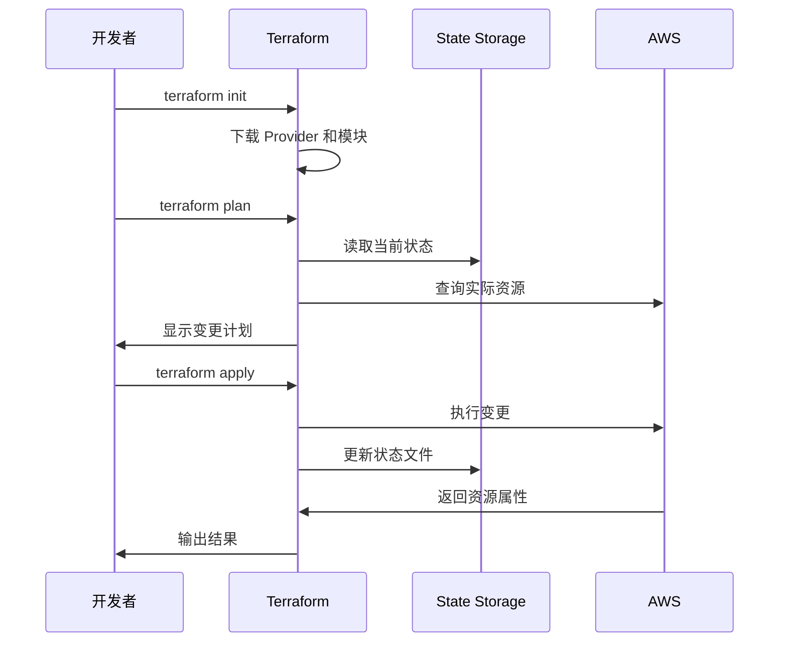
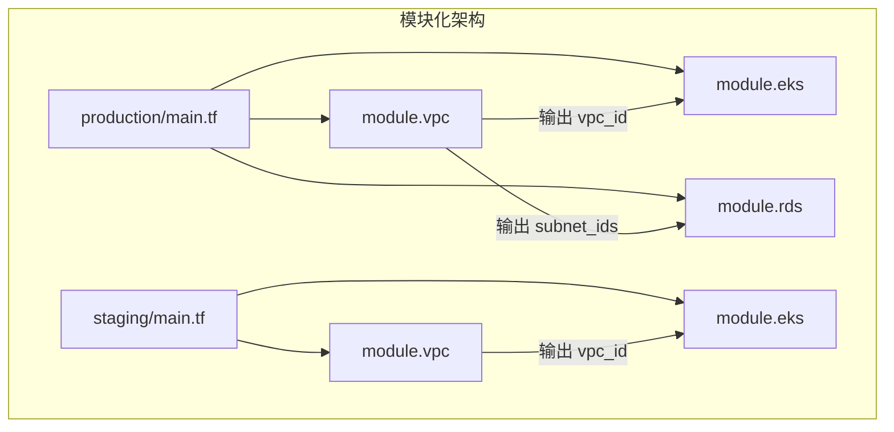
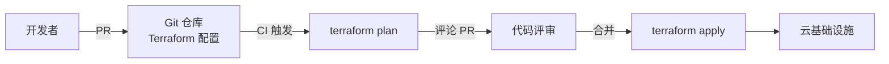

## IaC 概念

基础设施即代码（Infrastructure as Code，IaC）是将基础设施的配置和管理用代码来描述和执行，替代传统的人工点击和手动操作。IaC 让基础设施具备与软件相同的版本控制、评审和自动化能力。

### 声明式 vs 命令式

| 维度 | 声明式（Declarative） | 命令式（Imperative） |
|------|----------------------|---------------------|
| 描述方式 | 描述"想要什么" | 描述"怎么做" |
| 状态管理 | 工具自动对比差异 | 需要人工跟踪 |
| 幂等性 | 天然支持 | 需要额外保证 |
| 代表工具 | Terraform、CloudFormation | Ansible、Chef |
| 可重复性 | 多次执行结果一致 | 可能产生副作用 |

### 幂等性原则

幂等性是 IaC 的核心属性：无论执行多少次，只要输入相同，最终状态就一致。这意味着：

- 安全重试：网络超时后重新执行不会产生重复资源
- 状态收敛：手动修改被自动修正回期望状态
- 并发安全：多人操作不会相互覆盖



## Terraform 核心

Terraform 是目前最流行的 IaC 工具，支持多云和多服务的资源管理。

### 核心概念

| 概念 | 说明 |
|------|------|
| Provider | 云厂商插件（AWS/Azure/GCP/K8s 等） |
| Resource | 基础设施资源（VPC/EC2/RDS 等） |
| Data Source | 读取已有资源的数据 |
| Variable | 输入变量，参数化配置 |
| Output | 输出值，供其他模块引用 |
| State | 资源状态文件，记录实际状态与期望状态的映射 |
| Module | 可复用的配置包 |

### 基本配置示例

```hcl
# provider.tf
terraform {
  required_version = ">= 1.7"
  required_providers {
    aws = {
      source  = "hashicorp/aws"
      version = "~> 5.0"
    }
  }

  # 远程状态存储
  backend "s3" {
    bucket         = "my-tfstate"
    key            = "production/terraform.tfstate"
    region         = "us-east-1"
    dynamodb_table = "tfstate-lock"
    encrypt        = true
  }
}

provider "aws" {
  region = var.aws_region
}

# variables.tf
variable "aws_region" {
  description = "AWS region"
  type        = string
  default     = "us-east-1"
}

variable "environment" {
  description = "Environment name"
  type        = string
}

variable "vpc_cidr" {
  description = "VPC CIDR block"
  type        = string
  default     = "10.0.0.0/16"
}

# main.tf
resource "aws_vpc" "main" {
  cidr_block           = var.vpc_cidr
  enable_dns_hostnames = true
  enable_dns_support   = true

  tags = {
    Name        = "${var.environment}-vpc"
    Environment = var.environment
    ManagedBy   = "terraform"
  }
}

resource "aws_subnet" "public" {
  count                   = 2
  vpc_id                  = aws_vpc.main.id
  cidr_block              = cidrsubnet(var.vpc_cidr, 8, count.index)
  availability_zone       = data.aws_availability_zones.available.names[count.index]
  map_public_ip_on_launch = true

  tags = {
    Name = "${var.environment}-public-${count.index}"
  }
}

resource "aws_subnet" "private" {
  count             = 2
  vpc_id            = aws_vpc.main.id
  cidr_block        = cidrsubnet(var.vpc_cidr, 8, count.index + 2)
  availability_zone = data.aws_availability_zones.available.names[count.index]

  tags = {
    Name = "${var.environment}-private-${count.index}"
  }
}

data "aws_availability_zones" "available" {
  state = "available"
}

# outputs.tf
output "vpc_id" {
  description = "VPC ID"
  value       = aws_vpc.main.id
}

output "public_subnet_ids" {
  description = "Public subnet IDs"
  value       = aws_subnet.public[*].id
}
```

## Terraform 工作流



### 标准工作流

```bash
# 1. 初始化
terraform init

# 2. 格式化代码
terraform fmt

# 3. 代码检查
terraform validate

# 4. 预览变更
terraform plan -out=tfplan

# 5. 审查并应用
terraform apply tfplan

# 6. 查看输出
terraform output
```

### State 管理最佳实践

- **远程存储**：使用 S3+DynamoDB（AWS）或 Blob+Table（Azure），避免本地状态文件
- **状态锁**：启用 DynamoDB 锁，防止并发写入导致状态损坏
- **状态加密**：启用 S3 服务端加密，保护敏感数据
- **状态隔离**：每个环境（dev/staging/prod）独立的状态文件

```hcl
# 生产环境状态隔离
terraform {
  backend "s3" {
    bucket = "my-tfstate"
    key    = "production/terraform.tfstate"
    # ...
  }
}
```

## 模块化设计

模块是 Terraform 复用的核心手段，将相关资源封装为独立单元：

```text
modules/
├── vpc/
│   ├── main.tf
│   ├── variables.tf
│   ├── outputs.tf
│   └── versions.tf
├── eks/
│   ├── main.tf
│   ├── variables.tf
│   └── outputs.tf
└── rds/
    ├── main.tf
    ├── variables.tf
    └── outputs.tf

environments/
├── production/
│   ├── main.tf        # 引用模块
│   ├── variables.tf
│   └── terraform.tfvars
└── staging/
    ├── main.tf
    ├── variables.tf
    └── terraform.tfvars
```

### 模块定义

```hcl
# modules/vpc/main.tf
resource "aws_vpc" "this" {
  cidr_block = var.cidr_block
  tags = merge(var.tags, {
    Name = "${var.name}-vpc"
  })
}

resource "aws_subnet" "public" {
  count             = length(var.public_subnets)
  vpc_id            = aws_vpc.this.id
  cidr_block        = var.public_subnets[count.index]
  availability_zone = var.azs[count.index % length(var.azs)]

  tags = {
    Name = "${var.name}-public-${count.index}"
  }
}
```

### 模块引用

```hcl
# environments/production/main.tf
module "vpc" {
  source = "../../modules/vpc"

  name           = "production"
  cidr_block     = "10.0.0.0/16"
  public_subnets = ["10.0.1.0/24", "10.0.2.0/24"]
  azs            = ["us-east-1a", "us-east-1b"]
  tags = {
    Environment = "production"
    ManagedBy   = "terraform"
  }
}

module "eks" {
  source = "../../modules/eks"

  name       = "production"
  vpc_id     = module.vpc.vpc_id
  subnet_ids = module.vpc.private_subnet_ids
  node_groups = {
    general = {
      instance_types = ["m6i.large"]
      desired_size   = 3
      min_size       = 2
      max_size       = 6
    }
  }
}
```



## GitOps 联动

Terraform 与 GitOps 结合，实现基础设施变更的全自动化流程：



### CI/CD 集成

```yaml
# GitHub Actions Terraform 工作流
name: Terraform

on:
  pull_request:
    paths: ['terraform/**']
  push:
    branches: [main]
    paths: ['terraform/**']

jobs:
  plan:
    runs-on: ubuntu-latest
    if: github.event_name == 'pull_request'
    steps:
      - uses: actions/checkout@v4
      - uses: hashicorp/setup-terraform@v3
      - run: terraform init
        working-directory: terraform/environments/production
      - run: terraform plan -no-color
        working-directory: terraform/environments/production

  apply:
    runs-on: ubuntu-latest
    if: github.ref == 'refs/heads/main'
    environment: production
    steps:
      - uses: actions/checkout@v4
      - uses: hashicorp/setup-terraform@v3
      - run: terraform init
        working-directory: terraform/environments/production
      - run: terraform apply -auto-approve
        working-directory: terraform/environments/production
```

### Terraform 与 ArgoCD/Flux 配合

- Terraform 管理基础设施层（VPC、EKS、RDS）
- ArgoCD/Flux 管理应用层（K8s 清单、Helm Chart）
- Terraform Output 为应用层提供基础设施参数（VPC ID、数据库端点等）
- 两者通过 Git 仓库解耦，各自独立演进

IaC 将基础设施管理从手工操作转变为代码驱动，配合 GitOps 工作流，实现了基础设施变更的全流程可审计、可回滚和自动化。
