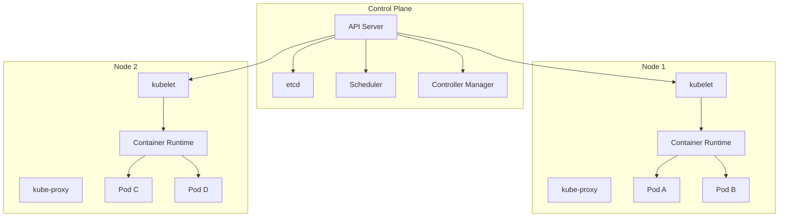
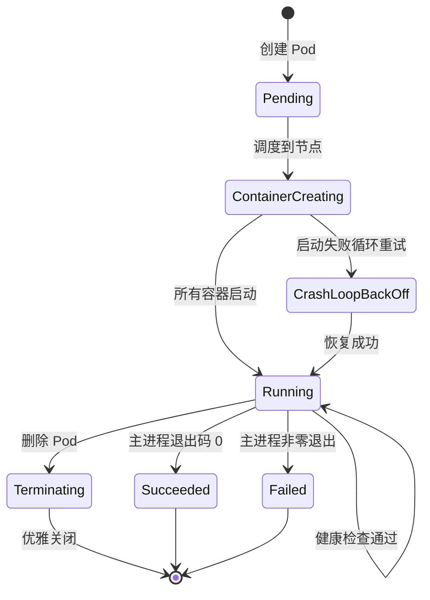

## Kubernetes 架构总览

Kubernetes（K8s）是容器编排领域的事实标准，它自动化了容器化应用的部署、扩缩和运维。K8s 采用 C/S 架构，由控制面（Control Plane）和工作节点（Node）组成。



### 控制面组件

| 组件 | 职责 |
|------|------|
| API Server | 集群入口，所有操作经其处理，认证/授权/准入控制 |
| etcd | 分布式 KV 存储，保存集群所有状态数据 |
| Scheduler | 根据资源需求和约束，将 Pod 调度到合适的节点 |
| Controller Manager | 运行各种控制器（Deployment/ReplicaSet/Node 等），维持期望状态 |

### 工作节点组件

| 组件 | 职责 |
|------|------|
| kubelet | 管理本节点上 Pod 的生命周期，向 API Server 上报状态 |
| kube-proxy | 维护网络规则，实现 Service 的负载均衡 |
| Container Runtime | 运行容器（containerd、CRI-O 等） |

## 核心对象

### Pod — 最小调度单元

Pod 是 K8s 中最小的部署单元，包含一个或多个共享网络和存储的容器：

```yaml
apiVersion: v1
kind: Pod
metadata:
  name: web-app
  labels:
    app: web
spec:
  containers:
    - name: app
      image: my-app:v1.0
      ports:
        - containerPort: 8080
      resources:
        requests:
          cpu: 100m
          memory: 128Mi
        limits:
          cpu: 500m
          memory: 512Mi
      livenessProbe:
        httpGet:
          path: /health
          port: 8080
        initialDelaySeconds: 15
        periodSeconds: 20
      readinessProbe:
        httpGet:
          path: /ready
          port: 8080
        initialDelaySeconds: 5
        periodSeconds: 10
    - name: log-sidecar
      image: log-collector:v1.0
```

### Deployment — 声明式更新

Deployment 管理 ReplicaSet，提供滚动更新和回滚能力：

```yaml
apiVersion: apps/v1
kind: Deployment
metadata:
  name: web-deployment
spec:
  replicas: 3
  selector:
    matchLabels:
      app: web
  strategy:
    type: RollingUpdate
    rollingUpdate:
      maxSurge: 1        # 滚动更新时最多多出 1 个 Pod
      maxUnavailable: 0  # 更新期间不允许不可用
  template:
    metadata:
      labels:
        app: web
    spec:
      containers:
        - name: app
          image: my-app:v2.0
          ports:
            - containerPort: 8080
```

### Service — 服务发现与负载均衡

Service 为一组 Pod 提供稳定的访问入口：

```yaml
apiVersion: v1
kind: Service
metadata:
  name: web-service
spec:
  selector:
    app: web
  type: ClusterIP
  ports:
    - port: 80
      targetPort: 8080
```

Service 类型对比：

| 类型 | 访问范围 | 典型场景 |
|------|---------|---------|
| ClusterIP | 集群内部 | 微服务间通信 |
| NodePort | 集群外部（节点 IP:端口） | 开发/测试环境 |
| LoadBalancer | 云厂商负载均衡器 | 生产环境对外暴露 |
| ExternalName | DNS CNAME 映射 | 引用外部服务 |

### ConfigMap 与 Secret

将配置与镜像解耦，实现同一镜像在不同环境运行：

```yaml
# ConfigMap — 非敏感配置
apiVersion: v1
kind: ConfigMap
metadata:
  name: app-config
data:
  database_host: "db.production.svc.cluster.local"
  log_level: "info"
  app.properties: |
    cache.ttl=300
    pool.size=10

---
# Secret — 敏感信息
apiVersion: v1
kind: Secret
metadata:
  name: db-secret
type: Opaque
data:
  username: YWRtaW4=
  password: c2VjcmV0MTIz
```

## Pod 生命周期



### 生命周期钩子

```yaml
spec:
  containers:
    - name: app
      lifecycle:
        postStart:
          exec:
            command: ["/bin/sh", "-c", "echo 'Started' > /tmp/ready"]
        preStop:
          exec:
            command: ["/bin/sh", "-c", "sleep 10 && /app/shutdown.sh"]
```

- **postStart**：容器创建后立即执行，与主进程并行，执行失败会导致容器重启
- **preStop**：容器终止前执行，是同步阻塞的，完成后才发送 SIGTERM

### 探针（Probes）

| 探针类型 | 用途 | 失败后果 |
|---------|------|---------|
| livenessProbe | 检测容器是否存活 | 重启容器 |
| readinessProbe | 检测容器是否就绪 | 从 Service 移除 |
| startupProbe | 检测应用是否启动完成 | 启动期间阻止其他探针 |

```yaml
# 慢启动应用配置示例
startupProbe:
  httpGet:
    path: /health
    port: 8080
  failureThreshold: 30
  periodSeconds: 10   # 最多等待 300s 启动

livenessProbe:
  httpGet:
    path: /health
    port: 8080
  periodSeconds: 15

readinessProbe:
  httpGet:
    path: /ready
    port: 8080
  periodSeconds: 5
```

## 标签与选择器

标签（Label）是附加到 K8s 对象上的键值对，选择器（Selector）通过标签筛选对象：

```yaml
# 标签定义
metadata:
  labels:
    app: web
    tier: frontend
    env: production
    version: v2.0

# 等值选择器
selector:
  matchLabels:
    app: web
    env: production

# 集合选择器
selector:
  matchExpressions:
    - key: version
      operator: In
      values: ["v2.0", "v2.1"]
    - key: tier
      operator: NotIn
      values: ["debug"]
```

标签的最佳实践：
- 使用 `app` 标签标识应用，这是 Service 和 Deployment 关联的基础
- 使用 `env` 区分环境（production/staging/development）
- 使用 `version` 支持 Canary 和 Blue-Green 部署
- 避免使用过于细粒度的标签，以免管理复杂度爆炸

## kubectl 常用命令

```bash
# 资源查看
kubectl get pods -A                    # 查看所有命名空间的 Pod
kubectl get pods -o wide               # 显示节点和 IP 信息
kubectl describe pod <name>            # 查看事件和状态详情
kubectl logs <pod> -c <container> -f   # 实时查看容器日志

# 资源操作
kubectl apply -f manifest.yaml         # 声明式创建/更新
kubectl delete -f manifest.yaml        # 删除资源
kubectl scale deployment/web --replicas=5  # 扩缩副本

# 排障调试
kubectl exec -it <pod> -- /bin/sh      # 进入容器终端
kubectl port-forward svc/web 8080:80   # 端口转发到本地
kubectl top pods                       # 查看资源使用率
kubectl get events --sort-by=.metadata.creationTimestamp  # 查看事件

# 集群管理
kubectl cordon <node>                  # 标记节点不可调度
kubectl drain <node> --ignore-daemonsets  # 驱逐节点上的 Pod
kubectl taint nodes <node> key=value:NoSchedule  # 添加污点
```

理解 K8s 的架构和核心概念是掌握容器编排的基础。从 Pod 到 Deployment，从 Service 到 ConfigMap，这些原语组合在一起，构成了云原生应用的运行平台。
