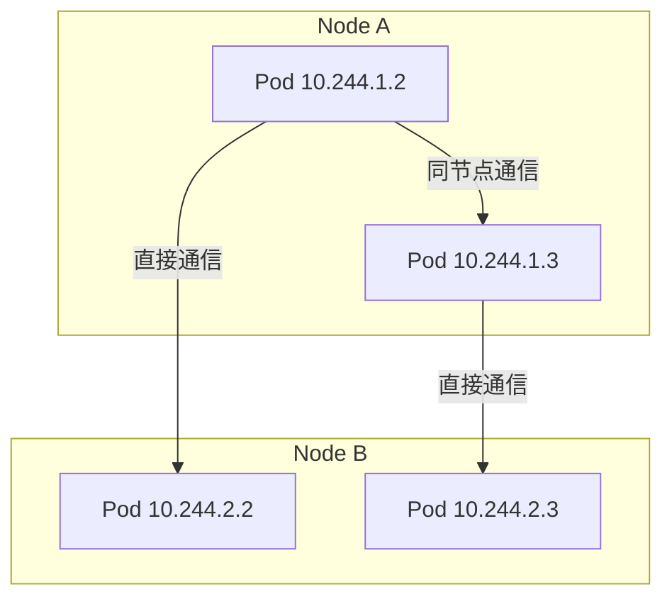
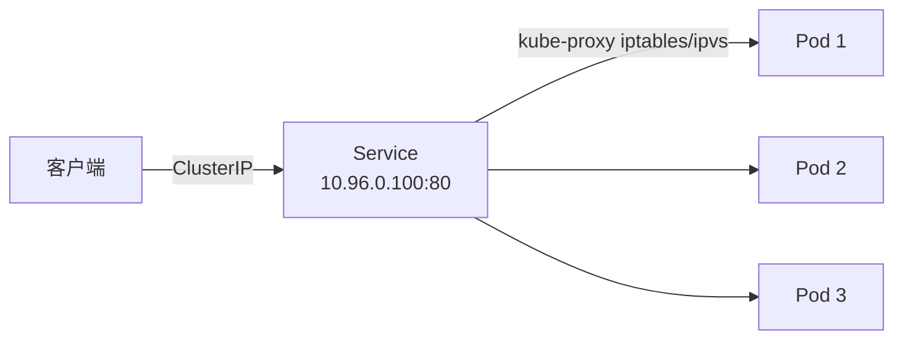
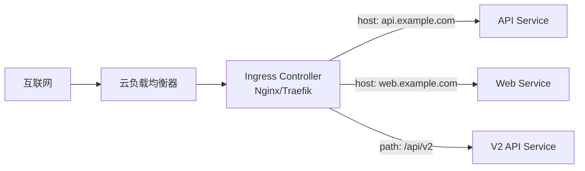
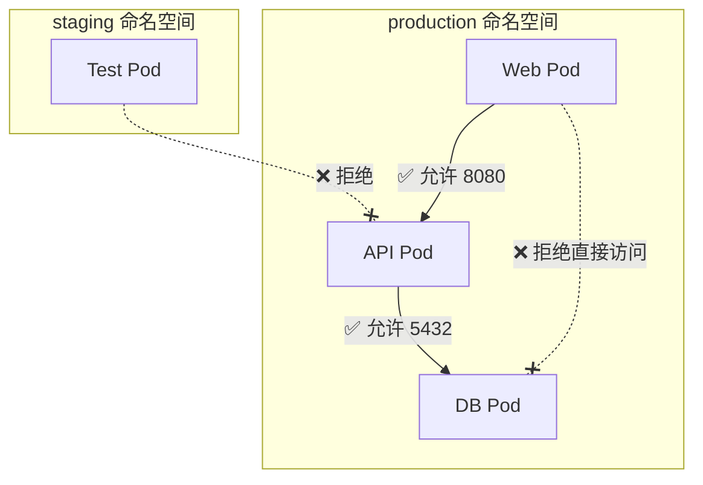
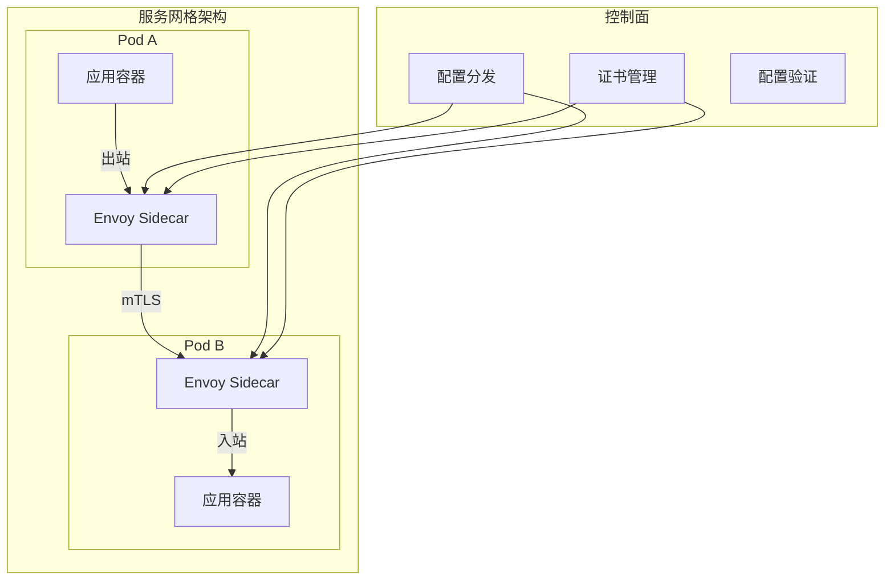

## K8s 网络模型

K8s 网络遵循一个基本原则：每个 Pod 拥有独立 IP，Pod 间可以直接通信，无需 NAT。这一模型对 CNI 插件提出了三个核心要求：

1. 所有 Pod 之间可以直接通信（跨节点也如此）
2. 所有 Node 与所有 Pod 之间可以直接通信
3. Pod 看到自己的 IP 与其他 Pod 看到它的 IP 一致



## CNI 网络插件对比

CNI（Container Network Interface）是 K8s 的网络插件标准，不同插件在性能、功能和使用场景上各有侧重：

| 插件 | 网络模式 | Network Policy | 性能 | 适用场景 |
|------|---------|---------------|------|---------|
| Calico | BGP/VXLAN | 支持 | 高 | 生产环境首选，大规模集群 |
| Cilium | eBPF | 支持（增强版） | 最高 | 内核 4.10+，需要可观测性 |
| Flannel | VXLAN/host-gw | 不支持 | 中 | 小型集群，入门简单 |
| Weave | VXLAN | 支持 | 中 | 混合环境，自组网 |
| Canal | Flannel+Calico | 支持 | 中高 | 兼顾简单与安全 |

### Calico 与 Cilium 深度对比

**Calico**：
- 使用 BGP 协议在节点间交换路由，纯三层网络
- 支持 iptables 和 eBPF 两种数据面
- Network Policy 功能成熟，社区生态完善
- 适合对稳定性要求高的生产环境

**Cilium**：
- 基于 eBPF 在内核层处理网络，绕过 iptables
- 提供七层网络策略（HTTP/gRPC/Kafka 级别）
- 内置 Hubble 可观测性平台
- 适合对性能和可观测性有极致要求的场景

## Service 类型详解

Service 为一组 Pod 提供稳定的虚拟 IP 和 DNS 名称：



### ClusterIP

默认类型，分配集群内部可达的虚拟 IP：

```yaml
apiVersion: v1
kind: Service
metadata:
  name: api-service
spec:
  type: ClusterIP
  selector:
    app: api
  ports:
    - port: 80
      targetPort: 8080
```

### NodePort

在每个节点上开放一个端口（范围 30000-32767），将流量转发到 Service：

```yaml
apiVersion: v1
kind: Service
metadata:
  name: api-nodeport
spec:
  type: NodePort
  selector:
    app: api
  ports:
    - port: 80
      targetPort: 8080
      nodePort: 30080
```

### LoadBalancer

在云环境中创建外部负载均衡器：

```yaml
apiVersion: v1
kind: Service
metadata:
  name: api-lb
spec:
  type: LoadBalancer
  selector:
    app: api
  ports:
    - port: 80
      targetPort: 8080
```

### ExternalName

将 Service 映射到外部 DNS 名称：

```yaml
apiVersion: v1
kind: Service
metadata:
  name: external-db
spec:
  type: ExternalName
  externalName: db.prod.example.com
```

## Ingress Controller

Ingress 是 K8s 的 HTTP 层路由规则，Ingress Controller 是其实际运行组件，提供七层负载均衡：



### Ingress 规则示例

```yaml
apiVersion: networking.k8s.io/v1
kind: Ingress
metadata:
  name: app-ingress
  annotations:
    cert-manager.io/cluster-issuer: letsencrypt-prod
    nginx.ingress.kubernetes.io/rate-limit: "100"
spec:
  ingressClassName: nginx
  tls:
    - hosts:
        - api.example.com
        - web.example.com
      secretName: app-tls
  rules:
    - host: api.example.com
      http:
        paths:
          - path: /v1
            pathType: Prefix
            backend:
              service:
                name: api-v1
                port:
                  number: 80
          - path: /v2
            pathType: Prefix
            backend:
              service:
                name: api-v2
                port:
                  number: 80
    - host: web.example.com
      http:
        paths:
          - path: /
            pathType: Prefix
            backend:
              service:
                name: web-frontend
                port:
                  number: 80
```

### 主流 Ingress Controller

| 方案 | 特点 | 适用场景 |
|------|------|---------|
| NGINX Ingress | 成熟稳定，社区最大 | 通用场景 |
| Traefik | 自动服务发现，配置热更新 | 云原生、动态环境 |
| Kong | 插件生态丰富，API 网关 | API 管理 |
| Istio Gateway | 与服务网格深度集成 | 服务网格场景 |

## Network Policy

Network Policy 控制 Pod 间的网络流量，是实现零信任网络的基础：

```yaml
# 命名空间默认拒绝所有入站
apiVersion: networking.k8s.io/v1
kind: NetworkPolicy
metadata:
  name: default-deny-ingress
  namespace: production
spec:
  podSelector: {}  # 选择所有 Pod
  policyTypes:
    - Ingress

---
# 允许 web Pod 访问 api Pod 的 8080 端口
apiVersion: networking.k8s.io/v1
kind: NetworkPolicy
metadata:
  name: allow-web-to-api
  namespace: production
spec:
  podSelector:
    matchLabels:
      app: api
  policyTypes:
    - Ingress
  ingress:
    - from:
        - podSelector:
            matchLabels:
              app: web
        - namespaceSelector:
            matchLabels:
              env: production
      ports:
        - port: 8080
          protocol: TCP
```



## 服务网格

服务网格在应用层之上提供流量管理、安全通信和可观测性，以 Sidecar 代理方式实现：



### Istio vs Linkerd

| 特性 | Istio | Linkerd |
|------|-------|---------|
| 代理 | Envoy | Linkerd2-proxy（Rust） |
| 复杂度 | 高 | 低 |
| 资源消耗 | 较高 | 极低 |
| 功能丰富度 | 最全面 | 核心功能 |
| 适用规模 | 大规模、复杂需求 | 中小规模、快速上手 |

服务网格不是银弹。在引入前需评估：是否真的需要 mTLS、精细流量控制和分布式追踪？如果 K8s 原生的 Service + Network Policy 已满足需求，无需引入额外的复杂性。

K8s 网络从 Pod 通信到 Service 暴露，从 Ingress 路由到 Network Policy 隔离，再到服务网格的深度管控，形成了一套完整的网络解决方案栈。理解每一层的职责和适用场景，才能构建既安全又高效的网络架构。
