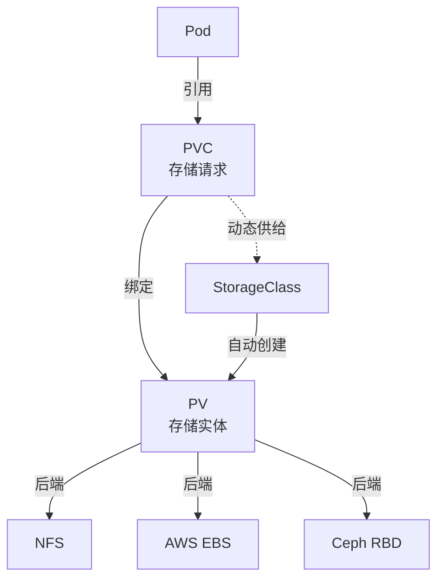
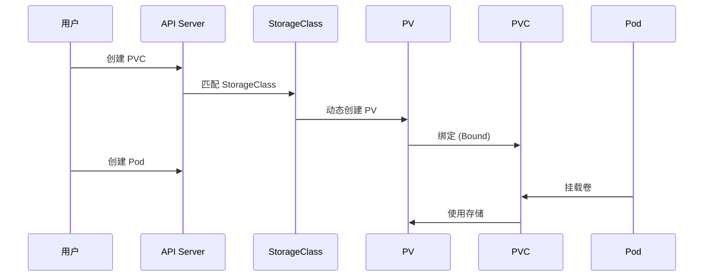
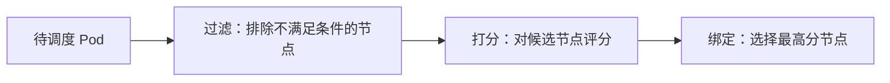

## 存储体系

K8s 存储体系将底层存储抽象为标准接口，让应用无需关心具体的存储实现。核心对象包括 PV、PVC 和 StorageClass。



### PersistentVolume（PV）

PV 是集群级别的存储资源，由管理员创建或动态供给：

```yaml
apiVersion: v1
kind: PersistentVolume
metadata:
  name: nfs-pv
spec:
  capacity:
    storage: 50Gi
  accessModes:
    - ReadWriteMany        # RWX：多节点读写
    # - ReadWriteOnce     # RWO：单节点读写
    # - ReadOnlyMany      # ROX：多节点只读
  persistentVolumeReclaimPolicy: Retain  # Retain/Delete/Recycle
  storageClassName: nfs
  nfs:
    server: 10.0.0.100
    path: /data/share
```

### PersistentVolumeClaim（PVC）

PVC 是用户对存储的声明，类似 Pod 对计算资源的请求：

```yaml
apiVersion: v1
kind: PersistentVolumeClaim
metadata:
  name: app-data
spec:
  accessModes:
    - ReadWriteOnce
  resources:
    requests:
      storage: 20Gi
  storageClassName: fast-ssd
```

### PV/PVC 绑定流程



### StorageClass — 动态供给

StorageClass 消除了管理员手动创建 PV 的负担：

```yaml
apiVersion: storage.k8s.io/v1
kind: StorageClass
metadata:
  name: fast-ssd
provisioner: ebs.csi.aws.com
parameters:
  type: gp3
  iops: "5000"
  throughput: "250"
reclaimPolicy: Delete
volumeBindingMode: WaitForFirstConsumer  # 延迟绑定，直到 Pod 调度
allowVolumeExpansion: true
```

`volumeBindingMode` 的两种模式：
- **Immediate**：PVC 创建后立即绑定，可能导致 Pod 调度到与 PV 不同的可用区
- **WaitForFirstConsumer**：等到使用此 PVC 的 Pod 创建时才绑定，确保 PV 和 Pod 在同一可用区

## 调度器

K8s 调度器负责将 Pod 分配到合适的节点，决策过程分为过滤和打分两个阶段：



### 节点亲和性

控制 Pod 调度到哪些节点：

```yaml
spec:
  affinity:
    nodeAffinity:
      requiredDuringSchedulingIgnoredDuringExecution:  # 硬约束
        nodeSelectorTerms:
          - matchExpressions:
              - key: topology.kubernetes.io/zone
                operator: In
                values: ["us-east-1a", "us-east-1b"]
      preferredDuringSchedulingIgnoredDuringExecution:  # 软约束
        - weight: 80
          preference:
            matchExpressions:
              - key: node-type
                operator: In
                values: ["high-mem"]
```

### Pod 亲和/反亲和

控制 Pod 之间的分布关系：

```yaml
spec:
  affinity:
    podAntiAffinity:  # 反亲和：分散部署
      requiredDuringSchedulingIgnoredDuringExecution:
        - labelSelector:
            matchLabels:
              app: web
          topologyKey: kubernetes.io/hostname  # 每个节点最多一个 web Pod
      preferredDuringSchedulingIgnoredDuringExecution:
        - weight: 100
          podAffinityTerm:
            labelSelector:
              matchLabels:
                app: web
            topologyKey: topology.kubernetes.io/zone  # 优先分散到不同可用区
```

### 污点与容忍

污点（Taint）让节点排斥 Pod，容忍（Toleration）让 Pod 接受污点：

```bash
# 给节点添加污点
kubectl taint nodes node-1 dedicated=gpu:NoSchedule
```

```yaml
# Pod 容忍该污点
spec:
  tolerations:
    - key: "dedicated"
      operator: "Equal"
      value: "gpu"
      effect: "NoSchedule"
```

| 污点效果 | 说明 |
|---------|------|
| NoSchedule | 不调度新 Pod |
| PreferNoSchedule | 尽量不调度（软约束） |
| NoExecute | 不调度且驱逐已有 Pod |

## 有状态应用：StatefulSet

StatefulSet 为有状态应用提供稳定的网络标识、持久存储和有序部署：

```yaml
apiVersion: apps/v1
kind: StatefulSet
metadata:
  name: postgres
spec:
  serviceName: postgres-headless  # 关联 Headless Service
  replicas: 3
  selector:
    matchLabels:
      app: postgres
  template:
    metadata:
      labels:
        app: postgres
    spec:
      containers:
        - name: postgres
          image: postgres:16
          ports:
            - containerPort: 5432
          volumeMounts:
            - name: data
              mountPath: /var/lib/postgresql/data
  volumeClaimTemplates:  # 每个 Pod 独立的 PVC
    - metadata:
        name: data
      spec:
        accessModes: ["ReadWriteOnce"]
        storageClassName: fast-ssd
        resources:
          requests:
            storage: 50Gi
```

StatefulSet vs Deployment：

| 特性 | StatefulSet | Deployment |
|------|------------|-----------|
| Pod 名称 | 固定：`statefulset-name-0/1/2` | 随机后缀 |
| 网络标识 | 固定 DNS：`pod-name.headless-svc` | 不稳定 |
| 存储 | 每个 Pod 独立 PVC | 共享或无状态 |
| 扩缩顺序 | 有序（0→1→2） | 并行 |
| 更新策略 | RollingUpdate/OnDelete | RollingUpdate/Recreate |

## 水平扩展

### HPA — 水平 Pod 自动扩缩

```yaml
apiVersion: autoscaling/v2
kind: HorizontalPodAutoscaler
metadata:
  name: api-hpa
spec:
  scaleTargetRef:
    apiVersion: apps/v1
    kind: Deployment
    name: api
  minReplicas: 2
  maxReplicas: 10
  metrics:
    - type: Resource
      resource:
        name: cpu
        target:
          type: Utilization
          averageUtilization: 70
    - type: Resource
      resource:
        name: memory
        target:
          type: Utilization
          averageUtilization: 80
    - type: Pods
      pods:
        metric:
          name: http_requests_per_second
        target:
          type: AverageValue
          averageValue: "1000"
  behavior:
    scaleDown:
      stabilizationWindowSeconds: 300  # 缩容稳定期
      policies:
        - type: Percent
          value: 10
          periodSeconds: 60
    scaleUp:
      stabilizationWindowSeconds: 0
      policies:
        - type: Percent
          value: 100
          periodSeconds: 15
```

### VPA — 垂直 Pod 自动扩缩

VPA 自动调整 Pod 的资源请求和限制：

```yaml
apiVersion: autoscaling.k8s.io/v1
kind: VerticalPodAutoscaler
metadata:
  name: api-vpa
spec:
  targetRef:
    apiVersion: apps/v1
    kind: Deployment
    name: api
  updatePolicy:
    updateMode: Auto  # Auto/Recreate/Off
  resourcePolicy:
    containerPolicies:
      - containerName: app
        minAllowed:
          cpu: 100m
          memory: 128Mi
        maxAllowed:
          cpu: "2"
          memory: 2Gi
```

### KEDA — 事件驱动的自动扩缩

KEDA 扩展了 HPA 的指标来源，支持基于消息队列长度、Cron 表达式等自定义指标：

```yaml
apiVersion: keda.sh/v1alpha1
kind: ScaledObject
metadata:
  name: worker-scaler
spec:
  scaleTargetRef:
    name: worker-deployment
  minReplicaCount: 0   # 支持缩容到 0
  maxReplicaCount: 30
  triggers:
    - type: rabbitmq
      metadata:
        queueName: tasks
        host: amqp://rabbitmq.default.svc.cluster.local
        queueLength: "5"  # 每队 5 条消息扩一个副本
```

## Helm Chart 管理

Helm 是 K8s 的包管理器，将一组 K8s 清单模板化并版本管理：

```text
my-chart/
├── Chart.yaml          # Chart 元数据
├── values.yaml         # 默认配置值
├── templates/
│   ├── deployment.yaml
│   ├── service.yaml
│   ├── ingress.yaml
│   ├── _helpers.tpl    # 模板辅助函数
│   └── NOTES.txt       # 安装后提示
└── charts/             # 依赖 Chart
```

```yaml
# Chart.yaml
apiVersion: v2
name: my-app
description: Kubernetes storage management Helm chart
type: application
version: 1.0.0
appVersion: "2.0.0"
dependencies:
  - name: postgresql
    version: "14.x.x"
    repository: "https://charts.bitnami.com/bitnami"
    condition: postgresql.enabled
```

```bash
# 安装
helm install my-app ./my-chart -n production

# 升级
helm upgrade my-app ./my-chart -n production -f values-prod.yaml

# 回滚
helm rollback my-app 1 -n production

# 查看发布历史
helm history my-app -n production
```

K8s 的存储和调度是运行有状态应用和优化资源利用率的关键。从 PV/PVC 的存储抽象到 StatefulSet 的稳定标识，从调度约束到自动扩缩，这些机制共同支撑了生产级别的容器化工作负载。
