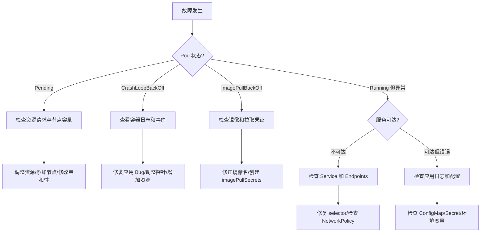
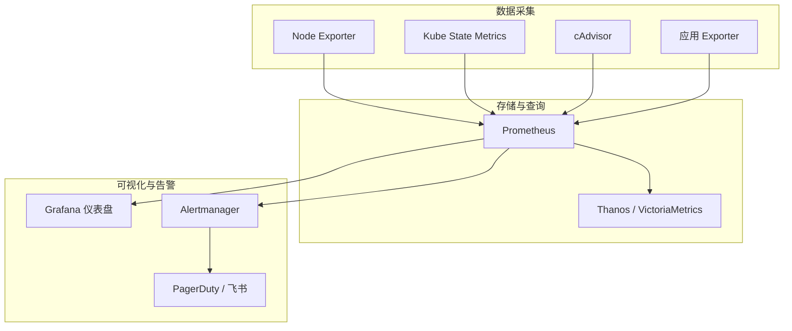

## 常见故障模式

K8s 故障通常遵循特定的模式，快速识别模式是高效排障的关键。

### Pod 级别故障

| 状态 | 原因 | 排查方向 |
|------|------|---------|
| ImagePullBackOff | 镜像拉取失败 | 检查镜像名、凭证、网络 |
| CrashLoopBackOff | 容器启动后崩溃 | 查看容器日志、资源限制 |
| OOMKilled | 内存不足被杀 | 增大 limits 或优化内存使用 |
| Pending | 无法调度 | 检查资源、亲和性、PVC |
| Completed | 主进程正常退出 | 检查是否应为长时间运行 |

### 节点级别故障

| 状态 | 原因 | 排查方向 |
|------|------|---------|
| NotReady | kubelet 异常 | 检查 kubelet 日志和证书 |
| DiskPressure | 磁盘压力 | 清理镜像和日志 |
| MemoryPressure | 内存压力 | 驱逐低优先级 Pod |
| PIDPressure | 进程数过多 | 检查是否有进程泄漏 |

## 排障决策树

面对 K8s 故障，按以下流程逐步排查：



## 排障工具链

### 基础命令速查

```bash
# === Pod 排障 ===
kubectl get pods -A -o wide                    # 全局 Pod 状态
kubectl describe pod <name>                    # 事件和状态详情
kubectl logs <pod> -c <container> --previous   # 上一次崩溃的日志
kubectl logs <pod> --all-containers            # 所有容器日志
kubectl exec -it <pod> -- /bin/sh              # 进入容器

# === 网络排障 ===
kubectl get endpoints <service>                # Service 后端 Pod
kubectl get networkpolicies -A                 # 网络策略
kubectl run tmp --image=busybox --rm -it -- wget -qO- http://svc:80  # 临时测试

# === 节点排障 ===
kubectl describe node <name>                   # 节点条件和资源
kubectl top nodes                              # 资源使用率
kubectl get events --field-selector involvedObject.kind=Node  # 节点事件

# === 集群排障 ===
kubectl get componentstatuses                  # 组件健康状态
kubectl get apiservices                        # API 服务状态
```

### 临时诊断 Pod

快速创建诊断工具 Pod：

```bash
# 网络诊断
kubectl run nettool --image=nicolaka/netshoot --rm -it -- bash

# 在诊断 Pod 中
nslookup api-service.production.svc.cluster.local
curl -v http://api-service:8080/health
traceroute db-service
```

### 日志聚合查询

```bash
# 使用 stern 并行查看多 Pod 日志
stern "app=api" -n production --since 1h

# 使用 kubectl 插件 kubectl-logs
kubectl logs -l app=api -n production --since=1h --tail=100
```

## 集群运维

### 证书管理

K8s 集群证书默认有效期 1 年，需定期轮换：

```bash
# 检查证书过期时间
kubeadm certs check-expiration

# 续签所有证书
kubeadm certs renew all

# 重启控制面组件使新证书生效
docker restart $(docker ps | grep kube- | awk '{print $1}')
```

### etcd 备份与恢复

etcd 是集群状态的核心，必须定期备份：

```bash
# 备份 etcd 快照
ETCDCTL_API=3 etcdctl snapshot save /backup/etcd-$(date +%Y%m%d).db \
  --endpoints=https://127.0.0.1:2379 \
  --cacert=/etc/kubernetes/pki/etcd/ca.crt \
  --cert=/etc/kubernetes/pki/etcd/server.crt \
  --key=/etc/kubernetes/pki/etcd/server.key

# 查看快照状态
ETCDCTL_API=3 etcdctl snapshot status /backup/etcd-20260501.db --write-table

# 恢复（在所有 etcd 节点执行）
ETCDCTL_API=3 etcdctl snapshot restore /backup/etcd-20260501.db \
  --data-dir=/var/lib/etcd/restore
```

### 节点维护

```bash
# 标记节点不可调度
kubectl cordon node-1

# 驱逐节点上的 Pod（维护前）
kubectl drain node-1 --ignore-daemonsets --delete-emptydir-data

# 维护完成后恢复
kubectl uncordon node-1
```

### 集群升级流程

```bash
# 1. 升级 kubeadm
apt-mark unhold kubeadm
apt-get update && apt-get install -y kubeadm=1.29.4-*
apt-mark hold kubeadm

# 2. 验证升级计划
kubeadm upgrade plan

# 3. 升级控制面
kubeadm upgrade apply v1.29.4

# 4. 逐个升级工作节点
kubectl drain node-1 --ignore-daemonsets
apt-get install -y kubelet=1.29.4-* kubectl=1.29.4-*
systemctl restart kubelet
kubectl uncordon node-1
```

## 资源配额

### ResourceQuota — 命名空间级配额

```yaml
apiVersion: v1
kind: ResourceQuota
metadata:
  name: team-quota
  namespace: team-a
spec:
  hard:
    requests.cpu: "10"
    requests.memory: 20Gi
    limits.cpu: "20"
    limits.memory: 40Gi
    pods: "50"
    services: "10"
    persistentvolumeclaims: "20"
```

### LimitRange — 默认资源限制

```yaml
apiVersion: v1
kind: LimitRange
metadata:
  name: default-limits
  namespace: team-a
spec:
  limits:
    - type: Container
      default:           # 默认 limits
        cpu: 500m
        memory: 256Mi
      defaultRequest:    # �定义 requests
        cpu: 100m
        memory: 128Mi
      max:               # 最大允许值
        cpu: "2"
        memory: 2Gi
      min:               # 最小允许值
        cpu: 50m
        memory: 64Mi
```

## 集群监控

### 监控体系架构



### 关键监控指标

| 类别 | 指标 | 告警阈值建议 |
|------|------|------------|
| Pod | `kube_pod_container_status_restarts_total` | > 3 次/10min |
| Pod | `kube_pod_status_phase{phase="Pending"}` | > 5min |
| 节点 | `node_cpu_seconds_total` | 利用率 > 85% |
| 节点 | `node_memory_MemAvailable_bytes` | 可用 < 10% |
| 节点 | `node_filesystem_avail_bytes` | 可用 < 15% |
| K8s | `kube_node_status_condition` | NotReady > 3min |
| etcd | `etcd_disk_wal_fsync_duration_seconds` | P99 > 10ms |

### 必备告警规则


```yaml
groups:
  - name: k8s-critical
    rules:
      - alert: PodCrashLooping
        expr: rate(kube_pod_container_status_restarts_total[15m]) > 0
        for: 15m
        labels:
          severity: critical
        annotations:
          summary: "Pod {{ $labels.namespace }}/{{ $labels.pod }} is crash looping"

      - alert: NodeNotReady
        expr: kube_node_status_condition{condition="Ready",status="true"} == 0
        for: 5m
        labels:
          severity: critical
        annotations:
          summary: "Node {{ $labels.node }} is not ready"

      - alert: PVAlmostFull
        expr: |
          (kubelet_volume_stats_used_bytes / kubelet_volume_stats_capacity_bytes) > 0.85
        for: 10m
        labels:
          severity: warning
        annotations:
          summary: "PVC {{ $labels.namespace }}/{{ $labels.persistentvolumeclaim }} is {{ $value | humanizePercentage }} full"
```


K8s 运维和排障是一项系统性能力。掌握故障模式识别、排障决策树和工具链的使用，结合完善的监控和告警体系，才能在故障发生时快速定位并恢复服务。
