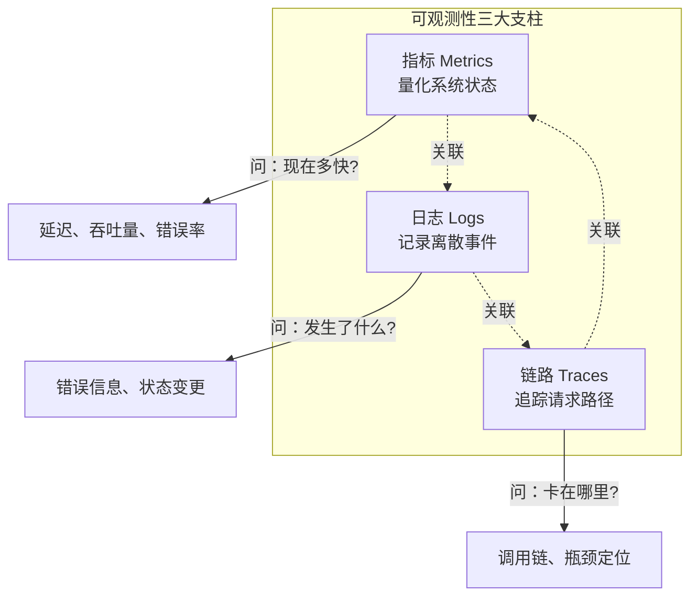
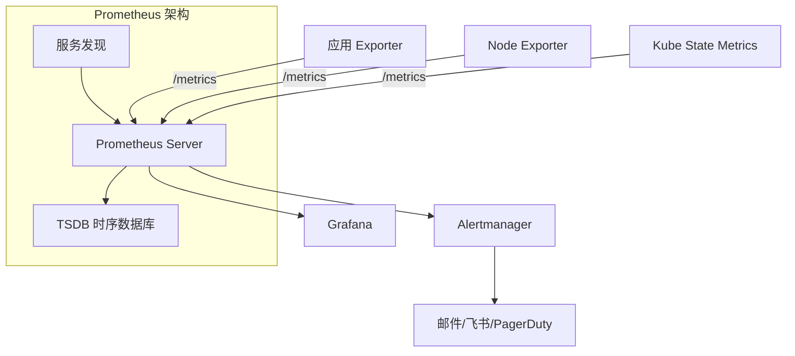
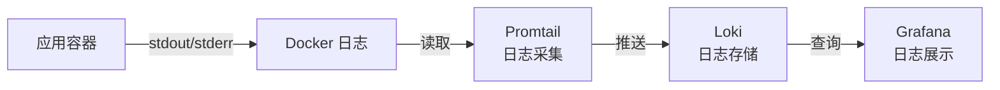
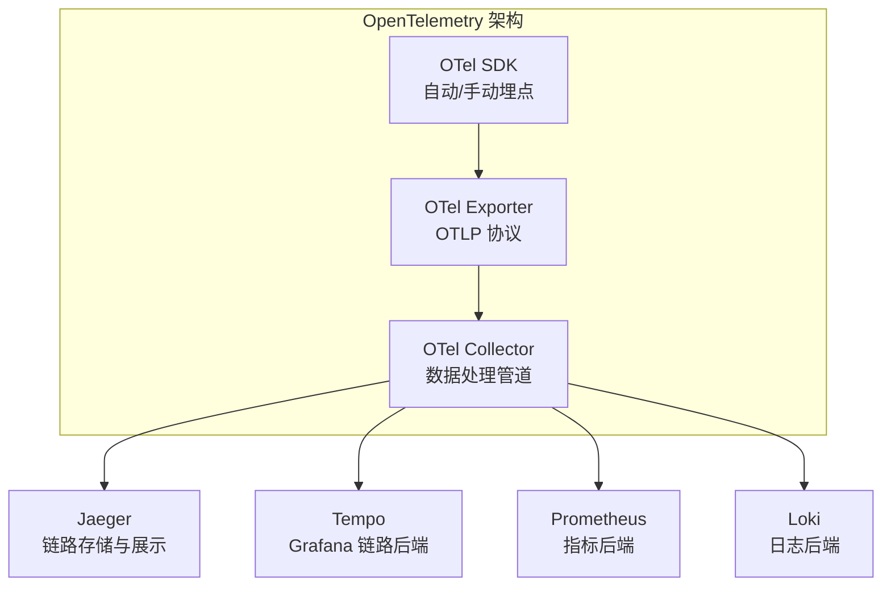
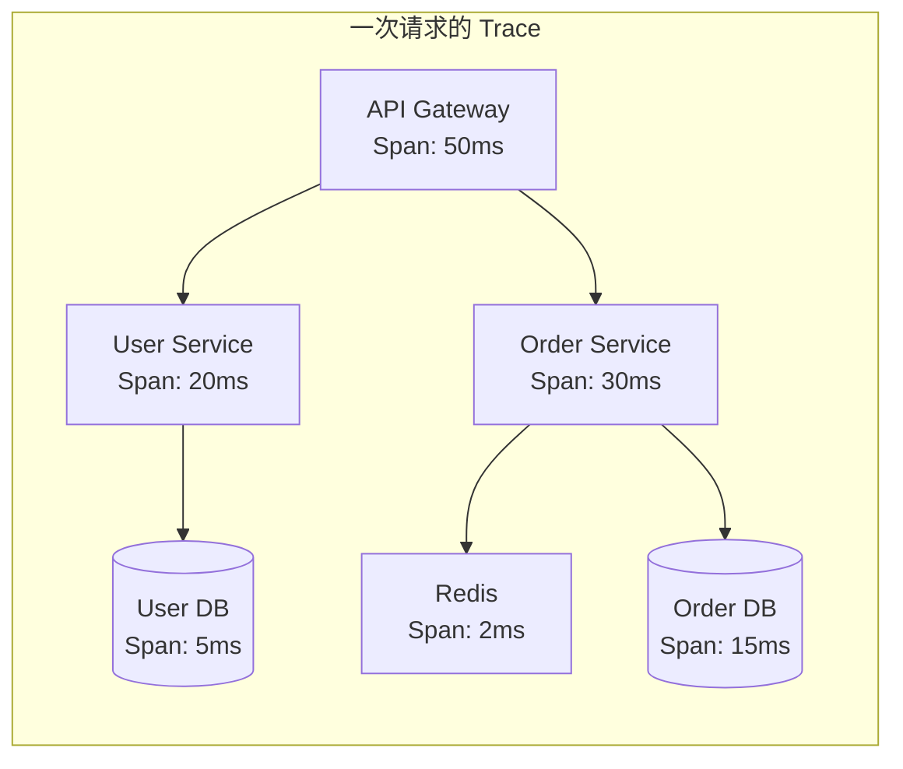

## 可观测性三大支柱

可观测性（Observability）是指通过系统外部输出推断内部状态的能力。与传统的"监控"不同，可观测性强调主动理解系统行为，而非被动响应已知问题。



### 三者关系

| 维度 | 指标 | 日志 | 链路 |
|------|------|------|------|
| 数据量 | 小（时间序列） | 大（离散事件） | 中（采样） |
| 告警 | 最适合 | 适合（关键日志） | 不适合 |
| 排障 | 定位方向 | 查看细节 | 定位瓶颈 |
| 成本 | 低 | 高 | 中 |
| 粒度 | 系统级 | 事件级 | 请求级 |

最佳实践是三者联动：指标触发告警 → 链路定位瓶颈 → 日志查看根因。

## Prometheus：指标采集与告警

Prometheus 是云原生可观测性的基石，采用拉取（Pull）模式采集指标：



### 指标类型

| 类型 | 说明 | 示例 |
|------|------|------|
| Counter | 只增不减的计数器 | 请求总数、错误总数 |
| Gauge | 可增可减的仪表盘 | 当前连接数、内存使用 |
| Histogram | 分布统计 | 请求延迟分布 |
| Summary | 分位数统计 | P50/P95/P99 延迟 |

### 应用埋点示例

```go
// Go 应用 Prometheus 埋点
var (
    httpRequestsTotal = prometheus.NewCounterVec(
        prometheus.CounterOpts{
            Name: "http_requests_total",
            Help: "Total number of HTTP requests",
        },
        []string{"method", "path", "status"},
    )

    httpRequestDuration = prometheus.NewHistogramVec(
        prometheus.HistogramOpts{
            Name:    "http_request_duration_seconds",
            Help:    "HTTP request duration in seconds",
            Buckets: prometheus.DefBuckets,
        },
        []string{"method", "path"},
    )
)

func metricsMiddleware(next http.Handler) http.Handler {
    return http.HandlerFunc(func(w http.ResponseWriter, r *http.Request) {
        timer := prometheus.NewTimer(httpRequestDuration.WithLabelValues(r.Method, r.URL.Path))
        next.ServeHTTP(w, r)
        timer.ObserveDuration()
        httpRequestsTotal.WithLabelValues(r.Method, r.URL.Path, "200").Inc()
    })
}
```

### PromQL 常用查询

```promql
# 请求速率（QPS）
rate(http_requests_total[5m])

# P99 延迟
histogram_quantile(0.99, rate(http_request_duration_seconds_bucket[5m]))

# 错误率
sum(rate(http_requests_total{status=~"5.."}[5m]))
/
sum(rate(http_requests_total[5m]))

# 按 Pod 分组的 CPU 使用率
sum(rate(container_cpu_usage_seconds_total{container!="POD"}[5m])) by (pod)
/
sum(container_spec_cpu_quota{container!="POD"} / container_spec_cpu_period{container!="POD"}) by (pod)
```

### 告警规则

```yaml
groups:
  - name: api-alerts
    rules:
      - alert: HighErrorRate
        expr: |
          sum(rate(http_requests_total{status=~"5.."}[5m]))
          /
          sum(rate(http_requests_total[5m])) > 0.05
        for: 5m
        labels:
          severity: critical
        annotations:
          summary: "API 错误率超过 5%"
          runbook: "https://wiki/runbook/high-error-rate"

      - alert: HighLatency
        expr: |
          histogram_quantile(0.95, rate(http_request_duration_seconds_bucket[5m])) > 2
        for: 10m
        labels:
          severity: warning
        annotations:
          summary: "API P95 延迟超过 2s"
```

## Grafana：仪表盘设计

Grafana 是可观测性的可视化层，将 Prometheus/ Loki/ Jaeger 等数据源统一展示：

### 仪表盘设计原则

1. **从宏观到微观**：顶部概览（SLI 指标），中间服务级，底部实例级
2. **使用变量模板**：通过 `$namespace`、`$pod` 变量实现仪表盘复用
3. **色彩有语义**：绿色=正常，黄色=警告，红色=异常
4. **关键指标突出**：SLI 放在第一行，大字体显示

### 常用仪表盘类型

| 面板类型 | 适用场景 | 示例 |
|---------|---------|------|
| Stat | 单一数值 | 当前 QPS、错误率 |
| Time Series | 时间趋势 | 延迟变化曲线 |
| Heatmap | 分布密度 | 请求延迟热力图 |
| Table | 表格数据 | 慢查询列表 |
| Log Viewer | 日志查看 | 错误日志上下文 |

```json
// Grafana 仪表盘变量示例
{
  "templating": {
    "list": [
      {
        "name": "namespace",
        "type": "query",
        "query": "label_values(kube_pod_info, namespace)"
      },
      {
        "name": "pod",
        "type": "query",
        "query": "label_values(kube_pod_info{namespace=\"$namespace\"}, pod)"
      }
    ]
  }
}
```

## 日志聚合

### ELK vs Loki

| 特性 | ELK（Elasticsearch） | Loki |
|------|---------------------|------|
| 索引方式 | 全文索引 | 仅索引标签 |
| 存储成本 | 高 | 低 |
| 查询能力 | 强（全文搜索） | 中（标签过滤+正则） |
| 部署复杂度 | 高 | 低 |
| 与 Prometheus 集成 | 需要适配 | 原生（同一查询语言） |

### Loki + Promtail 架构



### 结构化日志实践

```go
// 使用结构化日志（如 slog/zap）
slog.Info("request completed",
    "method", r.Method,
    "path", r.URL.Path,
    "status", statusCode,
    "duration_ms", duration.Milliseconds(),
    "trace_id", traceID,  // 关联链路追踪
)
```

日志查询示例（LogQL）：

```logql
# 查询特定服务的错误日志
{app="api", namespace="production"} |= "error" | json | status >= 500

# 统计每分钟错误日志数量
sum(count_over_time({app="api"} |= "error" [1m])) by (level)
```

## 分布式追踪

分布式追踪追踪一个请求在多个服务间的完整调用链，是微服务排障的核心工具。

### OpenTelemetry 标准

OpenTelemetry 是可观测性的统一标准，融合了 OpenTracing 和 OpenCensus：



### 核心概念

- **Trace**：一次请求的完整调用链
- **Span**：Trace 中的一个操作单元
- **Context Propagation**：跨服务传递 Trace ID（通常通过 HTTP Header）



### Go 应用接入示例

```go
import (
    "go.opentelemetry.io/otel"
    "go.opentelemetry.io/otel/exporters/otlp/otlptrace/otlptracegrpc"
    "go.opentelemetry.io/otel/sdk/trace"
)

func initTracer() (*trace.TracerProvider, error) {
    exporter, err := otlptracegrpc.New(context.Background(),
        otlptracegrpc.WithEndpoint("otel-collector:4317"),
        otlptracegrpc.WithInsecure(),
    )
    if err != nil {
        return nil, err
    }

    tp := trace.NewTracerProvider(
        trace.WithBatcher(exporter),
        trace.WithResource(resource.NewWithAttributes(
            semconv.SchemaURL,
            semconv.ServiceNameKey.String("api-service"),
        )),
    )
    otel.SetTracerProvider(tp)
    return tp, nil
}
```

### 追踪与日志/指标联动

最佳实践是将 Trace ID 注入日志和指标，实现三者关联：

- 日志中包含 `trace_id`：从日志跳转到链路详情
- 指标中包含 `trace_id` Exemplar：从指标图表跳转到慢请求的链路
- Grafana 中一键从指标 → 日志 → 链路跳转

可观测性不是工具的堆砌，而是三大支柱的有机联动。指标告诉你"出了问题"，链路告诉你"卡在哪里"，日志告诉你"为什么"。三者协同，才能实现快速定位和高效排障。
