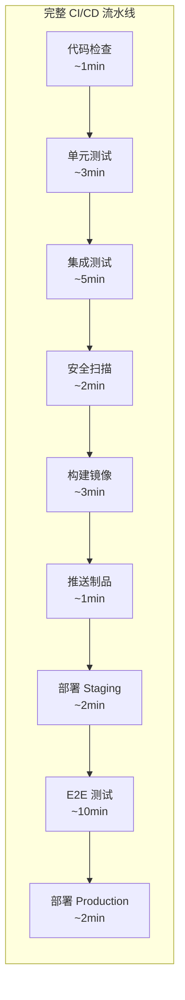
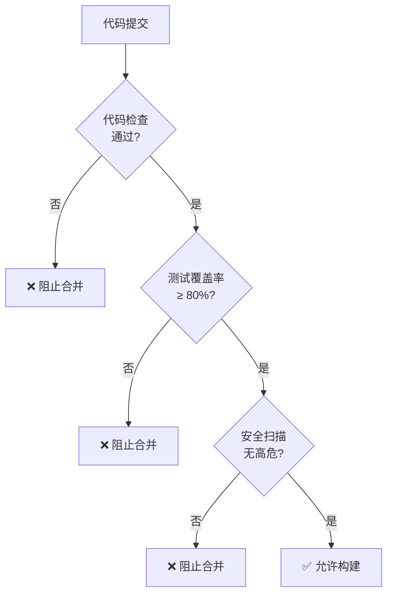
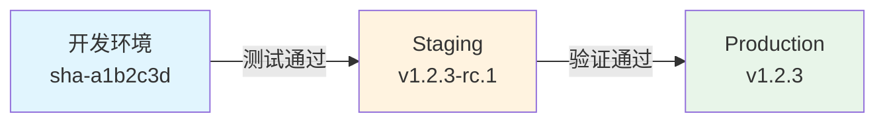
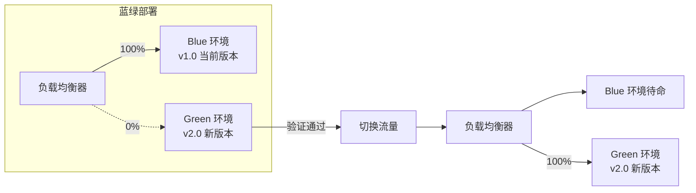
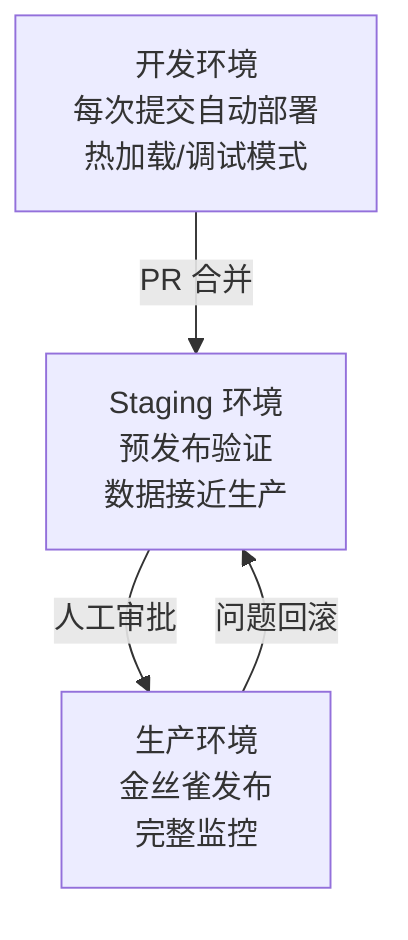

## 流水线设计原则

CI/CD 流水线是软件交付的核心引擎。好的流水线设计应当追求：快速反馈、质量保证、安全可靠和可重复性。

### 设计原则

1. **失败快速（Fail Fast）**：耗时短的检查放前面，如代码检查、单元测试
2. **单一职责**：每个 Stage 专注一个目标，便于定位问题
3. **幂等性**：同一输入始终产生相同输出，支持安全重试
4. **最小权限**：每个步骤仅获取必要的凭证和权限



## 流水线阶段设计

### 标准阶段划分


```yaml
# GitHub Actions 完整流水线示例
name: Delivery Pipeline

on:
  push:
    branches: [main]
  pull_request:
    branches: [main]

jobs:
  # ---- 阶段 1：代码质量 ----
  lint:
    runs-on: ubuntu-latest
    steps:
      - uses: actions/checkout@v4
      - uses: actions/setup-node@v4
        with:
          node-version: 20
          cache: npm
      - run: npm ci
      - run: npm run lint
      - run: npm run type-check

  # ---- 阶段 2：测试 ----
  unit-test:
    runs-on: ubuntu-latest
    steps:
      - uses: actions/checkout@v4
      - uses: actions/setup-node@v4
        with:
          node-version: 20
          cache: npm
      - run: npm ci
      - run: npm test -- --coverage
      - name: 上传覆盖率
        uses: codecov/codecov-action@v4
        with:
          token: ${{ secrets.CODECOV_TOKEN }}

  integration-test:
    runs-on: ubuntu-latest
    services:
      postgres:
        image: postgres:16
        env:
          POSTGRES_DB: testdb
          POSTGRES_USER: test
          POSTGRES_PASSWORD: test
        ports: ['5432:5432']
    steps:
      - uses: actions/checkout@v4
      - uses: actions/setup-node@v4
        with:
          node-version: 20
          cache: npm
      - run: npm ci
      - run: npm run test:integration

  # ---- 阶段 3：安全扫描 ----
  security-scan:
    runs-on: ubuntu-latest
    steps:
      - uses: actions/checkout@v4
      - name: 依赖漏洞扫描
        run: npx audit-ci --high
      - name: SAST 扫描
        uses: github/super-linter@v5
        env:
          DEFAULT_BRANCH: main

  # ---- 阶段 4：构建与推送 ----
  build:
    needs: [lint, unit-test, integration-test, security-scan]
    runs-on: ubuntu-latest
    outputs:
      image-tag: ${{ steps.meta.outputs.tags }}
    steps:
      - uses: actions/checkout@v4
      - uses: docker/setup-buildx-action@v3
      - uses: docker/login-action@v3
        with:
          registry: ghcr.io
          username: ${{ github.actor }}
          password: ${{ secrets.GITHUB_TOKEN }}
      - uses: docker/metadata-action@v5
        id: meta
        with:
          images: ghcr.io/${{ github.repository }}
          tags: |
            type=sha,prefix=
            type=raw,value=latest,enable={{is_default_branch}}
      - uses: docker/build-push-action@v5
        with:
          context: .
          push: ${{ github.ref == 'refs/heads/main' }}
          tags: ${{ steps.meta.outputs.tags }}
          cache-from: type=gha
          cache-to: type=gha,mode=max

  # ---- 阶段 5：部署 ----
  deploy-staging:
    needs: build
    if: github.ref == 'refs/heads/main'
    runs-on: ubuntu-latest
    environment: staging
    steps:
      - uses: actions/checkout@v4
      - name: 部署到 Staging
        run: |
          kubectl set image deployment/web-app \
            app=${{ needs.build.outputs.image-tag }} \
            -n staging

  deploy-production:
    needs: deploy-staging
    runs-on: ubuntu-latest
    environment: production
    steps:
      - uses: actions/checkout@v4
      - name: 部署到 Production
        run: |
          kubectl set image deployment/web-app \
            app=${{ needs.build.outputs.image-tag }} \
            -n production
```


## 质量门禁

质量门禁是流水线中的"一票否决"机制，确保不达标的代码不会进入下一阶段：



### 质量门禁指标

| 阶段 | 门禁指标 | 阈值建议 |
|------|---------|---------|
| 代码检查 | Lint 错误数 | 0 |
| 单元测试 | 覆盖率 | ≥ 80% |
| 单元测试 | 测试通过率 | 100% |
| 安全扫描 | 高危/严重漏洞 | 0 |
| 安全扫描 | 依赖漏洞 | 0 高危 |
| 集成测试 | API 契约测试 | 100% 通过 |
| E2E 测试 | 核心流程成功率 | ≥ 99% |

## 制品管理

### 制品版本策略

```text
# 语义化版本 + Git SHA
v1.2.3          # 正式发布
v1.2.3-rc.1     # 候选版本
v1.2.3-dev.a1b2c3d  # 开发版本（含 commit SHA）
```

### 镜像标签策略

| 标签 | 用途 | 不可变 |
|------|------|--------|
| `latest` | 最新稳定版 | 否（不推荐生产使用） |
| `v1.2.3` | 语义化版本 | 是 |
| `sha-a1b2c3d` | Git SHA | 是 |
| `main-20260502` | 分支+日期 | 否 |

### 制品晋升流程



关键原则：**同一个镜像在所有环境中运行**，通过配置（ConfigMap/Secret）区分环境，而非重新构建。

## 部署策略

### 常见部署策略对比

| 策略 | 停机时间 | 回滚速度 | 资源消耗 | 复杂度 |
|------|---------|---------|---------|--------|
| 重建（Recreate） | 有 | 慢 | 低 | 最低 |
| 滚动更新（Rolling） | 无 | 中 | 中 | 低 |
| 蓝绿（Blue-Green） | 无 | 快 | 高（2x） | 中 |
| 金丝雀（Canary） | 无 | 快 | 低 | 高 |
| 影子（Shadow） | 无 | N/A | 高 | 最高 |

### 滚动更新

K8s Deployment 默认策略，逐步替换旧 Pod：

```yaml
spec:
  strategy:
    type: RollingUpdate
    rollingUpdate:
      maxSurge: 25%        # 更新时最多多出 25% Pod
      maxUnavailable: 25%  # 更新时最多 25% Pod 不可用
```

### 蓝绿部署

同时运行两套完整环境，切换流量实现零停机：



实现方式：

```yaml
# 通过 Service selector 切换
apiVersion: v1
kind: Service
metadata:
  name: web-app
spec:
  selector:
    app: web-app
    version: blue  # 切换为 green 即可完成蓝绿切换
  ports:
    - port: 80
      targetPort: 8080
```

## 多环境管理

### 环境晋升策略



### 环境配置管理

```text
config/
├── base/                    # 通用配置
│   ├── app-config.yaml
│   └── kustomization.yaml
└── overlays/
    ├── development/
    │   └── patch.yaml       # 调试模式、Mock 服务
    ├── staging/
    │   └── patch.yaml       # 接近生产配置
    └── production/
        └── patch.yaml       # 高可用、完整监控
```

### 环境隔离要点

- **网络隔离**：每个环境独立的命名空间，Network Policy 限制跨环境访问
- **数据隔离**：独立的数据库实例，生产数据脱敏后导入 Staging
- **权限隔离**：生产环境需要额外审批，CI 不可直接推送
- **监控隔离**：独立的监控面板和告警规则，避免环境间干扰

设计合理的流水线是高效交付的基础。从阶段划分到质量门禁，从制品管理到部署策略，每一个环节都需要根据团队规模和业务需求进行取舍和优化。好的流水线不是一蹴而就的，而是在实践中持续演进的。
