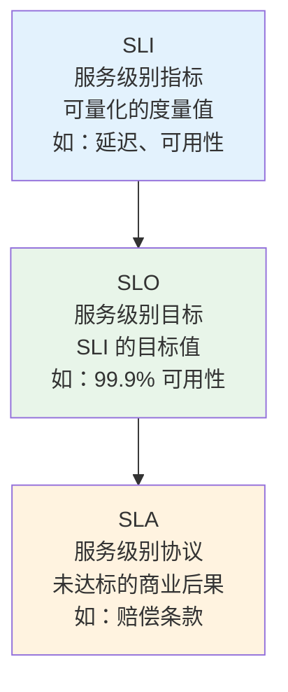
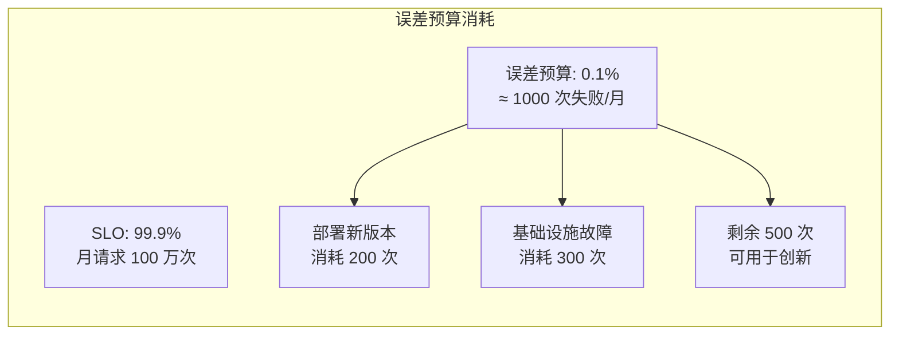
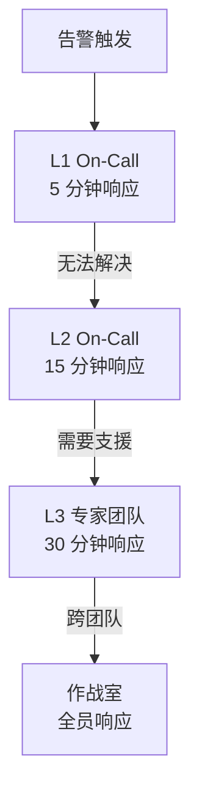
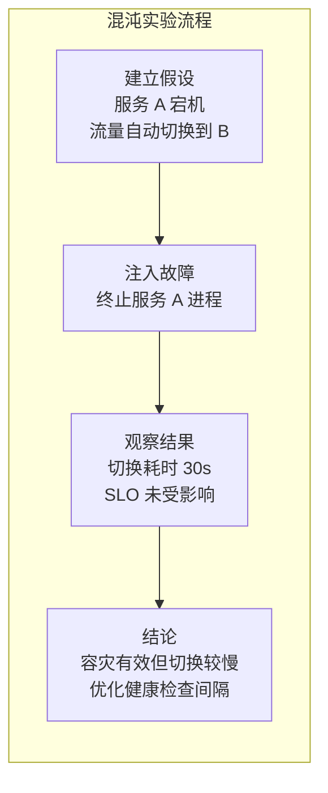
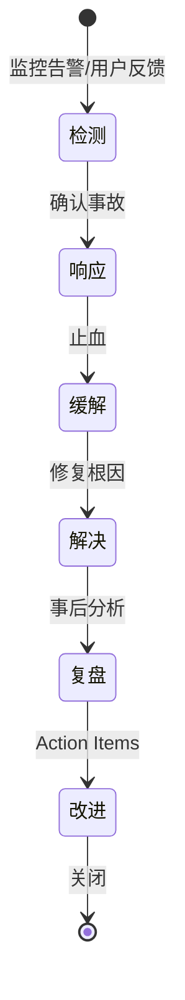
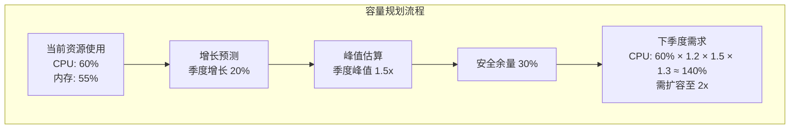

## SRE 概述

站点可靠性工程（Site Reliability Engineering，SRE）是 Google 提出的一套方法论，用软件工程的方法解决运维问题。SRE 的核心理念是：运维问题本质上是软件问题，应该用工程化的手段来系统性解决。

SRE 不是一个岗位，而是一套体系。它定义了可靠性的度量方法、故障的应对策略和风险的管控机制。

## SLI/SLO/SLA 体系

这是 SRE 的度量基石，从下到上层层递进：



### SLI 选择

SLI 应该反映用户真实体验，而非内部指标：

| 服务类型 | 推荐 SLI | 反模式 |
|---------|---------|--------|
| API 服务 | 请求成功率、延迟 | CPU 使用率 |
| Web 前端 | 页面加载时间、FCP | 服务器负载 |
| 存储 | 数据持久性、I/O 延迟 | 磁盘使用率 |
| 消息队列 | 消息投递延迟、丢消息率 | 队列长度 |

### SLO 制定

SLO 不是越高越好。100% 的 SLO 意味着不允许任何变更，系统将停滞不前。合理的 SLO 应该在用户体验和开发速度之间取得平衡：

```yaml
# SLO 定义示例（SLO Generator 格式）
service: api-gateway
slos:
  - name: availability
    description: "API 请求成功率"
    sli:
      type: good_bad_ratio
      good: sum(rate(http_requests_total{status=~"2.."}[5m]))
      bad: sum(rate(http_requests_total{status!~"2.."}[5m]))
    target: 99.9%
    window: 30d

  - name: latency
    description: "API P99 延迟"
    sli:
      type: threshold
      metric: histogram_quantile(0.99, rate(http_request_duration_seconds_bucket[5m]))
      threshold: 500ms
    target: 99%
    window: 30d
```

### 误差预算

误差预算（Error Budget）是 SLO 的反面：1 - SLO = 允许的故障空间。



**误差预算的实际意义**：

- 预算充足时：团队可以大胆发布新功能、进行架构重构
- 预算耗尽时：团队停止非紧急变更，专注可靠性改善
- 预算持续剩余：说明 SLO 过于宽松，应提高目标以推动改进

## On-Call 实践

On-Call 是 SRE 的一线工作，确保系统故障时有人响应和处理。

### On-Call 原则

1. **合理的告警量**：每周不超过 2 次页面级告警，否则 On-Call 人员会疲劳
2. **明确的升级路径**：一级 → 二级 → 三级，每级有时限要求
3. **事后复盘**：每次 On-Call 事件必须有事后分析
4. **轮换机制**：避免同一人长期 On-Call



### 告警分级

| 级别 | 响应时间 | 通知方式 | 示例 |
|------|---------|---------|------|
| P1 - 紧急 | 5 分钟 | 电话 + 短信 | 生产服务不可用 |
| P2 - 高 | 15 分钟 | 短信 + IM | 部分功能降级 |
| P3 - 中 | 1 小时 | IM 通知 | 延迟升高 |
| P4 - 低 | 24 小时 | 邮件 | 磁盘使用率 > 70% |

### On-Call 交接清单

- 本周发生的事件及处理状态
- 待跟进的 Action Item
- 即将到期的 SLO / 误差预算
- 计划中的变更和可能的影响

## 混沌工程

混沌工程是通过主动注入故障来验证系统韧性的实验方法。核心思想是：在故障影响用户之前，先发现系统的薄弱环节。

### 混沌工程原则

1. **建立稳态假设**：定义系统"正常"的行为指标
2. **模拟真实事件**：注入服务器宕机、网络延迟、依赖不可用等
3. **观察系统行为**：对比注入前后的指标变化
4. **学习和改进**：根据实验结果加固系统



### Chaos Monkey 与 Chaos Mesh

| 工具 | 平台 | 故障类型 |
|------|------|---------|
| Chaos Monkey | Netflix/Spinnaker | 随机终止实例 |
| Chaos Mesh | K8s | Pod 故障、网络故障、I/O 故障 |
| Litmus | K8s | 全面混沌实验 |
| Gremlin | 全平台 | 商业方案，可视化实验 |

### Chaos Mesh 实验示例

```yaml
apiVersion: chaos-mesh.org/v1alpha1
kind: NetworkChaos
metadata:
  name: api-latency
  namespace: chaos-testing
spec:
  action: delay
  mode: one
  selector:
    namespaces: ["production"]
    labelSelectors:
      app: api
  delay:
    latency: "500ms"
    correlation: "50"
  duration: "5m"
```

## 事故管理

### 事故生命周期



### 事故响应原则

1. **先止血，后查因**：快速恢复服务优先于找到根因
2. **单一指挥官**：一个人负责协调，其他人专注技术
3. **频繁更新**：每 15-30 分钟向利益相关方同步状态
4. **保留现场**：不要急于重启，保留日志和现场信息

### 无指责复盘（Blameless Post-Mortem）

复盘的核心原则：**对人不对事**（不对个人追责，而是找出系统性问题）。

复盘模板：

```text
## 事故复盘

### 基本信息
- 事故时间：2026-05-01 14:30 - 15:45
- 影响范围：API 服务 30% 请求失败
- 影响时长：75 分钟
- SLO 影响：消耗月度误差预算的 15%

### 时间线
- 14:30 - 告警触发：API 错误率上升
- 14:35 - On-Call 确认事故，开始排查
- 14:45 - 定位：数据库连接池耗尽
- 15:00 - 缓解：扩容数据库连接池
- 15:15 - 服务恢复正常
- 15:45 - 确认无复发

### 根因分析
数据库连接池配置未随流量增长调整，高并发时连接等待超时

### Action Items
1. [P0] 连接池配置自动随 HPA 扩缩（负责人：张三，截止：5/7）
2. [P1] 添加连接池使用率告警（负责人：李四，截止：5/5）
3. [P2] 接入 Chaos Mesh 模拟连接池耗尽（负责人：王五，截止：5/14）
```

## 容量规划

容量规划确保系统在业务增长时仍有足够资源承载流量：

### 规划方法论

1. **当前基线**：收集资源使用趋势数据
2. **增长率预测**：基于历史数据推算未来需求
3. **安全余量**：预留 30% 缓冲应对突发流量
4. **里程碑检查**：每季度复盘预测与实际的偏差



### 关键指标

| 维度 | 指标 | 作用 |
|------|------|------|
| 计算 | CPU/内存使用率趋势 | 决定节点扩缩 |
| 存储 | 磁盘增长速率 | 预测扩容时间点 |
| 网络 | 带宽使用趋势 | 规划带宽升级 |
| 业务 | DAU/请求量增长 | 驱动所有资源规划 |

### 自动化容量管理

```yaml
# K8s VPA 自动推荐资源配额
apiVersion: autoscaling.k8s.io/v1
kind: VerticalPodAutoscaler
metadata:
  name: api-vpa
spec:
  targetRef:
    apiVersion: apps/v1
    kind: Deployment
    name: api
  updatePolicy:
    updateMode: Off  # 仅推荐，不自动修改
  resourcePolicy:
    containerPolicies:
      - mode: Auto
```

SRE 不是让系统不发生故障——那是不可能的。SRE 的目标是让系统具备快速恢复的能力，并在故障中持续学习和改进。从 SLI/SLO 的度量到 On-Call 的响应，从混沌工程的验证到无指责复盘的成长，SRE 让可靠性成为工程化的可重复实践。
