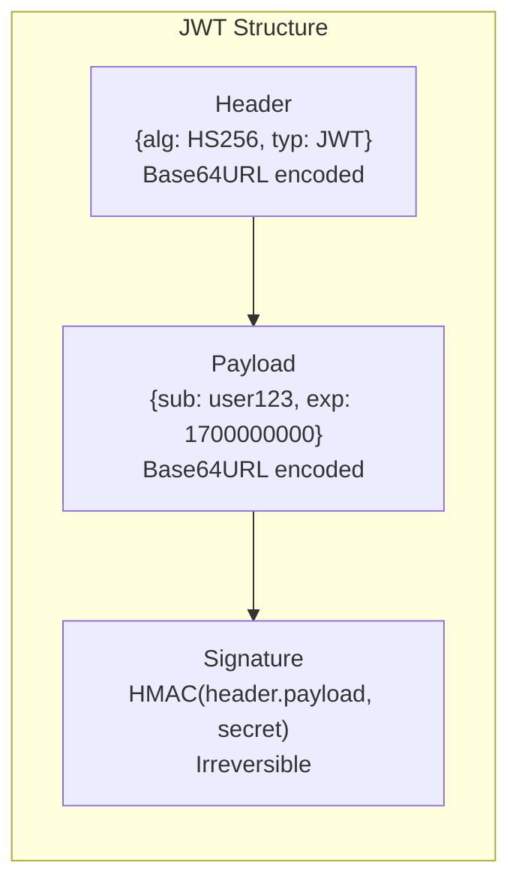
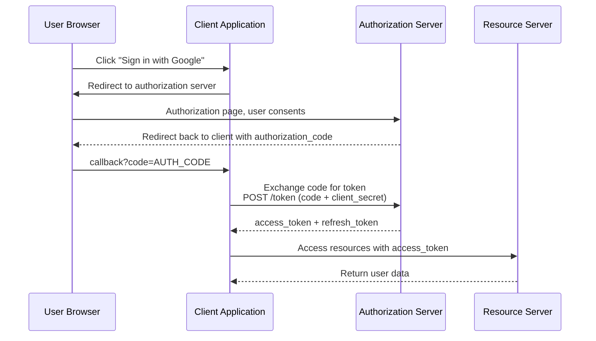
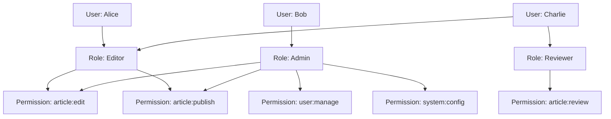
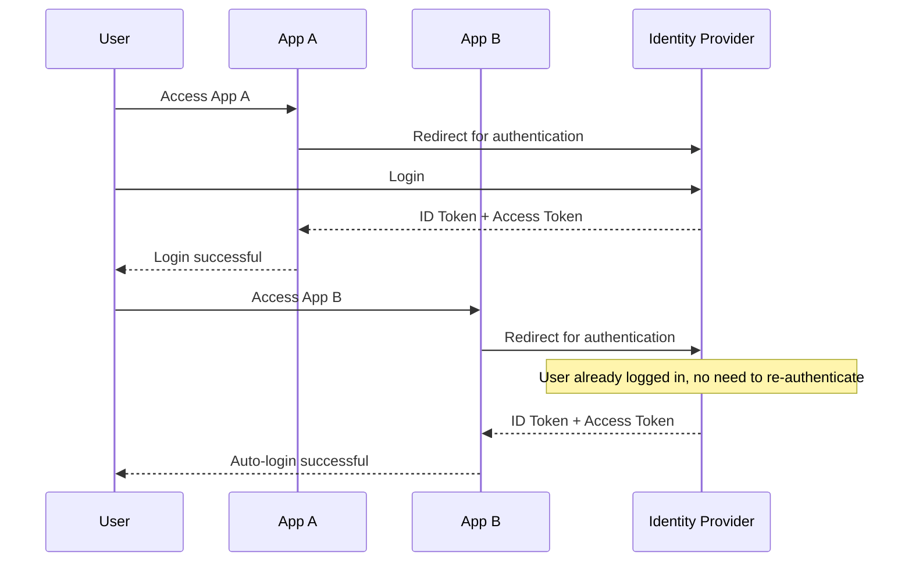

## Authentication Schemes Comparison

Authentication answers "who are you," while Authorization answers "what can you do." Three mainstream authentication schemes each have their applicable scenarios:

| Scheme | Stateful | Scalability | Use Case |
|--------|----------|-------------|----------|
| Session/Cookie | Yes (server-side storage) | Poor | Traditional web applications |
| JWT | No (self-contained token) | Good | SPA, microservices |
| OAuth 2.0 | Depends on implementation | Good | Third-party login, open platforms |

## Session/Cookie Mechanism

```mermaid
sequenceDiagram
    participant C as Browser
    participant S as Server
    participant Store as Session Store

    C->>S: POST /login (username, password)
    S->>Store: Create Session {user_id: 123}
    Store-->>S: session_id: abc123
    S-->>C: Set-Cookie: sid=abc123; HttpOnly; Secure
    C->>S: GET /profile Cookie: sid=abc123
    S->>Store: Query session_id=abc123
    Store-->>S: {user_id: 123}
    S-->>C: 200 OK (user data)
```

Core issues with the Session mechanism:

- **Scalability**: Multiple servers require Sticky Session or centralized storage (Redis)
- **CSRF risk**: Cookies are automatically sent, vulnerable to cross-site attacks
- **Cross-domain limitations**: Cookies have same-origin policy restrictions

## JWT Mechanism

JWT (JSON Web Token) consists of three parts separated by `.`:



```javascript
// JWT actual example
// Header
{ "alg": "HS256", "typ": "JWT" }

// Payload (Claims)
{
  "sub": "user_123",        // Subject - user identifier
  "name": "John",
  "role": "admin",
  "iat": 1700000000,        // Issued At - token issue time
  "exp": 1700003600         // Expiration - token expiry (1 hour later)
}

// Signature
HMACSHA256(base64(header) + "." + base64(payload), secret_key)
```

### Key Issues with JWT

**1. Cannot Actively Invalidate**

Once a JWT is issued, it cannot be revoked before expiration. Solutions:

```python
# Approach 1: Short-lived JWT + long-lived Refresh Token
# Access Token: 15 minutes
# Refresh Token: 7 days, stored in Redis, can be actively deleted

@app.route("/login", methods=["POST"])
def login():
    # Verify username and password...
    access_token = create_access_token(user_id, expires_delta=timedelta(minutes=15))
    refresh_token = create_refresh_token(user_id, expires_delta=timedelta(days=7))
    redis.setex(f"refresh:{user_id}", 7*24*3600, refresh_token)
    return {"access_token": access_token, "refresh_token": refresh_token}

@app.route("/refresh", methods=["POST"])
def refresh():
    refresh_token = request.json["refresh_token"]
    payload = verify_token(refresh_token)
    if not redis.exists(f"refresh:{payload['sub']}"):
        raise Unauthorized("Token revoked")
    new_access = create_access_token(payload["sub"], timedelta(minutes=15))
    return {"access_token": new_access}

# Approach 2: Token blacklist (sacrifices statelessness)
# Store the jti of revoked tokens in Redis, TTL = token's remaining validity
@app.route("/logout", methods=["POST"])
def logout():
    token = get_token_from_request()
    payload = decode_token(token)
    ttl = payload["exp"] - int(time.time())
    if ttl > 0:
        redis.setex(f"blacklist:{payload['jti']}", ttl, "1")
```

**2. Payload Can Be Decoded**

JWT's Header and Payload are only Base64 encoded, not encrypted. Anyone can decode and view the content, so **never store sensitive information in a JWT**.

## OAuth 2.0 Authorization Code Flow

OAuth 2.0 is used to authorize third-party applications to access user resources. The most secure is the **Authorization Code** mode:



### PKCE Enhancement

Pure frontend applications (SPAs) cannot securely store `client_secret`. PKCE (Proof Key for Code Exchange) solves this problem:

```javascript
// 1. Client generates code_verifier and code_challenge
const codeVerifier = generateRandomString(128);
const codeChallenge = base64URL(sha256(codeVerifier));

// 2. Authorization request includes code_challenge
const authUrl = `https://auth.example.com/authorize?` +
    `client_id=spa_app&` +
    `redirect_uri=https://app.example.com/callback&` +
    `code_challenge=${codeChallenge}&` +
    `code_challenge_method=S256`;

// 3. Token request includes code_verifier
const tokenResponse = await fetch('https://auth.example.com/token', {
    method: 'POST',
    body: new URLSearchParams({
        grant_type: 'authorization_code',
        code: authCode,
        code_verifier: codeVerifier,  // Auth server verifies sha256(verifier) == challenge
    })
});
```

## RBAC and ABAC Permission Models

### RBAC (Role-Based Access Control)



```sql
-- RBAC data model
CREATE TABLE users (id INT PRIMARY KEY, name VARCHAR(50));
CREATE TABLE roles (id INT PRIMARY KEY, name VARCHAR(50));
CREATE TABLE permissions (id INT PRIMARY KEY, resource VARCHAR(50), action VARCHAR(20));
CREATE TABLE user_roles (user_id INT, role_id INT);
CREATE TABLE role_permissions (role_id INT, permission_id INT);

-- Query user permissions
SELECT p.resource, p.action
FROM users u
JOIN user_roles ur ON u.id = ur.user_id
JOIN role_permissions rp ON ur.role_id = rp.role_id
JOIN permissions p ON rp.permission_id = p.id
WHERE u.id = ?;
```

### ABAC (Attribute-Based Access Control)

ABAC makes decisions based on multi-dimensional attributes such as subject, resource, and environment—more flexible but more complex:

```python
# ABAC policy example
policies = [
    {
        "effect": "allow",
        "action": "document:edit",
        "conditions": {
            "subject.department": "eq:resource.department",  # Same department
            "subject.level": "gte:3",                        # Level >= 3
            "environment.time": "between:09:00-18:00"        # Working hours
        }
    }
]

def check_access(subject, resource, action, environment):
    for policy in policies:
        if policy["action"] != action:
            continue
        if evaluate_conditions(policy["conditions"], subject, resource, environment):
            return policy["effect"] == "allow"
    return False
```

## SSO and OIDC

Single Sign-On (SSO) lets users log in once and access multiple systems. OpenID Connect (OIDC) is an identity layer built on top of OAuth 2.0:



OIDC adds `id_token` (JWT format) on top of OAuth 2.0, containing user identity information:

```json
{
  "iss": "https://auth.example.com",
  "sub": "user_123",
  "aud": "app_client_id",
  "exp": 1700003600,
  "iat": 1700000000,
  "name": "John",
  "email": "john@example.com",
  "email_verified": true
}
```

Authentication and authorization are the cornerstones of system security—choosing the right authentication scheme and designing a clear permission model is the first step in protecting your system.
