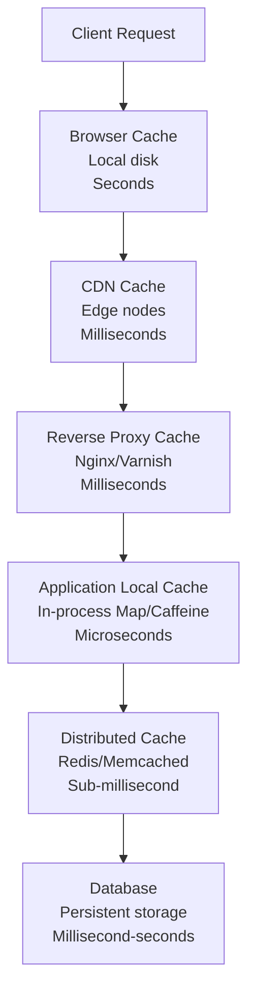
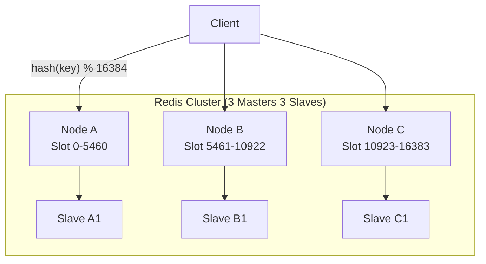
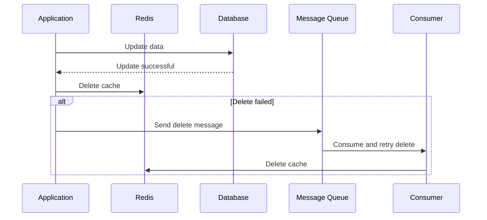

## Cache Hierarchy

Modern system caches typically form a multi-tier hierarchy, caching data from slow to fast, large to small:



| Cache Layer | Latency | Capacity | Consistency | Use Case |
|-------------|---------|----------|-------------|----------|
| Browser | ~0ms | Hundreds of MB | Weakest | Static assets |
| CDN | ~10ms | TB scale | Weak | Static assets, public data |
| Reverse proxy | ~1ms | GB scale | Weak | Hot pages, API responses |
| Local cache | ~0.01ms | MB scale | Medium | Configuration, metadata |
| Distributed cache | ~0.5ms | GB-TB scale | Strong | Business data |

## Redis Data Structures and Use Cases

Redis provides 5 basic data structures and 3 extended structures, each with its optimal use case:

### Basic Data Structures

| Structure | Characteristics | Typical Use Case | Time Complexity |
|-----------|----------------|-------------------|-----------------|
| String | Simple KV, max 512MB | Caching, counters, distributed locks | O(1) |
| Hash | Field-value mapping | Object storage (user info, product details) | O(1) |
| List | Ordered list, doubly linked | Message queue, latest lists | Head/tail O(1) |
| Set | Unordered unique collection | Tags, mutual friends, lottery | O(1) |
| Sorted Set | Ordered unique collection + score | Leaderboards, delay queues | O(log N) |

### Practical Examples

```bash
# Counter (String + INCR)
SET article:1001:views 0
INCR article:1001:views          # Atomic increment

# Object storage (Hash)
HMSET user:1001 name "John" email "john@example.com" age 28
HGET user:1001 name               # → "John"

# Leaderboard (Sorted Set)
ZADD leaderboard 1500 "player1"
ZADD leaderboard 2000 "player2"
ZREVRANGE leaderboard 0 9 WITHSCORES  # Top 10

# Distributed lock (String + Lua)
SET lock:order:1001 "uuid-xxx" NX PX 30000  # 30s expiration
# Release lock (Lua ensures atomicity)
EVAL "if redis.call('get',KEYS[1]) == ARGV[1] then return redis.call('del',KEYS[1]) else return 0 end" 1 lock:order:1001 "uuid-xxx"

# Delay queue (Sorted Set)
ZADD delay_queue <timestamp+delay> <task_id>
# Poll periodically
ZRANGEBYSCORE delay_queue 0 <current_timestamp> LIMIT 0 100
```

## Caching Strategies

### Four Classic Strategies

```mermaid
flowchart TD
    subgraph "Cache-Aside"
        A1[App queries cache] --> B1{Cache hit?}
        B1 -->|Yes| C1[Return cached data]
        B1 -->|No| D1[Query database]
        D1 --> E1[Write to cache]
        E1 --> C1
    end

    subgraph "Read-Through"
        A2[App queries cache layer] --> B2[Cache layer auto-loads<br/>missed data]
        B2 --> C2[Return data]
    end

    subgraph "Write-Through"
        A3[App writes to cache layer] --> B3[Cache layer synchronously<br/>writes to database]
        B3 --> C3[Return success]
    end

    subgraph "Write-Behind"
        A4[App writes to cache layer] --> B4[Cache layer asynchronously<br/>batch writes to database]
        B4 --> C4[Return immediately]
    end
```



| Strategy | Read Path | Write Path | Consistency | Complexity |
|----------|-----------|------------|-------------|------------|
| Cache-Aside | App queries cache first; on miss, query DB and backfill | App updates DB first, then invalidates cache | Eventually consistent | Low |
| Read-Through | App only queries cache layer; on miss, cache layer loads | Same as Cache-Aside | Eventually consistent | Medium |
| Write-Through | Same as Read-Through | Cache layer synchronously writes to DB | Strongly consistent | Medium |
| Write-Behind | Same as Read-Through | Cache layer asynchronously batch writes to DB | Weakly consistent | High |

**Cache-Aside is the most commonly used strategy** because it's simple to implement and widely applicable. The key question: should you update or invalidate the cache on writes?

**Invalidate the cache** rather than updating it:
- Avoids inconsistency from concurrent writes between cache and DB
- Cache may be a complex computation result; updating may cost more than invalidating and rebuilding
- Invalidation is idempotent and retry-safe

## Cache Problems and Defenses

### 1. Cache Penetration

**Symptom**: A large number of requests query non-existent data; cache misses, requests go directly to the database.

**Defense strategies**:

```python
# Approach 1: Cache null values
def get_user(user_id):
    data = cache.get(f"user:{user_id}")
    if data is not None:
        if data == "NULL":
            return None           # Hit null marker
        return data

    data = db.query("SELECT * FROM users WHERE id = %s", user_id)
    if data is None:
        cache.set(f"user:{user_id}", "NULL", ttl=300)  # Cache null value, 5 minutes
    else:
        cache.set(f"user:{user_id}", data, ttl=3600)
    return data

# Approach 2: Bloom filter (front-end interception)
# Put all valid IDs into a bloom filter; requests pass through bloom filter first
bloom = BloomFilter(capacity=10_000_000, error_rate=0.001)
for user_id in db.get_all_ids():
    bloom.add(user_id)

def get_user(user_id):
    if not bloom.check(user_id):
        return None  # Definitely doesn't exist
    # Query cache, query database...
```

### 2. Cache Stampede

**Symptom**: When a hot key expires, a large number of concurrent requests simultaneously query the database.

**Defense strategies**:

```python
# Approach 1: Mutex lock
def get_user(user_id):
    data = cache.get(f"user:{user_id}")
    if data is not None:
        return data

    lock_key = f"lock:user:{user_id}"
    if cache.set(lock_key, "1", nx=True, ex=5):  # Acquire lock
        try:
            data = db.query(...)
            cache.set(f"user:{user_id}", data, ttl=3600)
            return data
        finally:
            cache.delete(lock_key)
    else:
        time.sleep(0.1)     # Wait and retry
        return get_user(user_id)

# Approach 2: Logical expiration (no TTL set, embed expiration time in data)
def get_user(user_id):
    data = cache.get(f"user:{user_id}")
    if data and data["expire_at"] > time.time():
        return data["value"]

    # Async refresh
    async_refresh(user_id)
    return data["value"] if data else db.query(...)
```

### 3. Cache Avalanche

**Symptom**: A large number of keys expire simultaneously, or the cache service goes down, causing all requests to hit the database.

**Defense strategies**:

```bash
# Approach 1: Add random offset to expiration time
base_ttl = 3600
random_ttl = base_ttl + random.randint(0, 600)  # 3600~4200 seconds

# Approach 2: Cache high availability
# Redis Sentinel / Redis Cluster to avoid single point of failure

# Approach 3: Multi-level caching
# Local cache (Caffeine) + distributed cache (Redis)
# Local cache with shorter TTL as fallback

# Approach 4: Rate limiting and degradation
# When database load is too high, return degraded data directly
```

## Distributed Caching

### Redis Cluster

Redis Cluster implements data sharding through hash slots, with a total of 16384 slots:



Key design features:
- **Hash tags**: `{user}:profile` and `{user}:orders` are assigned to the same slot, supporting multi-key operations
- **Failover**: When a master node fails, a slave node is automatically promoted
- **Client routing**: Clients cache slot mappings; MOVED redirects update them

### Cache Consistency Guarantees



Best practice: Update the database first, then delete the cache. If cache deletion fails, reliably retry through a message queue. In extreme scenarios (a read thread reads and backfills stale data before the write thread commits), brief inconsistency may still occur, which can be addressed through delayed double deletion.

Caching is the classic trade-off of space for time—proper use can improve system performance by orders of magnitude, but you must defend against the three major problems: penetration, stampede, and avalanche.
