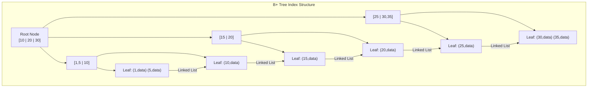
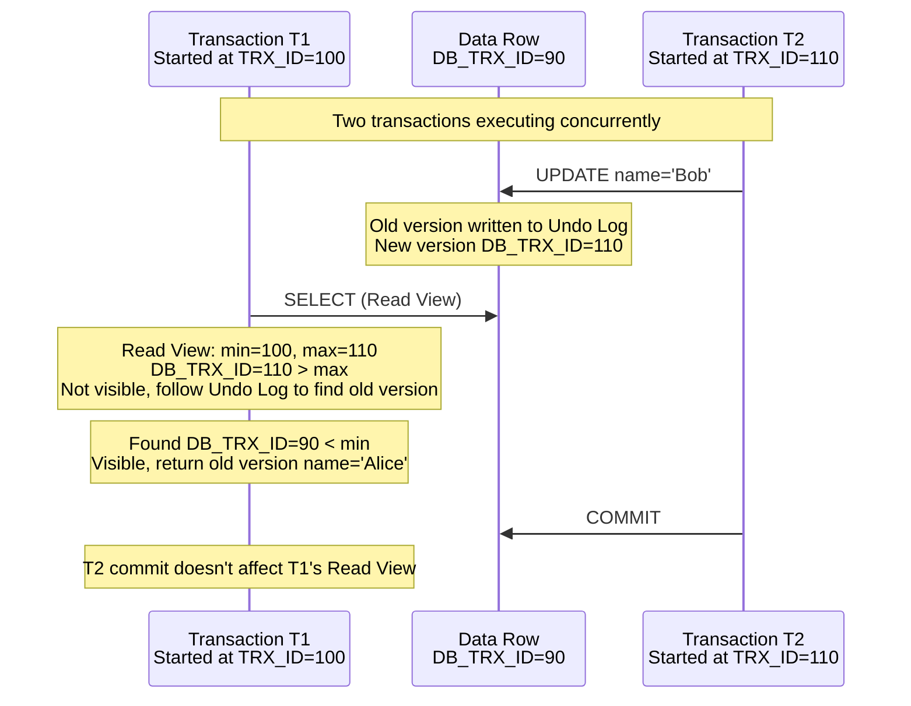
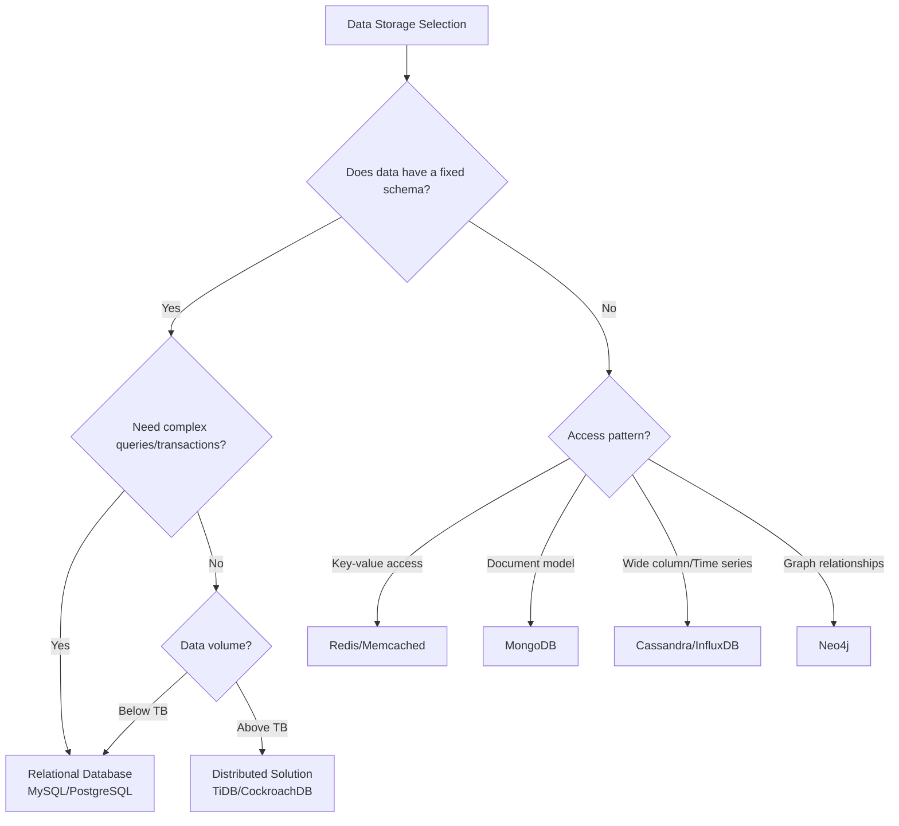

## Relational Database Storage Engines

Database storage engines are responsible for how data is organized on disk and cached in memory. Taking InnoDB as an example, the core design revolves around **reducing disk I/O**.

### B+ Tree Index Structure

InnoDB uses B+ trees as the index structure. All data is stored in leaf nodes, while non-leaf nodes only store key values and child node pointers:



Key B+ tree design characteristics:

- **Large fan-out, low height**: InnoDB page size is 16KB; a three-level B+ tree can store approximately 20 million rows (assuming ~12 bytes per key+pointer), locating data with just three disk I/Os
- **Leaf node linked list**: Range queries scan along the linked list sequentially without backtracking to upper nodes
- **Page structure**: Each node is a Page, InnoDB's smallest I/O unit

### Clustered Index and Secondary Index

InnoDB's **clustered index** (primary key index) stores complete row data in leaf nodes, while **secondary index** leaf nodes store primary key values:

```sql
-- Query using secondary index requires "bookmark lookup"
SELECT * FROM users WHERE email = 'alice@example.com';
-- 1. Find primary key id=5 in the email secondary index
-- 2. Find complete row data in the clustered index using id=5

-- Covering index avoids bookmark lookup
SELECT id, email FROM users WHERE email = 'alice@example.com';
-- The secondary index already contains id and email, no lookup needed
```

## Transaction ACID and Isolation Levels

### ACID Properties

| Property | Meaning | Implementation Mechanism |
|----------|---------|------------------------|
| Atomicity | Transactions are indivisible; either all or nothing | Undo Log |
| Consistency | Database state is valid before and after transaction | Constraints + Application layer |
| Isolation | Concurrent transactions don't interfere with each other | Locks + MVCC |
| Durability | Committed data is permanently saved | Redo Log |

### MVCC Implementation

Multi-Version Concurrency Control (MVCC) is InnoDB's core mechanism for high-concurrency read/write operations, enabling lock-free reads:



Core MVCC components:

1. **Hidden columns**: Each row has `DB_TRX_ID` (ID of the last modifying transaction) and `DB_ROLL_PTR` (rollback pointer to Undo Log)
2. **Undo Log version chain**: Each modification writes the old version to Undo Log, linked via `DB_ROLL_PTR`
3. **Read View**: A snapshot created when a transaction starts, recording the list of currently active transactions to determine which version is visible

Visibility rules:
- Version's `DB_TRX_ID` < Read View's `min_trx_id` → Visible (transaction already committed)
- Version's `DB_TRX_ID` is in the active list → Not visible (transaction not committed)
- Version's `DB_TRX_ID` > Read View's `max_trx_id` → Not visible (transaction started after Read View)
- Otherwise, follow the Undo Log chain to find an earlier version

### Four Isolation Levels

| Isolation Level | Dirty Read | Non-repeatable Read | Phantom Read | Implementation |
|----------------|-----------|---------------------|-------------|----------------|
| READ UNCOMMITTED | Possible | Possible | Possible | No isolation |
| READ COMMITTED | No | Possible | Possible | Create Read View on each SELECT |
| REPEATABLE READ | No | No | Possible* | Create Read View at transaction start |
| SERIALIZABLE | No | No | No | All reads acquire shared locks |

*InnoDB's REPEATABLE READ prevents phantom reads to some extent through Next-Key Locks (row locks + gap locks).

## SQL Tuning in Practice

### EXPLAIN Analysis

```sql
EXPLAIN SELECT u.name, o.total
FROM users u
JOIN orders o ON u.id = o.user_id
WHERE u.status = 'active' AND o.created_at > '2024-01-01';
```

Key metrics:
- **type**: `const` > `eq_ref` > `ref` > `range` > `index` > `ALL` (full table scan)
- **key**: Actual index used
- **rows**: Estimated rows scanned
- **Extra**: `Using index` (covering index) is good; `Using filesort` / `Using temporary` needs optimization

### Common Optimization Patterns

```sql
-- ❌ Index invalidated: function operation
SELECT * FROM users WHERE YEAR(created_at) = 2024;
-- ✅ Rewrite as range query
SELECT * FROM users WHERE created_at >= '2024-01-01' AND created_at < '2025-01-01';

-- ❌ Index invalidated: implicit type conversion
SELECT * FROM users WHERE phone = 13800138000;  -- phone is VARCHAR
-- ✅ Use string
SELECT * FROM users WHERE phone = '13800138000';

-- ❌ Index invalidated: left-side wildcard
SELECT * FROM users WHERE name LIKE '%Zhang';
-- ✅ For full-text search, use full-text index or Elasticsearch
```

## NoSQL Selection



Selection principle: **Use the simplest solution to solve the problem**. Relational databases are sufficient for 80% of scenarios; the operational complexity introduced by NoSQL is often underestimated.

## Database Connection Pool

Creating connections between applications and databases is expensive (TCP three-way handshake + TLS + authentication). Connection pools solve this by reusing connections:

Key parameters:
- **Maximum connections**: Depends on the database's `max_connections` and application instance count. Formula: `pool size = (core count * 2) + effective disk count`
- **Minimum idle connections**: Maintain a certain number of warm connections to avoid cold starts
- **Connection timeout**: Maximum wait time to acquire a connection, preventing request pileup
- **Maximum lifetime**: Periodically replace connections to avoid memory leaks from long-held connections

```java
// HikariCP configuration example
HikariConfig config = new HikariConfig();
config.setJdbcUrl("jdbc:mysql://localhost:3306/mydb");
config.setMaximumPoolSize(20);
config.setMinimumIdle(5);
config.setConnectionTimeout(3000);     // Error if no connection within 3 seconds
config.setMaxLifetime(1800000);        // Replace connections every 30 minutes
```
