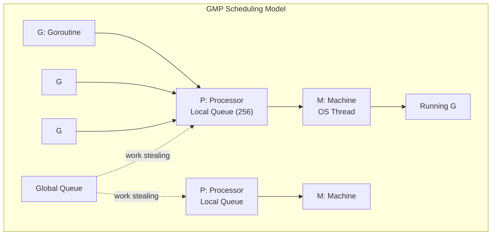
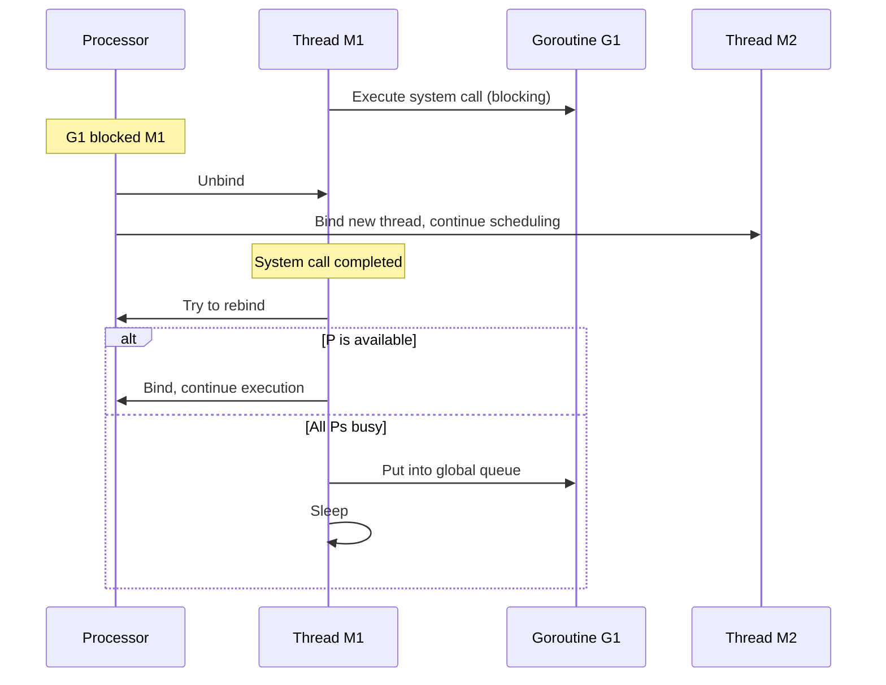

## Goroutine Scheduler: GMP Model

Go's concurrency is built on **Goroutines**—user-space lightweight threads with an initial stack of only 2KB (dynamically growable to 1GB). The scheduler uses the GMP model to manage Goroutine scheduling:



### Three Core Components

| Component | Responsibility | Count |
|-----------|---------------|-------|
| **G (Goroutine)** | Execution unit for user code, contains stack, instruction pointer, etc. | Created on demand |
| **M (Machine)** | OS thread that actually executes code | Created on demand, default limit 10000 |
| **P (Processor)** | Scheduling context, holds local run queue | GOMAXPROCS (default = CPU core count) |

### Scheduling Strategies

**1. Work Stealing**

When a P's local queue is empty, it steals half of the Gs from another P's local queue:

```go
// P1's local queue is empty
// → Try to fetch from global queue
// → Try to steal from other P
// → If nothing, unbind M from P, M goes to sleep
```

**2. Hand Off**

When a running G makes a system call that blocks M, P unbinds from M and finds or creates a new M to continue running other Gs in the local queue:



**3. Preemptive Scheduling**

Go 1.14 introduced signal-based asynchronous preemption, solving the problem in earlier versions where Goroutines could hold threads for extended periods (e.g., infinite loops).

## Channel Communication

Go's concurrency philosophy: **Don't communicate by sharing memory; share memory by communicating**. Channels are the core implementation of this philosophy.

### Channel Basics

```go
// Unbuffered channel: synchronous communication
ch := make(chan int)       // Send and receive must be ready simultaneously

// Buffered channel: asynchronous communication
ch := make(chan int, 100)  // Send blocks when buffer is full; receive blocks when buffer is empty

// Send and receive
ch <- 42         // Send
value := <-ch    // Receive

// Close channel
close(ch)        // Cannot send after closing, but can continue receiving until buffer is empty
```

### Channel Direction

```go
func producer(out chan<- int) {   // Write-only channel
    for i := 0; i < 10; i++ {
        out <- i
    }
    close(out)
}

func consumer(in <-chan int) {    // Read-only channel
    for v := range in {           // range automatically exits when channel is closed
        fmt.Println(v)
    }
}
```

### select Multiplexing

```go
select {
case msg := <-ch1:
    fmt.Println("received from ch1:", msg)
case msg := <-ch2:
    fmt.Println("received from ch2:", msg)
case ch3 <- 42:
    fmt.Println("sent to ch3")
case <-time.After(5 * time.Second):
    fmt.Println("timeout")
default:
    fmt.Println("no channel ready")  // Non-blocking mode
}
```

## sync Package

### Mutex and RWMutex

```go
var (
    mu    sync.RWMutex
    cache map[string]string
)

func Read(key string) string {
    mu.RLock()         // Read lock, multiple reads can proceed in parallel
    defer mu.RUnlock()
    return cache[key]
}

func Write(key, value string) {
    mu.Lock()          // Write lock, exclusive
    defer mu.Unlock()
    cache[key] = value
}
```

### WaitGroup

```go
var wg sync.WaitGroup

for i := 0; i < 5; i++ {
    wg.Add(1)
    go func(id int) {
        defer wg.Done()
        doWork(id)
    }(i)
}
wg.Wait()  // Wait for all goroutines to complete
```

### sync.Once

```go
var once sync.Once
var instance *Database

func GetDB() *Database {
    once.Do(func() {
        instance = &Database{}
        instance.Connect()
    })
    return instance
}
```

### sync.Pool

```go
var bufPool = sync.Pool{
    New: func() interface{} {
        return new(bytes.Buffer)
    },
}

func handler(w http.ResponseWriter, r *http.Request) {
    buf := bufPool.Get().(*bytes.Buffer)
    defer func() {
        buf.Reset()
        bufPool.Put(buf)   // Return after use
    }()
    // Use buf...
}
```

## Context Cancellation Propagation

Context is Go's standard mechanism for controlling Goroutine lifecycles, implementing cancellation propagation and timeout control:

```mermaid
flowchart TD
    A[context.Background] --> B[WithCancel]
    A --> C[WithTimeout 5s]
    B --> D[WithCancel<br/>Subtask 1]
    B --> E[Subtask 2]
    C --> F[WithDeadline<br/>Subtask 3]

    B -->|cancel()| G[Notify D, E to cancel]
    C -->|Timeout| H[Notify F to cancel]
```

```go
func fetchData(ctx context.Context, url string) ([]byte, error) {
    req, err := http.NewRequestWithContext(ctx, "GET", url, nil)
    if err != nil {
        return nil, err
    }
    resp, err := http.DefaultClient.Do(req)
    if err != nil {
        return nil, err  // When ctx is cancelled, Do returns context.Canceled
    }
    defer resp.Body.Close()
    return io.ReadAll(resp.Body)
}

func main() {
    // 5 second timeout
    ctx, cancel := context.WithTimeout(context.Background(), 5*time.Second)
    defer cancel()

    data, err := fetchData(ctx, "https://api.example.com/data")
    if err != nil {
        if errors.Is(err, context.DeadlineExceeded) {
            log.Println("Request timeout")
        }
        return
    }
    fmt.Println(data)
}
```

## Concurrency Patterns in Practice

### Fan-out / Fan-in

```go
func fanOutFanIn(ctx context.Context, input <-chan int, workerCount int) <-chan int {
    // Fan-out: launch multiple workers
    workers := make([]<-chan int, workerCount)
    for i := 0; i < workerCount; i++ {
        workers[i] = worker(ctx, input)
    }

    // Fan-in: merge all worker outputs
    return merge(ctx, workers...)
}

func worker(ctx context.Context, input <-chan int) <-chan int {
    out := make(chan int)
    go func() {
        defer close(out)
        for v := range input {
            select {
            case out <- process(v):
            case <-ctx.Done():
                return
            }
        }
    }()
    return out
}
```

### Pipeline Pattern

```go
// Generate → Filter → Aggregate
func generate(nums ...int) <-chan int {
    out := make(chan int)
    go func() {
        for _, n := range nums {
            out <- n
        }
        close(out)
    }()
    return out
}

func filter(ctx context.Context, in <-chan int, predicate func(int) bool) <-chan int {
    out := make(chan int)
    go func() {
        defer close(out)
        for n := range in {
            if predicate(n) {
                select {
                case out <- n:
                case <-ctx.Done():
                    return
                }
            }
        }
    }()
    return out
}
```

### Rate Limiter

```go
// Token bucket rate limiter
func rateLimiter(ctx context.Context, requests <-chan Request, rate time.Duration) <-chan Response {
    limiter := time.NewTicker(rate)
    defer limiter.Stop()

    out := make(chan Response)
    go func() {
        defer close(out)
        for req := range requests {
            select {
            case <-limiter.C:       // Token
                out <- handle(req)
            case <-ctx.Done():
                return
            }
        }
    }()
    return out
}
```

The essence of Go concurrency: connect Goroutines with Channels, control lifecycles with Context, and handle multiplexed events with select. Master these three primitives, and you can build any concurrency pattern.
