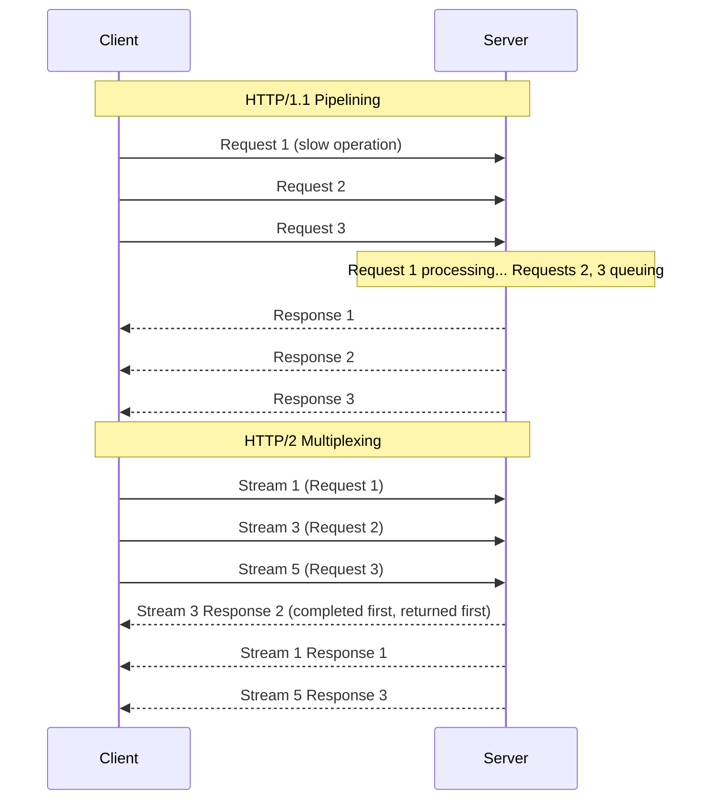
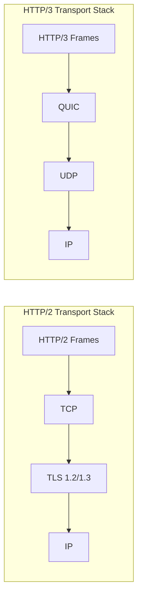
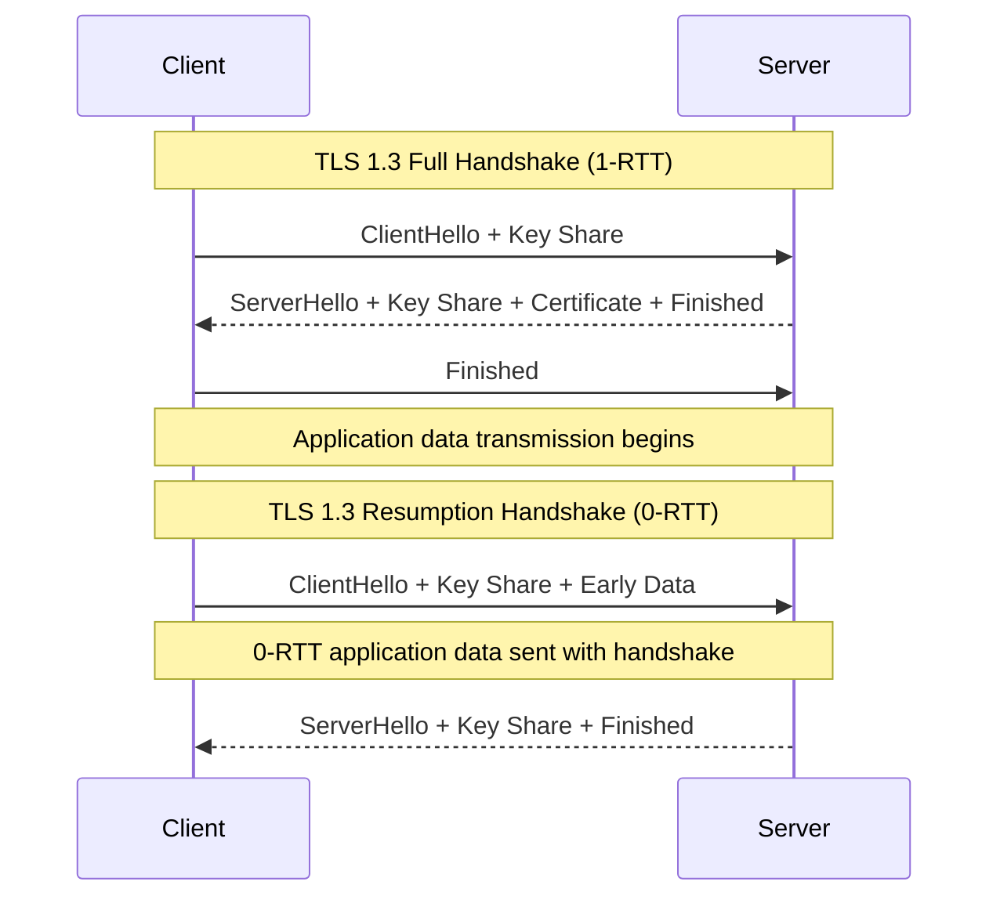
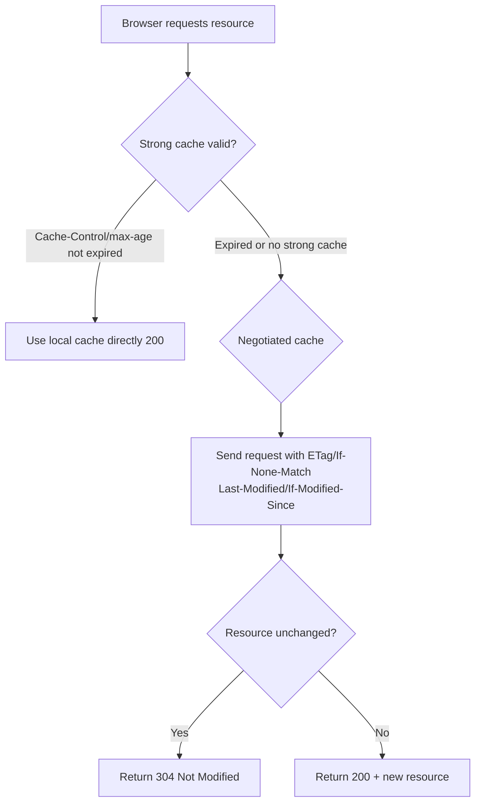

## HTTP Protocol Evolution

HTTP (HyperText Transfer Protocol) is the cornerstone of Web communication. From HTTP/1.0 to HTTP/3, the protocol has undergone three major upgrades, each addressing the core pain points of its predecessor:

| Version | Core Improvement | Problem Solved |
|---------|-----------------|----------------|
| HTTP/1.0 | Short connections | Basic communication |
| HTTP/1.1 | Persistent connections | Connection reuse |
| HTTP/2 | Multiplexing | Head-of-line blocking |
| HTTP/3 | QUIC transport | Transport layer blocking |

## HTTP/1.1: Persistent Connections and Head-of-Line Blocking

HTTP/1.1 introduced persistent connections with `Connection: keep-alive` as the default, allowing multiple requests to be sent over the same TCP connection. It also supports pipelining, where the next request can be sent without waiting for a response.

However, pipelining has a severe **Head-of-Line Blocking** problem: even if multiple requests are sent simultaneously, the server must still respond in order. If the first request is slow to process, subsequent requests must queue up and wait.



Browsers typically use a **multiple concurrent connections** strategy (Chrome allows up to 6 TCP connections per domain) to bypass head-of-line blocking, but this introduces connection overhead and resource waste.

## HTTP/2: Multiplexing and Header Compression

HTTP/2 introduced three core mechanisms at the application layer:

### 1. Binary Framing and Multiplexing

HTTP/2 splits requests and responses into smaller **frames** and interleaves them over a single TCP connection through **streams**:

- **Frame**: The smallest unit of communication, containing a frame header (type, length, stream identifier) and frame body
- **Message**: A complete request or response composed of multiple frames
- **Stream**: A bidirectional byte stream with a unique ID; frames from different streams can be interleaved

This design彻底 resolves application-layer head-of-line blocking—frames from different streams can be interleaved, so slow requests don't block fast ones.

### 2. HPACK Header Compression

HTTP/1.1 headers are plain text with a lot of repetition (e.g., Cookie, User-Agent), wasting bandwidth. HPACK compresses headers through two mechanisms:

- **Static table**: 61 predefined common header fields (e.g., `:method: GET` is index 2)
- **Dynamic table**: Connection-level shared cache of previously seen header key-value pairs
- **Huffman coding**: Compression of string values

In practice, HPACK can reduce header overhead by 80%+.

### 3. Server Push

The server can proactively push resources to the client without waiting for a request. Typical scenario: when the client requests `index.html`, the server simultaneously pushes `style.css` and `app.js`.

```http
PUSH_PROMISE :stream_id 2 :path /style.css
HEADERS :stream_id 2 :status 200
DATA :stream_id 2 <css content>
```

## HTTP/3: QUIC Protocol

While HTTP/2 resolved application-layer head-of-line blocking, the problem still exists at the TCP layer—a single lost TCP packet blocks the entire connection. HTTP/3 is based on the **QUIC (Quick UDP Internet Connections)** protocol, completely摆脱了 TCP's limitations:



Core advantages of QUIC:

- **Transport-layer multiplexing**: Each stream is independently delivered; packet loss in one stream doesn't affect others
- **0-RTT connection establishment**: First connection 1-RTT, subsequent connections can resume at 0-RTT
- **Connection migration**: Connections identified by Connection ID rather than four-tuple; switching from WiFi to 4G doesn't require reconnection
- **Built-in encryption**: QUIC mandates TLS 1.3; protocol handshake and encryption handshake are merged

## HTTPS and TLS Handshake

HTTPS = HTTP + TLS, encrypting data at the transport layer. The TLS 1.3 handshake has been significantly simplified:



TLS 1.3 improvements over 1.2:
- Handshake reduced from 2-RTT to 1-RTT
- Removed insecure cipher suites (e.g., RSA key exchange, CBC mode)
- Supports 0-RTT resumption for latency-sensitive scenarios

## Common Status Code Semantics

| Status Code | Meaning | Typical Scenario |
|-------------|---------|-----------------|
| 200 | OK | Request successful |
| 201 | Created | Resource created successfully |
| 204 | No Content | Successful but no response body (DELETE) |
| 301 | Moved Permanently | Permanent redirect, SEO authority transfer |
| 302 | Found | Temporary redirect |
| 304 | Not Modified | Cache hit, no transfer needed |
| 400 | Bad Request | Malformed request |
| 401 | Unauthorized | Not authenticated |
| 403 | Forbidden | Authenticated but no permission |
| 404 | Not Found | Resource does not exist |
| 409 | Conflict | Resource conflict |
| 429 | Too Many Requests | Rate limiting |
| 500 | Internal Server Error | Server internal error |
| 502 | Bad Gateway | Gateway upstream error |
| 503 | Service Unavailable | Service overloaded/maintenance |

## Cache Headers In Depth

HTTP caching is controlled through request/response headers, divided into strong caching and negotiated caching:



**Strong cache headers**:
- `Cache-Control: max-age=3600` — Resource valid for 3600 seconds
- `Cache-Control: no-cache` — Skip strong cache, use negotiated cache
- `Cache-Control: no-store` — No caching at all

**Negotiated cache headers**:
- `ETag` / `If-None-Match` — Content hash-based, precise but CPU-intensive
- `Last-Modified` / `If-Modified-Since` — Modification time-based, second-level precision

Practical advice: Use content-hashed filenames + long-term strong caching for static assets (JS/CSS/images); use `no-cache` with negotiated caching for HTML; set caching policies for API responses based on business semantics.
