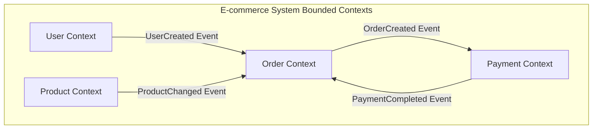
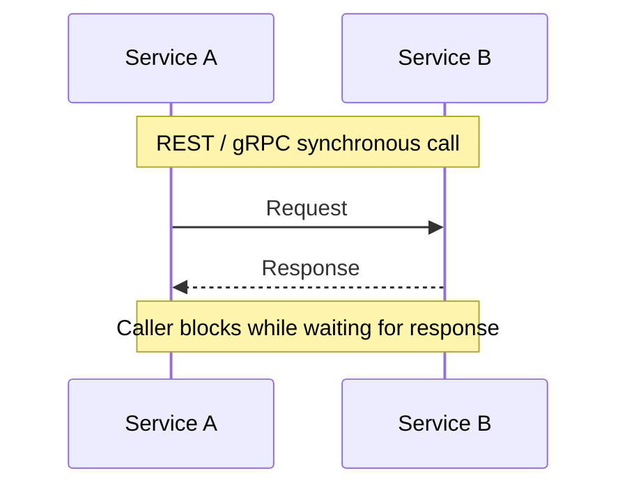
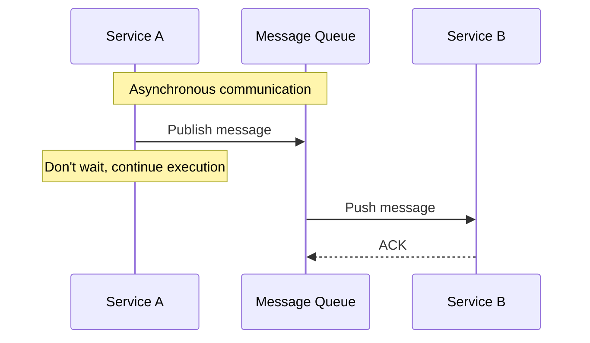
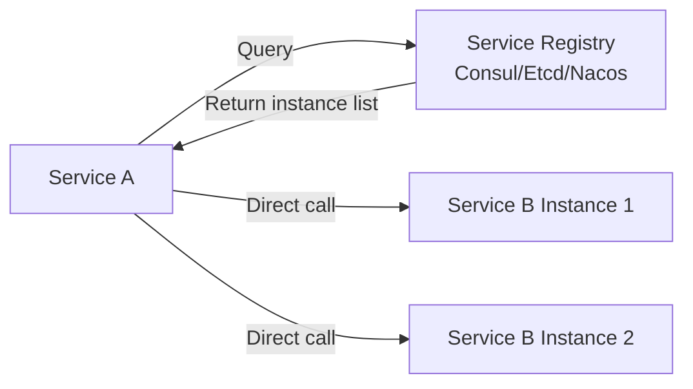
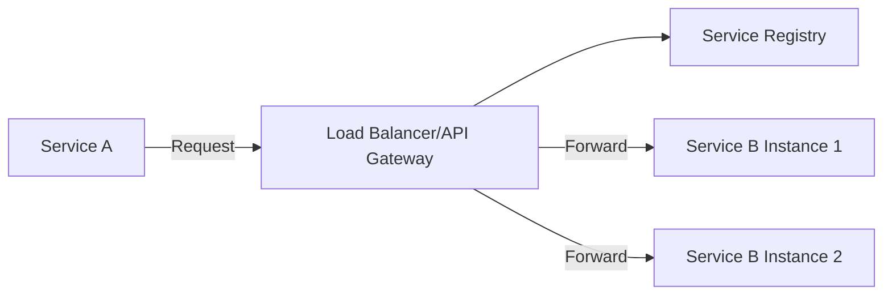
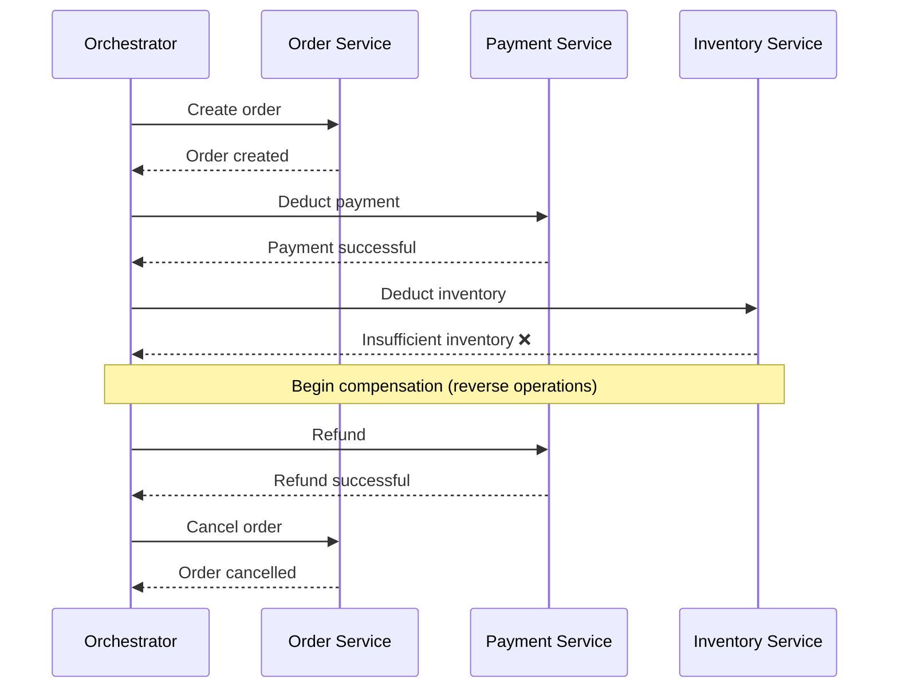
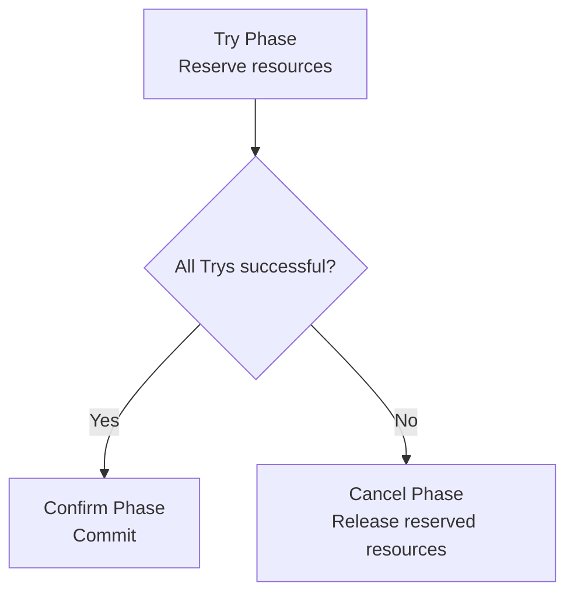
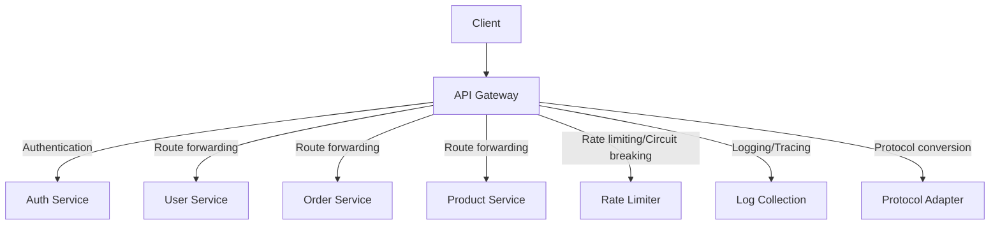

## From Monolith to Microservices

### When to Split

Microservices are not a silver bullet; the timing of splitting depends on the actual pain points of the business and team:

| Signal | Monolith Bottleneck | Microservice Advantage |
|--------|-------------------|----------------------|
| Team size | 10+ people modifying the same codebase, frequent merge conflicts | Independent repos, team autonomy |
| Deployment frequency | One line of change requires deploying the entire system | Independent deployment, no impact on other services |
| Fault isolation | One module's OOM crashes the entire system | Faults isolated within a single service |
| Technology selection | Unified tech stack, cannot optimize per scenario | Each service can choose the most suitable technology |
| Scaling needs | Scale the whole system, wasting resources | Scale independently as needed |

**Premature microservicification is a disaster**: it increases operational complexity, network latency, and data consistency challenges. Recommendation: start with a monolith and progressively split as the business grows.

### Domain-Driven Design (DDD)

DDD provides the methodology for microservice decomposition. Core concepts:

- **Bounded Context**: A boundary within a business domain where model meanings are unified. A microservice typically corresponds to one bounded context
- **Aggregate**: A group of objects that must maintain consistency, operated through the Aggregate Root
- **Domain Event**: The communication vehicle across bounded contexts



## Service Communication

### Synchronous Communication



| Protocol | Advantages | Disadvantages | Use Case |
|----------|-----------|--------------|----------|
| REST/HTTP | Simple, universal, rich ecosystem | Text protocol overhead | External APIs, simple internal calls |
| gRPC | Binary efficient, strongly typed, streaming | Hard to debug, no native browser support | Internal high-frequency calls, streaming scenarios |
| GraphQL | Client queries on demand | Complex implementation, N+1 problem | BFF layer aggregating multi-service data |

### Asynchronous Communication



- **Decoupling**: The sender doesn't need to know about the receiver's existence
- **Peak shaving**: Message queues buffer traffic spikes
- **Eventual consistency**: Event-driven approach ensures data eventually becomes consistent

## Service Discovery and Load Balancing

### Service Discovery Patterns

**Client-side discovery**: The client queries the service registry and selects instances itself:



**Server-side discovery**: The client requests a load balancer/gateway which forwards:



### Load Balancing Strategies

| Strategy | Characteristics | Use Case |
|----------|----------------|----------|
| Round Robin | Assign sequentially | Similar instance performance |
| Weighted Round Robin | Assign by weight | Different instance performance |
| Least Connections | Assign to instance with fewest current connections | Long connections, uneven request durations |
| Consistent Hashing | Same key routes to same instance | Stateful services, caching |
| Random | Random assignment | Simple scenarios |

## Distributed Transactions

In microservices, each service has its own database; cross-service transactions cannot be guaranteed with local transactions.

### Saga Pattern

Saga splits a long transaction into multiple local transactions, each with a corresponding compensating action:



Two orchestration approaches:
- **Choreography**: Services coordinate themselves through events with no central node. Simple but hard to trace
- **Orchestration**: A central orchestrator controls the flow. Clear but introduces a single point

### TCC (Try-Confirm-Cancel)



```go
// TCC example
func Transfer(ctx context.Context, from, to string, amount int) error {
    // Try: Freeze outgoing amount
    if err := account.TryFreeze(ctx, from, amount); err != nil {
        return err
    }
    // Try: Pre-add incoming amount
    if err := account.TryAdd(ctx, to, amount); err != nil {
        account.CancelFreeze(ctx, from, amount)  // Compensate
        return err
    }
    // Confirm: Confirm both operations
    account.ConfirmFreeze(ctx, from, amount)
    account.ConfirmAdd(ctx, to, amount)
    return nil
}
```

### Eventual Consistency

In most scenarios, eventual consistency is more practical than strong consistency:

1. Service A completes its local transaction and writes to an event table
2. A scheduled task reads the event table and publishes to the message queue
3. Service B consumes the event and executes its local transaction
4. On failure, retry until successful or human intervention is needed

## API Gateway

The API Gateway is the unified entry point for microservices to the outside world:



Core gateway responsibilities:

- **Routing**: Route external requests to corresponding services
- **Authentication**: Unified auth, backend services don't need to implement it repeatedly
- **Rate limiting**: Protect backend services from being overwhelmed by traffic
- **Circuit breaking**: Fast failure when downstream services are faulty
- **Protocol conversion**: Convert external REST to internal gRPC
- **Monitoring**: Unified request logging and distributed tracing

Common gateway solutions: Kong (Nginx-based), Envoy (cloud-native), APISIX (Apache Foundation), custom-built (Go-based).

The challenge of microservice architecture lies not in "splitting" but in post-split governance—service discovery, communication, transactions, and monitoring all require systematic design.
