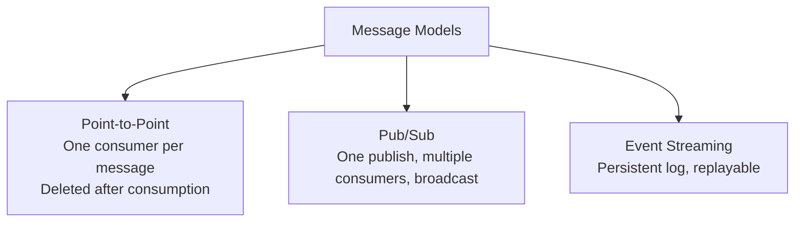
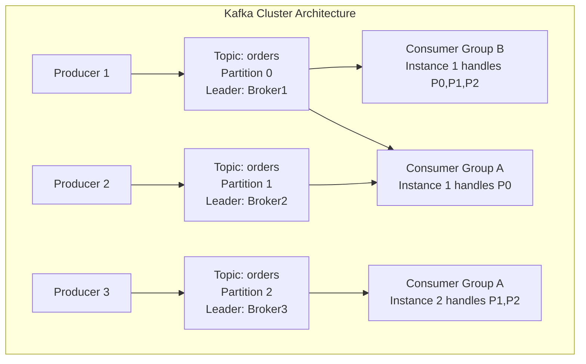
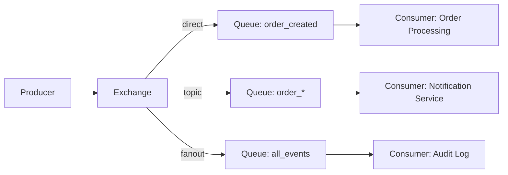
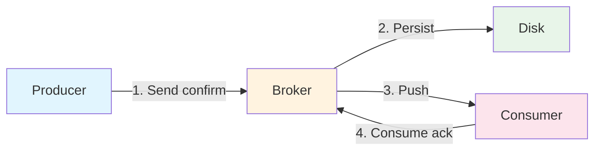
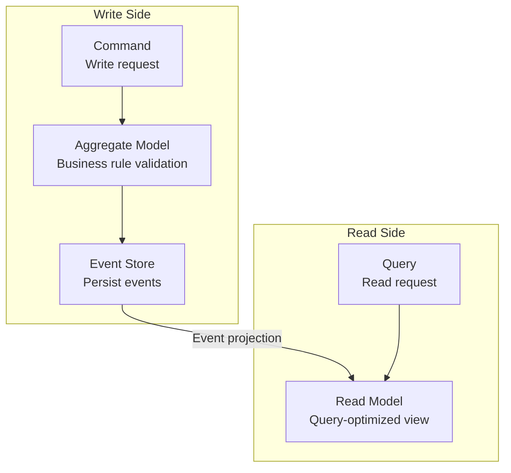

## Message Models

Message queues have three core models, each suitable for different business scenarios:



| Model | Representative | Consumption Semantics | Order Guarantee | Persistence |
|-------|---------------|----------------------|-----------------|-------------|
| Point-to-Point | RabbitMQ | One message processed by one consumer | Queue-level ordered | Can delete after acknowledgment |
| Pub/Sub | RabbitMQ Exchange | All subscribers receive | Each queue ordered | Per configuration |
| Event Streaming | Kafka | Consumer group competing, broadcast across groups | Strict per-partition order | Based on retention policy |

## Kafka Architecture

Kafka is a distributed event streaming platform with **append-only log** as its core design:



### Core Concepts

- **Topic**: Logical category, similar to a database table
- **Partition**: Physical shard of a Topic; each Partition is an ordered append log. Partition count determines maximum parallelism
- **Consumer Group**: Consumers within the same group share Partitions; groups consume independently
- **Offset**: Position of a message within a Partition; consumers control consumption progress via Offset

### Partitioning Strategies

```java
// Specify partition
producer.send(new ProducerRecord<>("orders", 0, key, value));

// Key-based hashing (same key goes to same partition, guaranteeing local ordering)
producer.send(new ProducerRecord<>("orders", orderId, orderData));

// No key: round-robin partitioning (load balanced, no order guarantee)
producer.send(new ProducerRecord<>("orders", orderData));

// Custom partitioner
public class RegionPartitioner implements Partitioner {
    public int partition(String topic, Object key, byte[] keyBytes,
                         Object value, byte[] valueBytes, Cluster cluster) {
        String region = ((Order) value).getRegion();
        return regionToPartition.get(region);
    }
}
```

### Consumer Rebalance

When consumers join or leave a group, Kafka triggers a Rebalance to reassign Partitions. This is a major pain point—consumers cannot consume during Rebalance:

```
Consumer Group A (3 instances, 6 partitions):
Instance1: [P0, P1]    →  Instance1: [P0, P1]     (Instance2 goes offline)
Instance2: [P2, P3]    →  Instance3: [P2, P3, P4]  (takes over Instance2's partitions)
Instance3: [P4, P5]    →  (New)Instance4: [P5]       (new instance joins)
```

**Avoiding frequent Rebalances**:
- `session.timeout.ms` (default 10s) and `heartbeat.interval.ms` (default 3s) should be configured properly
- `max.poll.interval.ms` (default 5 min) should be greater than the longest processing time
- Use **CooperativeStickyAssignor** to avoid "Stop-The-World" style Rebalances

## RabbitMQ Working Modes

RabbitMQ is based on the AMQP protocol, supporting various working modes through flexible combinations of Exchanges and Queues:



| Exchange Type | Routing Rules | Example |
|--------------|--------------|---------|
| direct | Exact routing key match | `order.created` → order processing queue |
| topic | Pattern match (`*` one word, `#` zero or more words) | `order.*` → matches order.created, order.cancelled |
| fanout | Broadcast to all bound queues | All consumers receive |
| headers | Match based on message headers | Rarely used |

### Dead Letter Queue

Messages that are rejected, expired, or land in a full queue enter the dead letter queue for exception handling and retry:

```python
# Declare dead letter exchange
channel.exchange_declare('dlx.exchange', exchange_type='direct')
channel.queue_declare('dlq.orders')

# Bind dead letter to main queue
channel.queue_declare(
    'orders',
    arguments={
        'x-dead-letter-exchange': 'dlx.exchange',
        'x-dead-letter-routing-key': 'dlq.orders',
        'x-message-ttl': 3600000,  # 1 hour expiration
    }
)
```

## Reliability Guarantees

From production to consumption, messages can be lost at every stage:



### Producer Confirmation

```java
// Kafka: acks confirmation level
props.put("acks", "all");  // Wait for all ISR replicas to confirm, safest but slowest
props.put("acks", "1");    // Wait only for Leader confirmation (default)
props.put("acks", "0");    // Don't wait, fastest but may lose messages

// RabbitMQ: Publisher Confirms
channel.confirmSelect();  // Enable confirm mode
channel.basicPublish(...);
channel.waitForConfirms(5000);  // Wait for Broker confirmation
```

### Consumer Idempotency

Network jitter may cause duplicate message delivery; consumers must guarantee idempotency:

```go
func processOrder(msg OrderMessage) error {
    // Approach 1: Unique constraint (database deduplication)
    _, err := db.Exec(
        "INSERT INTO processed_messages (id) VALUES (?) ON CONFLICT DO NOTHING",
        msg.MessageID,
    )
    if err != nil {
        return err
    }

    // Approach 2: Redis deduplication
    ok, _ := redis.SetNX(ctx, "msg:"+msg.MessageID, "1", 24*time.Hour).Result()
    if !ok {
        return nil  // Already processed, skip
    }

    // Execute business logic
    return orderService.Process(msg)
}
```

## Event-Driven Architecture

### CQRS (Command Query Responsibility Segregation)

CQRS separates read and write operations: writes go through the command model, reads go through the query model:



### Event Sourcing

Traditional approaches store only the current state; Event Sourcing stores all state-change events:

```go
// Traditional: Store only current state
// UPDATE accounts SET balance = 80 WHERE id = 'acc_1';

// Event Sourcing: Store event sequence
// INSERT INTO events (aggregate_id, type, data) VALUES
//   ('acc_1', 'AccountCreated', '{"initial": 100}'),
//   ('acc_1', 'MoneyWithdrawn', '{"amount": 20}');

// Rebuild current state: replay all events
func (a *Account) Apply(events []Event) {
    for _, e := range events {
        switch e.Type {
        case "AccountCreated":
            a.Balance = e.Data["initial"].(int)
        case "MoneyWithdrawn":
            a.Balance -= e.Data["amount"].(int)
        }
    }
}
```

Event Sourcing advantages: complete audit trail, time-travel debugging, naturally supports event-driven. Disadvantages: event store bloat, query complexity, eventual consistency.

Message queues and event-driven architecture are the foundation of microservice communication—choosing the right message model and reliability guarantee strategy is key to building robust distributed systems.
