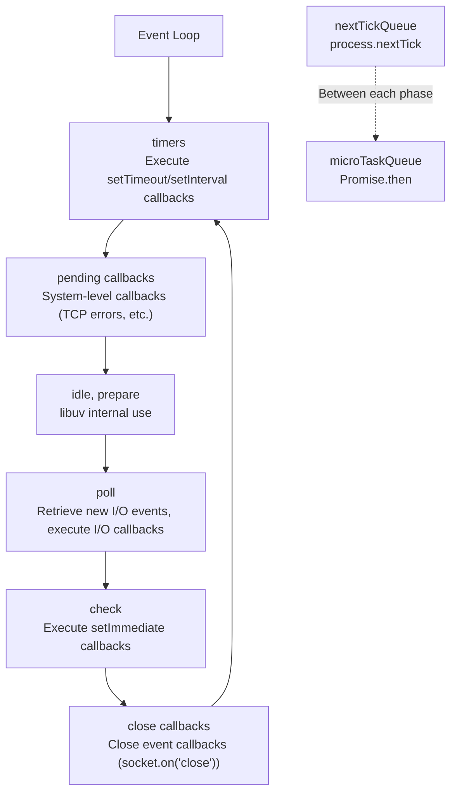
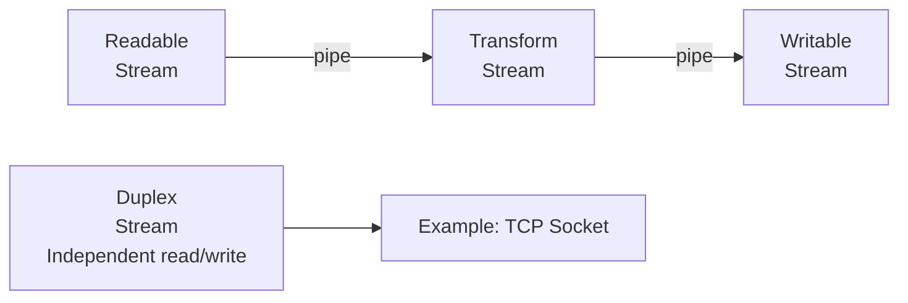

## V8 Engine and libuv Event Loop

Node.js consists of two core components: the **V8 engine** handles JavaScript compilation and execution, while the **libuv** library handles cross-platform asynchronous I/O. They are connected through Node.js's C++ binding layer.

The event loop is the heart of Node.js, dividing operations into 6 phases, each maintaining a callback queue:



### Six Phases In Detail

| Phase | Execution Content | Typical API |
|-------|------------------|-------------|
| timers | Expired timer callbacks | `setTimeout`, `setInterval` |
| pending callbacks | System operation callbacks | TCP connection error callbacks |
| idle, prepare | libuv internal | — |
| poll | I/O events and callbacks | File read, network request completion callbacks |
| check | Immediately executed callbacks | `setImmediate` |
| close callbacks | Close events | `socket.destroy()` callbacks |

**Key details**:

- `process.nextTick` is not in any event loop phase; it executes between phases and takes priority over the microtask queue
- `setImmediate` executes after the poll phase, while `setTimeout(0)` executes in the timers phase, but their order is non-deterministic in non-I/O contexts
- If the poll queue is empty: proceed to check phase if there's a `setImmediate`; wait for timers if there are scheduled timers; otherwise block and wait for I/O

## Module System

### CommonJS Loading Mechanism

```javascript
// Export
module.exports = { add, subtract };
// Or
exports.add = function(a, b) { return a + b; };

// Import
const math = require('./math');
```

CommonJS loading is **synchronous**. When `require()` executes, it:

1. Resolves the module path to an absolute path
2. Checks the cache (`require.cache`); returns `module.exports` if already loaded
3. If not cached, creates a `module` object and executes the module code
4. Caches and returns `module.exports`

This means CommonJS modules support **conditional loading** and **dynamic loading**:

```javascript
if (process.env.NODE_ENV === 'production') {
  const monitoring = require('./monitoring');  // Conditional loading
}
```

### ESM (ECMAScript Modules)

```javascript
// Export
export function add(a, b) { return a + b; }
export default class Calculator {}

// Import
import Calculator, { add } from './math.js';
```

Key differences between ESM and CommonJS:

| Feature | CommonJS | ESM |
|---------|----------|-----|
| Loading | Runtime synchronous loading | Compile-time static analysis |
| Export value | Copy of the value | Live binding (reference) |
| Top-level this | `module.exports` | `undefined` |
| Circular dependency | Snapshot of executed portion | Reference, may be uninitialized |
| Tree-shaking | Not supported | Supported |

```javascript
// CJS: Value copy
// counter.js
let count = 0;
module.exports = { count, increment: () => ++count };

// main.js
const { count, increment } = require('./counter');
console.log(count);      // 0
increment();
console.log(count);      // 0 — count is a copy, won't update

// ESM: Live binding
// counter.mjs
export let count = 0;
export function increment() { ++count; }

// main.mjs
import { count, increment } from './counter.mjs';
console.log(count);      // 0
increment();
console.log(count);      // 1 — count is a live binding, updated in real-time
```

## Stream Processing

Streams are Node.js's core abstraction for handling large data, transmitting data in chunks rather than loading everything into memory at once:



Four stream types:
- **Readable**: Readable stream (`fs.createReadStream`, HTTP request body)
- **Writable**: Writable stream (`fs.createWriteStream`, HTTP response body)
- **Duplex**: Duplex stream with independent read/write (TCP Socket)
- **Transform**: Transform stream that modifies data passing through (`zlib.createGzip`)

### Backpressure Mechanism

When the producer speed > consumer speed, data accumulates in memory. The backpressure mechanism uses feedback signals to pause the producer:

```javascript
const fs = require('fs');
const zlib = require('zlib');

// ❌ Not handling backpressure
readable.on('data', (chunk) => {
  writable.write(chunk);  // Internal buffer may overflow
});

// ✅ pipe automatically handles backpressure
fs.createReadStream('bigfile.txt')
  .pipe(zlib.createGzip())
  .pipe(fs.createWriteStream('bigfile.txt.gz'));

// ✅ Manual backpressure handling
const source = fs.createReadStream('bigfile.txt');
const dest = fs.createWriteStream('copy.txt');

source.on('data', (chunk) => {
  const canContinue = dest.write(chunk);
  if (!canContinue) {
    source.pause();  // Write buffer full, pause reading
  }
});

dest.on('drain', () => {
  source.resume();   // Buffer drained, resume reading
});
```

## Cluster and Worker Threads

### Cluster: Multiple Processes

Cluster leverages multi-core CPUs; the master process listens on the port and distributes connections to worker processes via IPC:

```javascript
const cluster = require('cluster');
const http = require('http');
const numCPUs = require('os').cpus().length;

if (cluster.isPrimary) {
  for (let i = 0; i < numCPUs; i++) {
    cluster.fork();
  }
  cluster.on('exit', (worker) => {
    console.log(`Worker ${worker.process.pid} died`);
    cluster.fork();  // Auto-restart
  });
} else {
  http.createServer((req, res) => {
    res.writeHead(200);
    res.end('Hello from worker ' + process.pid);
  }).listen(3000);
}
```

### Worker Threads: Multiple Threads

Worker Threads share process memory, suitable for CPU-intensive tasks:

```javascript
const { Worker, isMainThread, parentPort, SharedArrayBuffer } = require('worker_threads');

if (isMainThread) {
  const worker = new Worker(__filename);
  worker.on('message', (result) => console.log('Result:', result));
  worker.postMessage({ data: 'compute this' });
} else {
  parentPort.on('message', (msg) => {
    const result = heavyComputation(msg.data);
    parentPort.postMessage(result);
  });
}
```

| Feature | Cluster | Worker Threads |
|---------|---------|---------------|
| Isolation | Process-level isolation | Thread-level, shared memory |
| Communication | IPC (serialization) | MessagePort / SharedArrayBuffer |
| Use case | HTTP service multi-core scaling | CPU-intensive computation |
| Memory overhead | Each process has independent V8 instance | Shares main process V8 |

## Memory Management

V8's garbage collection is based on generational collection:

- **Young Generation**: Stores short-lived objects; uses Scavenge (semi-space copy) algorithm; frequent but fast GC
- **Old Generation**: Stores long-lived objects; uses Mark-Sweep / Mark-Compact; less frequent but longer pause times

Common memory leak scenarios:

```javascript
// 1. Closure references
function createLeak() {
  const bigData = new Array(1000000);
  return function() {
    return bigData.length;  // bigData cannot be garbage collected
  };
}

// 2. Global variables
function handler(req, res) {
  leakedData = req.body;  // Forgot var/let/const
}

// 3. Event listeners not removed
emitter.on('event', callback);
// Forgot emitter.removeListener('event', callback);

// 4. Unbounded cache growth
const cache = new Map();
app.get('/data/:id', (req, res) => {
  if (!cache.has(req.params.id)) {
    cache.set(req.params.id, fetchData(req.params.id));  // Only grows, never shrinks
  }
  res.json(cache.get(req.params.id));
});
```

Debugging tools: `process.memoryUsage()` to view heap memory usage, `--inspect` with Chrome DevTools for heap snapshot comparison, `node --max-old-space-size=4096` to adjust old generation limit.
