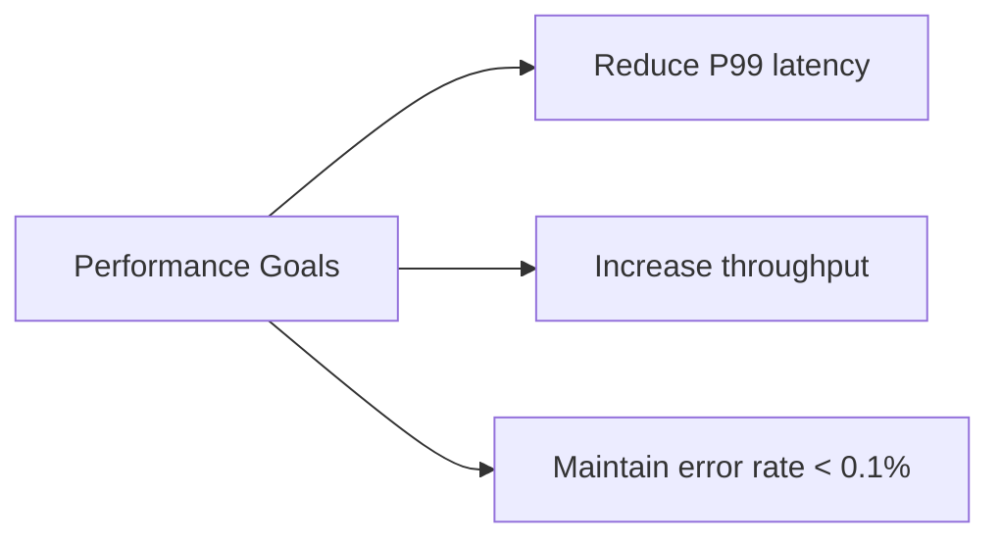
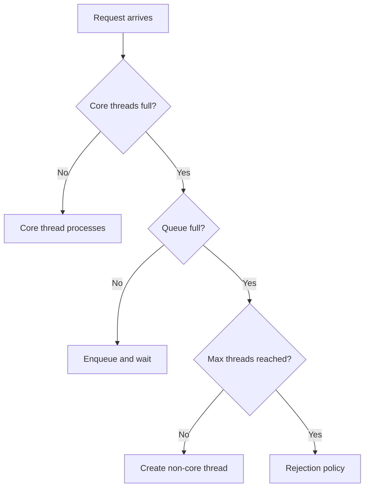
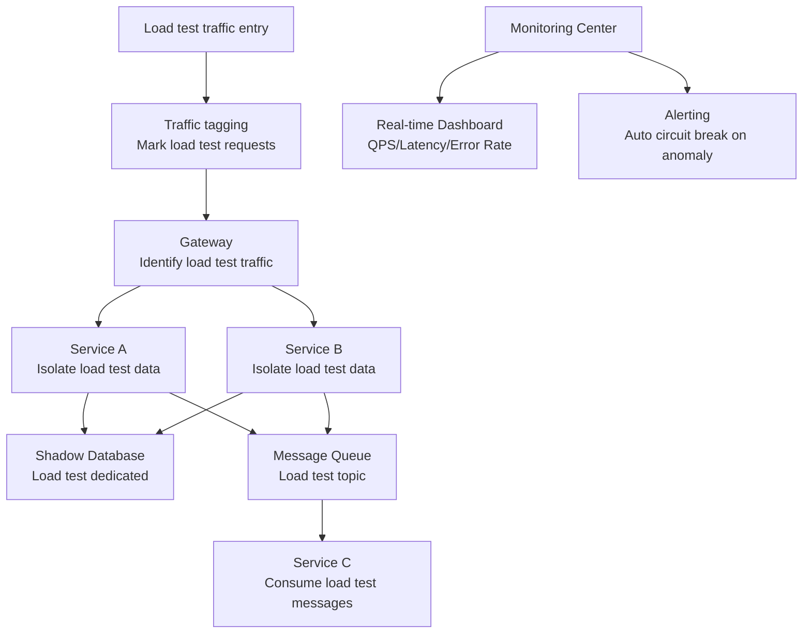
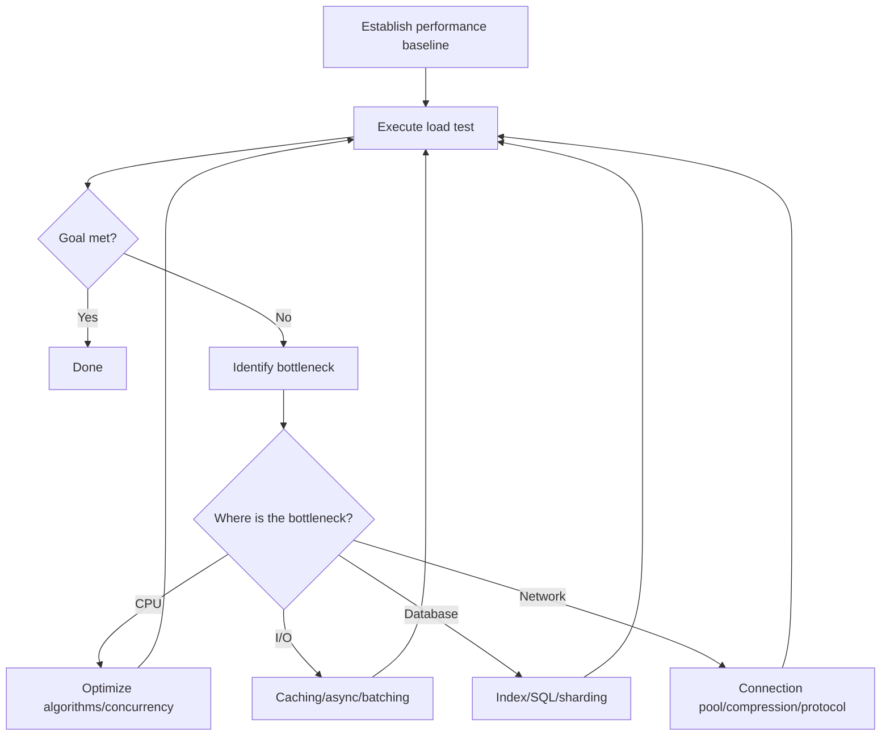

## Performance Metrics

Backend performance tuning starts with defining measurement standards:

| Metric | Meaning | Focus |
|--------|---------|-------|
| Throughput (QPS/TPS) | Requests/transactions per second | System capacity ceiling |
| Latency | Time from request to response | User experience |
| P50/P90/P99 | 50th/90th/99th percentile latency | Tail latency |
| Concurrency | Simultaneously processed requests | Resource utilization |
| Error rate | Percentage of failed requests | System stability |

**Why look at P99 instead of averages?** Suppose 99 out of 100 requests take 10ms and 1 takes 10s. The average is 109ms, which seems acceptable, but P99 is 10s—meaning 1% of users have a terrible experience. Averages mask tail problems.



## Load Testing Tools

### wrk

```bash
# Basic load test: 12 threads, 400 connections, 30 seconds
wrk -t12 -c400 -d30s http://localhost:8080/api/users

# With latency distribution
wrk -t12 -c400 -d30s --latency http://localhost:8080/api/users

# Output example
#   Latency   P50=3.21ms  P90=5.43ms  P99=12.87ms
#   Requests/sec: 124532.11
#   Transfer/sec: 45.67MB
```

### wrk2 (Constant Throughput Load Testing)

```bash
# Constant 1000 QPS, observe how latency changes with load
wrk2 -t4 -c100 -d30s -R1000 http://localhost:8080/api/users
```

### k6

```javascript
// k6 script: progressive load
import http from 'k6/http';
import { check } from 'k6';

export const options = {
  stages: [
    { duration: '2m', target: 100 },   // Ramp up to 100 VU in 2 minutes
    { duration: '5m', target: 100 },   // Steady for 5 minutes
    { duration: '2m', target: 500 },   // Ramp up to 500 VU
    { duration: '5m', target: 500 },   // Steady for 5 minutes
    { duration: '2m', target: 0 },     // Ramp down
  ],
  thresholds: {
    http_req_duration: ['p(99)<500'],   // P99 < 500ms
    http_req_failed: ['rate<0.01'],     // Error rate < 1%
  },
};

export default function () {
  const res = http.get('http://localhost:8080/api/users');
  check(res, { 'status is 200': (r) => r.status === 200 });
}
```

## Database Optimization

### Slow Query Management

```sql
-- MySQL enable slow query log
SET GLOBAL slow_query_log = ON;
SET GLOBAL long_query_time = 0.1;  -- Log queries over 100ms
SET GLOBAL log_queries_not_using_indexes = ON;

-- Analyze slow queries
EXPLAIN ANALYZE SELECT u.name, COUNT(o.id)
FROM users u
JOIN orders o ON u.id = o.user_id
WHERE u.created_at > '2024-01-01'
GROUP BY u.name;
```

Common optimization paths:

| Problem | Optimization | Expected Effect |
|---------|-------------|----------------|
| Full table scan | Add appropriate index | 99%+ row reduction |
| Excessive bookmark lookups | Covering index | Avoid 50%+ random I/O |
| Temporary table sorting | Optimize ORDER BY index | Eliminate filesort |
| Excessive JOINs | Denormalization/redundant fields | Reduce JOIN depth |
| Deep pagination | Cursor-based pagination | Avoid scanning first N rows |

```sql
-- ❌ OFFSET deep pagination (scans 100010 rows, discards first 100000)
SELECT * FROM orders ORDER BY id LIMIT 10 OFFSET 100000;

-- ✅ Cursor-based pagination (scans only 10 rows)
SELECT * FROM orders WHERE id > 100000 ORDER BY id LIMIT 10;
```

### Connection Pool Tuning

```yaml
# HikariCP recommended configuration
maximumPoolSize: 20          # Formula: (core count * 2) + effective disk count
minimumIdle: 5               # Minimum idle connections
connectionTimeout: 3000      # Connection acquisition timeout 3s
idleTimeout: 600000          # Max idle connection lifetime 10 minutes
maxLifetime: 1800000         # Max connection lifetime 30 minutes
leakDetectionThreshold: 60000  # Connection leak detection 60s
```

## Connection and Thread Pool Tuning

### Thread Pool Configuration



```java
// Thread pool configuration (I/O-intensive example)
ThreadPoolExecutor executor = new ThreadPoolExecutor(
    16,                              // Core thread count
    64,                              // Max thread count
    60, TimeUnit.SECONDS,            // Non-core thread idle keepalive time
    new LinkedBlockingQueue<>(1000), // Task queue
    new ThreadPoolExecutor.CallerRunsPolicy()  // Caller thread executes when queue is full
);

// CPU-intensive: core threads ≈ CPU core count + 1
// I/O-intensive: core threads ≈ CPU core count * (1 + wait time/compute time)
```

### Rejection Policy Selection

| Policy | Behavior | Use Case |
|--------|----------|----------|
| AbortPolicy | Throw exception | Default, need to sense overload |
| CallerRunsPolicy | Caller thread executes | Slow down but don't discard |
| DiscardOldestPolicy | Discard oldest task | Acceptable to lose tasks |
| DiscardPolicy | Silently discard | Acceptable to lose tasks |

### HTTP Connection Pool

```go
// Go HTTP client tuning
transport := &http.Transport{
    MaxIdleConns:        100,              // Global max idle connections
    MaxIdleConnsPerHost: 20,               // Max idle connections per host
    MaxConnsPerHost:     50,               // Max connections per host
    IdleConnTimeout:     90 * time.Second, // Idle connection timeout
    DialContext: (&net.Dialer{
        Timeout:   5 * time.Second,        // Connection timeout
        KeepAlive: 30 * time.Second,       // TCP keepalive
    }).DialContext,
    TLSHandshakeTimeout:   5 * time.Second,
    ResponseHeaderTimeout: 10 * time.Second,
}
client := &http.Client{Transport: transport, Timeout: 30 * time.Second}
```

## Full-Chain Load Testing and Capacity Planning

### Full-Chain Load Testing Architecture



### Four-Step Capacity Planning

**1. Define Goals**

```
Business goal: Peak 10000 QPS during promotion, P99 < 500ms, error rate < 0.1%
```

**2. Baseline Testing**

```
Single instance baseline: 2000 QPS per instance, P99 = 200ms
```

**3. Calculate Capacity**

```
Required instances = Target QPS / Single instance QPS × Safety factor
                   = 10000 / 2000 × 1.5
                   = 8 instances
```

**4. Validate and Tune**

```
Step load test:
  4 instances → 4000 QPS → P99 = 350ms ✅
  6 instances → 6000 QPS → P99 = 420ms ✅
  8 instances → 8000 QPS → P99 = 480ms ⚠️  Approaching target
  10 instances → 10000 QPS → P99 = 460ms ✅ Goal met

Bottleneck identified: Database connection pool queuing → Increase connection count → 8 instances sufficient
```

### Performance Tuning Process



### Common Tuning Methods by Priority

| Priority | Method | Effect | Cost |
|----------|--------|--------|------|
| 1 | Add caching | 10-100x | Low |
| 2 | Optimize indexes/SQL | 5-50x | Low |
| 3 | Asynchronous processing | 2-10x | Medium |
| 4 | Batch processing | 3-10x | Medium |
| 5 | Connection pool tuning | 2-5x | Low |
| 6 | Algorithm optimization | Varies | High |
| 7 | Horizontal scaling | Linear | High (cost) |

The core principle of performance tuning: **Measure first, then optimize**. Let data speak; don't optimize based on intuition. Change only one variable at a time, confirm the effect, then proceed to the next step.
