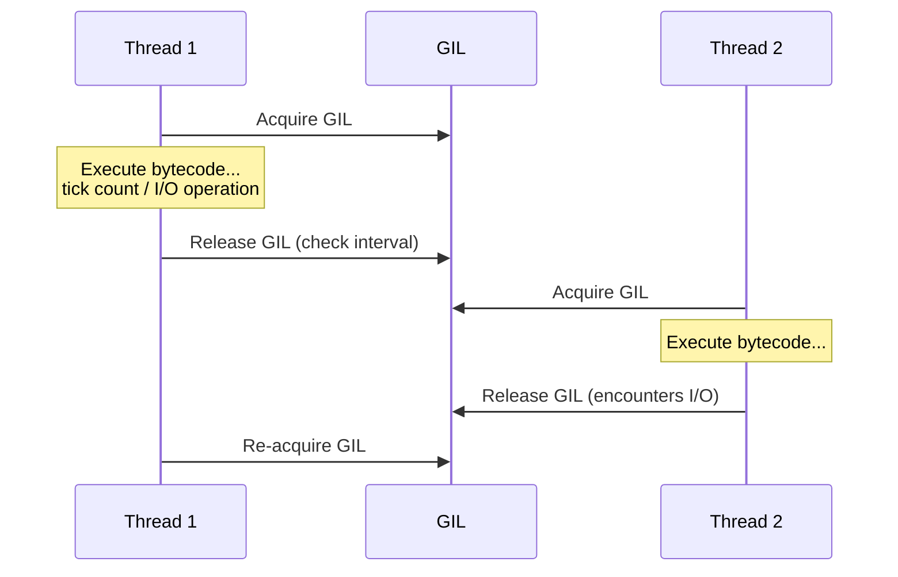
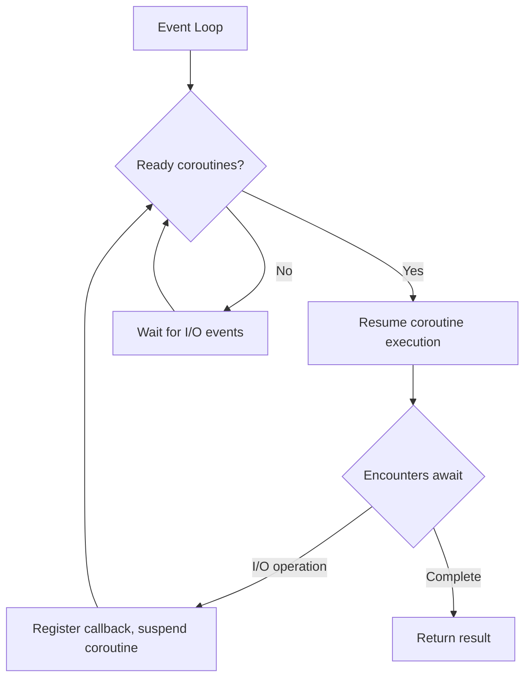

## CPython Interpreter

CPython is the reference implementation of Python. The code execution flow is: source code → bytecode → virtual machine execution.

### Bytecode Compilation and Execution

```python
import dis

def add(a, b):
    return a + b

dis.dis(add)
# Output:
#  2           0 LOAD_FAST                0 (a)
#              2 LOAD_FAST                1 (b)
#              4 BINARY_ADD
#              6 RETURN_VALUE
```

The core of CPython's execution loop is the **eval_frame** function, which takes bytecode instructions one by one and executes them. Each instruction corresponds to a C function implementation (e.g., `BINARY_ADD` calls `PyNumber_Add`).

**Performance key point**: Python's dynamic typing means every operation requires runtime type checking and dispatch. `a + b` at the C level requires: check `a`'s type → look up `__add__` → call → check result → return. This is the fundamental reason Python is 50-100x slower than C.

## GIL Mechanism

The Global Interpreter Lock (GIL) is CPython's most controversial design. It ensures that only one thread executes Python bytecode at any given time:



### Why the GIL Exists

CPython's memory management (reference counting) is not thread-safe. Without the GIL, two threads simultaneously modifying the same object's reference count could lead to memory leaks or premature deallocation. The GIL is the simplest solution—one lock to protect all objects.

### GIL's Impact on Multithreading

```python
import threading
import time

# CPU-intensive: multithreading cannot parallelize
def cpu_bound():
    total = 0
    for i in range(50_000_000):
        total += i

start = time.time()
t1 = threading.Thread(target=cpu_bound)
t2 = threading.Thread(target=cpu_bound)
t1.start(); t2.start()
t1.join(); t2.join()
print(f"Multithreaded: {time.time() - start:.2f}s")  # May be slower than single-threaded

# I/O-intensive: multithreading works
def io_bound():
    import urllib.request
    urllib.request.urlopen("https://httpbin.org/delay/1").read()
```

### Ways to Bypass the GIL

| Approach | Use Case | Example |
|----------|----------|---------|
| Multiprocessing | CPU-intensive | `multiprocessing.Pool` |
| C extensions releasing GIL | Computation-heavy libraries | NumPy, Pandas |
| `asyncio` | I/O-intensive | Async HTTP/database |
| Subprocess calls | Integrating external programs | `subprocess.run()` |

```python
from multiprocessing import Pool

def cpu_bound(n):
    return sum(i * i for i in range(n))

if __name__ == '__main__':
    with Pool(4) as p:
        results = p.map(cpu_bound, [50_000_000] * 4)  # True parallelism
```

## Async IO: asyncio

asyncio is Python's asynchronous I/O framework, implementing single-threaded concurrency based on **coroutines** and an **event loop**:



### Coroutine Scheduling

```python
import asyncio

async def fetch_data(url, delay):
    print(f"Starting request {url}")
    await asyncio.sleep(delay)  # Simulate I/O, yield control to event loop
    print(f"Completed request {url}")
    return f"data from {url}"

async def main():
    # Execute three requests concurrently, total time ≈ max(1, 2, 3) = 3s
    results = await asyncio.gather(
        fetch_data("api-1", 1),
        fetch_data("api-2", 2),
        fetch_data("api-3", 3),
    )
    print(results)

asyncio.run(main())
```

### Async Context Managers and Iterators

```python
# Async context manager (database connection pool)
class AsyncPool:
    async def __aenter__(self):
        self.conn = await create_connection()
        return self.conn

    async def __aexit__(self, *exc):
        await self.conn.close()

async def query():
    async with AsyncPool() as conn:
        result = await conn.execute("SELECT * FROM users")
        async for row in result:  # Async iteration
            print(row)
```

### Combining asyncio with Threads/Processes

```python
# Calling blocking I/O in async code
async def main():
    loop = asyncio.get_event_loop()

    # Run blocking function in thread pool
    result = await loop.run_in_executor(None, blocking_db_query, "SELECT 1")

    # Use process pool for CPU-intensive work
    from concurrent.futures import ProcessPoolExecutor
    with ProcessPoolExecutor() as pool:
        result = await loop.run_in_executor(pool, cpu_heavy_task, data)
```

## Type System

Python 3.5+ introduced type annotations (Type Hints), combined with mypy for static type checking:

```python
from typing import Optional, Union, Literal, TypedDict, Protocol

# Basic types
def greet(name: str, times: int = 1) -> str:
    return (f"Hello, {name}! ") * times

# Optional and union types
def find_user(user_id: int) -> Optional[dict]:
    ...  # Returns dict or None

# Literal type
def set_mode(mode: Literal["debug", "production"]) -> None:
    ...

# TypedDict
class UserInfo(TypedDict):
    name: str
    age: int
    email: Optional[str]

# Protocol (structural subtyping)
class Closeable(Protocol):
    def close(self) -> None: ...

def cleanup(resource: Closeable) -> None:
    resource.close()  # Any object with a close() method works
```

## FastAPI Framework

FastAPI is the most popular backend framework in the Python ecosystem, built on Starlette (ASGI) and Pydantic (data validation):

```python
from fastapi import FastAPI, HTTPException, Depends
from pydantic import BaseModel, Field
from typing import Optional

app = FastAPI(title="User Service API")

class UserCreate(BaseModel):
    name: str = Field(..., min_length=2, max_length=50)
    email: str = Field(..., pattern=r"^[\w.-]+@[\w.-]+\.\w+$")
    age: Optional[int] = Field(None, ge=0, le=150)

class UserResponse(BaseModel):
    id: int
    name: str
    email: str

@app.post("/users", response_model=UserResponse, status_code=201)
async def create_user(user: UserCreate):
    # Pydantic automatically validates request body; returns 422 + detailed error on failure
    db_user = await db.create(user.dict())
    return db_user

@app.get("/users/{user_id}", response_model=UserResponse)
async def get_user(user_id: int):
    user = await db.get(user_id)
    if not user:
        raise HTTPException(status_code=404, detail="User not found")
    return user
```

FastAPI's core advantages:

- **Auto OpenAPI docs**: Type annotations automatically generate Swagger UI / ReDoc
- **Request validation**: Pydantic validates based on types automatically, with error messages precise to the field level
- **Async native**: `async def` uses the async path automatically; `def` is automatically placed in a thread pool
- **Dependency injection**: `Depends()` enables elegant shared logic for authentication, database sessions, etc.

```python
# Dependency injection example
async def get_current_user(token: str = Depends(oauth2_scheme)):
    user = await decode_token(token)
    if not user:
        raise HTTPException(401)
    return user

@app.get("/me")
async def read_me(user: User = Depends(get_current_user)):
    return user
```
