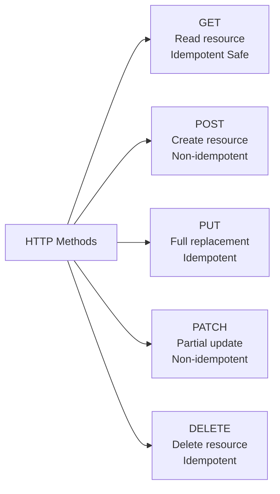
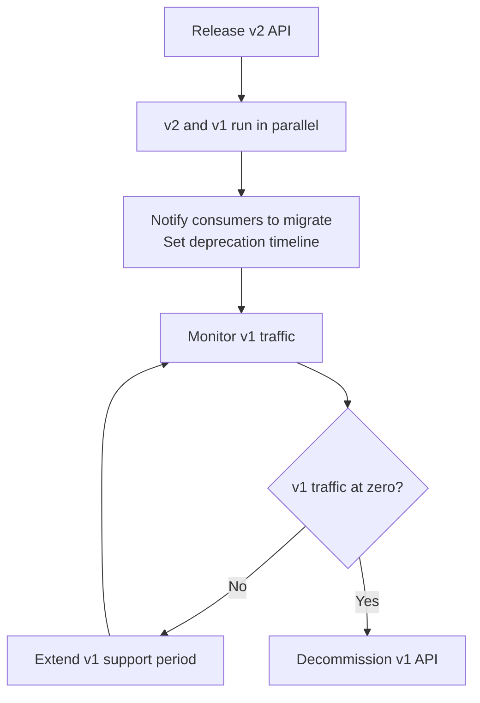
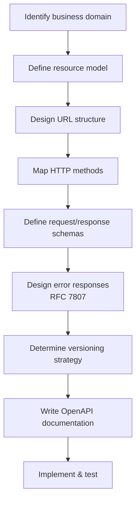

## REST Architecture Constraints

REST (Representational State Transfer) is an architectural style proposed by Roy Fielding in 2000. It defines six core constraints:

1. **Client-Server**: Separation of concerns; client handles user interaction, server handles data storage
2. **Stateless**: Each request must contain all necessary information; the server does not store client state
3. **Cacheable**: Responses must explicitly indicate whether they are cacheable
4. **Uniform Interface**: The core constraint, including resource identification, manipulation through representations, self-descriptive messages, and hypermedia-driven
5. **Layered System**: The client doesn't need to know whether it's directly connected to the server
6. **Code on Demand**: Optional constraint; the server can return executable code

The **Uniform Interface** is what distinguishes REST from other architectural styles. Many so-called "RESTful APIs" are actually just HTTP APIs because they don't satisfy the hypermedia-driven (HATEOAS) requirement.

## URL Design Principles

### Resource Naming

URLs identify resources, not operations. Core principles:

```
✅ Good Design                    ❌ Bad Design
GET  /users                   GET  /getUsers
GET  /users/123               GET  /getUserById?id=123
POST /users                   POST /createUser
PUT  /users/123               PUT  /updateUser?id=123
DELETE /users/123             DELETE /deleteUser?id=123
```

Key guidelines:

- **Use plural nouns**: `/users` not `/user`
- **Nest resources to express relationships**: `/users/123/orders` represents user 123's orders
- **Nesting depth no more than 2 levels**: Beyond that, use query parameters `/orders?user_id=123`
- **Use lowercase letters and hyphens**: `/user-profiles` not `/userProfiles`
- **Avoid verbs**: Actions are expressed by HTTP methods

### Query Parameters

```
# Filtering
GET /orders?status=active&region=cn

# Pagination
GET /orders?page=2&page_size=20

# Sorting
GET /orders?sort=-created_at,+amount   # - descending, + ascending

# Field selection (reduce bandwidth)
GET /users/123?fields=name,email

# Search
GET /products?q=keyword
```

## HTTP Method Semantics



| Method | Idempotent | Safe | Semantics | Typical Response |
|--------|-----------|------|-----------|-----------------|
| GET | Yes | Yes | Retrieve resource | 200 + resource |
| POST | No | No | Create resource | 201 + Location |
| PUT | Yes | No | Full replacement | 200 or 204 |
| PATCH | No | No | Partial update | 200 or 204 |
| DELETE | Yes | No | Delete resource | 204 |

**Idempotency**: Executing the same request once or multiple times produces the same effect. PUT is idempotent because it's a full replacement; PATCH is non-idempotent because incremental updates may compound.

**Practical Example**:

```http
# Create order - POST
POST /orders
Content-Type: application/json

{
  "items": [{"product_id": "p1", "quantity": 2}],
  "shipping_address": "..."
}

# Response
HTTP/1.1 201 Created
Location: /orders/ord_abc123

{
  "id": "ord_abc123",
  "status": "pending",
  "created_at": "2024-01-15T10:30:00Z"
}
```

## Error Handling: RFC 7807 Problem Details

Don't define custom error formats. RFC 7807 defines a standardized error response format:

```json
HTTP/1.1 422 Unprocessable Entity
Content-Type: application/problem+json

{
  "type": "https://example.com/problems/insufficient-stock",
  "title": "Insufficient Stock",
  "status": 422,
  "detail": "Product 'p1' only has 1 unit available, but 2 were requested",
  "instance": "/orders/ord_abc123",
  "available_stock": 1
}
```

Core fields:

- `type` (required): URI reference for the error type, a human-readable documentation link
- `title` (required): Short human-readable title
- `status` (required): HTTP status code
- `detail`: Specific error details
- `instance`: The specific resource where the problem occurred

Extension fields can add business-specific error information (e.g., `available_stock` in the example above).

## API Versioning Strategies

### URL Path Versioning (Recommended)

```
/api/v1/users
/api/v2/users
```

Pros: Simple and intuitive. Cons: URL changes.

### Request Header Versioning

```
GET /users
Accept: application/vnd.myapi.v2+json
```

Pros: URL stays the same. Cons: Less intuitive, harder to debug.

### Version Migration in Practice



Versioning recommendations:

- **Only bump major version for breaking changes**: Adding fields or endpoints doesn't count
- **Maintain at least 2 versions in parallel**: Give consumers enough migration time
- **Deprecation warnings**: Response header `Sunset: Sat, 1 Jan 2025 00:00:00 GMT` + `Link: <v2-docs>; rel="successor-version"`
- **Changelog**: Maintain CHANGES.md documenting changes for each version

## RESTful API Design Process



Complete design example—E-commerce Order API:

```
Resource relationships:
/users → /users/{id} → /users/{id}/orders
/orders → /orders/{id} → /orders/{id}/items
/products → /products/{id}

Endpoint design:
GET    /users/{id}/orders          # User's order list
POST   /orders                     # Create order
GET    /orders/{id}                # Order details
PATCH  /orders/{id}/status         # Update order status
DELETE /orders/{id}                # Cancel order
GET    /products?category=electronics  # Product search
```

RESTful design is not dogma but guiding principles. In real projects, reasonable trade-offs must be made based on team size, client requirements, and performance needs. The key is consistency—adopting unified standards within the team is more important than pursuing "perfect REST."
