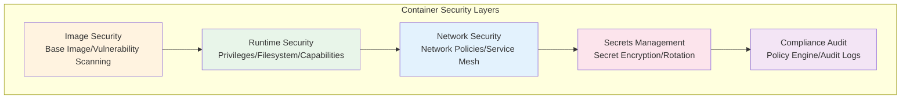
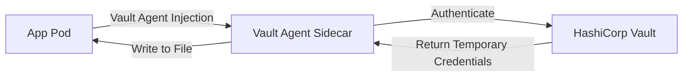

## Container Security Landscape

Container security is not a single technology but a full-chain practice spanning image building, runtime, networking, secrets, and compliance auditing. Negligence at any stage can become an attack entry point.



## Image Security

### Base Image Selection

Base images are the foundation of container security. Poor choices introduce many known vulnerabilities:

| Base Image | Size | Vulnerability Surface | Use Case |
|-----------|------|----------------------|----------|
| ubuntu:22.04 | ~77MB | Large | Need full toolchain |
| debian:bookworm-slim | ~74MB | Medium | Balance features and security |
| alpine:3.19 | ~7MB | Minimal | Lean runtime environment |
| distroless | ~2MB | Smallest | Application runtime only |
| scratch | 0MB | None | Statically compiled languages (Go/Rust) |

```dockerfile
# Use distroless as the final runtime image
FROM golang:1.22 AS builder
WORKDIR /app
COPY . .
RUN CGO_ENABLED=0 go build -o server .

FROM gcr.io/distroless/static-debian12:nonroot
COPY --from=builder /app/server /
USER nonroot:nonroot
ENTRYPOINT ["/server"]
```

### Vulnerability Scanning

Integrate image scanning in CI pipelines to block vulnerable images from reaching production:

```bash
# Scan image with Trivy
trivy image --severity HIGH,CRITICAL my-app:latest

# Use in CI, fail on high/critical vulnerabilities
trivy image --exit-code 1 --severity HIGH,CRITICAL my-app:latest

# Scan and generate report
trivy image --format json --output report.json my-app:latest
```

Recommended scanning tools:
- **Trivy**: Open source, fast, supports multiple targets
- **Grype**: By Anchore, works with Syft
- **Snyk Container**: Commercial solution, timely vulnerability database updates

### Image Signing and Verification

Use Cosign to sign images, ensuring deployed images have not been tampered with:

```bash
# Sign image
cosign sign --key cosign.key my-registry.com/app:v1.0.0

# Verify signature
cosign verify --key cosign.pub my-registry.com/app:v1.0.0
```

## Runtime Security

### Non-Root Execution

By default, containers run as root, which is one of the biggest security risks:

```dockerfile
# Specify non-root user in Dockerfile
RUN addgroup -S appgroup && adduser -S appuser -G appgroup
USER appuser

# Or specify at runtime
# docker run --user 1000:1000 my-app
```

```yaml
# K8s Pod Security Context
securityContext:
  runAsNonRoot: true
  runAsUser: 1000
  runAsGroup: 1000
  fsGroup: 1000
```

### Read-Only Filesystem

Prevent malicious files from being written at runtime:

```yaml
# Set read-only root filesystem in K8s
securityContext:
  readOnlyRootFileSystem: true

# Directories needing writes can be mounted via emptyDir
volumes:
  - name: tmp
    emptyDir: {}
volumeMounts:
  - name: tmp
    mountPath: /tmp
```

### Capability Pruning

Linux Capabilities split root privileges into fine-grained capabilities. Containers only need the minimum set:

```yaml
# Prune capabilities in K8s
securityContext:
  capabilities:
    drop:
      - ALL          # Drop all capabilities
    add:
      - NET_BIND_SERVICE  # Only add privileged port binding capability
```

Common capabilities:
- `NET_BIND_SERVICE`: Bind ports below 1024
- `SYS_PTRACE`: Debug processes (use with caution, can be used for process injection)
- `CHOWN`: Change file ownership
- `SETUID/SETGID`: Switch user/group identity

### Seccomp Configuration

Seccomp limits the system calls a container can use:

```json
{
  "defaultAction": "SCMP_ACT_ERRNO",
  "architectures": ["SCMP_ARCH_X86_64"],
  "syscalls": [
    {"names": ["read", "write", "open", "close", "mmap"], "action": "SCMP_ACT_ALLOW"}
  ]
}
```

## Secrets Management

### Common Anti-Patterns

```yaml
# ❌ Wrong: Secrets baked into image
ENV DATABASE_PASSWORD=supersecret

# ❌ Wrong: Secrets in Compose environment variables (stored in plaintext)
environment:
  - DB_PASSWORD=supersecret

# ✅ Correct: Use Docker Secrets or K8s Secrets
```

### K8s Secret Security Enhancement

```yaml
# Use encrypted Secrets
apiVersion: v1
kind: Secret
metadata:
  name: db-credentials
type: Opaque
data:
  username: YWRtaW4=        # base64 encoded
  password: c3VwZXJzZWNyZXQ=
```

Security enhancement measures:

1. **Enable etcd encryption**: Configure K8s API Server to encrypt Secret data at rest
2. **Use external secrets management**: Integrate Vault/AWS Secrets Manager
3. **RBAC access control**: Principle of least privilege, only authorize necessary service accounts to read Secrets
4. **Regular rotation**: Automated secret rotation mechanisms



## Network Security

### Network Isolation

```yaml
# K8s Network Policy — Allow only specific traffic
apiVersion: networking.k8s.io/v1
kind: NetworkPolicy
metadata:
  name: api-policy
  namespace: production
spec:
  podSelector:
    matchLabels:
      app: api
  policyTypes:
    - Ingress
    - Egress
  ingress:
    - from:
        - podSelector:
            matchLabels:
              app: web
      ports:
        - port: 8080
  egress:
    - to:
        - podSelector:
            matchLabels:
              app: db
      ports:
        - port: 5432
    - to: []  # Allow DNS resolution
      ports:
        - port: 53
          protocol: UDP
```

### Pod Security Standards

K8s 1.25+ uses Pod Security Standards replacing PodSecurityPolicy:

| Level | Description | Typical Scenario |
|-------|-------------|-----------------|
| Privileged | No restrictions | System components, CI runners |
| Baseline | Disallows known privilege escalation | General workloads |
| Restricted | Strict restrictions, minimum privileges | Security-sensitive applications |

```yaml
# Enforce at namespace level
apiVersion: v1
kind: Namespace
metadata:
  name: production
  labels:
    pod-security.kubernetes.io/enforce: restricted
    pod-security.kubernetes.io/audit: restricted
    pod-security.kubernetes.io/warn: restricted
```

## Compliance Audit

### Policy Engine

Use policy engines to intercept insecure configurations before deployment:

```yaml
# OPA/Gatekeeper policy example: Deny privileged containers
apiVersion: templates.gatekeeper.sh/v1
kind: ConstraintTemplate
metadata:
  name: denyprivileged
spec:
  crd:
    spec:
      names:
        kind: DenyPrivileged
  targets:
    - target: admission.k8s.gatekeeper.sh
      rego: |
        violation[{"msg": msg}] {
          container := input.review.object.spec.containers[_]
          container.securityContext.privileged
          msg := sprintf("Privileged container is forbidden: %v", [container.name])
        }
```

### Audit Logs

K8s audit logs record all API requests and are the foundation of security traceability:

```yaml
# Audit policy configuration
apiVersion: audit.k8s.io/v1
kind: Policy
rules:
  - level: RequestResponse
    resources:
      - group: ""
        resources: ["secrets"]
  - level: Metadata
    resources:
      - group: ""
        resources: ["pods", "services"]
```

### Security Scanning Toolchain

| Tool | Purpose | Stage |
|------|---------|-------|
| Trivy | Image vulnerability scanning | CI build |
| Cosign | Image signing and verification | CD deployment |
| Falco | Runtime anomaly detection | Runtime |
| OPA/Gatekeeper | Policy enforcement | Pre-deployment |
| kube-bench | CIS benchmark checks | Cluster assessment |

Container security is a continuous process that requires protective mechanisms at every stage. From image security to runtime protection, from network isolation to compliance auditing, only defense in depth can build truly secure containerized environments.
