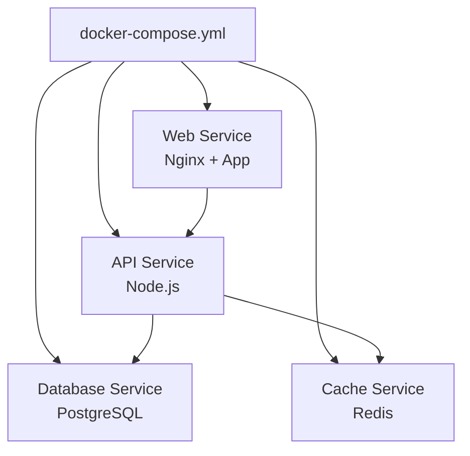
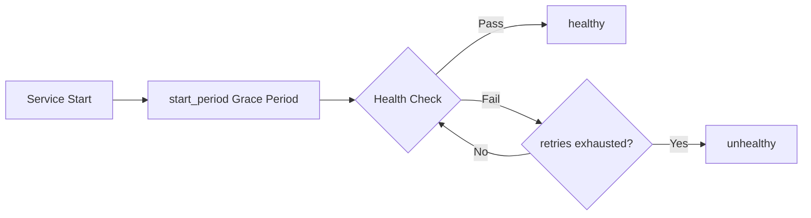
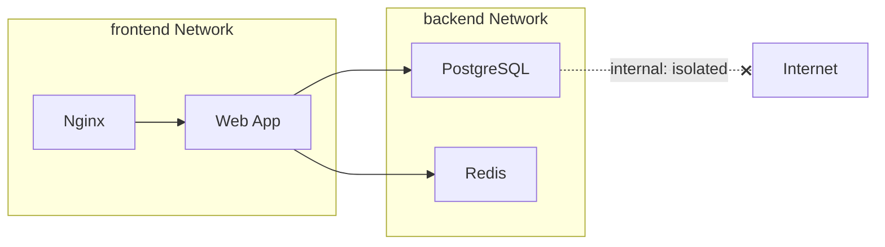

## Docker Compose Overview

Docker Compose is a tool for defining and running multi-container applications. With a single YAML file declaring all services the application needs, one command can create and start all containers. It simplifies the tedious process of manually starting containers one by one into declarative, automated orchestration.



## Compose File Structure and Version Evolution

### Version Differences

| Version | Description | Recommendation |
|---------|-------------|----------------|
| v1 | Early format, no version field | Deprecated |
| v2 | Supports depends_on conditions | Not recommended |
| v2.x | Supports healthcheck, deploy | Usable |
| v3 | Supports deploy config, designed for Swarm | Widely used |

> **Note**: Starting from Docker Compose V2, the `version` field is no longer required. Compose automatically infers the format.

### Complete File Example

```yaml
# docker-compose.yml
services:
  web:
    build:
      context: .
      dockerfile: Dockerfile
      args:
        NODE_ENV: production
    ports:
      - "3000:3000"
    environment:
      - DATABASE_URL=postgresql://app:secret@db:5432/appdb
      - REDIS_URL=redis://cache:6379
    depends_on:
      db:
        condition: service_healthy
      cache:
        condition: service_started
    healthcheck:
      test: ["CMD", "curl", "-f", "http://localhost:3000/health"]
      interval: 30s
      timeout: 10s
      retries: 3
      start_period: 40s
    restart: unless-stopped
    deploy:
      resources:
        limits:
          cpus: "1.0"
          memory: 512M

  db:
    image: postgres:16-alpine
    environment:
      POSTGRES_DB: appdb
      POSTGRES_USER: app
      POSTGRES_PASSWORD: secret
    volumes:
      - db-data:/var/lib/postgresql/data
    healthcheck:
      test: ["CMD-SHELL", "pg_isready -U app -d appdb"]
      interval: 10s
      timeout: 5s
      retries: 5

  cache:
    image: redis:7-alpine
    command: redis-server --appendonly yes
    volumes:
      - cache-data:/data

volumes:
  db-data:
  cache-data:
```

## Service Dependencies and Health Checks

### Dependency Management

`depends_on` controls service startup order but does not guarantee services are "ready":

```yaml
services:
  app:
    depends_on:
      db:
        condition: service_healthy  # Wait for db health check to pass
      redis:
        condition: service_started  # Only wait for redis to start
```

### Health Check Configuration

Health checks let Compose know whether a service is truly available, not just that the process is alive:

```yaml
healthcheck:
  test: ["CMD", "curl", "-f", "http://localhost:8080/health"]
  interval: 30s    # Check interval
  timeout: 10s     # Timeout duration
  retries: 3       # Consecutive failures before marking unhealthy
  start_period: 40s # Startup grace period, failures during this time don't count toward retries
```



## Network Configuration and Service Discovery

### Default Network Behavior

Compose automatically creates a bridge network for the project. Services can access each other by service name:

```yaml
services:
  web:
    # Can access database via db:5432
    environment:
      - DB_HOST=db
  db:
    # Automatically registered as "db" hostname
```

### Custom Networks

```yaml
services:
  web:
    networks:
      - frontend
      - backend

  db:
    networks:
      - backend

  nginx:
    networks:
      - frontend

networks:
  frontend:
    driver: bridge
  backend:
    driver: bridge
    internal: true  # Isolate external access
```



### Service Discovery Mechanism

In Compose networks, Docker's built-in DNS service automatically resolves service names to container IPs:

- Within the same network, `db` resolves directly to the database container's internal IP
- With multiple instances (`deploy.replicas: 3`), DNS round-robin provides basic load balancing
- Custom aliases: configure `aliases` under `networks` to add extra DNS names for services

## Development Environment Orchestration

Compose is a powerful tool for setting up development environments, enabling one-command startup of a complete local tech stack:

```yaml
# docker-compose.dev.yml
services:
  app:
    build:
      context: .
      target: development  # Development stage in multi-stage build
    volumes:
      - .:/app              # Real-time source code sync
      - /app/node_modules   # Prevent overwriting container's node_modules
    environment:
      - NODE_ENV=development
      - CHOKIDAR_USEPOLLING=true  # File watching compatibility
    ports:
      - "3000:3000"
      - "9229:9229"   # Node.js debug port
    command: npm run dev

  db:
    image: postgres:16-alpine
    environment:
      POSTGRES_DB: appdb
      POSTGRES_USER: app
      POSTGRES_PASSWORD: dev
    ports:
      - "5432:5432"   # Expose port for local tool connections
    volumes:
      - db-data:/var/lib/postgresql/data

  adminer:
    image: adminer
    ports:
      - "8080:8080"   # Database management UI

volumes:
  db-data:
```

```bash
# Start with development configuration
docker compose -f docker-compose.yml -f docker-compose.dev.yml up

# Start only dependency services (database, etc.), run app code locally
docker compose up db cache
```

## Migration Strategy from Compose to Kubernetes

When application scale grows to require K8s management, follow this migration path:

### 1. Map Compose Configuration

Map each service in Compose to K8s Deployment + Service:

| Compose Concept | K8s Equivalent |
|----------------|---------------|
| service | Deployment + Service |
| volumes | PersistentVolumeClaim |
| environment | ConfigMap / Secret |
| depends_on | initContainer / readinessProbe |
| healthcheck | livenessProbe / readinessProbe |
| ports | Service port + targetPort |
| restart policy | restartPolicy |

### 2. Use Tools for Conversion

```bash
# Convert using kompose
kompose convert -f docker-compose.yml

# Generate K8s manifest files
# deployment-web.yaml, service-web.yaml, etc.
```

### 3. Progressive Migration


- **Phase 1**: Migrate stateless services first (Web/API), keep databases in Compose or use managed services
- **Phase 2**: Introduce ConfigMap and Secret to replace environment variables
- **Phase 3**: Use Helm Charts to manage deployment configuration
- **Phase 4**: Migrate stateful services to StatefulSet or cloud managed services

### Migration Considerations

- Compose `depends_on` does not equal K8s startup order guarantees; use `initContainers` or readiness gates
- K8s doesn't have Compose's simplified `volumes` syntax; you need to manually create PVCs
- Environment variables should be migrated to ConfigMap (non-sensitive) and Secret (sensitive), not hardcoded in Deployments
- Health checks need to adapt to K8s probe semantics: liveness (whether restart is needed) and readiness (whether traffic can be received)

Docker Compose is the starting point for container orchestration — simple to use, suitable for local development and small-to-medium deployments. Understanding its core mechanisms and mapping to K8s enables smooth transitions as application scale evolves.
