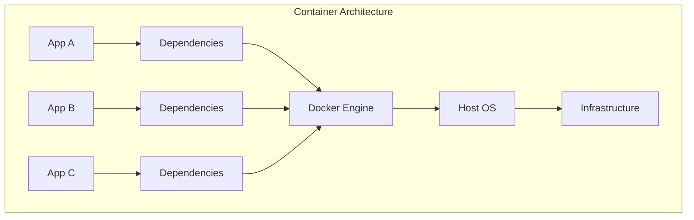
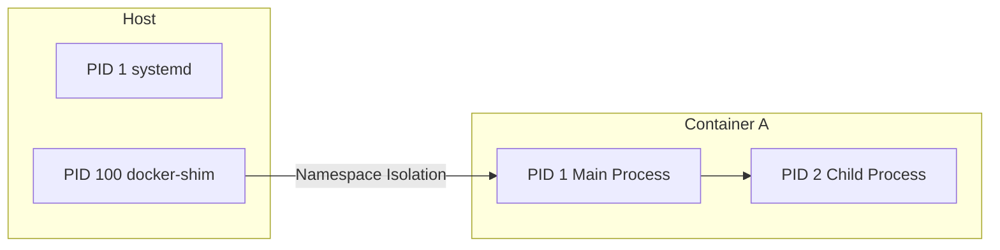
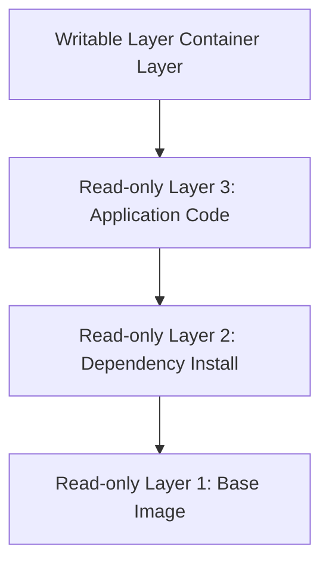
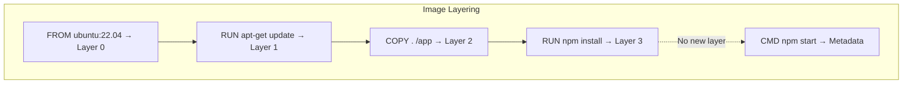
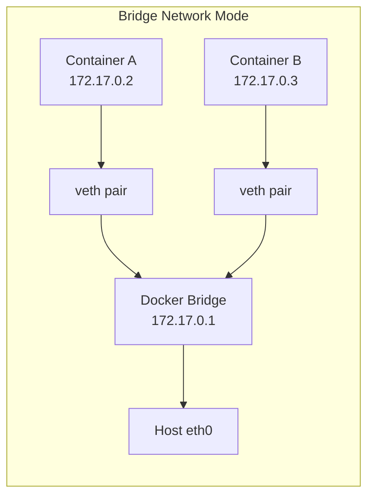
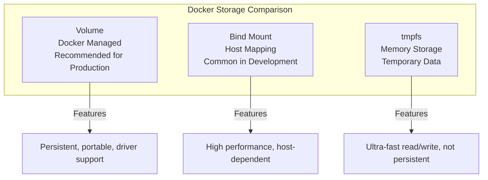

## Container Technology Overview

Docker is currently the most popular containerization platform. It uses OS-level virtualization to package applications and their dependencies into portable containers. Unlike virtual machines, containers share the host kernel without booting a full Guest OS, resulting in faster startup times and lower resource overhead.



### Containers vs Virtual Machines

| Feature | Container | Virtual Machine |
|---------|-----------|-----------------|
| Startup time | Seconds | Minutes |
| Resource usage | MB-level | GB-level |
| Performance | Near-native | Virtualization overhead |
| Isolation | Process-level | Full OS-level |
| Image size | Typically tens of MB | Typically several GB |

## Three Core Technologies

Docker container isolation and resource limits rely on three key Linux kernel technologies:

### Namespaces — Resource Isolation

Namespaces provide containers with an independent system view, making processes believe they are the only tenant in the system:

- **PID Namespace**: Process ID isolation, PID 1 inside the container maps to a different process on the host
- **NET Namespace**: Network stack isolation, each container has its own IP, ports, and routing table
- **MNT Namespace**: Filesystem mount point isolation
- **UTS Namespace**: Hostname isolation
- **IPC Namespace**: Inter-process communication isolation
- **USER Namespace**: User and group ID mapping



### Cgroups — Resource Limits

Cgroups (Control Groups) limit and monitor container usage of system resources:


```bash
# Check container CPU and memory limits
docker inspect --format '{{.HostConfig.CpuShares}}' my-container
docker inspect --format '{{.HostConfig.Memory}}' my-container

# View cgroup configuration directly
cat /sys/fs/cgroup/memory/docker/<container-id>/memory.limit_in_bytes
```


Core subsystems include: CPU (cpu/cpuacct), memory (memory), block device I/O (blkio), network (net_cls/net_prio), device access (devices), freezer (freeze/resume processes).

### UnionFS — Image Layering

The Union File System is the foundation of Docker image layered storage. It stacks multiple read-only layers into a unified filesystem view, with upper layers overriding files of the same name in lower layers:



Docker uses OverlayFS by default (overlay2 storage driver), which offers excellent performance and supports page-level cache sharing.

## Image Build Best Practices

### Dockerfile Writing Standards

```dockerfile
# Multi-stage build example: Go application
# ---- Build Stage ----
FROM golang:1.22-alpine AS builder

WORKDIR /app

# Copy dependency files first to leverage build cache
COPY go.mod go.sum ./
RUN go mod download

# Then copy source code
COPY . .

# Static compilation
RUN CGO_ENABLED=0 GOOS=linux go build -ldflags="-s -w" -o /app/server .

# ---- Runtime Stage ----
FROM alpine:3.19

# Install runtime certificates
RUN apk --no-cache add ca-certificates tzdata

# Create non-root user
RUN addgroup -S appgroup && adduser -S appuser -G appgroup

WORKDIR /app
COPY --from=builder /app/server .
USER appuser

EXPOSE 8080
ENTRYPOINT ["./server"]
```

### Advantages of Multi-stage Builds

Multi-stage builds are the core method for Docker image optimization:

1. **Significantly reduce image size**: The final image only contains runtime files, no compilers or intermediate artifacts
2. **Improved security**: Reduced attack surface, no build tools or debug symbols
3. **Build cache optimization**: Dependencies in a separate layer, code changes won't trigger dependency re-download

### Build Cache Optimization Principles

- Place low-frequency change instructions first (e.g., install system packages, download dependencies)
- Place high-frequency change instructions last (e.g., copy source code)
- Use `.dockerignore` to exclude unnecessary files

```text
# .dockerignore
.git
node_modules
*.md
.env
```

## Image Layering Mechanism in Detail

Docker images consist of a series of read-only layers, where each Dockerfile instruction generates a new layer:



**Key Details**:

- `RUN`, `COPY`, `ADD` produce new layers
- `ENTRYPOINT`, `CMD`, `ENV`, `EXPOSE` only modify metadata, no new layers
- Deleting files does not reduce image size, because deletion in upper layers only marks deletion, lower layer data still exists
- Merge `RUN` instructions to reduce layers: `RUN apt-get update && apt-get install -y pkg && rm -rf /var/lib/apt/lists/*`

## Network Modes

Docker provides multiple network modes for different scenarios:

| Network Mode | Description | Typical Scenario |
|-------------|-------------|-----------------|
| bridge | Default mode, containers communicate via virtual bridge | Single-host multi-container communication |
| host | Share host network stack, no network isolation | High-performance network applications |
| none | No network configuration | Offline computing tasks |
| overlay | Cross-host container communication | Docker Swarm cluster |
| macvlan | Container has independent MAC address | Direct physical network access needed |



## Storage Management

Docker provides three data persistence methods:

### Volume — Recommended Approach

```bash
# Create a named volume
docker volume create app-data

# Mount volume to container
docker run -d -v app-data:/var/lib/data my-app

# Inspect volume details
docker volume inspect app-data
```

Volumes are managed by Docker, stored in `/var/lib/docker/volumes/`, with lifecycle independent of containers, and support volume driver extensions (e.g., NFS, cloud storage).

### Bind Mount

```bash
# Mount host directory to container
docker run -d -v /host/path:/container/path my-app

# Read-only mount
docker run -d -v /host/path:/container/path:ro my-app
```

Bind Mounts directly map host directories, suitable for real-time code synchronization in development, but not convenient for cross-environment migration.

### tmpfs — In-Memory Storage

```bash
# Temporary file storage in memory
docker run -d --tmpfs /tmp:rw,noexec,nosuid my-app
```

tmpfs data exists only in memory and is lost when the container stops, suitable for temporary files and sensitive information.



## Practical Example: Web Application Containerization

Take a Node.js + Redis web application as an example:

```dockerfile
# Dockerfile
FROM node:20-alpine AS production

WORKDIR /app
COPY package*.json ./
RUN npm ci --only=production
COPY . .

USER node
EXPOSE 3000
HEALTHCHECK --interval=30s --timeout=3s \
  CMD wget --no-verbose --tries=1 --spider http://localhost:3000/health || exit 1

CMD ["node", "server.js"]
```

```bash
# Build and run
docker build -t my-webapp:1.0 .
docker run -d --name webapp -p 3000:3000 my-webapp:1.0
```

By understanding Docker's core technology principles and best practices, you can build lighter, more secure, and more efficient containerized applications, laying a solid foundation for subsequent container orchestration and cloud-native deployment.
