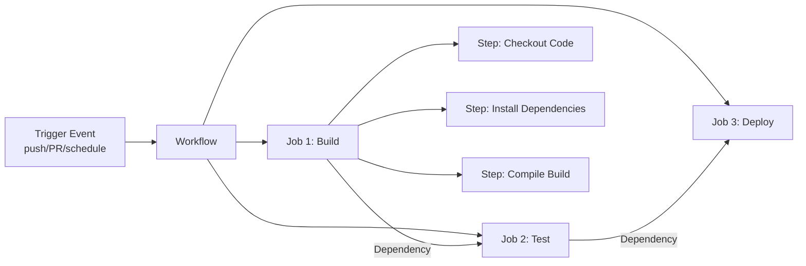
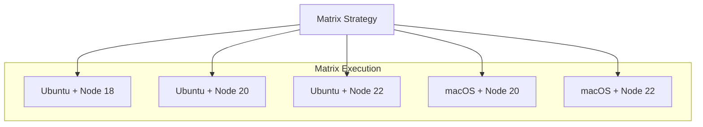
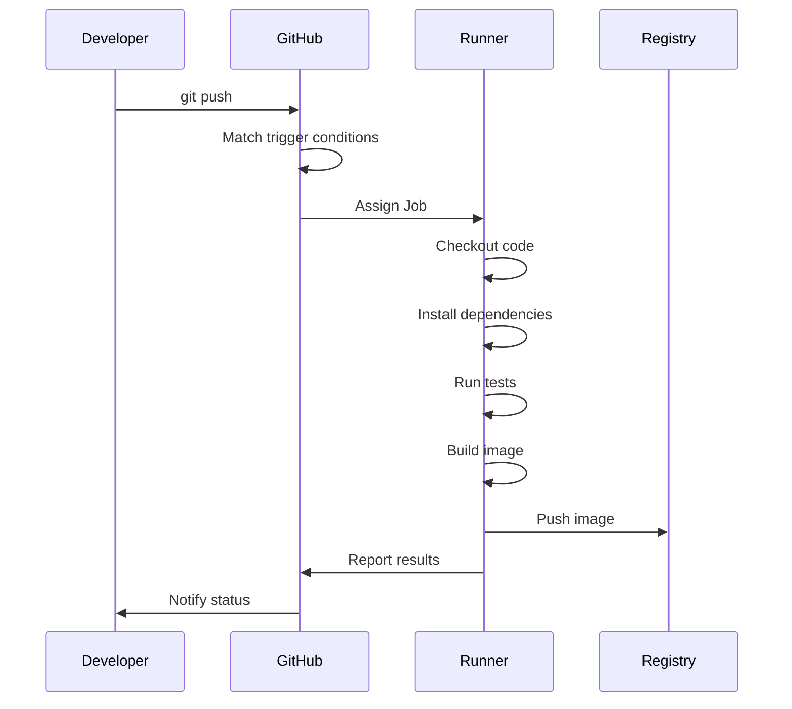

## GitHub Actions Overview

GitHub Actions is GitHub's built-in CI/CD platform. It defines workflows through YAML files that automatically execute builds, tests, and deployments when triggered by code pushes, PR creation, and other events. It integrates deeply with GitHub repositories and works out of the box without additional configuration.



## Workflow Syntax

### Basic Structure


```yaml
# .github/workflows/ci.yml
name: CI Pipeline

on:
  push:
    branches: [main]
  pull_request:
    branches: [main]

# Concurrency control: only keep the latest run for the same PR
concurrency:
  group: ci-${{ github.ref }}
  cancel-in-progress: true

permissions:
  contents: read
  pull-requests: write

env:
  REGISTRY: ghcr.io
  IMAGE_NAME: ${{ github.repository }}

jobs:
  build:
    runs-on: ubuntu-latest
    outputs:
      version: ${{ steps.version.outputs.value }}

    steps:
      - name: Checkout code
        uses: actions/checkout@v4
        with:
          fetch-depth: 0  # Full history for version generation

      - name: Setup Node.js
        uses: actions/setup-node@v4
        with:
          node-version: 20
          cache: npm

      - name: Install dependencies
        run: npm ci

      - name: Lint
        run: npm run lint

      - name: Unit tests
        run: npm test

      - name: Build application
        run: npm run build

      - name: Generate version
        id: version
        run: echo "value=v$(date +%Y%m%d)-$(git rev-parse --short HEAD)" >> $GITHUB_OUTPUT

  test-e2e:
    needs: build
    runs-on: ubuntu-latest
    steps:
      - uses: actions/checkout@v4
      - uses: actions/setup-node@v4
        with:
          node-version: 20
          cache: npm
      - run: npm ci
      - run: npx playwright install --with-deps
      - run: npx playwright test
      - name: Upload test report
        if: always()
        uses: actions/upload-artifact@v4
        with:
          name: playwright-report
          path: playwright-report/

  deploy:
    needs: [build, test-e2e]
    if: github.ref == 'refs/heads/main'
    runs-on: ubuntu-latest
    environment: production
    steps:
      - uses: actions/checkout@v4
      - name: Deploy to production
        run: echo "Deploying ${{ needs.build.outputs.version }}"
```


### Trigger Conditions

```yaml
on:
  push:
    branches: [main]
    tags: ['v*']           # Tag trigger
    paths:                 # Path filter
      - 'src/**'
      - 'package.json'
  pull_request:
    types: [opened, synchronize]
  schedule:
    - cron: '0 2 * * *'   # Daily at 2 AM
  workflow_dispatch:       # Manual trigger
    inputs:
      environment:
        description: 'Deployment environment'
        required: true
        default: 'staging'
```

## Common Actions

### Official Recommended Actions

| Action | Purpose |
|--------|---------|
| `actions/checkout@v4` | Checkout repository code |
| `actions/setup-node@v4` | Install Node.js |
| `actions/setup-python@v5` | Install Python |
| `actions/setup-go@v5` | Install Go |
| `actions/cache@v4` | Cache dependencies |
| `actions/upload-artifact@v4` | Upload build artifacts |
| `actions/download-artifact@v4` | Download build artifacts |

### Caching Strategy


```yaml
- name: Cache dependencies
  uses: actions/cache@v4
  with:
    path: |
      ~/.npm
      node_modules
    key: npm-${{ runner.os }}-${{ hashFiles('package-lock.json') }}
    restore-keys: |
      npm-${{ runner.os }}-
```


## Environments and Secrets

### Secrets Management


```yaml
# Configure in repository Settings > Secrets
steps:
  - name: Login to container registry
    uses: docker/login-action@v3
    with:
      registry: ghcr.io
      username: ${{ github.actor }}
      password: ${{ secrets.GITHUB_TOKEN }}  # Automatically provided token

  - name: Use custom secret
    env:
      DATABASE_URL: ${{ secrets.DATABASE_URL }}
      API_KEY: ${{ secrets.API_KEY }}
    run: npm run migrate
```


### Environment Protection Rules

```yaml
deploy:
  runs-on: ubuntu-latest
  environment:
    name: production
    url: https://app.example.com
  # Reviewers need to be configured in repository Settings > Environments
```

## Container Build and Push

### Build and Push Docker Image


```yaml
docker-build:
  runs-on: ubuntu-latest
  permissions:
    contents: read
    packages: write
  steps:
    - uses: actions/checkout@v4

    - name: Login to GHCR
      uses: docker/login-action@v3
      with:
        registry: ghcr.io
        username: ${{ github.actor }}
        password: ${{ secrets.GITHUB_TOKEN }}

    - name: Setup Docker Buildx
      uses: docker/setup-buildx-action@v3

    - name: Extract metadata
      id: meta
      uses: docker/metadata-action@v5
      with:
        images: ghcr.io/${{ github.repository }}
        tags: |
          type=ref,event=branch
          type=semver,pattern={{version}}
          type=sha,prefix=

    - name: Build and push
      uses: docker/build-push-action@v5
      with:
        context: .
        push: true
        tags: ${{ steps.meta.outputs.tags }}
        labels: ${{ steps.meta.outputs.labels }}
        cache-from: type=gha
        cache-to: type=gha,mode=max
```


## Advanced Patterns

### Reusable Workflows

Extract common processes into reusable workflows:


```yaml
# .github/workflows/reusable-deploy.yml
name: Reusable Deploy

on:
  workflow_call:
    inputs:
      environment:
        required: true
        type: string
      image-tag:
        required: true
        type: string
    secrets:
      deploy-key:
        required: true

jobs:
  deploy:
    runs-on: ubuntu-latest
    environment: ${{ inputs.environment }}
    steps:
      - name: Deploy
        run: |
          echo "Deploying ${{ inputs.image-tag }} to ${{ inputs.environment }}"
          # Actual deployment logic
```



```yaml
# Call reusable workflow
jobs:
  deploy-staging:
    uses: ./.github/workflows/reusable-deploy.yml
    with:
      environment: staging
      image-tag: ${{ needs.build.outputs.version }}
    secrets:
      deploy-key: ${{ secrets.STAGING_DEPLOY_KEY }}
```


### Matrix Strategy

Test multiple version combinations in parallel:


```yaml
test:
  runs-on: ${{ matrix.os }}
  strategy:
    fail-fast: false  # One failure doesn't cancel others
    matrix:
      os: [ubuntu-latest, macos-latest]
      node-version: [18, 20, 22]
      exclude:
        - os: macos-latest
          node-version: 18  # Exclude specific combination

  steps:
    - uses: actions/checkout@v4
    - uses: actions/setup-node@v4
      with:
        node-version: ${{ matrix.node-version }}
    - run: npm ci
    - run: npm test
```




### Workflow Execution Flow



GitHub Actions embeds CI/CD directly into the development workflow, achieving fully automated software delivery from code push to production deployment. Mastering workflow syntax, caching strategies, and advanced patterns significantly improves build efficiency and deployment reliability.
