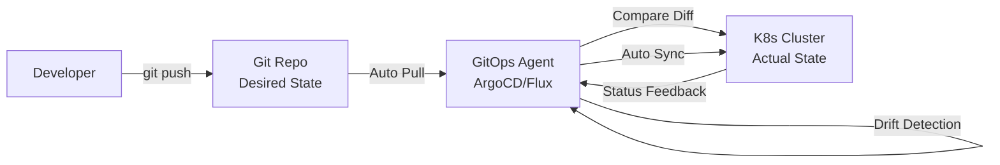
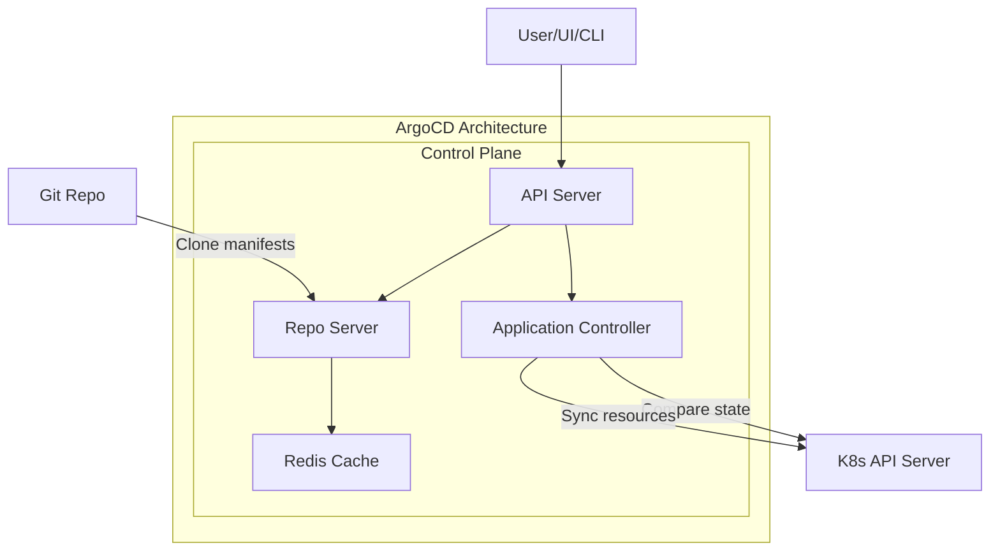
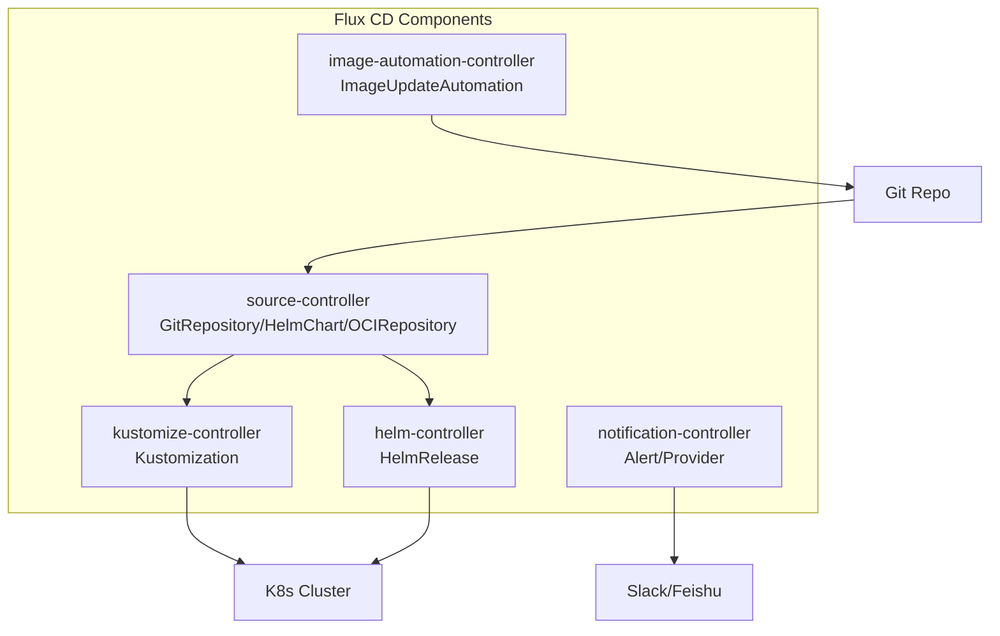
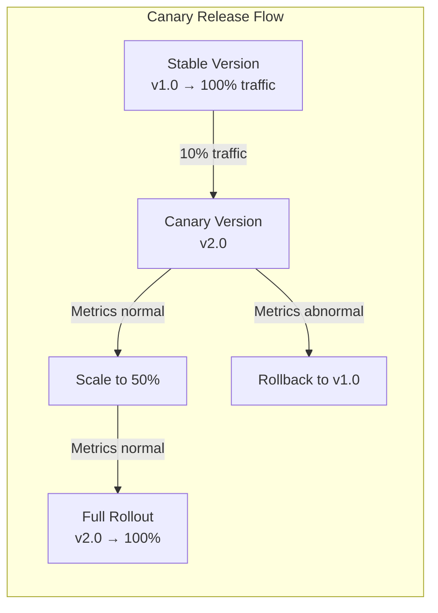
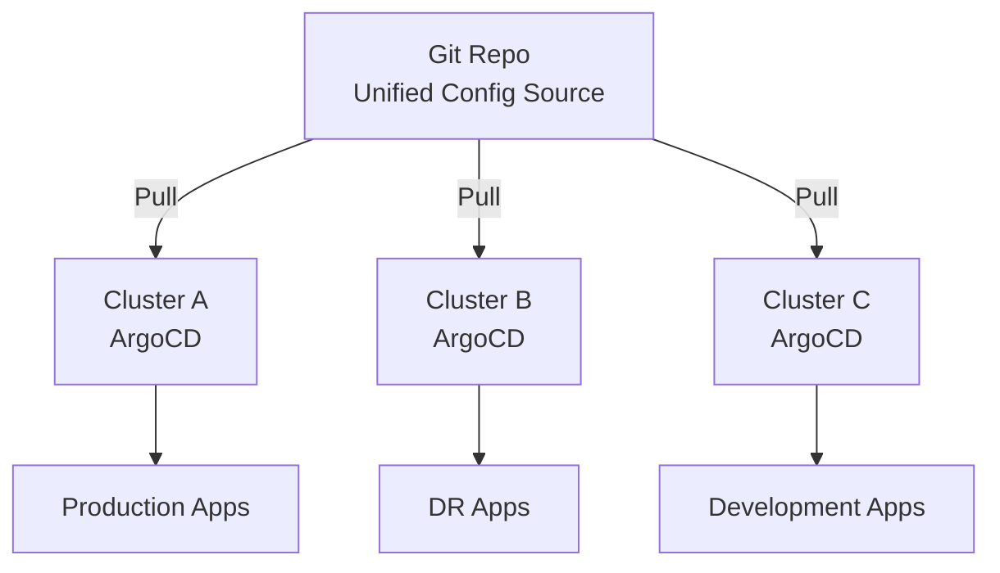

## GitOps Core Philosophy

GitOps is a continuous delivery methodology that uses Git as the Single Source of Truth. It stores all infrastructure and application configuration in Git repositories, managing deployments through Git's commit, review, and rollback mechanisms to achieve declarative, versioned, and auditable operations.

### Core Principles

1. **Declarative**: The desired state of the entire system is described declaratively, not imperatively
2. **Versioned and Immutable**: Desired state is stored in Git with full history and rollback capabilities
3. **Auto-Pull**: Software agents automatically pull and apply the desired state from Git
4. **Continuous Reconciliation**: Software agents continuously compare actual state with desired state and automatically correct drift



### GitOps vs Traditional CI/CD

| Dimension | Traditional CI/CD | GitOps |
|-----------|-------------------|--------|
| Deployment method | Push: CI pushes directly | Pull: Cluster pulls actively |
| Config storage | CI platform variables | Git repository |
| Audit trail | CI logs | Git commit history |
| Rollback method | Re-run pipeline | `git revert` |
| Access control | CI needs K8s credentials | In-cluster Agent auto-authenticates |
| Multi-cluster | Independent config per cluster | Unified Git repository management |

## ArgoCD Architecture

ArgoCD is a K8s-native GitOps continuous delivery tool that runs as a Controller in the cluster:



### Core Concepts

- **Application**: ArgoCD's core resource, defining the mapping between manifests in Git and targets in K8s
- **Project**: Logical grouping of Applications, limiting deployment scope and permissions
- **Sync Policy**: Synchronization strategy, manual or automatic sync

### Application Configuration Example

```yaml
apiVersion: argoproj.io/v1alpha1
kind: Application
metadata:
  name: web-app
  namespace: argocd
spec:
  project: default
  source:
    repoURL: https://github.com/org/k8s-manifests.git
    targetRevision: main
    path: overlays/production
    # Supports Kustomize
    kustomize:
      namePrefix: prod-
    # Or Helm
    # helm:
    #   valueFiles:
    #     - values-prod.yaml
  destination:
    server: https://kubernetes.default.svc
    namespace: production
  syncPolicy:
    automated:
      prune: true       # Auto-delete resources not in Git
      selfHeal: true    # Auto-fix drift from manual changes
    syncOptions:
      - CreateNamespace=true
      - PrunePropagationPolicy=foreground
    retry:
      limit: 5
      backoff:
        duration: 5s
        factor: 2
        maxDuration: 3m
```

### Multi-Environment Management

```text
k8s-manifests/
├── base/                    # Base configuration
│   ├── deployment.yaml
│   ├── service.yaml
│   └── kustomization.yaml
└── overlays/
    ├── development/         # Dev environment overrides
    │   ├── kustomization.yaml
    │   └── patch-replicas.yaml
    ├── staging/             # Staging environment overrides
    │   ├── kustomization.yaml
    │   └── patch-resources.yaml
    └── production/          # Production environment overrides
        ├── kustomization.yaml
        └── patch-resources.yaml
```

## Flux CD Workflow

Flux CD is a CNCF graduated project known for being lightweight and modular:



### Flux Basic Configuration

```yaml
# GitRepository — Declare Git source
apiVersion: source.toolkit.fluxcd.io/v1
kind: GitRepository
metadata:
  name: web-app
  namespace: flux-system
spec:
  interval: 1m
  url: https://github.com/org/k8s-manifests.git
  ref:
    branch: main
  secretRef:
    name: git-credentials

---
# Kustomization — Declare sync target
apiVersion: kustomize.toolkit.fluxcd.io/v1
kind: Kustomization
metadata:
  name: web-app-production
  namespace: flux-system
spec:
  interval: 5m
  sourceRef:
    kind: GitRepository
    name: web-app
  path: ./overlays/production
  prune: true
  healthChecks:
    - apiVersion: apps/v1
      kind: Deployment
      name: web-app
      namespace: production
```

### ArgoCD vs Flux CD

| Feature | ArgoCD | Flux CD |
|---------|--------|---------|
| UI | Feature-rich Web UI | Minimal UI (optional) |
| Configuration | Application CRD | Set of specialized CRDs |
| Multi-cluster | Native support | Via cluster federation |
| Notifications | Built-in | notification-controller |
| Community | Active, many enterprise users | CNCF graduated, growing |
| Learning curve | Medium | Lower |

## Progressive Delivery: Canary Releases

Canary releases gradually expose new versions to a portion of traffic, verifying no anomalies before full rollout:



### Argo Rollouts Configuration

```yaml
apiVersion: argoproj.io/v1alpha1
kind: Rollout
metadata:
  name: web-app
spec:
  replicas: 10
  strategy:
    canary:
      steps:
        - setWeight: 10          # 10% traffic to canary
        - pause: {duration: 5m}  # Wait 5 minutes for observation
        - setWeight: 30
        - pause: {duration: 5m}
        - setWeight: 50
        - pause: {duration: 10m}
        - setWeight: 80
        - pause: {duration: 5m}
      canaryService: web-app-canary
      stableService: web-app-stable
      analysis:
        templates:
          - templateName: success-rate
```

### AnalysisTemplate — Automated Verification

```yaml
apiVersion: argoproj.io/v1alpha1
kind: AnalysisTemplate
metadata:
  name: success-rate
spec:
  metrics:
    - name: success-rate
      provider:
        prometheus:
          address: http://prometheus.monitoring:9090
          query: |
            sum(rate(http_requests_total{job="web-app",status!~"5.."}[1m]))
            /
            sum(rate(http_requests_total{job="web-app"}[1m]))
      successCondition: result[0] >= 0.99
      failureLimit: 3
      interval: 60s
```

## Multi-Cluster Management

GitOps is naturally suited for multi-cluster management — each cluster runs its own Agent, pulling its configuration from the same Git repository:



### Multi-Cluster ArgoCD Configuration

```yaml
# Register target cluster on management cluster
apiVersion: v1
kind: Secret
metadata:
  name: cluster-production
  namespace: argocd
  labels:
    argocd.argoproj.io/secret-type: cluster
type: Opaque
stringData:
  name: production
  server: https://production-api.example.com
  config: |
    {
      "bearerAuth": {
        "token": "${PRODUCTION_CLUSTER_TOKEN}"
      }
    }
```

GitOps transforms operations work into code review processes — modify configuration through PRs, and auto-deploy after merge. This model not only improves deployment security and traceability but also brings infrastructure management the same best practices as software development.
