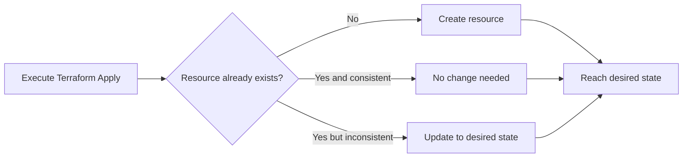
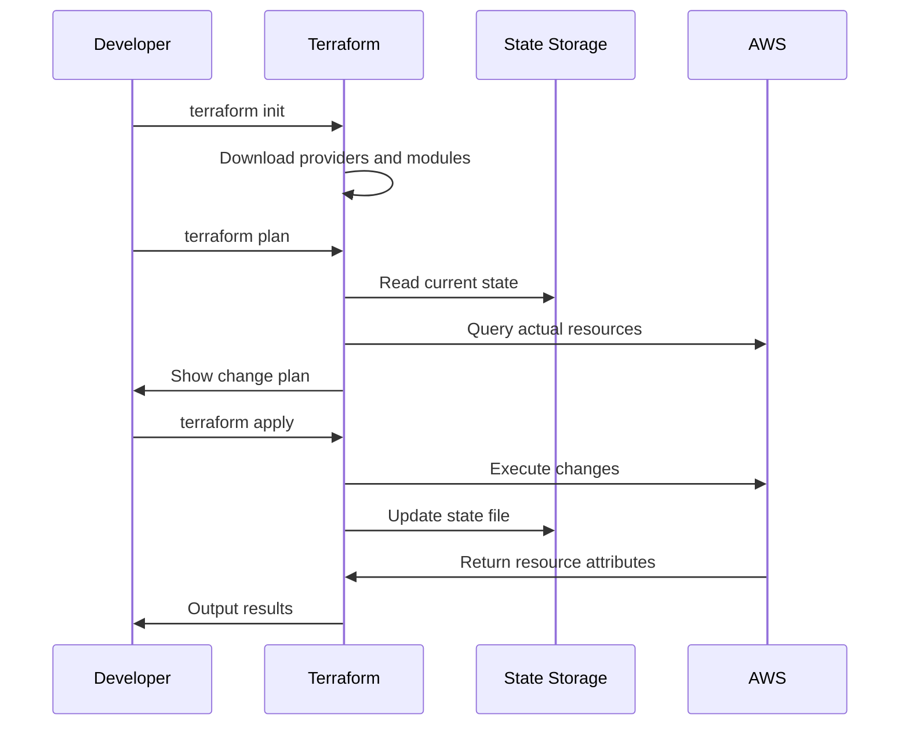
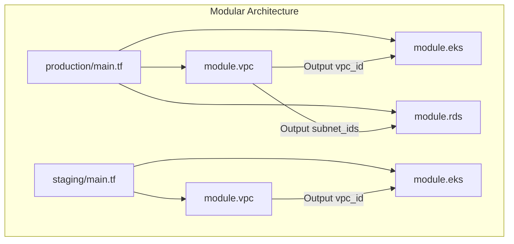
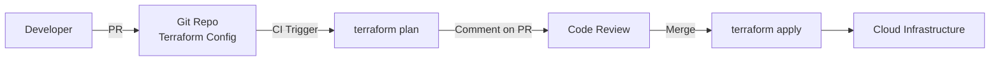

## IaC Concepts

Infrastructure as Code (IaC) describes and executes infrastructure configuration and management using code, replacing traditional manual clicking and operations. IaC gives infrastructure the same version control, review, and automation capabilities as software.

### Declarative vs Imperative

| Dimension | Declarative | Imperative |
|-----------|------------|-----------|
| Description style | Describe "what you want" | Describe "how to do it" |
| State management | Tool auto-compares differences | Requires manual tracking |
| Idempotency | Naturally supported | Requires extra guarantees |
| Representative tools | Terraform, CloudFormation | Ansible, Chef |
| Repeatability | Consistent results across runs | May produce side effects |

### Idempotency Principle

Idempotency is the core property of IaC: no matter how many times it's executed, as long as the input is the same, the final state is consistent. This means:

- Safe retries: Re-executing after a network timeout won't create duplicate resources
- State convergence: Manual changes are automatically corrected back to desired state
- Concurrent safety: Multiple people's operations won't overwrite each other



## Terraform Core

Terraform is currently the most popular IaC tool, supporting multi-cloud and multi-service resource management.

### Core Concepts

| Concept | Description |
|---------|-------------|
| Provider | Cloud vendor plugin (AWS/Azure/GCP/K8s, etc.) |
| Resource | Infrastructure resource (VPC/EC2/RDS, etc.) |
| Data Source | Read data from existing resources |
| Variable | Input variables, parameterized configuration |
| Output | Output values, referenced by other modules |
| State | Resource state file, records mapping between actual and desired state |
| Module | Reusable configuration package |

### Basic Configuration Example

```hcl
# provider.tf
terraform {
  required_version = ">= 1.7"
  required_providers {
    aws = {
      source  = "hashicorp/aws"
      version = "~> 5.0"
    }
  }

  # Remote state storage
  backend "s3" {
    bucket         = "my-tfstate"
    key            = "production/terraform.tfstate"
    region         = "us-east-1"
    dynamodb_table = "tfstate-lock"
    encrypt        = true
  }
}

provider "aws" {
  region = var.aws_region
}

# variables.tf
variable "aws_region" {
  description = "AWS region"
  type        = string
  default     = "us-east-1"
}

variable "environment" {
  description = "Environment name"
  type        = string
}

variable "vpc_cidr" {
  description = "VPC CIDR block"
  type        = string
  default     = "10.0.0.0/16"
}

# main.tf
resource "aws_vpc" "main" {
  cidr_block           = var.vpc_cidr
  enable_dns_hostnames = true
  enable_dns_support   = true

  tags = {
    Name        = "${var.environment}-vpc"
    Environment = var.environment
    ManagedBy   = "terraform"
  }
}

resource "aws_subnet" "public" {
  count                   = 2
  vpc_id                  = aws_vpc.main.id
  cidr_block              = cidrsubnet(var.vpc_cidr, 8, count.index)
  availability_zone       = data.aws_availability_zones.available.names[count.index]
  map_public_ip_on_launch = true

  tags = {
    Name = "${var.environment}-public-${count.index}"
  }
}

resource "aws_subnet" "private" {
  count             = 2
  vpc_id            = aws_vpc.main.id
  cidr_block        = cidrsubnet(var.vpc_cidr, 8, count.index + 2)
  availability_zone = data.aws_availability_zones.available.names[count.index]

  tags = {
    Name = "${var.environment}-private-${count.index}"
  }
}

data "aws_availability_zones" "available" {
  state = "available"
}

# outputs.tf
output "vpc_id" {
  description = "VPC ID"
  value       = aws_vpc.main.id
}

output "public_subnet_ids" {
  description = "Public subnet IDs"
  value       = aws_subnet.public[*].id
}
```

## Terraform Workflow



### Standard Workflow

```bash
# 1. Initialize
terraform init

# 2. Format code
terraform fmt

# 3. Validate code
terraform validate

# 4. Preview changes
terraform plan -out=tfplan

# 5. Review and apply
terraform apply tfplan

# 6. View outputs
terraform output
```

### State Management Best Practices

- **Remote storage**: Use S3+DynamoDB (AWS) or Blob+Table (Azure), avoid local state files
- **State locking**: Enable DynamoDB locking to prevent state corruption from concurrent writes
- **State encryption**: Enable S3 server-side encryption to protect sensitive data
- **State isolation**: Independent state file per environment (dev/staging/prod)

```hcl
# Production environment state isolation
terraform {
  backend "s3" {
    bucket = "my-tfstate"
    key    = "production/terraform.tfstate"
    # ...
  }
}
```

## Modular Design

Modules are the core mechanism for Terraform reuse, encapsulating related resources as independent units:

```text
modules/
├── vpc/
│   ├── main.tf
│   ├── variables.tf
│   ├── outputs.tf
│   └── versions.tf
├── eks/
│   ├── main.tf
│   ├── variables.tf
│   └── outputs.tf
└── rds/
    ├── main.tf
    ├── variables.tf
    └── outputs.tf

environments/
├── production/
│   ├── main.tf        # Reference modules
│   ├── variables.tf
│   └── terraform.tfvars
└── staging/
    ├── main.tf
    ├── variables.tf
    └── terraform.tfvars
```

### Module Definition

```hcl
# modules/vpc/main.tf
resource "aws_vpc" "this" {
  cidr_block = var.cidr_block
  tags = merge(var.tags, {
    Name = "${var.name}-vpc"
  })
}

resource "aws_subnet" "public" {
  count             = length(var.public_subnets)
  vpc_id            = aws_vpc.this.id
  cidr_block        = var.public_subnets[count.index]
  availability_zone = var.azs[count.index % length(var.azs)]

  tags = {
    Name = "${var.name}-public-${count.index}"
  }
}
```

### Module Reference

```hcl
# environments/production/main.tf
module "vpc" {
  source = "../../modules/vpc"

  name           = "production"
  cidr_block     = "10.0.0.0/16"
  public_subnets = ["10.0.1.0/24", "10.0.2.0/24"]
  azs            = ["us-east-1a", "us-east-1b"]
  tags = {
    Environment = "production"
    ManagedBy   = "terraform"
  }
}

module "eks" {
  source = "../../modules/eks"

  name       = "production"
  vpc_id     = module.vpc.vpc_id
  subnet_ids = module.vpc.private_subnet_ids
  node_groups = {
    general = {
      instance_types = ["m6i.large"]
      desired_size   = 3
      min_size       = 2
      max_size       = 6
    }
  }
}
```



## GitOps Integration

Combining Terraform with GitOps enables a fully automated infrastructure change process:



### CI/CD Integration

```yaml
# GitHub Actions Terraform workflow
name: Terraform

on:
  pull_request:
    paths: ['terraform/**']
  push:
    branches: [main]
    paths: ['terraform/**']

jobs:
  plan:
    runs-on: ubuntu-latest
    if: github.event_name == 'pull_request'
    steps:
      - uses: actions/checkout@v4
      - uses: hashicorp/setup-terraform@v3
      - run: terraform init
        working-directory: terraform/environments/production
      - run: terraform plan -no-color
        working-directory: terraform/environments/production

  apply:
    runs-on: ubuntu-latest
    if: github.ref == 'refs/heads/main'
    environment: production
    steps:
      - uses: actions/checkout@v4
      - uses: hashicorp/setup-terraform@v3
      - run: terraform init
        working-directory: terraform/environments/production
      - run: terraform apply -auto-approve
        working-directory: terraform/environments/production
```

### Terraform with ArgoCD/Flux

- Terraform manages the infrastructure layer (VPC, EKS, RDS)
- ArgoCD/Flux manages the application layer (K8s manifests, Helm Charts)
- Terraform Output provides infrastructure parameters for the application layer (VPC ID, database endpoint, etc.)
- The two are decoupled through Git repositories, each evolving independently

IaC transforms infrastructure management from manual operations to code-driven. Combined with GitOps workflows, it achieves fully auditable, rollback-capable, and automated infrastructure changes.
