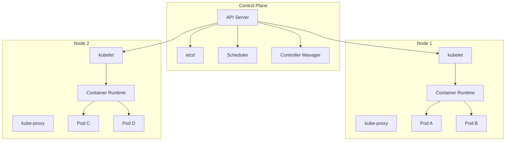
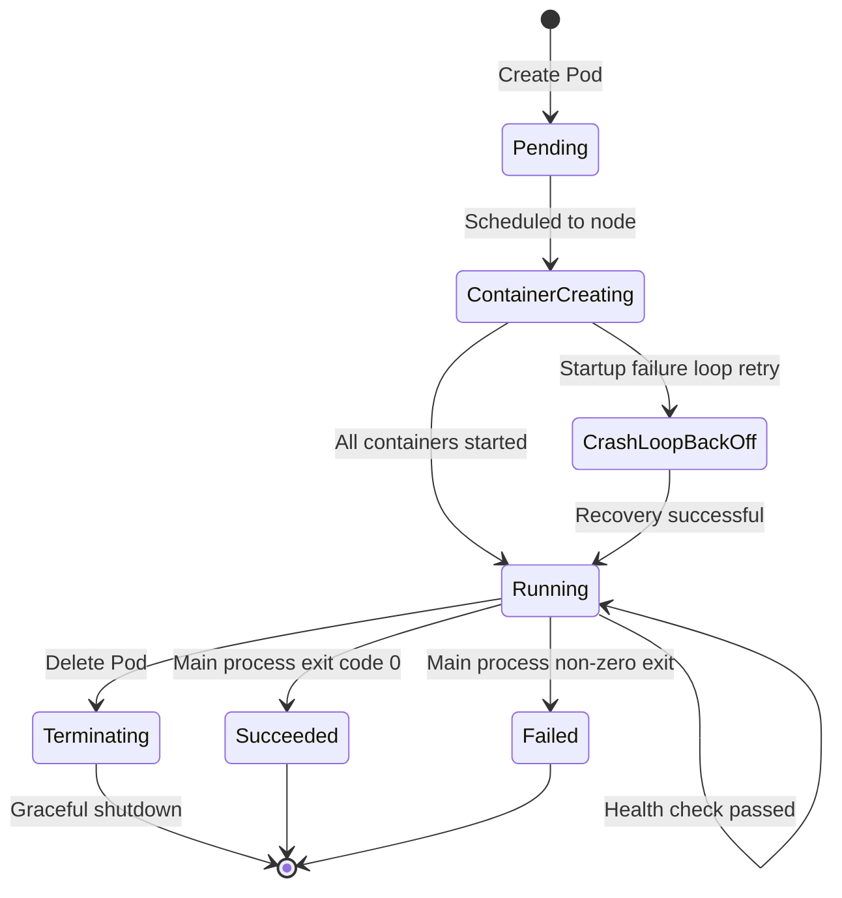

## Kubernetes Architecture Overview

Kubernetes (K8s) is the de facto standard for container orchestration, automating the deployment, scaling, and operations of containerized applications. K8s uses a client-server architecture consisting of a Control Plane and Worker Nodes.



### Control Plane Components

| Component | Responsibility |
|-----------|---------------|
| API Server | Cluster entry point, all operations go through it; handles authentication/authorization/admission control |
| etcd | Distributed KV store, holds all cluster state data |
| Scheduler | Assigns Pods to appropriate nodes based on resource requirements and constraints |
| Controller Manager | Runs various controllers (Deployment/ReplicaSet/Node, etc.) to maintain desired state |

### Worker Node Components

| Component | Responsibility |
|-----------|---------------|
| kubelet | Manages Pod lifecycle on the node, reports status to API Server |
| kube-proxy | Maintains network rules, implements Service load balancing |
| Container Runtime | Runs containers (containerd, CRI-O, etc.) |

## Core Objects

### Pod — Smallest Scheduling Unit

A Pod is the smallest deployment unit in K8s, containing one or more containers that share network and storage:

```yaml
apiVersion: v1
kind: Pod
metadata:
  name: web-app
  labels:
    app: web
spec:
  containers:
    - name: app
      image: my-app:v1.0
      ports:
        - containerPort: 8080
      resources:
        requests:
          cpu: 100m
          memory: 128Mi
        limits:
          cpu: 500m
          memory: 512Mi
      livenessProbe:
        httpGet:
          path: /health
          port: 8080
        initialDelaySeconds: 15
        periodSeconds: 20
      readinessProbe:
        httpGet:
          path: /ready
          port: 8080
        initialDelaySeconds: 5
        periodSeconds: 10
    - name: log-sidecar
      image: log-collector:v1.0
```

### Deployment — Declarative Updates

Deployment manages ReplicaSets, providing rolling updates and rollback capabilities:

```yaml
apiVersion: apps/v1
kind: Deployment
metadata:
  name: web-deployment
spec:
  replicas: 3
  selector:
    matchLabels:
      app: web
  strategy:
    type: RollingUpdate
    rollingUpdate:
      maxSurge: 1        # At most 1 extra Pod during rolling update
      maxUnavailable: 0  # No unavailable Pods allowed during update
  template:
    metadata:
      labels:
        app: web
    spec:
      containers:
        - name: app
          image: my-app:v2.0
          ports:
            - containerPort: 8080
```

### Service — Discovery and Load Balancing

Service provides a stable access point for a set of Pods:

```yaml
apiVersion: v1
kind: Service
metadata:
  name: web-service
spec:
  selector:
    app: web
  type: ClusterIP
  ports:
    - port: 80
      targetPort: 8080
```

Service type comparison:

| Type | Access Scope | Typical Scenario |
|------|-------------|-----------------|
| ClusterIP | Within cluster | Inter-service communication |
| NodePort | External (Node IP:Port) | Development/testing environments |
| LoadBalancer | Cloud provider load balancer | Production external exposure |
| ExternalName | DNS CNAME mapping | Reference external services |

### ConfigMap and Secret

Decouple configuration from images, enabling the same image to run in different environments:

```yaml
# ConfigMap — Non-sensitive configuration
apiVersion: v1
kind: ConfigMap
metadata:
  name: app-config
data:
  database_host: "db.production.svc.cluster.local"
  log_level: "info"
  app.properties: |
    cache.ttl=300
    pool.size=10

---
# Secret — Sensitive information
apiVersion: v1
kind: Secret
metadata:
  name: db-secret
type: Opaque
data:
  username: YWRtaW4=
  password: c2VjcmV0MTIz
```

## Pod Lifecycle



### Lifecycle Hooks

```yaml
spec:
  containers:
    - name: app
      lifecycle:
        postStart:
          exec:
            command: ["/bin/sh", "-c", "echo 'Started' > /tmp/ready"]
        preStop:
          exec:
            command: ["/bin/sh", "-c", "sleep 10 && /app/shutdown.sh"]
```

- **postStart**: Executed immediately after container creation, runs in parallel with the main process; failure causes container restart
- **preStop**: Executed before container termination, synchronous and blocking; SIGTERM is sent after completion

### Probes

| Probe Type | Purpose | Failure Consequence |
|-----------|---------|-------------------|
| livenessProbe | Detect if container is alive | Restart container |
| readinessProbe | Detect if container is ready | Remove from Service |
| startupProbe | Detect if application has started | Block other probes during startup |

```yaml
# Slow-starting application configuration example
startupProbe:
  httpGet:
    path: /health
    port: 8080
  failureThreshold: 30
  periodSeconds: 10   # Wait up to 300s for startup

livenessProbe:
  httpGet:
    path: /health
    port: 8080
  periodSeconds: 15

readinessProbe:
  httpGet:
    path: /ready
    port: 8080
  periodSeconds: 5
```

## Labels and Selectors

Labels are key-value pairs attached to K8s objects. Selectors filter objects by labels:

```yaml
# Label definition
metadata:
  labels:
    app: web
    tier: frontend
    env: production
    version: v2.0

# Equality-based selector
selector:
  matchLabels:
    app: web
    env: production

# Set-based selector
selector:
  matchExpressions:
    - key: version
      operator: In
      values: ["v2.0", "v2.1"]
    - key: tier
      operator: NotIn
      values: ["debug"]
```

Label best practices:
- Use the `app` label to identify applications — this is the basis for Service and Deployment association
- Use `env` to distinguish environments (production/staging/development)
- Use `version` to support Canary and Blue-Green deployments
- Avoid overly fine-grained labels to prevent management complexity explosion

## Common kubectl Commands

```bash
# Resource viewing
kubectl get pods -A                    # View Pods across all namespaces
kubectl get pods -o wide               # Show node and IP information
kubectl describe pod <name>            # View events and status details
kubectl logs <pod> -c <container> -f   # Stream container logs

# Resource operations
kubectl apply -f manifest.yaml         # Declarative create/update
kubectl delete -f manifest.yaml        # Delete resources
kubectl scale deployment/web --replicas=5  # Scale replicas

# Troubleshooting
kubectl exec -it <pod> -- /bin/sh      # Enter container terminal
kubectl port-forward svc/web 8080:80   # Port forward to local
kubectl top pods                       # View resource usage
kubectl get events --sort-by=.metadata.creationTimestamp  # View events

# Cluster management
kubectl cordon <node>                  # Mark node unschedulable
kubectl drain <node> --ignore-daemonsets  # Evict Pods from node
kubectl taint nodes <node> key=value:NoSchedule  # Add taint
```

Understanding K8s architecture and core concepts is the foundation for mastering container orchestration. From Pod to Deployment, from Service to ConfigMap, these primitives combine to form the runtime platform for cloud-native applications.
