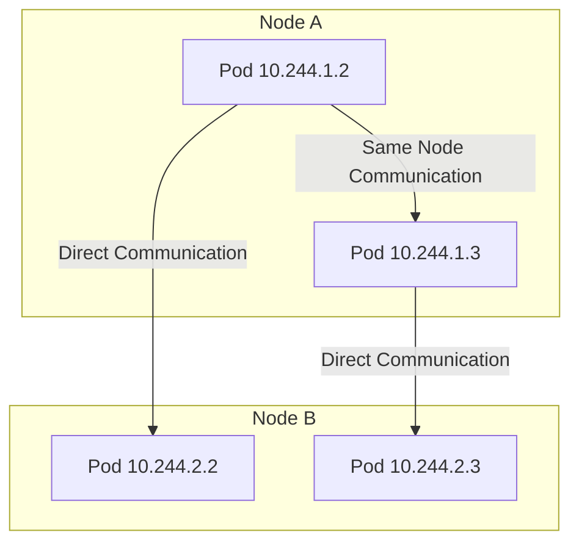
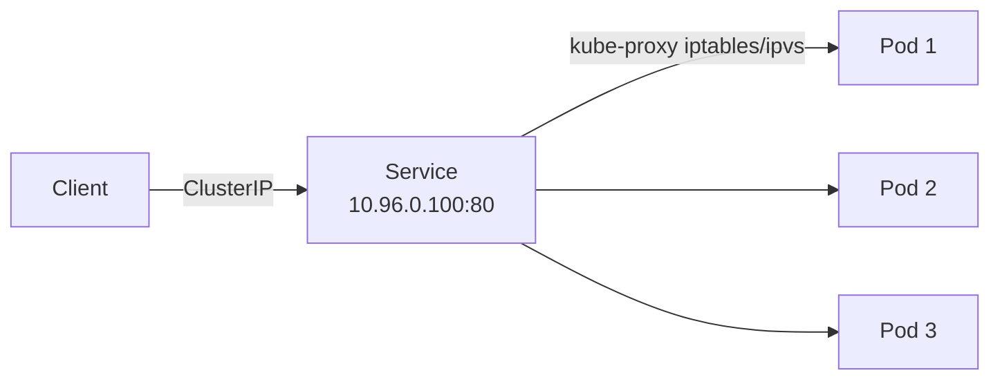
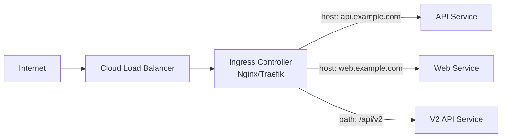
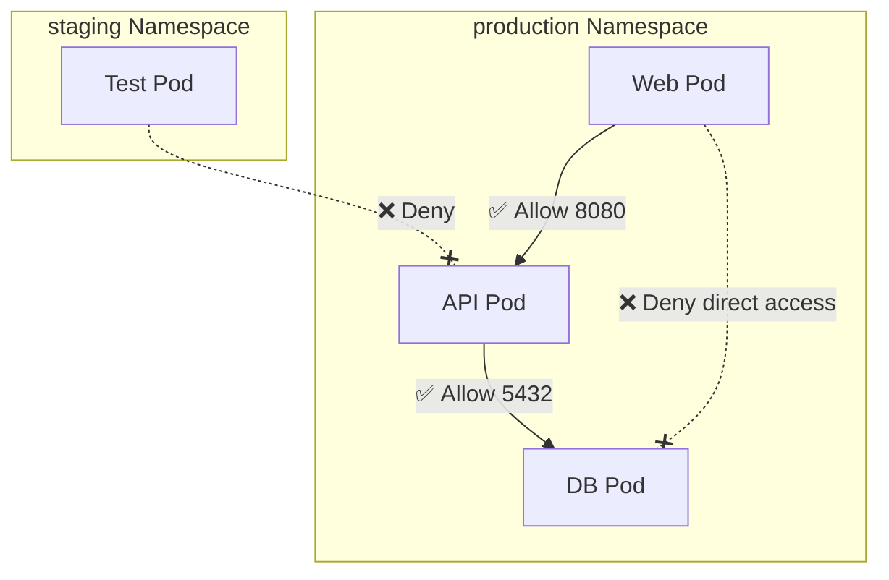
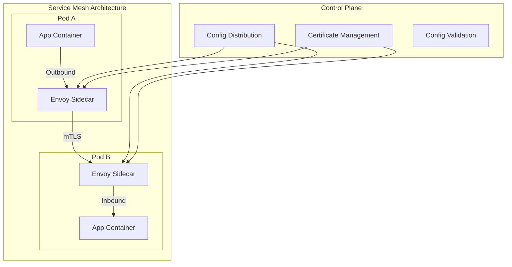

## K8s Network Model

K8s networking follows a fundamental principle: every Pod has its own IP, and Pods can communicate directly without NAT. This model imposes three core requirements on CNI plugins:

1. All Pods can communicate directly (even across nodes)
2. All Nodes can communicate directly with all Pods
3. A Pod sees its own IP the same as other Pods see it



## CNI Network Plugin Comparison

CNI (Container Network Interface) is the K8s network plugin standard. Different plugins vary in performance, features, and use cases:

| Plugin | Network Mode | Network Policy | Performance | Use Case |
|--------|-------------|---------------|-------------|----------|
| Calico | BGP/VXLAN | Supported | High | Production首选, large-scale clusters |
| Cilium | eBPF | Supported (enhanced) | Highest | Kernel 4.10+, needs observability |
| Flannel | VXLAN/host-gw | Not supported | Medium | Small clusters, easy to start |
| Weave | VXLAN | Supported | Medium | Hybrid environments, self-organizing |
| Canal | Flannel+Calico | Supported | Medium-High | Balance simplicity and security |

### Calico vs Cilium Deep Comparison

**Calico**:
- Uses BGP protocol to exchange routes between nodes, pure L3 networking
- Supports both iptables and eBPF data planes
- Mature Network Policy functionality, well-established community ecosystem
- Suitable for production environments requiring stability

**Cilium**:
- Based on eBPF for kernel-level network processing, bypassing iptables
- Provides L7 network policies (HTTP/gRPC/Kafka level)
- Built-in Hubble observability platform
- Suitable for scenarios requiring extreme performance and observability

## Service Types Explained

Service provides a stable virtual IP and DNS name for a set of Pods:



### ClusterIP

Default type, assigns a cluster-internal virtual IP:

```yaml
apiVersion: v1
kind: Service
metadata:
  name: api-service
spec:
  type: ClusterIP
  selector:
    app: api
  ports:
    - port: 80
      targetPort: 8080
```

### NodePort

Opens a port on each node (range 30000-32767), forwarding traffic to the Service:

```yaml
apiVersion: v1
kind: Service
metadata:
  name: api-nodeport
spec:
  type: NodePort
  selector:
    app: api
  ports:
    - port: 80
      targetPort: 8080
      nodePort: 30080
```

### LoadBalancer

Creates an external load balancer in cloud environments:

```yaml
apiVersion: v1
kind: Service
metadata:
  name: api-lb
spec:
  type: LoadBalancer
  selector:
    app: api
  ports:
    - port: 80
      targetPort: 8080
```

### ExternalName

Maps a Service to an external DNS name:

```yaml
apiVersion: v1
kind: Service
metadata:
  name: external-db
spec:
  type: ExternalName
  externalName: db.prod.example.com
```

## Ingress Controller

Ingress is K8s' HTTP-layer routing rules. Ingress Controller is its runtime component, providing L7 load balancing:



### Ingress Rule Example

```yaml
apiVersion: networking.k8s.io/v1
kind: Ingress
metadata:
  name: app-ingress
  annotations:
    cert-manager.io/cluster-issuer: letsencrypt-prod
    nginx.ingress.kubernetes.io/rate-limit: "100"
spec:
  ingressClassName: nginx
  tls:
    - hosts:
        - api.example.com
        - web.example.com
      secretName: app-tls
  rules:
    - host: api.example.com
      http:
        paths:
          - path: /v1
            pathType: Prefix
            backend:
              service:
                name: api-v1
                port:
                  number: 80
          - path: /v2
            pathType: Prefix
            backend:
              service:
                name: api-v2
                port:
                  number: 80
    - host: web.example.com
      http:
        paths:
          - path: /
            pathType: Prefix
            backend:
              service:
                name: web-frontend
                port:
                  number: 80
```

### Mainstream Ingress Controllers

| Solution | Features | Use Case |
|----------|----------|----------|
| NGINX Ingress | Mature and stable, largest community | General purpose |
| Traefik | Auto service discovery, hot config reload | Cloud-native, dynamic environments |
| Kong | Rich plugin ecosystem, API gateway | API management |
| Istio Gateway | Deep integration with service mesh | Service mesh scenarios |

## Network Policy

Network Policy controls network traffic between Pods, forming the basis of zero-trust networking:

```yaml
# Namespace default deny all ingress
apiVersion: networking.k8s.io/v1
kind: NetworkPolicy
metadata:
  name: default-deny-ingress
  namespace: production
spec:
  podSelector: {}  # Select all Pods
  policyTypes:
    - Ingress

---
# Allow web Pods to access api Pods on port 8080
apiVersion: networking.k8s.io/v1
kind: NetworkPolicy
metadata:
  name: allow-web-to-api
  namespace: production
spec:
  podSelector:
    matchLabels:
      app: api
  policyTypes:
    - Ingress
  ingress:
    - from:
        - podSelector:
            matchLabels:
              app: web
        - namespaceSelector:
            matchLabels:
              env: production
      ports:
        - port: 8080
          protocol: TCP
```



## Service Mesh

Service mesh provides traffic management, secure communication, and observability above the application layer, implemented via Sidecar proxies:



### Istio vs Linkerd

| Feature | Istio | Linkerd |
|---------|-------|---------|
| Proxy | Envoy | Linkerd2-proxy (Rust) |
| Complexity | High | Low |
| Resource consumption | Higher | Very low |
| Feature richness | Most comprehensive | Core features |
| Suitable scale | Large-scale, complex needs | Small-medium, quick start |

Service mesh is not a silver bullet. Before adopting, evaluate: do you truly need mTLS, fine-grained traffic control, and distributed tracing? If K8s native Service + Network Policy meets your needs, there's no need to introduce additional complexity.

K8s networking — from Pod communication to Service exposure, from Ingress routing to Network Policy isolation, to service mesh deep control — forms a complete networking solution stack. Understanding each layer's responsibilities and applicable scenarios is key to building secure and efficient network architectures.
