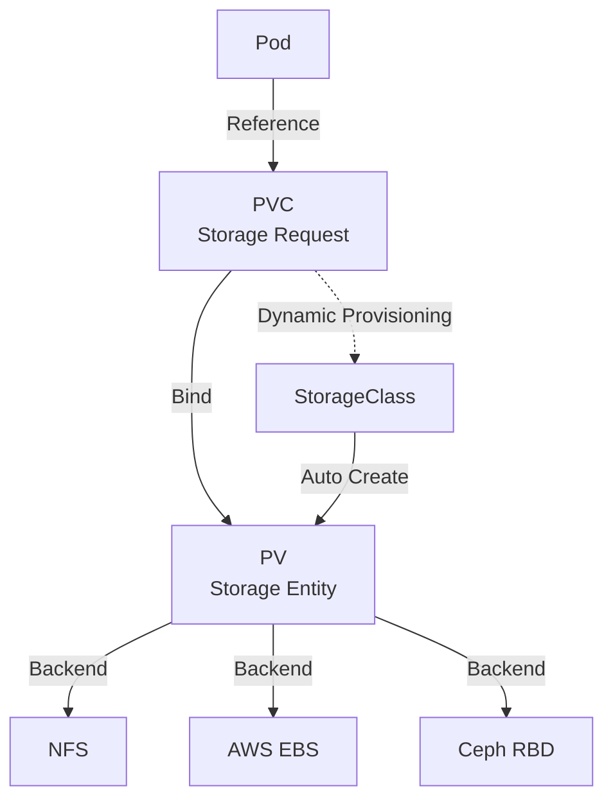
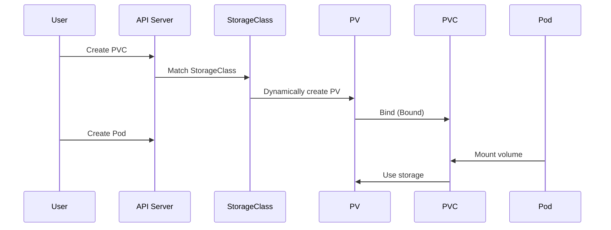
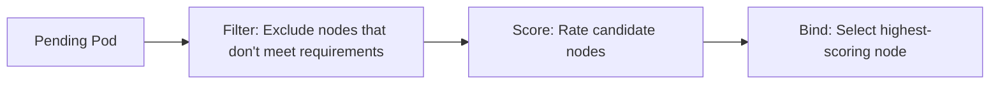

## Storage System

The K8s storage system abstracts underlying storage into standard interfaces, allowing applications to be unaware of specific storage implementations. Core objects include PV, PVC, and StorageClass.



### PersistentVolume (PV)

PV is a cluster-level storage resource, created by administrators or dynamically provisioned:

```yaml
apiVersion: v1
kind: PersistentVolume
metadata:
  name: nfs-pv
spec:
  capacity:
    storage: 50Gi
  accessModes:
    - ReadWriteMany        # RWX: Multi-node read-write
    # - ReadWriteOnce     # RWO: Single-node read-write
    # - ReadOnlyMany      # ROX: Multi-node read-only
  persistentVolumeReclaimPolicy: Retain  # Retain/Delete/Recycle
  storageClassName: nfs
  nfs:
    server: 10.0.0.100
    path: /data/share
```

### PersistentVolumeClaim (PVC)

PVC is a user's storage request, similar to a Pod's compute resource request:

```yaml
apiVersion: v1
kind: PersistentVolumeClaim
metadata:
  name: app-data
spec:
  accessModes:
    - ReadWriteOnce
  resources:
    requests:
      storage: 20Gi
  storageClassName: fast-ssd
```

### PV/PVC Binding Flow



### StorageClass — Dynamic Provisioning

StorageClass eliminates the burden of administrators manually creating PVs:

```yaml
apiVersion: storage.k8s.io/v1
kind: StorageClass
metadata:
  name: fast-ssd
provisioner: ebs.csi.aws.com
parameters:
  type: gp3
  iops: "5000"
  throughput: "250"
reclaimPolicy: Delete
volumeBindingMode: WaitForFirstConsumer  # Delay binding until Pod is scheduled
allowVolumeExpansion: true
```

Two `volumeBindingMode` options:
- **Immediate**: Bind immediately after PVC creation, which may result in Pod being scheduled to a different availability zone than the PV
- **WaitForFirstConsumer**: Wait until a Pod using this PVC is created before binding, ensuring PV and Pod are in the same availability zone

## Scheduler

The K8s scheduler assigns Pods to appropriate nodes. The decision process has two phases: filtering and scoring:



### Node Affinity

Controls which nodes a Pod is scheduled to:

```yaml
spec:
  affinity:
    nodeAffinity:
      requiredDuringSchedulingIgnoredDuringExecution:  # Hard constraint
        nodeSelectorTerms:
          - matchExpressions:
              - key: topology.kubernetes.io/zone
                operator: In
                values: ["us-east-1a", "us-east-1b"]
      preferredDuringSchedulingIgnoredDuringExecution:  # Soft constraint
        - weight: 80
          preference:
            matchExpressions:
              - key: node-type
                operator: In
                values: ["high-mem"]
```

### Pod Affinity/Anti-Affinity

Controls the distribution relationship between Pods:

```yaml
spec:
  affinity:
    podAntiAffinity:  # Anti-affinity: Spread deployment
      requiredDuringSchedulingIgnoredDuringExecution:
        - labelSelector:
            matchLabels:
              app: web
          topologyKey: kubernetes.io/hostname  # At most one web Pod per node
      preferredDuringSchedulingIgnoredDuringExecution:
        - weight: 100
          podAffinityTerm:
            labelSelector:
              matchLabels:
                app: web
            topologyKey: topology.kubernetes.io/zone  # Prefer spreading across availability zones
```

### Taints and Tolerations

Taints make nodes repel Pods, while tolerations let Pods accept taints:

```bash
# Add taint to node
kubectl taint nodes node-1 dedicated=gpu:NoSchedule
```

```yaml
# Pod tolerates the taint
spec:
  tolerations:
    - key: "dedicated"
      operator: "Equal"
      value: "gpu"
      effect: "NoSchedule"
```

| Taint Effect | Description |
|-------------|-------------|
| NoSchedule | Don't schedule new Pods |
| PreferNoSchedule | Try not to schedule (soft constraint) |
| NoExecute | Don't schedule and evict existing Pods |

## Stateful Applications: StatefulSet

StatefulSet provides stable network identity, persistent storage, and ordered deployment for stateful applications:

```yaml
apiVersion: apps/v1
kind: StatefulSet
metadata:
  name: postgres
spec:
  serviceName: postgres-headless  # Associated Headless Service
  replicas: 3
  selector:
    matchLabels:
      app: postgres
  template:
    metadata:
      labels:
        app: postgres
    spec:
      containers:
        - name: postgres
          image: postgres:16
          ports:
            - containerPort: 5432
          volumeMounts:
            - name: data
              mountPath: /var/lib/postgresql/data
  volumeClaimTemplates:  # Independent PVC per Pod
    - metadata:
        name: data
      spec:
        accessModes: ["ReadWriteOnce"]
        storageClassName: fast-ssd
        resources:
          requests:
            storage: 50Gi
```

StatefulSet vs Deployment:

| Feature | StatefulSet | Deployment |
|---------|------------|-----------|
| Pod name | Fixed: `statefulset-name-0/1/2` | Random suffix |
| Network identity | Fixed DNS: `pod-name.headless-svc` | Unstable |
| Storage | Independent PVC per Pod | Shared or stateless |
| Scaling order | Ordered (0→1→2) | Parallel |
| Update strategy | RollingUpdate/OnDelete | RollingUpdate/Recreate |

## Horizontal Scaling

### HPA — Horizontal Pod Autoscaler

```yaml
apiVersion: autoscaling/v2
kind: HorizontalPodAutoscaler
metadata:
  name: api-hpa
spec:
  scaleTargetRef:
    apiVersion: apps/v1
    kind: Deployment
    name: api
  minReplicas: 2
  maxReplicas: 10
  metrics:
    - type: Resource
      resource:
        name: cpu
        target:
          type: Utilization
          averageUtilization: 70
    - type: Resource
      resource:
        name: memory
        target:
          type: Utilization
          averageUtilization: 80
    - type: Pods
      pods:
        metric:
          name: http_requests_per_second
        target:
          type: AverageValue
          averageValue: "1000"
  behavior:
    scaleDown:
      stabilizationWindowSeconds: 300  # Scale-down stabilization period
      policies:
        - type: Percent
          value: 10
          periodSeconds: 60
    scaleUp:
      stabilizationWindowSeconds: 0
      policies:
        - type: Percent
          value: 100
          periodSeconds: 15
```

### VPA — Vertical Pod Autoscaler

VPA automatically adjusts Pod resource requests and limits:

```yaml
apiVersion: autoscaling.k8s.io/v1
kind: VerticalPodAutoscaler
metadata:
  name: api-vpa
spec:
  targetRef:
    apiVersion: apps/v1
    kind: Deployment
    name: api
  updatePolicy:
    updateMode: Auto  # Auto/Recreate/Off
  resourcePolicy:
    containerPolicies:
      - containerName: app
        minAllowed:
          cpu: 100m
          memory: 128Mi
        maxAllowed:
          cpu: "2"
          memory: 2Gi
```

### KEDA — Event-Driven Autoscaling

KEDA extends HPA's metric sources, supporting custom metrics based on message queue length, Cron expressions, etc.:

```yaml
apiVersion: keda.sh/v1alpha1
kind: ScaledObject
metadata:
  name: worker-scaler
spec:
  scaleTargetRef:
    name: worker-deployment
  minReplicaCount: 0   # Support scaling to zero
  maxReplicaCount: 30
  triggers:
    - type: rabbitmq
      metadata:
        queueName: tasks
        host: amqp://rabbitmq.default.svc.cluster.local
        queueLength: "5"  # Scale one replica per 5 messages in queue
```

## Helm Chart Management

Helm is the K8s package manager, templating and versioning a set of K8s manifests:

```text
my-chart/
├── Chart.yaml          # Chart metadata
├── values.yaml         # Default configuration values
├── templates/
│   ├── deployment.yaml
│   ├── service.yaml
│   ├── ingress.yaml
│   ├── _helpers.tpl    # Template helper functions
│   └── NOTES.txt       # Post-install notes
└── charts/             # Dependency Charts
```

```yaml
# Chart.yaml
apiVersion: v2
name: my-app
description: My application Helm chart
type: application
version: 1.0.0
appVersion: "2.0.0"
dependencies:
  - name: postgresql
    version: "14.x.x"
    repository: "https://charts.bitnami.com/bitnami"
    condition: postgresql.enabled
```

```bash
# Install
helm install my-app ./my-chart -n production

# Upgrade
helm upgrade my-app ./my-chart -n production -f values-prod.yaml

# Rollback
helm rollback my-app 1 -n production

# View release history
helm history my-app -n production
```

K8s storage and scheduling are critical for running stateful applications and optimizing resource utilization. From PV/PVC storage abstraction to StatefulSet stable identity, from scheduling constraints to auto-scaling, these mechanisms together support production-grade containerized workloads.
