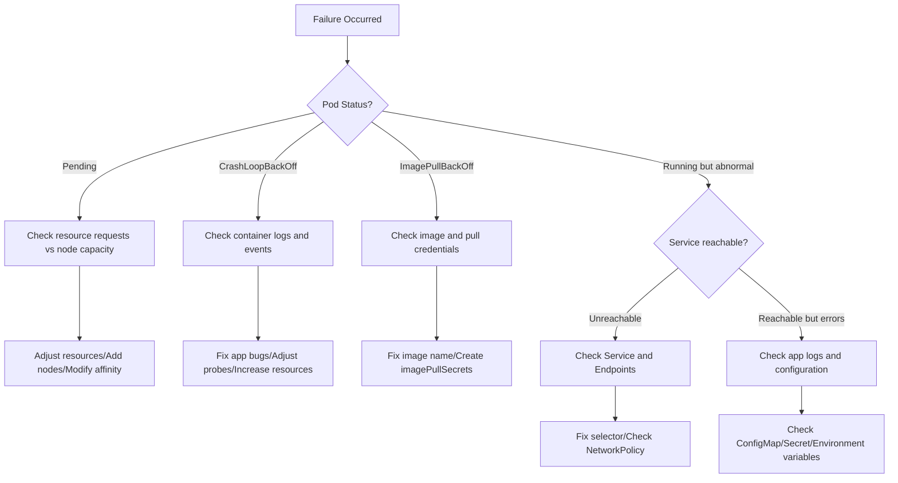
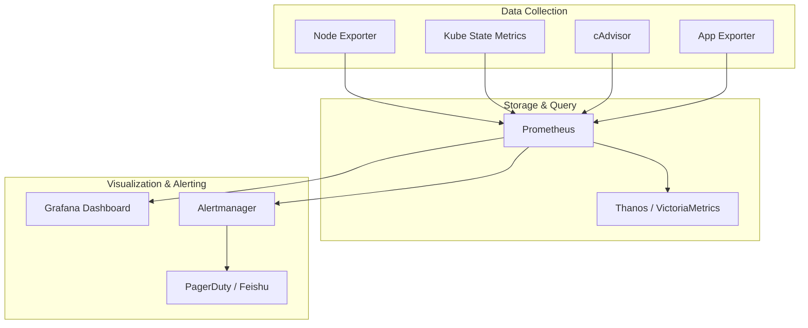

## Common Failure Patterns

K8s failures typically follow specific patterns. Quickly identifying patterns is key to efficient troubleshooting.

### Pod-Level Failures

| Status | Cause | Troubleshooting Direction |
|--------|-------|--------------------------|
| ImagePullBackOff | Image pull failure | Check image name, credentials, network |
| CrashLoopBackOff | Container crashes after starting | Check container logs, resource limits |
| OOMKilled | Killed due to insufficient memory | Increase limits or optimize memory usage |
| Pending | Cannot be scheduled | Check resources, affinity, PVC |
| Completed | Main process exited normally | Check if it should be long-running |

### Node-Level Failures

| Status | Cause | Troubleshooting Direction |
|--------|-------|--------------------------|
| NotReady | kubelet abnormal | Check kubelet logs and certificates |
| DiskPressure | Disk pressure | Clean up images and logs |
| MemoryPressure | Memory pressure | Evict low-priority Pods |
| PIDPressure | Too many processes | Check for process leaks |

## Troubleshooting Decision Tree

When facing K8s failures, follow this process to troubleshoot step by step:



## Troubleshooting Toolchain

### Essential Command Reference

```bash
# === Pod Troubleshooting ===
kubectl get pods -A -o wide                    # Global Pod status
kubectl describe pod <name>                    # Events and status details
kubectl logs <pod> -c <container> --previous   # Logs from last crash
kubectl logs <pod> --all-containers            # All container logs
kubectl exec -it <pod> -- /bin/sh              # Enter container

# === Network Troubleshooting ===
kubectl get endpoints <service>                # Service backend Pods
kubectl get networkpolicies -A                 # Network policies
kubectl run tmp --image=busybox --rm -it -- wget -qO- http://svc:80  # Temporary test

# === Node Troubleshooting ===
kubectl describe node <name>                   # Node conditions and resources
kubectl top nodes                              # Resource usage
kubectl get events --field-selector involvedObject.kind=Node  # Node events

# === Cluster Troubleshooting ===
kubectl get componentstatuses                  # Component health status
kubectl get apiservices                        # API service status
```

### Temporary Diagnostic Pods

Quickly create diagnostic tool Pods:

```bash
# Network diagnostics
kubectl run nettool --image=nicolaka/netshoot --rm -it -- bash

# Inside diagnostic Pod
nslookup api-service.production.svc.cluster.local
curl -v http://api-service:8080/health
traceroute db-service
```

### Log Aggregation Queries

```bash
# Use stern to view multiple Pod logs in parallel
stern "app=api" -n production --since 1h

# Use kubectl logs with label selector
kubectl logs -l app=api -n production --since=1h --tail=100
```

## Cluster Operations

### Certificate Management

K8s cluster certificates have a default validity of 1 year and require regular rotation:

```bash
# Check certificate expiration
kubeadm certs check-expiration

# Renew all certificates
kubeadm certs renew all

# Restart control plane components for new certificates to take effect
docker restart $(docker ps | grep kube- | awk '{print $1}')
```

### etcd Backup and Recovery

etcd is the core of cluster state and must be backed up regularly:

```bash
# Backup etcd snapshot
ETCDCTL_API=3 etcdctl snapshot save /backup/etcd-$(date +%Y%m%d).db \
  --endpoints=https://127.0.0.1:2379 \
  --cacert=/etc/kubernetes/pki/etcd/ca.crt \
  --cert=/etc/kubernetes/pki/etcd/server.crt \
  --key=/etc/kubernetes/pki/etcd/server.key

# View snapshot status
ETCDCTL_API=3 etcdctl snapshot status /backup/etcd-20260501.db --write-table

# Restore (execute on all etcd nodes)
ETCDCTL_API=3 etcdctl snapshot restore /backup/etcd-20260501.db \
  --data-dir=/var/lib/etcd/restore
```

### Node Maintenance

```bash
# Mark node as unschedulable
kubectl cordon node-1

# Evict Pods from node (before maintenance)
kubectl drain node-1 --ignore-daemonsets --delete-emptydir-data

# Restore after maintenance
kubectl uncordon node-1
```

### Cluster Upgrade Process

```bash
# 1. Upgrade kubeadm
apt-mark unhold kubeadm
apt-get update && apt-get install -y kubeadm=1.29.4-*
apt-mark hold kubeadm

# 2. Verify upgrade plan
kubeadm upgrade plan

# 3. Upgrade control plane
kubeadm upgrade apply v1.29.4

# 4. Upgrade worker nodes one by one
kubectl drain node-1 --ignore-daemonsets
apt-get install -y kubelet=1.29.4-* kubectl=1.29.4-*
systemctl restart kubelet
kubectl uncordon node-1
```

## Resource Quotas

### ResourceQuota — Namespace-Level Quotas

```yaml
apiVersion: v1
kind: ResourceQuota
metadata:
  name: team-quota
  namespace: team-a
spec:
  hard:
    requests.cpu: "10"
    requests.memory: 20Gi
    limits.cpu: "20"
    limits.memory: 40Gi
    pods: "50"
    services: "10"
    persistentvolumeclaims: "20"
```

### LimitRange — Default Resource Limits

```yaml
apiVersion: v1
kind: LimitRange
metadata:
  name: default-limits
  namespace: team-a
spec:
  limits:
    - type: Container
      default:           # Default limits
        cpu: 500m
        memory: 256Mi
      defaultRequest:    # Default requests
        cpu: 100m
        memory: 128Mi
      max:               # Maximum allowed
        cpu: "2"
        memory: 2Gi
      min:               # Minimum allowed
        cpu: 50m
        memory: 64Mi
```

## Cluster Monitoring

### Monitoring System Architecture



### Key Monitoring Metrics

| Category | Metric | Suggested Alert Threshold |
|----------|--------|--------------------------|
| Pod | `kube_pod_container_status_restarts_total` | > 3 times/10min |
| Pod | `kube_pod_status_phase{phase="Pending"}` | > 5min |
| Node | `node_cpu_seconds_total` | Utilization > 85% |
| Node | `node_memory_MemAvailable_bytes` | Available < 10% |
| Node | `node_filesystem_avail_bytes` | Available < 15% |
| K8s | `kube_node_status_condition` | NotReady > 3min |
| etcd | `etcd_disk_wal_fsync_duration_seconds` | P99 > 10ms |

### Essential Alert Rules


```yaml
groups:
  - name: k8s-critical
    rules:
      - alert: PodCrashLooping
        expr: rate(kube_pod_container_status_restarts_total[15m]) > 0
        for: 15m
        labels:
          severity: critical
        annotations:
          summary: "Pod {{ $labels.namespace }}/{{ $labels.pod }} is crash looping"

      - alert: NodeNotReady
        expr: kube_node_status_condition{condition="Ready",status="true"} == 0
        for: 5m
        labels:
          severity: critical
        annotations:
          summary: "Node {{ $labels.node }} is not ready"

      - alert: PVAlmostFull
        expr: |
          (kubelet_volume_stats_used_bytes / kubelet_volume_stats_capacity_bytes) > 0.85
        for: 10m
        labels:
          severity: warning
        annotations:
          summary: "PVC {{ $labels.namespace }}/{{ $labels.persistentvolumeclaim }} is {{ $value | humanizePercentage }} full"
```


K8s operations and troubleshooting is a systematic capability. Mastering failure pattern recognition, troubleshooting decision trees, and toolchain usage, combined with comprehensive monitoring and alerting systems, enables rapid identification and service recovery when failures occur.
