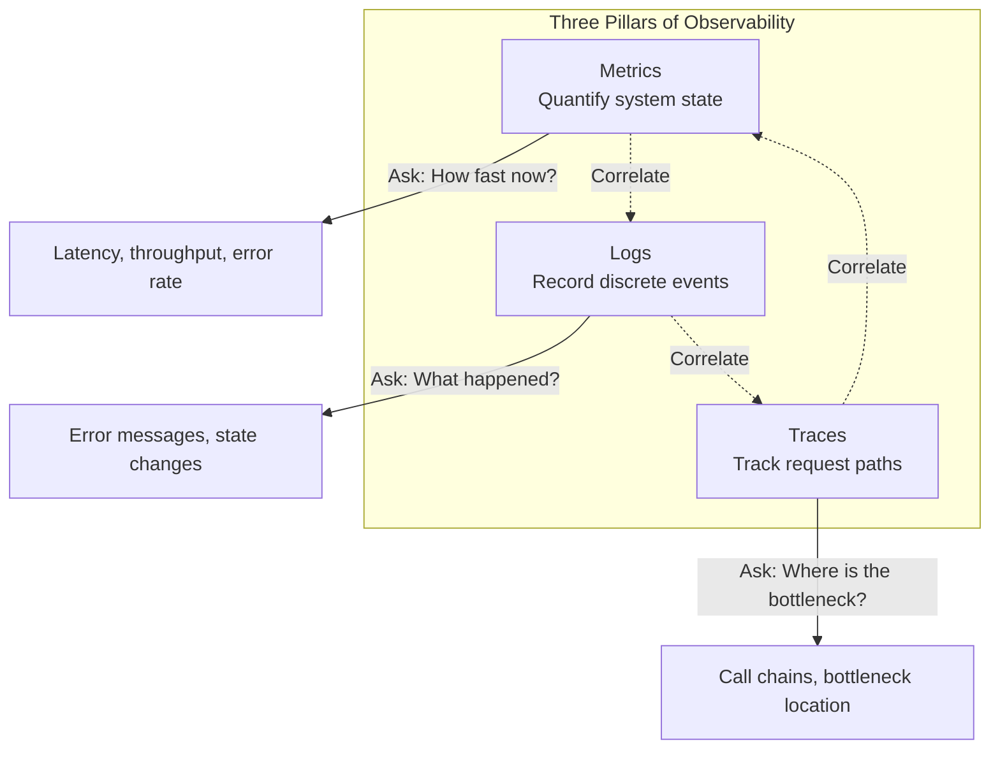
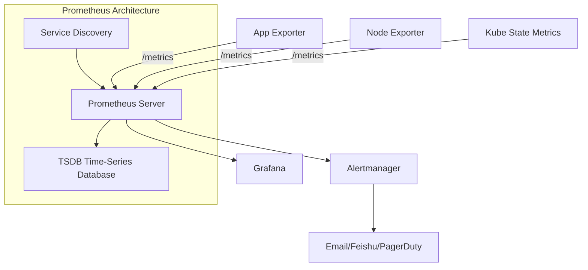
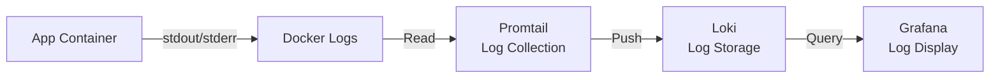
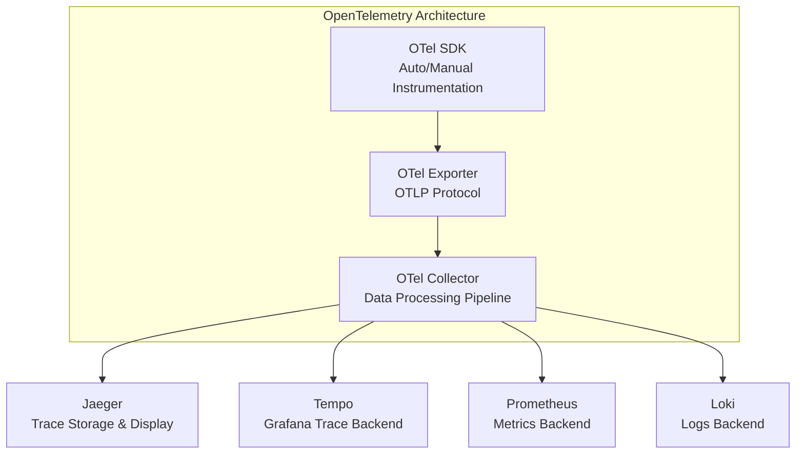
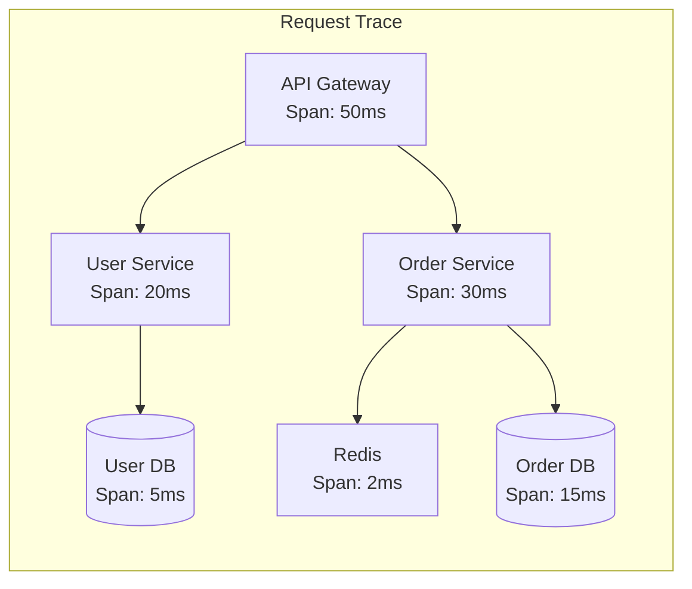

## Three Pillars of Observability

Observability refers to the ability to infer internal state from a system's external outputs. Unlike traditional "monitoring," observability emphasizes proactively understanding system behavior rather than reactively responding to known issues.



### Relationship Between the Three

| Dimension | Metrics | Logs | Traces |
|-----------|---------|------|--------|
| Data volume | Small (time series) | Large (discrete events) | Medium (sampled) |
| Alerting | Best suited | Suitable (critical logs) | Not suitable |
| Troubleshooting | Identify direction | View details | Locate bottleneck |
| Cost | Low | High | Medium |
| Granularity | System-level | Event-level | Request-level |

Best practice is three-way correlation: metrics trigger alerts → traces locate bottlenecks → logs reveal root causes.

## Prometheus: Metrics Collection and Alerting

Prometheus is the cornerstone of cloud-native observability, using a pull model for metrics collection:



### Metric Types

| Type | Description | Example |
|------|-------------|---------|
| Counter | Only-increments counter | Total requests, total errors |
| Gauge | Can increase or decrease | Current connections, memory usage |
| Histogram | Distribution statistics | Request latency distribution |
| Summary | Quantile statistics | P50/P95/P99 latency |

### Application Instrumentation Example

```go
// Go application Prometheus instrumentation
var (
    httpRequestsTotal = prometheus.NewCounterVec(
        prometheus.CounterOpts{
            Name: "http_requests_total",
            Help: "Total number of HTTP requests",
        },
        []string{"method", "path", "status"},
    )

    httpRequestDuration = prometheus.NewHistogramVec(
        prometheus.HistogramOpts{
            Name:    "http_request_duration_seconds",
            Help:    "HTTP request duration in seconds",
            Buckets: prometheus.DefBuckets,
        },
        []string{"method", "path"},
    )
)

func metricsMiddleware(next http.Handler) http.Handler {
    return http.HandlerFunc(func(w http.ResponseWriter, r *http.Request) {
        timer := prometheus.NewTimer(httpRequestDuration.WithLabelValues(r.Method, r.URL.Path))
        next.ServeHTTP(w, r)
        timer.ObserveDuration()
        httpRequestsTotal.WithLabelValues(r.Method, r.URL.Path, "200").Inc()
    })
}
```

### Common PromQL Queries

```promql
# Request rate (QPS)
rate(http_requests_total[5m])

# P99 latency
histogram_quantile(0.99, rate(http_request_duration_seconds_bucket[5m]))

# Error rate
sum(rate(http_requests_total{status=~"5.."}[5m]))
/
sum(rate(http_requests_total[5m]))

# CPU usage by Pod
sum(rate(container_cpu_usage_seconds_total{container!="POD"}[5m])) by (pod)
/
sum(container_spec_cpu_quota{container!="POD"} / container_spec_cpu_period{container!="POD"}) by (pod)
```

### Alert Rules

```yaml
groups:
  - name: api-alerts
    rules:
      - alert: HighErrorRate
        expr: |
          sum(rate(http_requests_total{status=~"5.."}[5m]))
          /
          sum(rate(http_requests_total[5m])) > 0.05
        for: 5m
        labels:
          severity: critical
        annotations:
          summary: "API error rate exceeds 5%"
          runbook: "https://wiki/runbook/high-error-rate"

      - alert: HighLatency
        expr: |
          histogram_quantile(0.95, rate(http_request_duration_seconds_bucket[5m])) > 2
        for: 10m
        labels:
          severity: warning
        annotations:
          summary: "API P95 latency exceeds 2s"
```

## Grafana: Dashboard Design

Grafana is the visualization layer of observability, unifying data from Prometheus/Loki/Jaeger and other sources:

### Dashboard Design Principles

1. **Macro to Micro**: Top overview (SLI metrics), middle service-level, bottom instance-level
2. **Use Variable Templates**: Reuse dashboards via `$namespace`, `$pod` variables
3. **Semantic Color Coding**: Green=normal, Yellow=warning, Red=abnormal
4. **Highlight Key Metrics**: SLIs on the first row, displayed in large font

### Common Dashboard Panel Types

| Panel Type | Use Case | Example |
|-----------|---------|---------|
| Stat | Single value | Current QPS, error rate |
| Time Series | Time trends | Latency change curve |
| Heatmap | Distribution density | Request latency heat map |
| Table | Tabular data | Slow query list |
| Log Viewer | Log viewing | Error log context |

```json
// Grafana dashboard variable example
{
  "templating": {
    "list": [
      {
        "name": "namespace",
        "type": "query",
        "query": "label_values(kube_pod_info, namespace)"
      },
      {
        "name": "pod",
        "type": "query",
        "query": "label_values(kube_pod_info{namespace=\"$namespace\"}, pod)"
      }
    ]
  }
}
```

## Log Aggregation

### ELK vs Loki

| Feature | ELK (Elasticsearch) | Loki |
|---------|---------------------|------|
| Indexing | Full-text index | Label-only index |
| Storage cost | High | Low |
| Query capability | Strong (full-text search) | Medium (label filtering + regex) |
| Deployment complexity | High | Low |
| Prometheus integration | Requires adapter | Native (same query language) |

### Loki + Promtail Architecture



### Structured Logging Practices

```go
// Use structured logging (e.g., slog/zap)
slog.Info("request completed",
    "method", r.Method,
    "path", r.URL.Path,
    "status", statusCode,
    "duration_ms", duration.Milliseconds(),
    "trace_id", traceID,  // Correlate with tracing
)
```

Log query examples (LogQL):

```logql
# Query error logs for specific service
{app="api", namespace="production"} |= "error" | json | status >= 500

# Count error logs per minute
sum(count_over_time({app="api"} |= "error" [1m])) by (level)
```

## Distributed Tracing

Distributed tracing tracks a request's complete call chain across multiple services, a core tool for microservice troubleshooting.

### OpenTelemetry Standard

OpenTelemetry is the unified standard for observability, merging OpenTracing and OpenCensus:



### Core Concepts

- **Trace**: A request's complete call chain
- **Span**: An operation unit within a Trace
- **Context Propagation**: Passing Trace ID across services (typically via HTTP Header)



### Go Application Integration Example

```go
import (
    "go.opentelemetry.io/otel"
    "go.opentelemetry.io/otel/exporters/otlp/otlptrace/otlptracegrpc"
    "go.opentelemetry.io/otel/sdk/trace"
)

func initTracer() (*trace.TracerProvider, error) {
    exporter, err := otlptracegrpc.New(context.Background(),
        otlptracegrpc.WithEndpoint("otel-collector:4317"),
        otlptracegrpc.WithInsecure(),
    )
    if err != nil {
        return nil, err
    }

    tp := trace.NewTracerProvider(
        trace.WithBatcher(exporter),
        trace.WithResource(resource.NewWithAttributes(
            semconv.SchemaURL,
            semconv.ServiceNameKey.String("api-service"),
        )),
    )
    otel.SetTracerProvider(tp)
    return tp, nil
}
```

### Trace-Log-Metric Correlation

Best practice is to inject Trace IDs into both logs and metrics, enabling three-way correlation:

- Logs include `trace_id`: Jump from logs to trace details
- Metrics include `trace_id` Exemplars: Jump from metric charts to slow request traces
- One-click navigation in Grafana from metrics → logs → traces

Observability is not a piling up of tools but an organic correlation of the three pillars. Metrics tell you "there's a problem," traces tell you "where it's stuck," and logs tell you "why." Only when all three work together can you achieve rapid identification and efficient troubleshooting.
