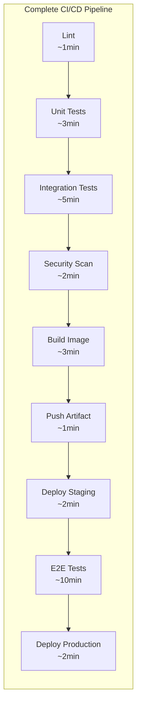
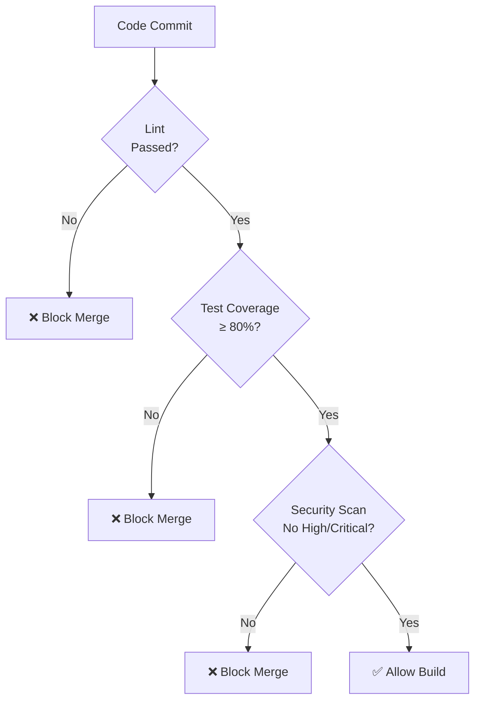
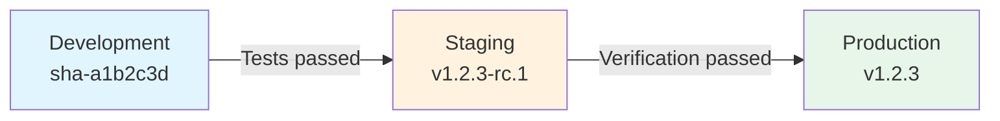
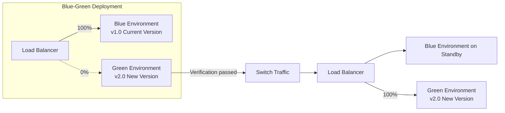
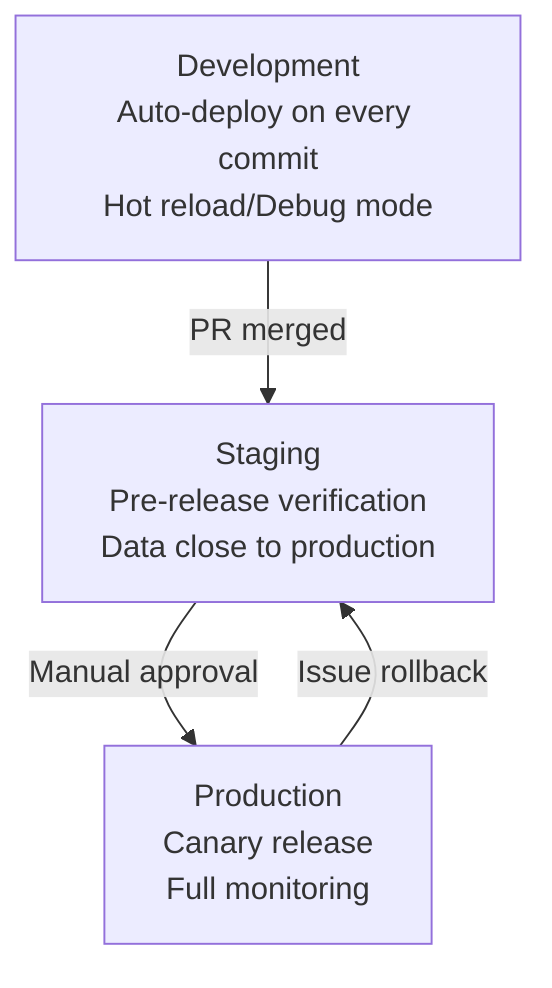

## Pipeline Design Principles

CI/CD pipelines are the core engine of software delivery. Good pipeline design should pursue: fast feedback, quality assurance, security and reliability, and repeatability.

### Design Principles

1. **Fail Fast**: Place quick checks first, such as linting and unit tests
2. **Single Responsibility**: Each Stage focuses on one goal, making it easier to locate issues
3. **Idempotency**: Same input always produces same output, supporting safe retries
4. **Least Privilege**: Each step only obtains necessary credentials and permissions



## Pipeline Stage Design

### Standard Stage Division


```yaml
# GitHub Actions complete pipeline example
name: Delivery Pipeline

on:
  push:
    branches: [main]
  pull_request:
    branches: [main]

jobs:
  # ---- Stage 1: Code Quality ----
  lint:
    runs-on: ubuntu-latest
    steps:
      - uses: actions/checkout@v4
      - uses: actions/setup-node@v4
        with:
          node-version: 20
          cache: npm
      - run: npm ci
      - run: npm run lint
      - run: npm run type-check

  # ---- Stage 2: Testing ----
  unit-test:
    runs-on: ubuntu-latest
    steps:
      - uses: actions/checkout@v4
      - uses: actions/setup-node@v4
        with:
          node-version: 20
          cache: npm
      - run: npm ci
      - run: npm test -- --coverage
      - name: Upload coverage
        uses: codecov/codecov-action@v4
        with:
          token: ${{ secrets.CODECOV_TOKEN }}

  integration-test:
    runs-on: ubuntu-latest
    services:
      postgres:
        image: postgres:16
        env:
          POSTGRES_DB: testdb
          POSTGRES_USER: test
          POSTGRES_PASSWORD: test
        ports: ['5432:5432']
    steps:
      - uses: actions/checkout@v4
      - uses: actions/setup-node@v4
        with:
          node-version: 20
          cache: npm
      - run: npm ci
      - run: npm run test:integration

  # ---- Stage 3: Security Scanning ----
  security-scan:
    runs-on: ubuntu-latest
    steps:
      - uses: actions/checkout@v4
      - name: Dependency vulnerability scan
        run: npx audit-ci --high
      - name: SAST scan
        uses: github/super-linter@v5
        env:
          DEFAULT_BRANCH: main

  # ---- Stage 4: Build and Push ----
  build:
    needs: [lint, unit-test, integration-test, security-scan]
    runs-on: ubuntu-latest
    outputs:
      image-tag: ${{ steps.meta.outputs.tags }}
    steps:
      - uses: actions/checkout@v4
      - uses: docker/setup-buildx-action@v3
      - uses: docker/login-action@v3
        with:
          registry: ghcr.io
          username: ${{ github.actor }}
          password: ${{ secrets.GITHUB_TOKEN }}
      - uses: docker/metadata-action@v5
        id: meta
        with:
          images: ghcr.io/${{ github.repository }}
          tags: |
            type=sha,prefix=
            type=raw,value=latest,enable={{is_default_branch}}
      - uses: docker/build-push-action@v5
        with:
          context: .
          push: ${{ github.ref == 'refs/heads/main' }}
          tags: ${{ steps.meta.outputs.tags }}
          cache-from: type=gha
          cache-to: type=gha,mode=max

  # ---- Stage 5: Deploy ----
  deploy-staging:
    needs: build
    if: github.ref == 'refs/heads/main'
    runs-on: ubuntu-latest
    environment: staging
    steps:
      - uses: actions/checkout@v4
      - name: Deploy to Staging
        run: |
          kubectl set image deployment/web-app \
            app=${{ needs.build.outputs.image-tag }} \
            -n staging

  deploy-production:
    needs: deploy-staging
    runs-on: ubuntu-latest
    environment: production
    steps:
      - uses: actions/checkout@v4
      - name: Deploy to Production
        run: |
          kubectl set image deployment/web-app \
            app=${{ needs.build.outputs.image-tag }} \
            -n production
```


## Quality Gates

Quality gates are the "veto mechanism" in pipelines, ensuring substandard code doesn't proceed to the next stage:



### Quality Gate Metrics

| Stage | Gate Metric | Suggested Threshold |
|-------|------------|-------------------|
| Lint | Number of lint errors | 0 |
| Unit test | Coverage | ≥ 80% |
| Unit test | Test pass rate | 100% |
| Security scan | High/Critical vulnerabilities | 0 |
| Security scan | Dependency vulnerabilities | 0 high |
| Integration test | API contract tests | 100% pass |
| E2E test | Core flow success rate | ≥ 99% |

## Artifact Management

### Artifact Versioning Strategy

```text
# Semantic Versioning + Git SHA
v1.2.3          # Official release
v1.2.3-rc.1     # Release candidate
v1.2.3-dev.a1b2c3d  # Development version (with commit SHA)
```

### Image Tag Strategy

| Tag | Purpose | Immutable |
|-----|---------|-----------|
| `latest` | Latest stable version | No (not recommended for production) |
| `v1.2.3` | Semantic version | Yes |
| `sha-a1b2c3d` | Git SHA | Yes |
| `main-20260502` | Branch + date | No |

### Artifact Promotion Flow



Key principle: **Run the same image in all environments**, distinguishing environments through configuration (ConfigMap/Secret), not rebuilding.

## Deployment Strategies

### Common Deployment Strategy Comparison

| Strategy | Downtime | Rollback Speed | Resource Cost | Complexity |
|----------|----------|---------------|--------------|-----------|
| Recreate | Yes | Slow | Low | Lowest |
| Rolling Update | No | Medium | Medium | Low |
| Blue-Green | No | Fast | High (2x) | Medium |
| Canary | No | Fast | Low | High |
| Shadow | No | N/A | High | Highest |

### Rolling Update

K8s Deployment default strategy, gradually replacing old Pods:

```yaml
spec:
  strategy:
    type: RollingUpdate
    rollingUpdate:
      maxSurge: 25%        # At most 25% extra Pods during update
      maxUnavailable: 25%  # At most 25% Pods unavailable during update
```

### Blue-Green Deployment

Run two complete environments simultaneously, switch traffic for zero-downtime:



Implementation:

```yaml
# Switch via Service selector
apiVersion: v1
kind: Service
metadata:
  name: web-app
spec:
  selector:
    app: web-app
    version: blue  # Switch to green to complete blue-green switch
  ports:
    - port: 80
      targetPort: 8080
```

## Multi-Environment Management

### Environment Promotion Strategy



### Environment Configuration Management

```text
config/
├── base/                    # Common configuration
│   ├── app-config.yaml
│   └── kustomization.yaml
└── overlays/
    ├── development/
    │   └── patch.yaml       # Debug mode, Mock services
    ├── staging/
    │   └── patch.yaml       # Near-production configuration
    └── production/
        └── patch.yaml       # High availability, full monitoring
```

### Environment Isolation Essentials

- **Network isolation**: Independent namespace per environment, Network Policy restricts cross-environment access
- **Data isolation**: Independent database instances, production data masked before importing to Staging
- **Permission isolation**: Production requires additional approval, CI cannot push directly
- **Monitoring isolation**: Independent monitoring dashboards and alert rules, avoiding cross-environment interference

Well-designed pipelines are the foundation of efficient delivery. From stage division to quality gates, from artifact management to deployment strategies, every aspect requires trade-offs and optimization based on team size and business needs. Good pipelines aren't built overnight — they continuously evolve through practice.
